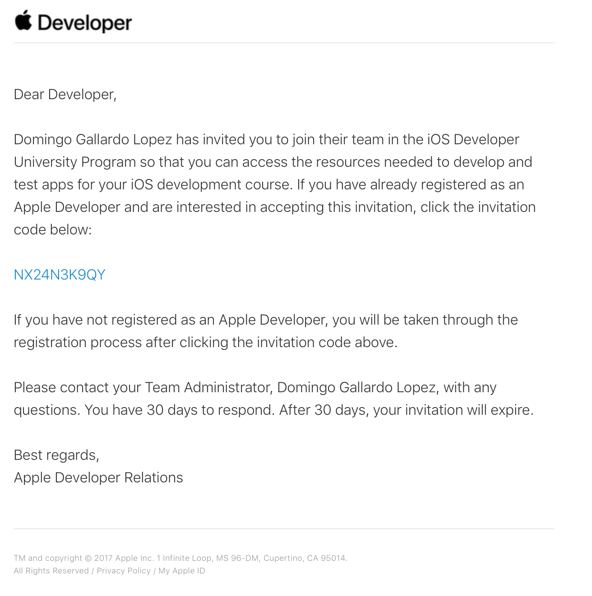

# Práctica 1: Firma, aprovisionamiento y   distribución de apps

En las prácticas de esta sesión deberás trabajar con distintos
aspectos relacionados con la firma, la distribución y el despliegue de
apps en dispositivos reales.

Resumimos a continuación los objetivos generales de esta práctica:

1. Firmar una app con tu cuenta gratuita e instalarla en un
   dispositivo configurado como dispositivo de desarrollo.
2. Importar un certificado de desarrollo de Apple.
3. Firmar y exportar la app usando un perfil de aprovisionamiento que
   te permite instalarla en cualquier dispositivo autorizado en el
   perfil.
4. Configurar en la aplicación una capacidad y seleccionar un perfil
   del equipo de desarrollo que permita esta capacidad.

## 1. Antes de empezar la clase presencial ##

1. Antes de la clase presencial deberás mirar los tres vídeos con
demostraciones que podrás encontrar en Moodle, en la sesión 1.

2. Una vez vistas estas demostraciones, debes leer los
   siguientes apartados del tema de teoría:

    - [Introducción](https://malozano.github.io/apuntes-spm-ios/teoria/firma-aprovisionamiento/firma-aprovisionamiento.html#introduccion):
     Resumen de lo que vamos a ver en este tema e introducción breve a
     la importancia de la seguridad en la plataforma de Apple.
    - [Cuenta de desarrollador de Apple](https://malozano.github.io/apuntes-spm-ios/teoria/firma-aprovisionamiento/firma-aprovisionamiento.html#cuenta-de-desarrollador-de-apple):
     Explicación de los distintos tipo de programas de desarrollo en
     la plataforma Apple y características de cada uno.
    - [Certificado de firma de
      apps](https://malozano.github.io/apuntes-spm-ios/teoria/firma-aprovisionamiento/firma-aprovisionamiento.html#certificados): Explicación del funcionamiento del certificado de desarrollador
      para la firma de apps. Una app sólo puede instalarse en un
      dispositivo si ha sido previamente firmada con un certificado de
      un desarrollador registrado.
    - [Capacidades de las
      apps](https://malozano.github.io/apuntes-spm-ios/teoria/firma-aprovisionamiento/firma-aprovisionamiento.html#capacidades-de-las-apps):
      Para usar las capacidades proporcionadas por la plataforma de
      desarrollo Apple es necesario configurar una autorización usando
      un App ID.
    - [Despliegue de
      apps](https://malozano.github.io/apuntes-spm-ios/teoria/firma-aprovisionamiento/firma-aprovisionamiento.html#despliegue-de-apps-en-dispositivos-de-prueba):
      para desplegar una app en un dispositivo de prueba es necesario instalar en ella un _perfil de
      aprovisionamiento_ que contenga los permisos para acceder a las
      capacidades y los dispositivos autorizados en los que la app
      puede instalarse.

## 2. Firma e instalación de una app en un dispositivo de desarrollo ##

1. Deberás crear un Apple ID y darte de alta como desarrollador. Si ya lo tienes, no hace falta que hagas nada.

    Para crear un Apple ID, puedes introducir tus datos en [este
    enlace](https://appleid.apple.com/account?localang=es_es). Este
    Apple ID será el que se asociará a la cuenta de desarrollador.

    Después deberás darte de alta como desarrollador Apple con el Apple ID
    recién creado en [https://developer.apple.com](https://developer.apple.com).

2. Accede a tu portal de desarrollador. Será el portal del programa
   gratuito. Este programa permite acceder a las herramientas de
   desarrollo, la documentación y acceso limitado a ciertas
   capacidades (incluido probar aplicaciones en dispositivos
   conectados a Xcode).

    Explora las distintas opciones que permite la cuenta:

    - Documentation
    - Downloads
    - Forums
    - Bug reporter
    - Help

3. Descarga la app
   [ToDo (versión _storyboards_)](https://github.com/malozano/apuntes-spm-ios/raw/master/apps/ToDo.zip) o [ToDo (versión _SwiftUI_)](https://github.com/malozano/apuntes-spm-ios/raw/master/apps/ToDoSwiftUI.zip). Y
   sigue los pasos de la demostración para crear el certificado
   gratuito de desarrollador, cambiar el _bundle ID_ de la app a un
   identificador tuyo, firmar la app, comprobar el certificado y
   probar la app en tu dispositivo de desarrollo (si lo tienes).

4. Incluye tu nombre en la pantalla en la que aparece el número de
   tareas terminadas (a la que se accede pulsando en el botón _Done_).

5. **Captura la pantalla** de Xcode en la que se muestra el bundle ID y el
   equipo que realiza la firma. **Captura también** una instantánea con la
   app ejecutándose en el dispositivo mostrando la pantalla con tu
   nombre. Si no tienes dispositivo, hazlo con la ejecución del
   simulador.

6. Comprueba que aparece un error cuando intentas exportar la
   app. **Captura la pantalla** de Xcode.

## 3. Importar un certificado de desarrollador ##

1. Para poder firmar las aplicaciones necesitamos un certificado de desarrollador. Puedes **descargar el certificado** desde la página Moodle de la asignatura (se trata de un fichero con extensión `.p12`).

2. **Importar el certificado**, haciendo doble _click_ sobre el fichero. Nos pedirá una contraseña que
se proporcionará en clase.

3. Tras introducir la contraseña, el **certificado habrá quedado instalado en el sistema**. Podemos comprobarlo, por ejemplo, mediante la aplicación _Acceso a llaveros_, donde deberemos encontrar un _item_ llamado _"Apple Development: Miguel Angel Lozano Ortega"_. Tendremos tanto el certificado como la clave privada asociada, necesaria para la firma.

4. Para poder probar las aplicaciones en dispositivos físicos, es necesario darlos de alta en la cuenta de Apple y actualizar los perfiles de aprovisionamiento para incluirlos. Para realizar esto, incluye en [este fichero Google Docs](https://docs.google.com/spreadsheets/d/13VqNS9KUATl-0t_IsvPjpPzcNrfyul-1rBcOh551ySo/edit?usp=sharing) el ID del dispositivo (o dispositivos que desees incorporar.

<!--
## 3. Configuración de la cuenta de desarrollador ##

1. Para la inscripción en el equipo de desarrollo de la universidad
   escribe tu nombre, apellidos, dirección de e-mail en [este fichero
   Google
   Docs](https://docs.google.com/document/d/1-fgqgzKNPpo4--PGUvrsnXTe_ABA04gLcpv8rtJd9D0/edit?usp=sharing). Escribe
   también el ID del dispositivo (o dispositivos) que desees
   incorporar al portal del equipo de la UA.

2. Una vez que te añadamos al equipo de la UA recibirás en el correo
   electrónico un mensaje con un código de invitación. Pincha en él e
   introduce allí tu Apple ID.

   

3.   Una vez aceptada la invitación entra en el [portal del
   desarrollador](https://developer.apple.com/account/), comprueba que
   ya estás en el programa de la UA y prueba las distintas opciones
   disponibles.

-->

## 4. Firma y despliegue de app con perfil de aprovisionamiento ##

Sigue los pasos de la [demo y
   ejercicio](https://malozano.github.io/apuntes-spm-ios/teoria/firma-aprovisionamiento/firma-aprovisionamiento.html#demo-y-ejercicio)
   de teoría, realizando lo siguiente:

> **Importante**: No será necesario realizar ninguna acción en _developer portal_, ya que ya hemos
importado un certificado de desarrollo y los perfiles de aprovisionamiento necesarios están creados.

1. Cambia el bundle ID y firma la app con el perfil Genérico. **Captura la pantalla** de Xcode en la que se muestre esto.

2.  Comprueba que es posible exportar la app utilizando el perfil
    Genérico. **Captura la pantalla**.

3. Comprueba que aparece un error cuando intentas añadir la capacidad
   `Game Center` usando el perfil Genérico. **Captura la pantalla**.

4. Cambia al perfil `SPM ToDo` y añade la
   capacidad `Game Center` (que si que se encuentra activada en este perfil). Comprueba que Xcode no da ningún error y
   **captura la pantalla**.

6. Exporta la app, creando un binario .ipa. Si tienes algún
   dispositivo iOS, instala el fichero .ipa obtenido usando Apple
   Configurator.. El UUID del dispositivo deberá estar incluido en el
   perfil de aprovisionamiento. **Captura una pantalla** de la aplicación
   `Apple Configurator` instalando la app en el
   dispositivo. Comprueba que la app funciona correctamente.

## 5. Entrega ##

Crea una carpeta y guarda en ella lo siguiente:

- Todas las capturas de pantalla (un total de 8 imágenes).
- Binario .ipa exportado en el último paso.
- Carpeta con el proyecto completo.

Comprime la carpeta y entrégala en la actividad de Moodle _Entrega 1_.
