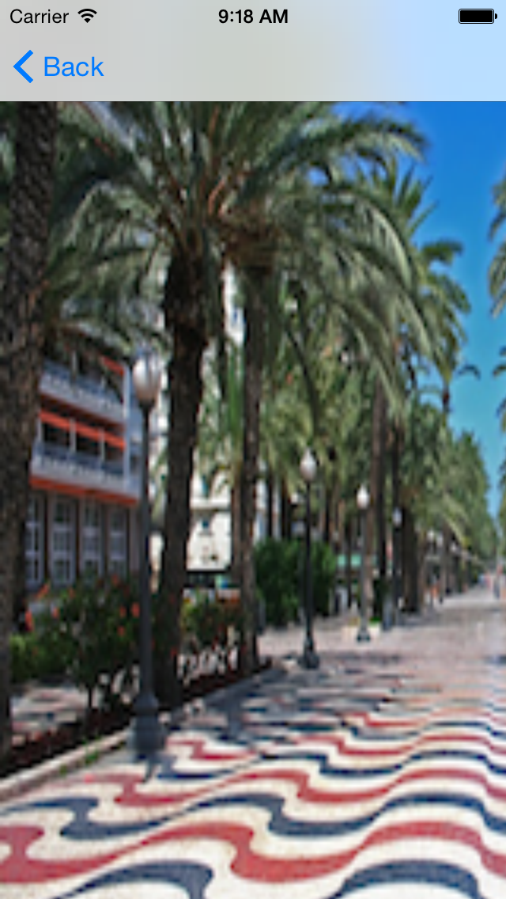

<!--
Terminan la práctica en unas 1,5 horas + 1 hora de explicación = 2,5 horas
-->

# Práctica 2: Mapas y localización

1. Lee los siguientes apartados de los [apuntes de teoría](https://domingogallardo.github.io/apuntes-spm-ios/teoria/mapas-localizacion/mapas-localizacion.html#aspectos-basicos-de-mapkit): desde _Aspectos básicos de MapKit_
   hasta _Uso del delegado_ (incluido).

2. Debes crear la app `es.ua.mastermoviles.Mapas`.

3. Empieza por definir un _View Controller_ en el que debes incluir un
mapa centrado inicialmente en Alicante. Inclúyelo en un _Navigation Controller_ con la
opción _Editor > Embed In > Navigation Controller_.

4. Añade en el centro de la barra del _Navigation Controller_ un
_Segmented Control_ con los valores `Mapa` y `Satélite`, conéctalos
con el _ViewController_ y haz que el mapa cambie de tipo cuando se
pulse en el control.

5. Lee los siguientes apartados [apuntes de teoría](https://domingogallardo.github.io/apuntes-spm-ios/teoria/mapas-localizacion/mapas-localizacion.html#anotaciones): desde
   _Anotaciones_ hasta _Elementos en el callout_ (incluido).

6. En el _Storyboard_ añade un `Bar Button Item` en la parte derecha de
la barra de navegación.

7. Llámalo `Pin` y enlázalo con una acción en el `ViewController` que
  añada una anotación en el mapa.

8. Añade en los _callouts_ imágenes _thumbnails_ predefinidas,
dependiendo de si el número de pin es par o impar.

9. Añade en los _callouts_ el botón de información.

**Parte opcional 1**

10. Implementa un _segue_ que haga aparecer otra vista con un detalle
  de la foto. Puedes definir un segue haciendo control click desde un
 view controller hasta otro. Después debes dar un identificador al
  segue. Por ejemplo `DetalleImagen`.

 

**Parte opcional 2**

11. Lee los siguientes apartados de los [apuntes de teoría](https://domingogallardo.github.io/apuntes-spm-ios/teoria/mapas-localizacion/mapas-localizacion.html#geocoding): desde
    _Geocoding_ hasta _Conversión de placemarks en localizaciones_ (incluido).

12. Implementa una llamada al servicio de geolocalización que coloque
   como subtítulo del Pin el país en el que se ha colocado el
   mismo. 

**Parte opcional 3**

13. Lee el siguiente apartado de los [apuntes de teoría](https://domingogallardo.github.io/apuntes-spm-ios/teoria/mapas-localizacion/mapas-localizacion.html#localizacion): _Localización_.

14. Añade el tracking de localización a la aplicación, imprimiendo la
localización en la salida estándar cada 10 metros. Comprueba el
funcionamiento activando la localización en el simulador.

15. Añade la localización al mapa, haciendo que aparezca en la parte
izquierda de la barra de navegación el botón de navegación.

    - Cuando pulses el botón de navegación se debe mostrar la posición
      actual del dispositivo.

    - Deberás modificar la función que muestra la vista de una
      anotación
      ([`mapView(_:viewFor:)`](https://developer.apple.com/reference/mapkit/mkmapviewdelegate/1452045-mapview))
      porque se utiliza también para mostrar la vista de la posición
      actual del dispositivo (que también es una anotación). Si la
      anotación que se quiere mostrar no es de tipo Pin debes poner la
      vista a `nil` para que se use la vista por defecto (el círculo).
      

16. Comprime el proyecto y entrégalo en la entrega correspondiente de Moodle.
