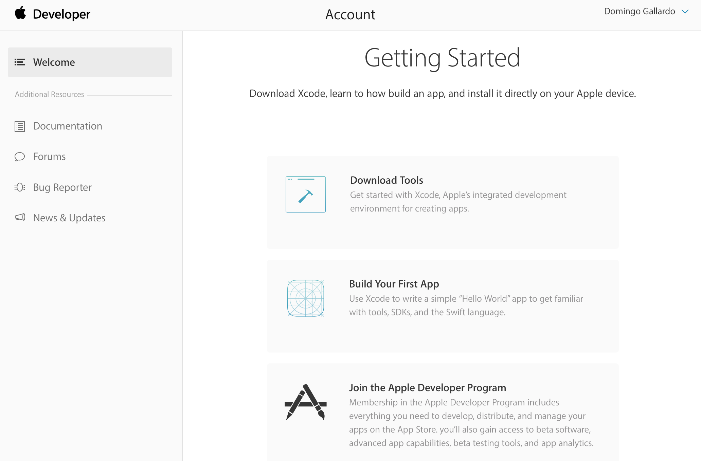

# Práctica 1: Firma, aprovisionamiento y   distribución de apps

En las prácticas de esta sesión deberás trabajar con distintos
aspectos relacionados con la firma, la distribución y el despliegue de
apps en dispositivos reales.

Resumimos a continuación lo que debes realizar:

1. Firmar una app con tu cuenta gratuita e instalarla en un
   dispositivo configurado como dispositivo de desarrollo.
2. Darte de alta en el equipo de desarrollo de la UA y firmar la app
   usando un perfil de aprovisionamiento que te permite instalarla en
   cualquier dispositivo autorizado en el perfil.
3. Distribuir esta app firmada con el perfil de aprovisionamiento del
   equipo de la UA usando Fabric.

## Creación de la cuenta de desarrollador Apple ##

Deberás crear un Apple ID introduciendo tus datos en [este
enlace](https://appleid.apple.com/account?localang=es_es). Este Apple
ID será el que se asociará a la cuenta de desarrollador.

Activa la autenticación de doble factor de alguna de las formas
definida en [este enlace](https://support.apple.com/es-es/HT204915).

Después deberás darte de alta como desarrollador Apple con el Apple ID
recién creado en [https://developer.apple.com/register/](https://developer.apple.com/register/).

De esta forma estás accediendo al programa gratuito. Este programa
permite acceder a las herramientas de desarrollo, la documentación y
acceso limitado a ciertas capacidades (incluido probar aplicaciones en
dispositivos conectados a Xcode).

Explora las distintas opciones que permite la cuenta:

- Documentation
- pDownloads
- Forums
- Bug reporter
- Help

## Firma e instalación de una app en un dispositivo de desarrollo ##

1. Descarga la app [ToDoList](https://github.com/domingogallardo/apuntes-spm-ios/raw/master/apps/ToDoList.zip). 
2. Incluye tu nombre en alguna parte de la interfaz de usuario.
3. Fírmala con tu cuenta gratuita de desarrollador Apple (no la del
equipo de la UA). 
4. Instálala en un dispositivo de desarrollo conectado a Xcode y
   prueba que funciona correctamente.
5. Haz una foto y guárdala como documentación.

## Configuración de la cuenta de desarrollador ##

Para la inscripción en el equipo de desarrollo de la universidad
escribe tu nombre, apellidos y dirección de e-mail en [este fichero
Google
Docs](https://docs.google.com/document/d/1-fgqgzKNPpo4--PGUvrsnXTe_ABA04gLcpv8rtJd9D0/edit?usp=sharing).

Una vez que te añadamos al equipo de la UA recibirás en el correo
electrónico un mensaje con un código de invitación. Pincha en él e
introduce allí tu Apple ID.

Una vez aceptada la invitación podemos entrar en el [_member
center_](https://developer.apple.com/account/), comprobar que ya estás
en el programa y probar las distintas opciones disponibles.

## Firma y despliegue de app con perfil de aprovisionamiento ##

Debes seguir los pasos realizados en la demostración con la app
`ToDoList`.

1. Nos damos de alta al equipo de la universidad.
2. Compilamos la app, añadimos las capacidades necesarias y la firmamos con la cuenta del equipo.
3. Exportamos el fichero .ipa compilado de la app.
4. Instalamos y ejecutamos la app en un dispositivo de prueba.

## Distribución con Fabric ##

- Distribuye la app al profesor (`domingo.gallardo@ua.es`) usando
  Fabric.
- Captura la pantalla de la web de fabric en la que se muestra que el
  profesor ha instalado la app.
- Crea una nueva versión de la app en la que el usuario pueda provocar
  un crash (consulta cómo hacerlo en la documentación de
  Crashlytics). Distribúyela al profesor y captura la pantalla en la
  que se muestra el número de crashes producidos.

## Entregas ##

Resumen de las prácticas a realizar en esta sesión y entregas a
realizar en Moodle.

1. Descarga la app
   [ToDoList](https://github.com/domingogallardo/apuntes-spm-ios/raw/master/apps/ToDoList.zip)
   (o usa una app tuya que hayas desarrollado) y fírmala con tu cuenta
   gratuita de desarrollador Apple (no la del equipo de la
   UA). Modifica la app para que aparezca tu nombre en la interfaz de
   usuario. Instálala en un dispositivo de desarrollo de Xcode y
   prueba que funciona correctamente. Haz una foto y guárdala como
   documentación.
2. Firma la app con tu cuenta del equipo de la UA, activa
   el servicio de _Game Center_ e instálala en otro dispositivo del
   profesor que esté dado de alta en el perfil de aprovisionamiento,
   pero que no sea el dispositivo de desarrollo de Xcode. Instala la
   app usando _Apple Configurator 2_. Haz una foto y guárdala como
   documentación.
3. Distribuye la app al profesor (`domingo.gallardo@ua.es`) usando
   Fabric. Captura la pantalla de la web de fabric en la que se
   muestra que el profesor ha instalado la app.
4. Crea una nueva versión de la app en la que el usuario
   pueda provocar un crash (consulta cómo hacerlo en la documentación
   de Crashlytics). Distribúyela al profesor y captura la pantalla en
   la que se muestra el número de crashes producidos.
5. **Guarda las fotografías y pantallas en una carpeta, junto con el
   binario .ipa de la actividad 2, comprime la carpeta y entrégala en
   la actividad de Moodle _Entrega 1_**.

