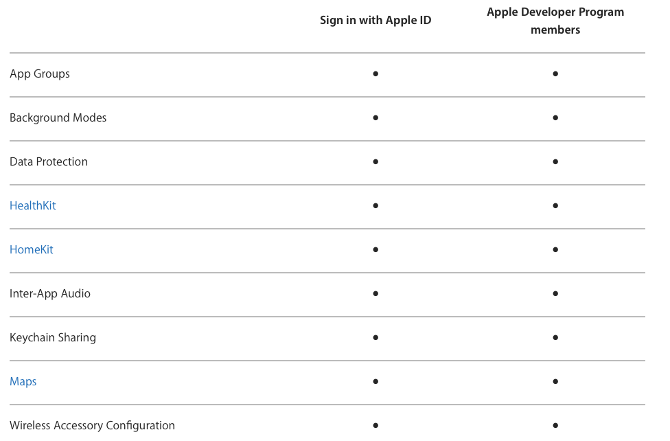
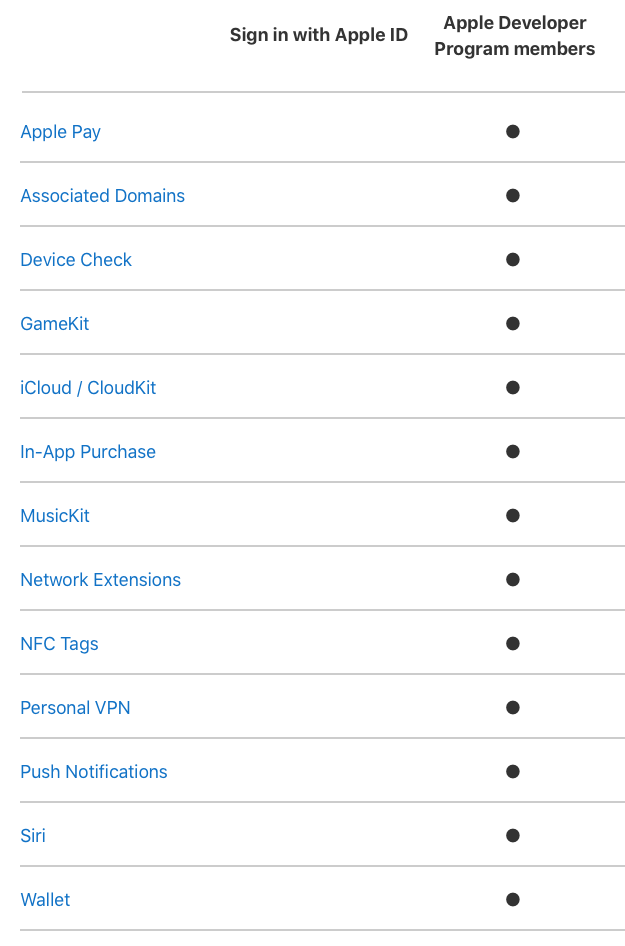

<!--

Instalación de app de prueba mediante Fabric:

Para que tu aplicación pueda lanzarse en un dispositivo, éste debe
estar registrado en tu perfil de aprovisionamiento.

Para desplegar una app iOS en un dispositivo, el perfil de
aprovisionamiento usado debe contener el UDID de dicho dispositivo. Si 
no lo está, en lugar de recibir un enlace para instalar la app, el 
tester recibirá un enlace para la aplicación web Beta, que se usa 
para recoger su UDID y enviarle una alerta cuando una nueva 
versión de la app esté disponible. 

Una vez el tester instala la app web, recibirás una notificación 
conteniendo un adjunto con su UDID. Los UDIDs también se mostrarán 
en la aplicación de Fabric para OS X cuando se cree una 
distribución que incluya testers con UDIDs desconocidos.

-->

# Sesión 1: <br/> Firma, aprovisionamiento y <br/> distribución de apps

## Firma y aprovisionamiento de apps ##

### Seguridad en las apps ###


La seguridad es uno de los elementos fundamentales de la plataforma
iOS. En concreto, el sistema de instalación y ejecución de apps en
dispositivos reales contempla la necesidad de que las apps se ejecuten
de forma segura y sin comprometer la integridad de la plataforma,
eliminando virus, malware o ataques no autorizados.

El documento [iOS Security
Guide](https://www.google.es/url?sa=t&rct=j&q=&esrc=s&source=web&cd=1&ved=0ahUKEwiZ1pDvkKHaAhURnRQKHduRBBAQFggwMAA&url=https%3A%2F%2Fwww.apple.com%2Fbusiness%2Fdocs%2FiOS_Security_Guide.pdf&usg=AOvVaw3GGJo3lQoRe6VTTv0GiAMU)
detalla todos los elementos que conforman la seguridad de la
plataforma. Uno de los elementos más críticos de la arquitectura son
las apps.

Para garantizar la autoría del desarrollador y la no modificación del
código, todo el código ejecutable debe haber sido firmado con un
**certificado generado por Apple**. Para obtener un certificado, los
desarrolladores deben registrase en el **Apple Developer Program**.

Para distribuir apps a dispositivos de terceros también es necesario
que estén firmadas digitalmente y que contengan un **perfil de
aprovisionamiento** que permita la ejecución de la app sólo en los
dispositivos autorizados.

Aunque la plataforma principal de distribución de apps es el App Store
de Apple, veremos que también es posible distribuirlas por otros
medios para instalarlas en dispositivos de prueba o de forma interna
en una organización mediante el **Apple Developer Enterprise Program
(ADEP)**.
  

### Código firmado ###

Para poder tanto ejecutar una app en un dispositivo físico como
distribuirla en el _App Store_ es necesario firmar su código
digitalmente.

La **firma digital del código** (_code signing_) permite al sistema
operativo identificar quién ha firmado la app y verificar que no se ha
modificado desde el momento de su firma. El código ejecutable está
protegido por la firma y ésta se invalida si el código cambia. Los
recursos de la app como ficheros nib o imágenes no están firmados.

En combinación con el **bundle ID**, el **perfil de
aprovisionamiento** (_provisioning profile_) y los **permisos**
(_entitlements_) se usa para asegurar que:

- La app ha sido compilada y firmada por ti o por un miembro de
  confianza del equipo.
- Las apps firmadas por ti o por tu equipo se ejecutan sólo en
  dispositivos de desarrollo escogidos.
- Las apps se ejecutan únicamente en los dispositivos de prueba
  que especifiques.
- Tu app no está usando servicios que no has añadido al app.
- Sólo tú puedes enviar revisiones del app al _store_.


### Ejecución de apps en dispositivos reales ###

Para la instalación y ejecución de una app iOS en un dispositivo
físico es necesario realizar una configuración del _target_ (binario
que se instala en el dispositivo) que incluye múltiples procesos:

- **Firma digital** del binario con un certificado del desarrollador
  proporcionado por Apple (_Signing Certificate_).

- Instalación de un **perfil de aprovisionamiento** (_Provisioning
  Profile_) correcto que determina, entre otros: servicios de la
  plataforma Apple a los que la app puede acceder (**_capabilities_**
  y **_entitlements_**) y dispositivos concretos (IDs) autorizados en
  los que puede ejecutarse la app.

Xcode facilita la realización de todos estos procesos. 
  


### Identidad de firma ###


Una **identidad de firma** (_signing identity_) consiste en una pareja
de clave pública y clave privada que proporciona Apple.

La clave privada se almacena en el llavero (_keychain_) y se usa para
generar la firma. La clave pública se guarda en un certificado que te
identifica como el propietario de la clave privada. El certificado se
almacena en el llavero y en tu cuenta de desarrollador de Apple.

Se necesita también un certificado intermedio proporcionado por
Apple. Cuando instalas Xcode este certificado intermedio se guarda en
el llavero.

La clave pública del certificado determina la identidad del
desarrollador. La mantiene Apple en el centro de desarrollador y se
guarda en los perfiles de aprovisionamiento del equipo de desarrollo.

Es muy importante conservar segura la clave privada, como si fuera una
contraseña de una cuenta. Debes mantener una contraseña segura de tu
pareja clave pública-privada. Si se pierde la clave privada, tendrás
que crear una identidad completamente nueva para firmar el código. O
peor aún, si alguien se hace con tu clave privada puede hacerse pasar
por ti e intentar distribuir una app con código malicioso. Esto podría
hacer que Apple revocara tus credenciales de desarrollador.


### Certificados ###

Varios tipos de certificados: de desarrollo, de distribución, para el
servidor de notificaciones push, etc. El **certificado de
desarrollador** permite ejecutar aplicaciones en un dispositivo. El de
distribución permite enviarla al _app store_.

Los certificados de desarrollo identifican a una persona del
equipo. Los certificados de distribución identifican al equipo y
pueden ser compartidos por los miembros del equipo que tienen permiso
para enviar apps al _store_.

Todos los certificados son proporcionados por Apple.

Para comprobar el tipo de certificado podemos consultar el _member
center_, _Xcode_ o _Acceso a llaveros_ (lo veremos más adelante).


### Distintos programas de desarrollo ###

Apple define varios tipos de programas de desarrollo:

- Programa gratuito 
- Programa universidad - gratuito
- Desarrollador individual - $99 al año
- Programa desarrollo de organización - $99 al año
- Programa desarrollo de empresa - $299 al año

Para desarrollar y probar apps en dispositivos basta con darse de alta
de forma gratuita en el _member center_ de Apple con un Apple ID.

Cada programa proporciona distintas capacidades
(_capabilities_). Probaremos las posibilidades del programa gratuito y
del programa de universidad, y explicaremos las posibilidades del
resto de programas.


### Características de los distintos programas de desarrollo ###


Más información sobre los distintos programas de desarrollo en
[https://developer.apple.com/support/compare-memberships/](https://developer.apple.com/support/compare-memberships/)


### Capacidades de las apps ###

Para poder utilizar capacidades avanzadas en las apps (como
notificaciones push, iCloud o Game Center) es necesario darse de alta
de forma individual en el [programa de desarrollo de
iOS](https://developer.apple.com/programs/ios/) o inscribirse en un
equipo de desarrollo. En la Universidad tenemos dado de alta un equipo
[_iOS Developer University
Program_](https://developer.apple.com/programs/ios/university/gettingstarted/).

Es posible distribuir las apps desarrolladas en los dispositivos
autorizados en la cuenta de la universidad.

Para una lista completa de las capacidades disponibles según el tipo
de desarrollador se puede consultar la documentación en [_Apple
Developer > Support > Advanced App
Capabilities_](https://developer.apple.com/support/app-capabilities/).

 




### Aprovisionamiento de apps ###


Es necesario configurar un perfil de aprovisionamiento en la app para
poder acceder a servicios de la plataforma Apple (como almacenamiento
iCloud, mapas, compras In-App o notificaciones push) y para configurar
en qué dispositivos es posible ejecutar la app.

Con la cuenta de desarrollador gratuita es posible desarrollar
aplicaciones, acceder a un número limitado de servicios de Apple y
probarlas en el dispositivo propio pero no distribuirlas a terceros.

Para poder distribuir apps para probar en un número de dispositivos o
usar servicios avanzados de la plataforma Apple es necesario tener una
cuenta de pago de desarrollador en Apple o estar en un equipo que
tenga una cuenta (una empresa o una educación educativa).

Vamos a ir paso a paso, explicando los conceptos según los vayamos
necesitando. Vamos a explicar cómo firmar digitalmente una app y cómo
crear un perfil de aprovisionamiento que nos permita probarla en
dispositivos reales. Vamos a usar como ejemplo una app sencilla
llamada `ToDoList`.


### _Bundle Identifier_ ###


Un _bundle ID_ identifica de forma única una app. 

La cadena de _bundle ID_ debe contener únicamente caracteres
alfanuméricos (A-Z,a-z,0-9), guiones (-), y puntos (.). La cadena
debería estar en un formato DNS-inverso y usar un dominio propio de la
organización. De esta forma se garantiza su unicidad. Por ejemplo, si
el dominio de la organización es `Acme.com` y creamos una app llamada
`Hola` podríamos usar como _bundle ID_ de la app la cadena
`com.Acme.Hello`.


### Uso del Bundle ID ###


Se utiliza durante el desarrollo para aprovisionar dispositivos y por
el sistema operativo cuando la app se distribuye a los clientes. Por
ejemplo, los servicios de Game Center o de compras In-App usan el
_bundle ID_ para identificar la app cuando utilizan estos servicios.


### Permisos de la aplicación ###


Para que una aplicación pueda utilizar ciertos servicios de Apple es
necesario configurar sus permisos (_entitlements_).

Un permiso (_entitlement_) es un elemento de configuración incluido en
la firma digital de la app que le indica al sistema que permita a la
app acceder a ciertos recursos o realizar ciertas operaciones.

Los permisos se asocian a un **App ID**, un patrón de texto que da
permiso a un único _bundle ID_ o a un conjunto de ellos.

Es posible configurar los permisos de un App ID en Xcode o en el
_Member Center_.

Por ejemplo, podríamos crear el App ID `es.ua.mastermoviles.icloud.*`
con permiso de acceso a iCloud y todos los _bundles ID_ que tengan
este prefijo podrán acceder al servicio.


### App ID ###

Un App ID define una lista de capacidades (_whitelist_) que permitimos
usar a una app (_explicit App ID_) o varias apps (_wildcard App ID_).

Para usar un servicio determinado, hay que definir un App ID que lo
permita e incluirlo en un perfil de aprovisionamiento.

En Xcode se define el _bundle ID_ de la app y los servicios
concretos que va a usar.

Xcode busca algún perfil de aprovisionamiento que empareje el _bundle
ID_ y que satisfaga estas necesidades. Si no existe ninguno, intenta
crear uno.

Es posible gestionar App IDs y perfiles de aprovisionamiento desde la
página de _member center_ si tenemos el rol de administrador de la
organización.


### Aprovisionamiento de una aplicación ###

La firma digital es uno de los dos elementos que se necesita para
poder ejecutar una app en un dispositivo. El otro es un **perfil de
aprovisionamiento**.
  
En el _Member Center_ se crean **perfiles de aprovisionamiento** que
determinan en qué dispositivos pueden ejecutar las apps y qué
servicios pueden usar éstas. Un perfil de aprovisionamiento contiene
los siguientes elementos:


- **App ID**: nombre del perfil, cadena de búsqueda y servicios
  autorizados por el pérfil.
- **Certificados** de desarrolladores del equipo.
- **Dispositivos**: Nombre e identificadores de dispositivos.


### Condiciones de lanzamiento de una app en un dispositivo ###


[Exporting Your App for
Testing](https://developer.apple.com/library/ios/documentation/IDEs/Conceptual/AppDistributionGuide/TestingYouriOSApp/TestingYouriOSApp.html)

## Demo ##

### Resumen del flujo de trabajo ###

Es necesario firmar digitalmente la app para poder ejecutarla en un
dispositivo y usar ciertos servicios como CloudKit, Game Center o
compras In-App.

Los dispositivos que se usan para el desarrollo deben ser registrados
y añadidos en el perfil de aprovisionamiento que uses para firmar la
app.

Si seleccionamos la opción de firma automática en Xcode (es lo
recomendado), Xcode crea estos elementos de forma automática. Si
perteneces a un equipo, algunos de estos permisos deben ser
configurados por el administrador del equipo en la web de
desarrollador de Apple.

Pasos a seguir:

1. Añadir tu Apple ID a cuentas de Xcode (_Preferences > Accounts_).
2. Asignar los _targets_ del proyecto a un equipo.
3. Añadir _capabilities_ a la app.
4. Ejecutar la app en un dispositivo.
5. Exportar los certificados de firma y los perfiles de aprovisionamiento.


## Demo: Configuración de la cuenta de desarrollador

Para crear un Apple ID hay que introducir los datos en [este
enlace](https://appleid.apple.com/account?localang=es_es). Este Apple
ID será el que se asociará a la cuenta de desarrollador.

Para darse de alta como desarrollador Apple se introduce el Apple ID
recién creado en [este
enlace](https://developer.apple.com/register/). Es gratuito, y permite
acceder a las herramientas de desarrollo, la documentación y acceso
limitado a ciertas capacidades (incluido probar aplicaciones en
dispositivos conectados a Xcode).


### Instalación de la identidad de firma ###

Una vez creado el Apple ID, Xcode facilita el proceso de generación
de nuestra identidad de firma y de nuestro certificado de
desarrollador.

Escoge _Xcode > Preferences_ y pincha en el signo + para añadir Apple
ID.

Si todo ha ido bien, Xcode mostrará la información de tu
perfil gratuito y **creará automáticamente el certificado de desarrollador**.

 


### Comprobación del certificado ###

Pulsa _Manage Certificates..._ para comprobar el certificado recién
creado.

Puedes gestionar los certificados (crear nuevos, exportar, importar,
examinar) desde esta pantalla. Puedes encontrar más información en el
[manual de
Xcode](https://help.apple.com/xcode/mac/current/#/dev154b28f09).

  


### Comprobación de la identidad de firma en Acceso a Llaveros ###

En la aplicación Acceso a Llaveros y podemos comprobar que se ha
instalado el certificado junto con la clave privada en _Mis
certificados_ e _Inicio de sesión_.


### Equipo personal ###

Si no eres un individuo o una organización miembro del Apple Developer
Program, tu Apple ID se asigna a un equipo personal (_personal team_)
que puedes usar para lanzar apps en dispositivos.

Si te añades a una organización, mantienes tu equipo personal y se
añade un equipo de la organización.

Si eres un miembro de una organización que pertenece al Apple
Developer Program o al programa educativo, tu rol en el programa puede
restringir las tareas que puedes realizar.
  


### Firma de una app ###

Para firmar una app con Xcode debes seleccionar el proyecto completo,
el _target_ y, en el apartado General, rellenar el _bundle ID_ de la
app y seleccionar tu identidad de firma en la opción _Signing_.


### App ejemplo `ToDoList` ###


Puedes descargar la app de [esta
dirección](https://github.com/domingogallardo/apuntes-mastermoviles/blob/gh-pages/apps/ToDoList.zip)
y probar a ejecutarla en el simulador.

Para poder probarla en un móvil real es necesario:

- Firmar el código compilado de la app con el certificado de
  desarrollador que acabamos de obtener.
- Instalar un perfil de aprovisionamiento en el móvil que incluya
  la clave pública del certificado con el que se firma la app.

Podemos hacer ambas cosas usando Xcode y la identidad de firma
obtenida con el Apple ID.


## Demo Ejemplo concreto con la app `ToDoList`


### Conexión de un dispositivo real a Xcode ###

Conecta un dispositivo iOS real al ordenador.

En Xcode selecciona _Window > Devices_ para comprobar que se ha
conectado correctamente. En esa ventana se puede acceder al
identificador UUID del dispositivo.

Es posible activar la conexión inalámbrica al dispositivo.


### Prueba en un dispositivo real ###

Selecciona el dispositivo en el menú de ejecución y ejecuta para que
la app se instale en el dispositivo (junto con un perfil de
aprovisionamiento creado automáticamente por Xcode con el UUID del
dispositivo).

Es posible desplegar y ejecutar la aplicación en el dispositivo de
forma inalámbrica.


### Autorización al desarrollador en el dispositivo ###

- Al ser un dispositivo de prueba gestionado automáticamente por
  Xcode, se debe autorizar al desarrollador antes de poder lanzarse la
  app.


 
 


### Capacidades de la app ###

- Al estar registrado en el programa gratuito el conjunto de
  capacidades disponibles para añadir a la app está limitado.
  


### Archivo y distribución de la app ###

Seleccionando la opción de Xcode _Product > Archive_ se accede al
panel de archivo y distribución de la app.

La opción de exportar la app y subirla al App Store está deshabilitado
por estar registrado con el programa gratuito.


### Desarrolladores y organizaciones registradas ###

Para obtener más privilegios de distribución y de servicios a añadir
al app es necesario darse de alta en el _Apple Developer Program_ o
pertenecer a una organización inscrita en el programa.

También hemos visto que existe la posibilidad de inscribirse en un
_iOS Developer University Program_ (programa al que pertenece la
Universidad de Alicante).  ([consultar
detalle](https://developer.apple.com/support/roles/)).

En el caso del _iOS Developer University Program_ las características
son similares a las de una organización, pero sin la posibilidad de
distribuir apps.

Dependiendo del rol en la organización podrás acceder a distintas
opciones. Hay dos tipos de roles principales: `Admin` (administrador
de la organización) y `Member` (miembro de la organización).

En la sesión de prácticas se va a inscribir a todos los estudiantes de
la asignatura como miembros de la organización.


### Configuración de la cuenta de desarrollador  ###

Para la inscripción en el equipo de desarrollo de la universidad
escribe tu nombre, apellidos y dirección de e-mail en [este fichero
Google
Docs](https://docs.google.com/document/d/1-fgqgzKNPpo4--PGUvrsnXTe_ABA04gLcpv8rtJd9D0/edit?usp=sharing).

Una vez que te añadamos al equipo de la UA recibirás en el correo
electrónico un mensaje con un código de invitación. Pincha en él e
introduce allí tu Apple ID.


Una vez aceptada la invitación puedes entrar en el [_member
center_](https://developer.apple.com/account/), comprobar que ya estás
en el programa y probar [las distintas opciones
disponibles](https://developer.apple.com/programs/ios/university/gettingstarted/).

La mayoría de opciones en el member center serán sólo accesibles para
consulta. Será el administrador del equipo de la Universidad el que
podrá cambiarlas.

 


Es necesario crear un nuevo certificado para el desarrollador,
distinto del certificado individual. Servirá para firmar aplicaciones
desarrolladas en el equipo en el que se ha añadido al desarrollador.

Se puede hacer desde el _member center_ o desde Xcode. Será un
certificado de tipo **iOS App Development**.

 


Para confirmar que se ha creado el nuevo certificado, puedes entrar
en el _member center_ o en la aplicación de Acceso a llaveros:
  


<!-- Tres líneas en blanco para la siguiente transparencia -->


### Firma de la app con el nuevo certificado ###


Para firmar la app con el nuevo certificado dejamos marcada la opción
para que Xcode gestione automáticamente la firma. Seleccionamos el
_team_ Universidad de Alicante.

Aparecen los siguientes errores porque Xcode no puede realizar
automáticamente las actualizaciones que necesita:

- La cuenta no tiene permisos suficientes para crear un perfil de
  aprovisionamiento.
- No existe perfil de aprovisionamiento aplicable al bundle ID de
  la app.

Es el **administrador de la cuenta** de la UA el que debe crear un
perfil de aprovisionamiento para la app en el _member center_ e
incorporar en ese perfil el certificado del desarrollador.

Aclaremos antes algunos conceptos.


### Examinar los perfiles de aprovisionamiento ###


Podemos examinar los perfiles de aprovisionamiento desde el _Member
Center_ o desde Xcode y el terminal

En el _Member Center_ tenemos que entrar en la opción _Certificates,
Identifiers and Profiles_ para entrar en la página de gestión de los
perfiles de aprovisionamiento.


### Menú de opciones ###


Contiene todos los perfiles de aprovisionamiento creados, junto con
la información asociada.

- **Certificados**: todos los certificados de los desarrolladores del
  equipo.
- **Identificadores**: todos los App IDs aprobados, con las
  características aprobadas en cada uno de ellos.
- **Dispositivos**: todos los dispositivos aprobados para probar las
  apps


### Creación un App ID desde _Member Center_  ###

Sólo se puede hacer con el rol administrador.


## Dispositivos


Para añadir un dispositivo a un certificado de aprovisionamiento hay
que añadir su UDID, _Unique Device Identifier_.

Cadena de 40 caracteres de símbolos alfanuméricos (a-z y 0-9).

Desde Xcode se puede obtener en la pantalla de Dispositivos (_Window > Devices_).

Se pueden registrar en el _Member Center_ hasta 200 UDIDs para
probar aplicaciones en desarrollo.


### Creación de perfiles de aprovisionamento ###

Una vez creado el App ID con los permisos necesarios, añadidos los
certificados de los desarrolladores del equipo y añadidos los
dispositivos es posible crear un nuevo perfil de aprovisionamiento.

Se puede hacer desde el _Member Center_ y también desde Xcode. Es más
claro ver el proceso desde _Member Center_, ya que Xcode mezcla el
proceso de creación del perfil con el de dar autorizaciones
(_entitlements_) a la propia aplicación.


### Nuevo perfil de aprovisionamiento desde _Member Center_  ###


 


### Firma de la app ToDoList con el perfil de aprovisionamiento creado ###

Una vez creado el perfil de aprovisionamiento ya es posible aplicarlo
a la app. Basta con definir un _bundle ID_ compatible con el App ID
definido en el perfil.

En este caso, al haber definido un App ID único (sin el `*`) se define
como _bundle ID_ el mismo.

Se descarga e instala automáticamente el perfil de aprovisionamiento
correspondiente.


### Perfil de aprovisionamiento ###

El perfil de aprovisionamiento es un fichero XML encriptado que se
descarga en el directorio `~Library/MobileDevice/Provisioning
Profiles`.

Si los borramos de esa carpeta, automáticamente se borran de Xcode.

Es posible consultar su contenido desde el terminal con el comando:

```
security cms -D -i <perfil>.mobileprovision
```


### Selección manual del perfil de aprovisionamiento ###

Es posible seleccionar manualmente un perfil de aprovisionamiento del _member
center_ eliminando la opción de Xcode de gestión automática de la firma.

 


### Capabilities ###

El perfil de aprovisionamiento permite (por defecto) 3 capabilities:

- Game Center
- In-App Purchase
- Keychain Sharing

Sería posible activar cualquiera de estos servicios en la app, en el
menú _Capabilities_.

Ahora este menú muestra todos los servicios posibles, al pertenecer al
equipo de la UA:
  
 

  
### Activación del permiso de _Game Center_ ###


Si se activa el permiso de _Game Center_ Xcode se asegurará e que el
perfil de aprovisionamiento seleccionado proporcione este permiso. Si
no es así aparecerá un error y el botón Fix Issue.

Es posible comprobar el error si se intenta activar el permiso _Push
Notificacions_.

Xcode puede arreglar el error creando un nuevo perfil de
aprovisionamiento y subiéndolo al _Member Center_. Para ello hay que
tener permisos apropiados en la cuenta de desarrollador (ser un
administrador del equipo en el caso de una organización o el
propietario del equipo en el caso de un programa de desarrollo).


### Exportar la app  ###


Seleccionando en Xcode la opción _Product > Archive_ ahora ya está
activa la opción _Export_

Las opciones _App Store_ y _Ad Hoc_ no funcionan por no tener una
cuenta de universidad permisos para subir apps al App Store. Se puede
hacer con una cuenta de pago. En la opción _Ad Hoc_ es posible definir
una URL privada para descargar la app y probarla.

La única opción de exportación que funciona es _Development_, que
permite distribuir la app a cualquier dispositivo incluido en el
perfil de aprovisionamiento.


La opción de `App Thining` permite generar distintos ficheros _ipa_
adaptados a cada tipo de dispositivo, lo que minimiza el tamaño del
fichero. Si no se selecciona, se genera un único fichero _ipa_ que
puede ejecutarse en cualquier dispositivo.

Tarda un buen rato en generar el fichero _ipa_ (_iOS App file_).

El fichero generado es un binario que se puede instalar sólo en
dispositivos autorizados en el perfil de aprovisionamiento.
  

### Instalación de la app en un dispositivo de prueba (1) ###


Es posible instalar la app en el iPhone de prueba usando Xcode o
_Apple Configurator 2_.

La aplicación _Apple Configurator 2_ permite configurar dispositivos,
hacer copias de seguridad, añadir apps, etc. Contiene funcionalidades
que se han extraído de iTunes.

La app se copia en el dispositivo junto con el perfil de
aprovisionamiento (está incluido en el ipa). De esta forma, para
ejecutar la app no es necesario autorizar el perfil del desarrollador.


Podemos instalar también el fichero _ipa_ desde el panel de gestión de
dispositivos de Xcode accesible desde la opción _Window > Devices_.

Allí también podemos comprobar el perfil de aprovisionamiento recién
instalado.


## 2. Distribución de apps para pruebas ##


### Distribución de apps ###


### iTunes Connect ###


iTunes Connect es el servicio de Apple con el que los
desarrolladores pueden organizar:

- Todos sus productos (apps, eBooks, podcasts, etc.), para poder
  enviar a prueba versiones beta y subirlos al App Store.
- Toda la información legal y de impuestos.
- Información sobre el estado de los productos, retroalimentación
  e información de descargas, ventas y ganancias.

Accesible desde el _member center_ en los programas de pago. No
disponible en el programa de universidad.

Accesible también en la URL [https://itunesconnect.apple.com](https://itunesconnect.apple.com).


### Pasos para subir una app al App Store desde iTunes Connect ###

1. Crear un registro en iTunes Connect, un identificador único para el
   app.
2. Subir una compilación de la app.
3. Pruebas Beta: probar la app con usuarios de la organización o
   usuarios invitados, usando **Test Flight**.
4. Completar toda la información y enviar la app a revisión de la App Store.
5. Una vez que ha superado la revisión, la app se pone a la venta en
   la App Store.
6. Analizar analíticas de la app (de ventas, de uso, etc.) y
   desarrollar una nueva versión.


### Registro en iTunes Connect ###


### Diseño de la página en el App Store ###


iTunes Connect se usa también para gestionar todos los elementos
necesarios para crear la página de la app en el App Store: nombre de
la App, iconos, previsualizaciones (pantallas y vídeos), descripción,
novedades, palabras claves y categorías.


### Gestión en iTunes Connect ###


### Subir una compilación de la app ###


La forma más sencilla de subir una app a iTunes Connect es
utilizando Xcode.

Debes crear un archivo ipa con la opción **_Product > Archive_** y
seleccionar la opción _Upload to App Store_.


### Nuevos usuarios iTunes Connect ###


Es posible **añadir usuarios** a la cuenta de iTunes Connect. Son
usuarios que van a poder trabajar con las apps subidas, realizando
funciones limitadas por su función.

No es necesario tener una cuenta de organización para poder añadir
usuarios colaboradores en iTunes Connect. Es posible en cuentas de
desarrollador individual.

Los usuarios añadidos podrán ser **probadores internos** en TestFlight.


### Funciones usuarios iTunes Connect ###


Los usuarios pueden tener distintos funciones. En la figura, por
ejemplo, aparece un rol de desarrollador.


### TestFlight ###


TestFlight es una plataforma integrada en iTunes Connect que permite
distribuir versiones beta de apps a probadores.

Es posible distribuir la app hasta 25 probadores internos
(seleccionados de entre los usuarios de la cuenta de iTunes Connect) y
hasta 10.000 probadores externos.

Los usuarios de prueba deben descargarse la **app TestFlight** con la
que gestionarán la descarga de las pruebas en sus dispositivos.

[Más información](https://developer.apple.com/testflight/).


### Aprobación de pruebas externas ###


Una vez subida a iTunes Connect la app entra automáticamente en un
proceso de aprobación para que se pueda distribuir **externamente**
una versión beta en TestFlight.

La aprobación suele tardar menos de 1 día la primera compilación y ser
casi instantánea cada nueva compilación que se sube.

No es necesaria aprobación para la distribución de pruebas internas.


### TestFlight en iTunes Connect ###


[iTunes Connect Help](https://help.apple.com/itunes-connect/developer/#/devdc42b26b8)


### Compilaciones listas para probar ###


Los números de versión y de compilación (_build_) son los definidos
en Xcode.


### Añadir nuevos probadores ###


### Lanzamiento de una prueba ###


### Pruebas de los usuarios ###


Los usuarios de prueba deben reciben un correo avisándoles de que la
beta está disponible.

Deben instalar la app TestFlight.

No es necesario que el dispositivo esté en la lista incluida en el
perfil de aprovisionamiento, porque la app está autorizada por Apple
para su ejecución en cualquier dispositivo.


### Prueba en TestFlight en el dispositivo ###


### Nuevas compilaciones ###


Cuando subimos desde Xcode una nueva compilación, debemos entrar en
el enlace de la compilación para activar la nueva prueba.

TestFlight enviará una notificación automáticamente a todos los
usuarios para que descarguen la nueva versión.


### Distribución de betas sin TestFlight ###

Es posible distribuir betas sin utilizar TestFlight usando AdHoc o
Development Deployment.

El UUID del dispositivo debe estar en el perfil de aprovisionamiento
con el que firmamos la app.

Es necesario instalar la app con Xcode o Apple Configurator 2.

Existen programas de terceros que permiten facilitar la distribución.

Vamos a ver **Fabric**, una plataforma y API que permite una gran
cantidad de funcionalidades: distribución, recopilación de datos de
crashes, recopilación de estadísticas de uso, etc.

Se trata de una plataforma creada por Twitter y comprada por Google en
enero de 2017. Se puede acceder desde [esta
URL](https://get.fabric.io).


### Alta y descarga de Fabric ###


Tras [registrarse](https://fabric.io/kits?show_signup=true) en Fabric
hay que descargar e instalar la aplicación para Mac, moviéndola a la
carpeta de Aplicaciones. La última versión es la 2.7.5.

Una vez descargada, hay que registrarse en la aplicación en ella con
la misma cuenta y contraseña que en la web.


### Distribución de una app con Fabric ###


Para la instalación de Fabric es necesario importar unas librerías en
la app y añadir un **Run Script Build Phase**.

La aplicación Fabric te guía paso a paso:

- Debes seleccionar el proyecto XCode
- Elige el Kit a instalar. Vamos a elegir **Crashlytics** que nos
  permite, además de distribuir la app beta, obtener información de
  los crashes de nuestra app en los dispositivos de prueba.
- Sigue las indicaciones que aparece en la aplicación Fabric.

También está toda la información disponible en la [guía de instalación
manual de
Crashlytics](https://fabric.io/kits/ios/crashlytics/manual-install)

 
 

Se selecciona en Xcode **Build Phases** y en el símbolo **+** se
selecciona **New Run Script Build Phase**.

En la opción **Run Script** se pega el código que aparece en la
aplicación.

 
 

Se instala el SDK Kit en el proyecto, arrastrando desde la aplicación
al proyecto.

 


Se debe copiar el código que aparece en Fabric en el fichero
**AppDelegate.swift**.

La app debe estar firmada con el perfil de aprovisionamiento que se
va a usar para distribuirse.

Se ejecuta la app para que Fabric compruebe que todo está
funcionando perfectamente.
  
 
 
 
 

En la aplicación Fabric aparecerá la app seleccionada y podremos
activar la distribución, añadiendo los correos electrónicos de las
personas a las que se les enviará.

Si el UUID del dispositivo del probador está incluido en el perfil de
aprovisionamiento podrá ejecutar la app sin problemas. Si no, Fabric
obtendrá el UUID y nos lo proporcionará para que actualicemos el
perfil de aprovisionamiento.


Para compilar y distribuir nuevas versiones, basta con crear un
archivo (_Product > Archive_) y aparecerá una notificación en la que
podremos pinchar para realizar una nueva distribución.


### Ejecución de la app por el probador  ###

 

 

 

 

El probador recibe un e-mail que le dirige a una página web desde la
que debe instalar un perfil (que será el que permitirá leer el UUID
del dispositivo y comprobar si está incluido en el perfil de
aprovisionamiento instalado en la app que se distribuye).

 

 

Si el dispositivo puede ejecutar la app aparecerá un botón para
instalarla. La forma de instalarla será tan sencilla como pulsar ese
botón (no hay necesidad de usar iTunes ni Xcode).

Si el dispositivo no puede ejecutar la app, aparecerá un mensaje
indicándolo y nos informará del UUID.


### Dashboard de Fabric ###


En el dashboard podemos acceder a estadísticas de descargas e
instalaciones, información sobre los crashes de nuestra apps, etc.


### Distribución en empresas ###


Tal y como vimos al comienzo de la sesión, una empresa puede
subscribirse por $299 al año al programa de desarrollo de empresa.


El programa permite añadir usuarios con distintos roles
(desarrolladores, administradores, etc.), tal y como hemos visto en
_iTunes Connect_, junto herramientas adicionales para gestionar el
equipo de desarrollo.

La ventaja fundamental de este programa es que permite la
**distribución _in-house_ de apps**: las apps se suben al portal
interno de la empresa (denominado en la nomenclatura empresarial un
_Mobile Device Management (MDM) system_) y desde ahí pueden
descargarse en cualquier dispositivo de la empresa.

Puedes encontrar más información sobre la distribución de apps
_in-house_ y sobre otros aspectos de apps para empresas en la página
de Apple [_Make your apps enterprise
ready_](https://developer.apple.com/enterprise/integrate/).


## Ejercicios ##
<!-- .slide: data-background="#cbe0fc"-->

1. (2,5 puntos) Descarga la app
   [ToDoList](https://github.com/domingogallardo/apuntes-mastermoviles/blob/gh-pages/apps/ToDoList.zip)
   (o usa una app tuya que hayas desarrollado) y fírmala con tu cuenta
   gratuita de desarrollador Apple (no la del equipo de la
   UA). Instálala en el dispositivo del profesor usándolo como
   dispositivo de desarrollo de Xcode y prueba que funciona
   correctamente. Haz una foto y guárdala como documentación.
2. (2,5 puntos) Firma la app con tu cuenta del equipo de la UA, activa
   el servicio de _Game Center_ e instálala en otro dispositivo del
   profesor que esté dado de alta en el perfil de aprovisionamiento,
   pero que no sea el dispositivo de desarrollo de Xcode. Instala la
   app usando _Apple Configurator 2_. Haz una foto y guárdala como
   documentación.
3. (2,5 puntos) Modifica la app para que aparezca tu nombre en el
   título de la tabla. Distribuye la app al profesor
   (`domingo.gallardo@ua.es`) usando Fabric. Captura la pantalla de la
   web de fabric en la que se muestra que el profesor ha instalado la
   app.
4. (2,5 puntos) Crea una nueva versión de la app en la que el usuario
   pueda provocar un crash (consulta cómo hacerlo en la documentación
   de Crashlytics). Distribúyela al profesor y captura la pantalla en
   la que se muestra el número de crashes producidos.
5. **Guarda las fotografías y pantallas en una carpeta, junto con el
   binario .ipa de la actividad 2, comprime la carpeta y entrégala en
   la actividad de Moodle _Entrega 1_**.

<!-- Tres líneas en blanco para la siguiente transparencia -->


## Recursos

- [Developer Account Help](https://help.apple.com/developer-account/)
- [Xcode Help](https://help.apple.com/xcode/)
- [iTunes Connect Help](https://help.apple.com/itunes-connect/developer/)
- [Documentación de Fabric](https://docs.fabric.io/apple/fabric/overview.html)
  
<!-- Tres líneas en blanco para la siguiente transparencia -->


# Master Programación <br/> de Dispositivos Móviles

