# Sesión 1: <br/> Firma, aprovisionamiento y <br/> distribución de apps

## Introducción ##

En la sesión de hoy estudiaremos los elementos que proporciona la
plataforma iOS para:

- Ejecutar apps en dispositivos reales.
- Configurar perfiles de aprovisionamiento en el Programa de
  Desarrollo de la Universidad que nos permitan:
    - Distribuir nuestras apps en dispositivos de prueba.
    - Utilizar APIs de los servicios de iOS no disponibles en la cuenta
      de desarrollador gratuita. 
- Probar y distribuir apps de iOS usando Test Flight y App Store Connect.


### Seguridad en las apps ###


La seguridad es uno de los elementos fundamentales de la plataforma
iOS. En concreto, el sistema de instalación y ejecución de apps en
dispositivos reales contempla la necesidad de que las apps se ejecuten
de forma segura y sin comprometer la integridad de la plataforma,
eliminando virus, malware o ataques no autorizados.

El documento [iOS Security
Guide](https://www.google.es/url?sa=t&rct=j&q=&esrc=s&source=web&cd=1&ved=0ahUKEwiZ1pDvkKHaAhURnRQKHduRBBAQFggwMAA&url=https%3A%2F%2Fwww.apple.com%2Fbusiness%2Fdocs%2FiOS_Security_Guide.pdf&usg=AOvVaw3GGJo3lQoRe6VTTv0GiAMU)
detalla todos los elementos que conforman la seguridad de la
plataforma. Uno de los elementos más críticos de la arquitectura son
las apps.

Para garantizar la autoría del desarrollador y la no modificación del
código, todo el código ejecutable que se ejecute en un dispositivo iOS
debe haber sido firmado con un **certificado generado por
Apple**. Para obtener un certificado, los desarrolladores deben
registrase en el **Apple Developer Program**.

A diferencia de otras plataformas móviles, iOS no permite que los
usuarios instalen de páginas web apps no firmadas, potencialmente
maliciosas. Tampoco permite ejecutar código no fiable. 


## Cuenta de desarrollador de Apple ##

### Distintos programas de desarrollo ###

Apple define varios tipos de programas de desarrollo:

- Programa gratuito 
- [Programa de desarrollador de Apple](https://developer.apple.com/programs/ios/) (_Apple Developer Program_) - $99 al año
- [Programa de desarrollador de empresa](https://developer.apple.com/programs/enterprise/) (_Apple Developer Enterprise Program_) - $299 al año

Si sólo queremos empezar a desarrollar y probar apps en nuestro
dispositivo iOS basta con darse de alta de forma gratuita en el
_member center_ de Apple con un Apple ID. 

El programa de pago de desarrollador de Apple permite utilizar
funcionalidades avanzadas, distribuir apps a dispositivos de prueba o
subir nuestra app al App Store.

El programa de desarrollador de empresa permite distribuir apps
_in-house_, en los dispositivos del personal de la empresa, sin
necesidad de usar el App Store.

Además de los anteriores programas, Apple ofrece el denominado [_iOS Developer
University Program_](https://developer.apple.com/support/university/) orientado a la formación en iOS en la universidad,
que permite acceder a funcionalidades intermedias entre el programa
gratuito y el programa de pago. 

Este programa permite utilizar servicios de Apple no disponibles en el
programa gratuito y ejecutar apps en dispositivos registrados, no solo
en el dispositivo de desarrollo.

Dependiendo del rol es posible acceder a distintas opciones. Hay dos
tipos de roles principales: `Admin` (administrador de la organización)
y `Member` (miembro de la organización).

La Universidad de Alicante participa en este programa y probaremos sus
características.

En concreto, las características de cada uno de los programas se
muestra en la siguiente tabla
[https://developer.apple.com/support/compare-memberships/](https://developer.apple.com/support/compare-memberships/):

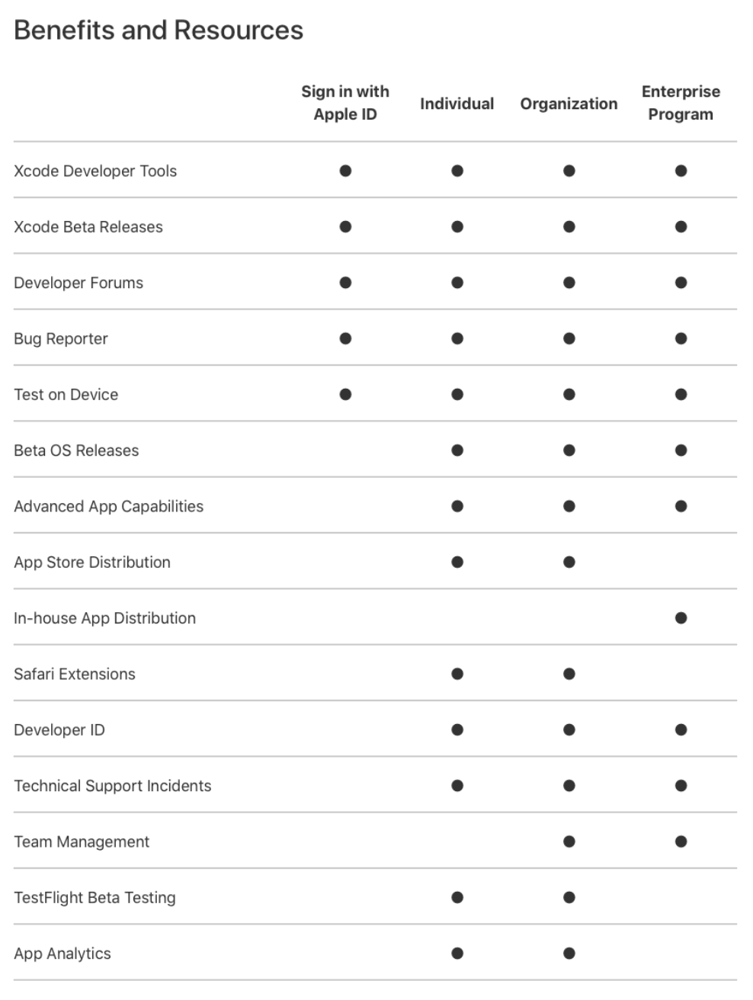


### Cuenta de desarrollador ###

Para darse de alta como desarrollador de Apple es necesario dar de
alta un Apple ID y definir una [autenticación de doble
factor](https://support.apple.com/es-es/HT204915). 

Con esta forma de autenticación activada, cada vez que intentes
acceder a tu cuenta desde un nuevo dispositivo tendrás que introducir
un código de autorización que se envía a tus dispositivos autorizados
en los que estás logeado.

También es posible recibir un código de autorización en un teléfono
móvil que deberás proporcionar en tu registro.


Una vez dados de alta como desarrolladores de Apple podremos acceder a
la [cuenta de desarrollador](https://developer.apple.com/account/), en
la que podremos gestionar numerosos elementos que veremos durante el curso.


También tenemos acceso al portal de gestión de nuestras apps, el [App
Store Connect](https://appstoreconnect.apple.com/login) desde donde
gestionar recursos relacionados con nuestro equipo de desarrollo y
prueba, así como preparar las apps para su distribución en la App
Store.


### Equipo de desarrollo ###

En todos los programas de pago de desarrollador de Apple, incluso en
los programas individuales, es posible trabajar con un equipo de
desarrolladores. 

Cuando se da de alta un programa de desarrollo se crea un
identificador de equipo único (_Team ID_)  que compartirán todos los
desarrolladores del equipo. Se puede consultar el identificador de
equipo en la opción _Membership_ de la cuenta de desarrollador.


Se pueden añadir desarrolladores al equipo desde el App Store Connect,
en la opción de _Usuarios y Acceso_.


También es posible configurar los permisos de los desarrolladores del
equipo para que puedan subir apps o probarlas como _testers_ en Test
Flight.

----

## Demo ##

Veremos una demostración en la que accederemos a la [cuenta de
desarrollador](https://developer.apple.com/account/) y al [App Store
Connect](https://appstoreconnect.apple.com/login) usando distintos
perfiles:

- Perfil gratuito (domingo.gallardo.appledev2@gmail.com)
- Miembro de la cuenta de la universidad (domingo.gallardo.appledev1@gmail.com)
- Administrador de la cuenta de la universidad (domingo@dccia.ua.es)
- Perfil de pago (domingo@dccia.ua.es)

----


## Certificados  ##

### Código firmado ###

Para poder tanto ejecutar una app en un dispositivo físico como
distribuirla en el _App Store_ es necesario firmar su código
digitalmente.

La **firma digital del código** (_code signing_) permite al sistema
operativo identificar quién ha firmado la app y verificar que no se ha
modificado desde el momento de su firma. El código ejecutable está
protegido por la firma y ésta se invalida si el código cambia. Los
recursos de la app como ficheros nib o imágenes no están firmados.

En tiempo de ejecución, el sistema iOS comprueba el código firmado de
todas las páginas ejecutables de memoria cuando se cargan, para
asegurar que la app no ha sido modificada desde que fue instalada o
actualizada por última vez.

Para poder firmar una app es necesario instalar un certificado
proporcionado por Apple que proporciona la clave privada con la que se
realiza la firma.


### Identidad de firma ###


Una **identidad de firma** (_signing identity_) consiste en una pareja
de clave pública y clave privada que proporciona Apple en el
certificado de desarrollador.

El certificado se almacena en el llavero de inicio de sesión del Mac
en el que se realiza el desarrollo (se puede consultar con la
aplicación _Acceso a llaveros_) y en la cuenta de desarrollador de
Apple.

La clave privada se usa para firmar la aplicación. La clave pública
del certificado determina la identidad del desarrollador. La mantiene
Apple en el centro de desarrollador y se guarda en los perfiles de
aprovisionamiento del equipo de desarrollo.

Se necesita también un certificado intermedio proporcionado por
Apple. Cuando instalas Xcode este certificado intermedio se guarda en
el llavero.

Es muy importante conservar segura la clave privada, como si fuera una
contraseña de una cuenta. Debes mantener una contraseña segura de tu
pareja clave pública-privada. Si se pierde la clave privada, tendrás
que crear una identidad completamente nueva para firmar el código. O
peor aún, si alguien se hace con tu clave privada puede hacerse pasar
por ti e intentar distribuir una app con código malicioso. Esto podría
hacer que Apple revocara tus credenciales de desarrollador.


### Tipos de certificados ###

Existen varios [tipos de certificados](https://help.apple.com/developer-account/#/dev52fdd1ce5):
de desarrollo, de distribución, para el servidor de notificaciones
push, etc. El **certificado de desarrollador** permite ejecutar
aplicaciones en un dispositivo. El de distribución permite enviarla al
_App Store_.

Los certificados de desarrollo identifican a una persona del
equipo. Los certificados de distribución identifican al equipo y
pueden ser compartidos por los miembros del equipo que tienen permiso
para enviar apps al _store_.

Todos los certificados son proporcionados por Apple.

Para comprobar el tipo de certificado podemos consultar el _member
center_, _Xcode_ o _Acceso a llaveros_.


### Gestión de los certificados en Xcode ###

Xcode mantiene nuestra identidad (Apple ID) y nuestros certificados. 

En el caso de pertenecer a más de un programa de desarrollo (por
ejemplo al programa educativo de la UA y a nuestro programa personal)
Xcode muestra las dos identidades y nos permite utilizar la que nos
interese en cada momento.
  
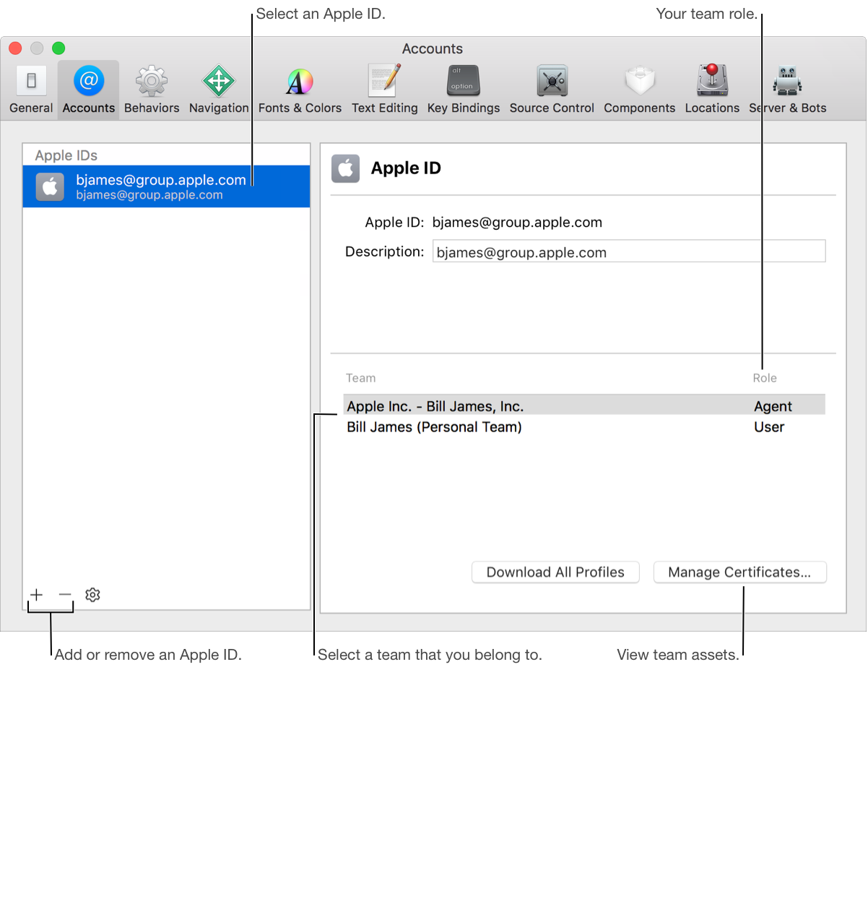


### Creación e instalación de certificados ###

Es posible generar e instalar manualmente los certificados, pero es
más sencillo dejar que sea Xcode quien los gestione.

Al firmar una aplicación por primera vez, Xcode se descarga de los
servidores de Apple e instala automáticamente el certificados de
firma.


### Ejecución de apps en dispositivos reales ###

Para la instalación y ejecución de una app iOS en un dispositivo
físico es necesario realizar una configuración del _target_ (binario
que se instala en el dispositivo) que incluye múltiples procesos:

- **Firma digital** del binario con un certificado del desarrollador
  proporcionado por Apple (_Signing Certificate_).

- Instalación de un **perfil de aprovisionamiento** (_Provisioning
  Profile_) correcto que determina, entre otros: servicios de la
  plataforma Apple a los que la app puede acceder (**_capabilities_**
  y **_entitlements_**) y dispositivos concretos (IDs) autorizados en
  los que puede ejecutarse la app (lo veremos más adelante).

Xcode facilita la realización de todos estos procesos. 
  


El resultado de estos procesos es un fichero binario .ipa firmado
digitalmente.

La forma habitual de instalar una app en un dispositivo iOS es
descargándola del App Store. Pero también existen formas alternativas,
para el caso de dispositivos de prueba o apps distribuidas
internamente en una empresa (_in-house_). En estos casos es posible
instalar las apps desde _Test Flight_, desde una web o con el programa
de MacOS _Apple Configurator 2_.

Resumiendo las distintas condiciones posibles, un dispositivo iOS
puede ejecutar una app si:

1. El dispositivo es un dispositivo de desarrollo inicializado por
  Xcode.
2. El dispositivo tiene instalado un perfil de aprovisionamiento
  aprobado por el usuario, que contiene el UUID del propio dispositivo
  y el certificado contiene la clave pública del desarrollador que ha
  firmado la app.
3. Se trata de una versión beta de la app que se ha instalado con Test
   Flight.
4. El dispositivo tiene instalado un perfil de aprovisionamiento
  aprobado por el usuario y la app está firmada con un certificado de
  empresa proporcionado por Apple.
5. Proviene del App Store y está firmada con un certificado de
  distribución en el App Store.

----


## Demo ##

Vamos a demostrar cómo firmar una app y cómo ejecutarla en un
dispositivo autorizado por Xcode.

### Instalación de la identidad de firma ###

Una vez creado el Apple ID, Xcode facilita el proceso de generación
de nuestra identidad de firma y de nuestro certificado de
desarrollador.

Escogemos _Xcode > Preferences_ y pinchamos en el signo + para añadir Apple
ID.

 


Si todo ha ido bien, Xcode mostrará la información de nuestro perfil gratuito. 

### Firma de una app ###

Para firmar una app con Xcode debemos seleccionar el proyecto completo,
el _target_ y, en el apartado General, rellenar el _bundle ID_ de la
app y seleccionar tu identidad de firma en la opción _Signing_.


El _bundle ID_ debe ser un identificador único. Si utilizamos uno que
ya se ha usado Xcode indicará un error. Podemos utilizar nuestro
nombre de login, seguido de un punto y del nombre de la app.


### App ejemplo `ToDoList` ###

Vamos a utilizar una app ya codificada para probar todos los conceptos
de esta sesión. Se trata de una app muy sencilla, con la que podemos
gestionar una lista de tareas por hacer.


Podemos descargar la app de [esta
dirección](https://github.com/domingogallardo/apuntes-spm-ios/raw/master/apps/ToDoList.zip)
y probar a ejecutarla en el simulador.

Estando en el programa de desarrollo gratuito podemos probar la app en
nuestro móvil de desarrollo. Para ello es necesario firmar el código
compilado de la app con el certificado de desarrollador que acabamos
de obtener.
    
Al firmar la app, Xcode creará automáticamente el certificado de
desarrollador.

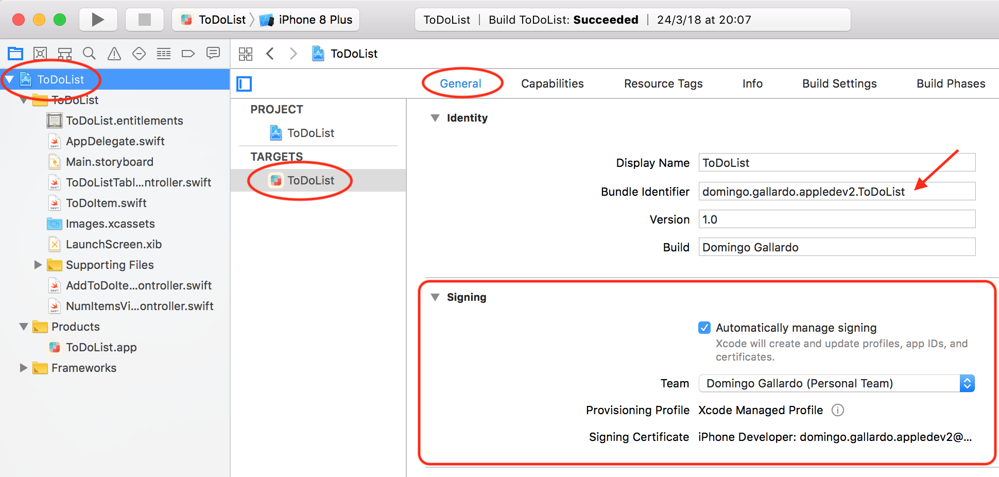

### Comprobación del certificado ###

En la pantalla de _Xcode > Preferences... > Accounts_ pulsamos _Manage
Certificates..._ para comprobar el certificado recién creado.

Podemos gestionar los certificados (crear nuevos, exportar, importar,
examinar) desde esta pantalla. Podemos encontrar más información en el
[manual de
Xcode](https://help.apple.com/xcode/mac/current/#/dev154b28f09).

 

 

### Comprobación de la identidad de firma en Acceso a Llaveros ###

En la aplicación Acceso a Llaveros y podemos comprobar que se ha
instalado el certificado junto con la clave privada en _Mis
certificados_ e _Inicio de sesión_.


### Conexión de un dispositivo real a Xcode ###

Conectamos un dispositivo iOS real al ordenador.

En Xcode seleccionamos _Window > Devices_ para comprobar que se ha
conectado correctamente. En esa ventana se puede acceder al
identificador UUID del dispositivo.

Es posible activar la conexión inalámbrica al dispositivo.


### Prueba en un dispositivo real ###

Seleccionamos el dispositivo en el menú de ejecución y ejecutamos para que
la app se instale en el dispositivo.

Es posible desplegar y ejecutar la aplicación en el dispositivo de
forma inalámbrica.


### Autorización al desarrollador en el dispositivo ###

Al ser un dispositivo de prueba gestionado automáticamente por
Xcode, debemos autorizar al desarrollador antes de poder lanzarse la
app.

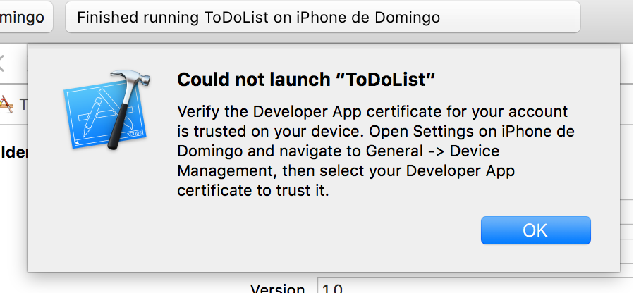

 

 


### Archivo y distribución de la app ###

Seleccionando la opción de Xcode _Product > Archive_ se accede al
panel de archivo y distribución de la app 

La opción de exportar la app está deshabilitado por que estamos
registrados con el programa gratuito.

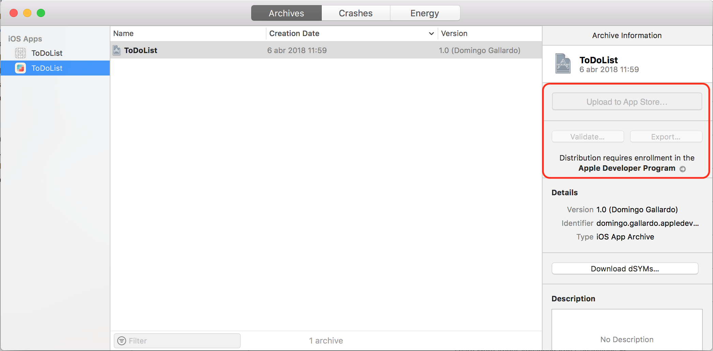

!!! Alert "Cuidado"
    Para poder pulsar la opción _Archive_ debe estar seleccionada la
    opción _Generic iOS Device_ en el menú de ejecución. Si está
    seleccionado un modelo concreto de iPhone la opción _Archive_ se
    deshabilita. 

    


----

## Despliegue de apps en dispositivos de prueba ##


### Capacidades de las apps ###


Para poder utilizar servicios avanzados proporcionados por Apple en
las apps (como notificaciones push, iCloud o Game Center) es necesario
darse de alta de forma individual en el programa de desarrollo de iOS
o formar parte de un equipo de desarrollo. 

Para una lista completa de las capacidades disponibles según el tipo
de desarrollador se puede consultar la documentación en [_Apple
Developer > Support > Advanced App
Capabilities_](https://developer.apple.com/support/app-capabilities/).

 

Con el programa de desarrollo de la Universidad podemos acceder a más
servicios que a los gratuitos, pero no a todos los servicios
disponibles. La lista de servicios accesibles son los siguientes:

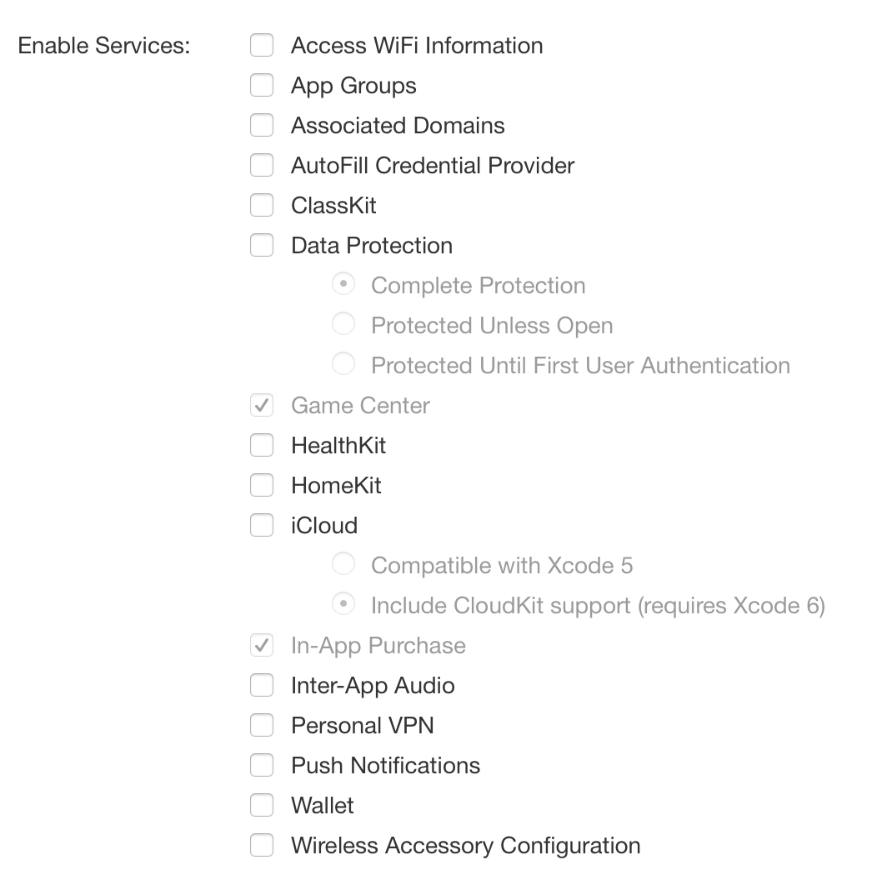


### Permisos para las apps ###

Un permiso (_entitlement_) es un elemento de configuración incluido en
la firma digital de la app que le indica al sistema que permita a la
app acceder a ciertos recursos o realizar ciertas operaciones.

La forma de otorgar los permisos a una app es algo elaborada, para
permitir una configuración flexible y no atar los permisos a una única
app.

El responsable de la cuenta de desarrollador debe crear un
identificador denominado **_App ID_** y otorgar los permisos a ese
identificador. 

### _Bundle Identifier_ ###


Un _bundle ID_ identifica de forma única una app. 

La cadena de _bundle ID_ debe contener únicamente caracteres
alfanuméricos (A-Z,a-z,0-9), guiones (-), y puntos (.). La cadena
debería estar en un formato DNS-inverso y usar un dominio propio de la
organización. De esta forma se garantiza su unicidad. Por ejemplo, si
el dominio de la organización es `Acme.com` y creamos una app llamada
`Hola` podríamos usar como _bundle ID_ de la app la cadena
`com.Acme.Hello`.


### Uso del Bundle ID ###


Se utiliza durante el desarrollo para aprovisionar dispositivos y por
el sistema operativo cuando la app se distribuye a los clientes. Por
ejemplo, los servicios de Game Center o de compras In-App usan el
_bundle ID_ para identificar la app cuando utilizan estos servicios.


### App ID ###

El **App ID** es un patrón de texto que da permiso a un único _bundle
ID_ (identificador de la app) o a un conjunto de ellos. Un App ID
define una lista de capacidades (_whitelist_) que permitimos usar a
una app (_explicit App ID_) o varias apps (_wildcard App ID_).

El _App ID_ se puede crear de forma automática desde Xcode o
manualmente desde la propia cuenta de desarrollo. 


Todos los App IDs creados se guardan en el _member center_. Los que
crea Xcode de forma automática tienen en su nombre el prefijo XC.


Por ejemplo, podríamos crear el App ID `es.ua.mastermoviles.icloud.*`
con permiso de acceso a iCloud y todos los _bundles ID_ que tengan
este prefijo podrán acceder al servicio.

Una vez creado, el _App ID_ se instala en un **perfil de
aprovisionamiento** que permite que una o más apps desarrolladas por
el equipo accedan a los permisos otorgados.

En el caso de un desarrollador individual los permisos se gestionan
automáticamente desde Xcode, que es quien se encarga de crear el _App
ID_ y otorgarle los permisos necesarios.

La cadena del APP ID contiene realmente dos partes separadas por un
punto: el prefijo, que es el _Team ID_, y el sufijo que es la
cadena de búsqueda del _bundle ID_ propiamente dicha.


### Gestión de las capacidades en Xcode ###

En Xcode se deben indicar las capacidades que necesita la app que
estamos desarrollando.

Para ello debemos seleccionar el _target_ y la opción
_Capabilities_. Dependiendo del programa de desarrollo en el que
estemos tendremos más o menos capacidades disponibles.

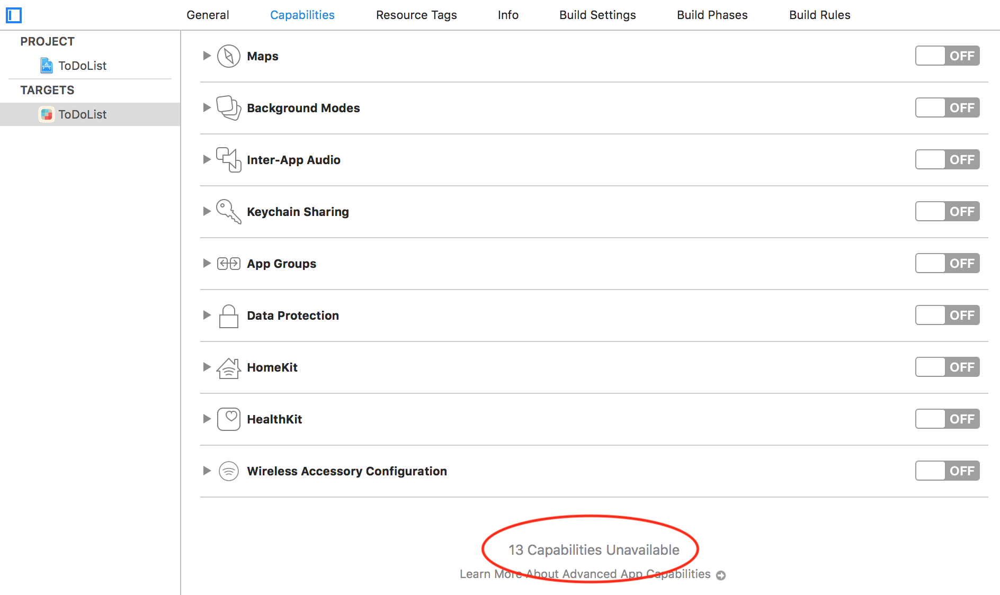

Una vez seleccionadas las capacidades que necesitamos, Xcode busca en
el _member center_ algún perfil de aprovisionamiento con un App ID que
empareje el _bundle ID_ y que satisfaga estas necesidades. Si no
existe ninguno, crea el _App ID_ y el perfil de aprovisionamiento de
forma automática. El App ID lo registra en la cuenta de
desarrollo. Sólo lo puede hacer si somos administradores.


### Aprovisionamiento de apps ###

Es necesario configurar un perfil de aprovisionamiento para
que la app pueda acceder a servicios de la plataforma Apple (como almacenamiento
iCloud, mapas, compras In-App o notificaciones push) y para configurar
dispositivos de prueba en los que podamos ejecutar la app.

Con la cuenta de desarrollador gratuita es posible desarrollar
aplicaciones, acceder a un número limitado de servicios de Apple y
probarlas configurando el dispositivo propio como un dispositivo de
desarrollo. Pero es una forma muy limitada de prueba
porque es necesario conectar físicamente el dispositivo al ordenador
en el que está Xcode.

Es posible ejecutar apps en dispositivos de prueba sin tener que
configurarlos como dispositivos de desarrollo usando **perfiles de
aprovisionamiento**. Esto solo es posible si tenemos una cuenta de
pago de desarrollador o si estamos en un equipo con una cuenta. En
nuestro caso usaremos la cuenta del programa de desarrollo de la
universidad. 

### Distribución de apps ###

La forma de distribuir apps en la plataforma iOS es la App Store. Para
enviar una app al App Store es necesario haberse registrado en el
programa de pago de desarrollador de Apple. 

Apple proporciona un certificado de distribución necesario para subir
la app al App Store. De esta forma, todas las apps en el App Store han
sido enviadas por una persona o una empresa conocida.

Las apps enviadas son revisadas por Apple para asegurarse de que
funcionan tal y como se describe y que no contiene bugs obvios ni
otros problemas evidentes. Este proceso de curación da a los clientes
confianza en las apps que compran.

Antes de distribuir la app en el App Store debemos haberla probada en
dispositivos de prueba. Como ya hemos dicho, Apple permite ejecutar
apps en dispositivos registrados mediante el uso de **perfiles de
aprovisionamiento**.

Apple también permite distribuir una app de forma restringida, sólo a
los dispositivos particulares de los empleados de una empresa. Para
ello es necesario darse de alta en el **Apple Developer Enterprise
Program** y utilizar también el perfil de aprovisionamiento
apropiado. 


### Perfil de aprovisionamiento ###

Un **perfil de aprovisionamiento** (_provisioning profile_) es un fichero
que contiene una colección de datos (claves públicas de certificados,
permisos, UUIDs de dispositivos autorizados, etc.) que conecta
desarrolladores y dispositivos a un equipo de desarrollo autorizado y
que permite que un dispositivo sea utilizado para pruebas.

Un perfil de aprovisionamiento determina básicamente:

- Qué servicios puede utilizar una app.
- En qué dispositivos se pueden ejecutar la app.

Un perfil de aprovisionamiento contiene los siguientes elementos:


- **App ID**: nombre del perfil, cadena de búsqueda y servicios
  autorizados por el pérfil.
- **Certificados** de desarrolladores del equipo.
- **Dispositivos**: Nombre e identificadores de dispositivos.

Físicamente, los perfiles de aprovisionamiento son ficheros XML
encriptados. Los que usa Xcode se guardan en el directorio
`~Library/MobileDevice/Provisioning Profiles`. Si los borramos de esa
carpeta, automáticamente se borran de Xcode.

Es posible consultar su contenido desde el terminal con el comando:

```
security cms -D -i <perfil>.mobileprovision
```

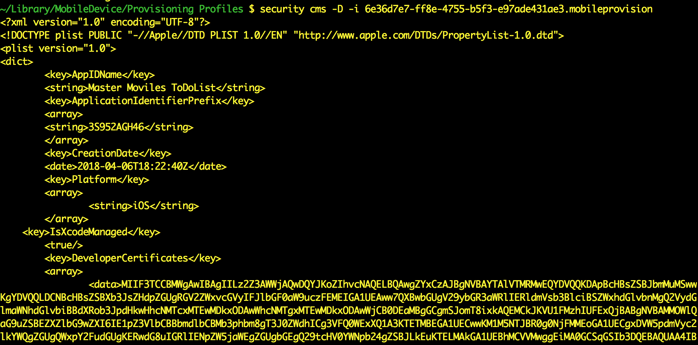

También podemos visualizar su contenido con la vista previa del
Finder:


### Dispositivos de prueba en el perfil de aprovisionamiento ###

El perfil de aprovisionamiento de una app se incluye en el binario de
la app (fichero .ipa) y se instala automáticamente en el dispositivo
cuando se copia la app.

Para que la app se pueda ejecutar en el dispositivo, su UUID debe
estar incluido en la lista de dispositivos autorizados del
perfil. Además se deben cumplir las siguientes condiciones:

- El bundle ID de la app empareja el App ID del perfil.
- Los permisos solicitados por la app están otorgados en el App ID del
perfil.
- La app está firmada por un desarrollador cuya clave pública está en
la perfil de aprovisionamiento.


En combinación con el **bundle ID**, el **perfil de
aprovisionamiento** (_provisioning profile_) y los **permisos**
(_entitlements_) se usa para asegurar que:

- La app ha sido compilada y firmada por nosotros o por un miembro de
  confianza del equipo.
- Las apps firmadas por nosotros o por nuestro equipo se ejecutan sólo en
  dispositivos de desarrollo escogidos.
- Las apps se ejecutan únicamente en los dispositivos de prueba
  que especifiquemos.
- Nuestra app no está usando servicios que no hemos añadido al app.
- Sólo nosotros podemos enviar revisiones del app al _store_.


### Instalación de la app en un dispositivo de prueba  ###


Es posible instalar la app en el iPhone de prueba usando Xcode o
_Apple Configurator 2_.

La aplicación _Apple Configurator 2_ permite configurar dispositivos,
hacer copias de seguridad, añadir apps, etc. Contiene funcionalidades
que se han extraído de iTunes.

La app se copia en el dispositivo junto con el perfil de
aprovisionamiento (está incluido en el ipa). De esta forma, para
ejecutar la app no es necesario autorizar el perfil del desarrollador.


Podemos instalar también el fichero _ipa_ desde el panel de gestión de
dispositivos de Xcode accesible desde la opción _Window > Devices_.

Allí también podemos comprobar el perfil de aprovisionamiento recién
instalado.

### Ejecución de apps en dispositivos no registrados ###

Existen dos tipos especiales de perfiles de aprovisionamiento que
permiten que cualquier dispositivo (no solo aquellos que están
registrados en el propio perfil) puedan ejecutar una app:

- El _App Store Distribution Provisioning Profile_ que se utiliza para
  poder subir la app al App Store de Apple.
- El _In-house Distribution Provisioning Profile_ que se utiliza para
  poder distribuir una app en la empresa y que debe tener un
  **certificado de empresa** de Apple.


### Certificados de empresa ###

Los certificados de empresa de Apple han sido noticia recientemente
debido a que Apple ha detectado [malas prácticas en su uso por parte de
Facebook y Google](https://www.theverge.com/2019/1/31/18205795/apple-google-blocked-internal-ios-apps-developer-certificate). Como
castigo, Apple ha revocado los certificados durante un par de
días. Durante ese tiempo, las apps _in-house_ de esas compañías han
dejado de funcionar. 

El mal uso de Facebook y Google de estos certificados [ha puesto al
descubierto](https://www.theverge.com/2019/2/20/18232583/apple-ios-developer-enterprise-program-store-mobile-apps)
la existencia de una gran cantidad de sitios que hacen un uso
fraudulento de los certificados de empresa de Apple para distribuir
apps no permitidas en el App Store (de juego o pornografía) como si
fueran apps _in-house_.


----

## Demo ##

### Resumen del flujo de trabajo ###

Es necesario firmar digitalmente la app para poder ejecutarla en un
dispositivo y usar ciertos servicios como CloudKit, Game Center o
compras In-App.

Los dispositivos que se usan para el desarrollo deben ser registrados
y añadidos en el perfil de aprovisionamiento que uses para firmar la
app.

Si seleccionamos la opción de firma automática en Xcode (es lo
recomendado), Xcode crea estos elementos de forma automática. Si
perteneces a un equipo, algunos de estos permisos deben ser
configurados por el administrador del equipo en la web de
desarrollador de Apple.

Pasos a seguir:

1. Nos damos de alta al equipo de la universidad.
2. El administrador del equipo de la universidad crea un App ID con
   ciertas capacidades y un perfil de aprovisionamiento con ese App
   ID, los dispositivos de prueba y los desarrolladores del equipo.
3. Compilamos la app, añadimos las capacidades necesarias y la firmamos con la cuenta del equipo.
4. Exportamos el fichero .ipa compilado de la app.
5. Instalamos y ejecutamos la app en un dispositivo de prueba.


### Equipo de desarrollo del programa de Universidad ###

La mayoría de opciones en el member center serán sólo accesibles para
consulta. Será el administrador del equipo de la Universidad el que
podrá cambiarlas.

 

Es necesario crear un nuevo certificado para el desarrollador,
distinto del certificado individual. Servirá para firmar aplicaciones
desarrolladas en el equipo en el que se ha añadido al desarrollador.

Se puede hacer desde el _member center_ o desde Xcode. Será un
certificado de tipo **iOS App Development**.

 


Para confirmar que se ha creado el nuevo certificado, podemos entrar
en el _member center_ o en la aplicación de Acceso a llaveros:
  


### Firma de la app con el nuevo certificado ###


Para firmar la app con el nuevo certificado dejamos marcada la opción
para que Xcode gestione automáticamente la firma. Seleccionamos el
_team_ Universidad de Alicante.

Aparecen los siguientes errores porque Xcode no puede realizar
automáticamente las actualizaciones que necesita:

- La cuenta no tiene permisos suficientes para crear un perfil de
  aprovisionamiento.
- No existe perfil de aprovisionamiento aplicable al bundle ID de
  la app.

Es el **administrador de la cuenta** de la UA el que debe crear un
perfil de aprovisionamiento para la app en el _member center_ e
incorporar en ese perfil el certificado del desarrollador.


### Examinamos los perfiles de aprovisionamiento ###


Podemos examinar los perfiles de aprovisionamiento desde el _Member
Center_ o desde Xcode y el terminal

En el _Member Center_ tenemos que entrar en la opción _Certificates,
Identifiers and Profiles_ para entrar en la página de gestión de los
perfiles de aprovisionamiento.


### Menú de opciones ###


Contiene todos los perfiles de aprovisionamiento creados, junto con
la información asociada.

- **Certificados**: todos los certificados de los desarrolladores del
  equipo.
- **Identificadores**: todos los App IDs aprobados, con las
  características aprobadas en cada uno de ellos.
- **Dispositivos**: todos los dispositivos aprobados para probar las
  apps


### Creación un App ID desde _Member Center_  ###

Sólo se puede hacer con el rol administrador.


### Dispositivos ###

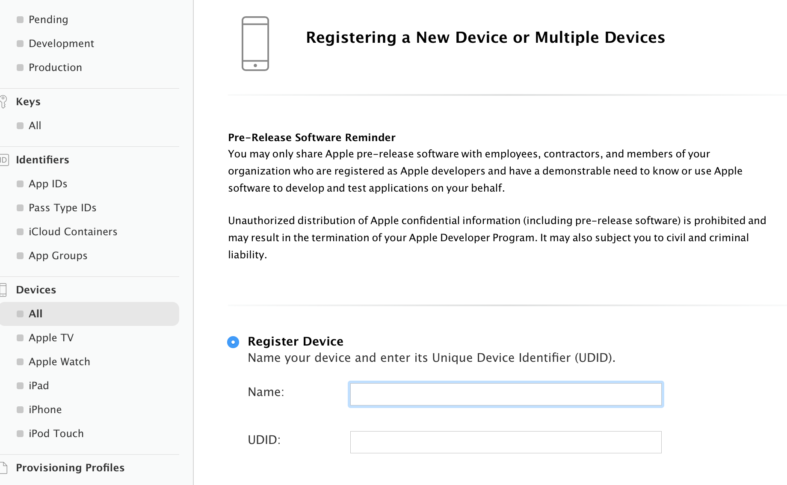

Para añadir un dispositivo a un certificado de aprovisionamiento hay
que añadir su UDID, _Unique Device Identifier_.

Cadena de 40 caracteres de símbolos alfanuméricos (a-z y 0-9).

Desde Xcode se puede obtener en la pantalla de Dispositivos (_Window > Devices_).

Se pueden registrar en el _Member Center_ hasta 200 UDIDs para
probar aplicaciones en desarrollo.

### Creación de perfiles de aprovisionamento ###

Una vez creado el App ID con los permisos necesarios, añadidos los
certificados de los desarrolladores del equipo y añadidos los
dispositivos es posible crear un nuevo perfil de aprovisionamiento.

Se puede hacer desde el _Member Center_ y también desde Xcode. Es más
claro ver el proceso desde _Member Center_, ya que Xcode mezcla el
proceso de creación del perfil con el de dar autorizaciones
(_entitlements_) a la propia aplicación.

### Nuevo perfil de aprovisionamiento desde _Member Center_  ###


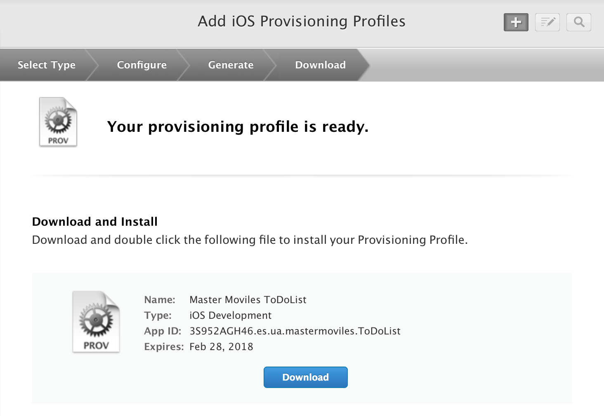 


### Firma de la app ToDoList con el perfil de aprovisionamiento creado ###

Una vez creado el perfil de aprovisionamiento ya es posible aplicarlo
a la app. Basta con definir un _bundle ID_ compatible con el App ID
definido en el perfil.

En este caso, al haber definido un App ID único (sin el `*`) se define
como _bundle ID_ el mismo.

El perfil de aprovisionamiento correspondiente se descarga automáticamente.


### Selección manual del perfil de aprovisionamiento ###

Es posible seleccionar manualmente un perfil de aprovisionamiento del _member
center_ eliminando la opción de Xcode de gestión automática de la firma.

 


### Capabilities ###

El perfil de aprovisionamiento que hemos creado permite 3 capabilities:

- Game Center
- In-App Purchase
- Keychain Sharing

Es posible activar cualquiera de estos servicios en la app, en el
menú _Capabilities_.

Ahora este menú muestra más servicios posibles, al pertenecer al
equipo de la UA:
  
 


  
  
### Activación del permiso de _Game Center_ ###


Si se activa el permiso de _Game Center_ Xcode se asegurará e que el
perfil de aprovisionamiento seleccionado proporcione este permiso. Si
no es así aparecerá un error y el botón Fix Issue.

Es posible comprobar el error si se intenta activar el permiso _Push
Notificacions_.

Xcode puede arreglar el error creando un nuevo perfil de
aprovisionamiento y subiéndolo al _Member Center_. Para ello hay que
tener permisos apropiados en la cuenta de desarrollador (ser un
administrador del equipo en el caso de una organización o el
propietario del equipo en el caso de un programa de desarrollo).


### Exportar la app  ###


Seleccionando en Xcode la opción _Product > Archive_ ahora ya está
activa la opción _Export_

Las opciones _App Store_ y _Ad Hoc_ no funcionan por no tener una
cuenta de universidad permisos para subir apps al App Store. Se puede
hacer con una cuenta de pago. En la opción _Ad Hoc_ es posible definir
una URL privada para descargar la app y probarla.

La única opción de exportación que funciona es _Development_, que
permite distribuir la app a cualquier dispositivo incluido en el
perfil de aprovisionamiento.


La opción de `App Thining` permite generar distintos ficheros _ipa_
adaptados a cada tipo de dispositivo, lo que minimiza el tamaño del
fichero. Si no se selecciona, se genera un único fichero _ipa_ que
puede ejecutarse en cualquier dispositivo.

Tarda un buen rato en generar el fichero _ipa_ (_iOS App file_).

El fichero generado es un binario que se puede instalar sólo en
dispositivos autorizados en el perfil de aprovisionamiento.
  
### Instalación y ejecución de la app ###

Probamos a instalar la app en un dispositivo autorizado usando Apple
Configurator 2.


----


## Distribución e instalación de betas online ##

Hemos visto que es posible ejecutar apps de prueba en dispositivos que
estén dados de alta en el perfil de aprovisionamiento. 

Pero la instalación de la app es un proceso algo tedioso: hay que
conectar físicamente el dispositivo a un ordenador Mac y realizar la
instalación mediante una aplicación auxiliar como Xcode o Apple
Configurator 2.

Sería mucho más fácil si permitiéramos instalar la app desde el propio
dispositivo (iPhone o iPad), descargándola de una web o de alguna app
de configuración.

Esto es lo que se consigue con la aplicación TestFlight de Apple (lo
veremos más adelante). Pero este servicio sólo está disponible para
apps enviadas al App Store. Es necesario para ello una cuenta de pago.

Existe una solución intermedia: seguir usando la distribución al
equipo de desarrollo mediante el alta de los dispositivos en el pefil
de aprovisionamiento, pero usar un servicio que facilite la
instalación de la app en esos dispositivos.

Es lo que se consigue con servicios como el que vamos a ver: Fabric.

### Fabric ###

**Fabric** es una plataforma y API que permite una gran cantidad de
funcionalidades: distribución, recopilación de datos de crashes,
recopilación de estadísticas de uso, etc.

Se trata de una plataforma creada por Twitter y comprada por Google en
enero de 2017. Se puede acceder desde [esta
URL](https://get.fabric.io).


En este año 2019 Google realizará la integración del servicio en Firebase.

----

## Demo ##

### Alta y descarga de Fabric ###

Debemos [registrarnos](https://fabric.io/kits?show_signup=true) en
Fabric con nuestro correo electrónico y nuestro nombre. Escribimos
como nombre de la organización nuestro propio nombre.


Hay entrar en el [dashboard](https://fabric.io/onboard) y descargar e
instalar la aplicación para Mac, moviéndola a la carpeta de
Aplicaciones. La última versión es la 2.7.5.

Una vez descargada, hay que registrarse en la aplicación en ella con
la misma cuenta y contraseña que en la web.


### Instalación de Fabric ###

La aplicación Fabric nos guía paso a paso:

Debemos seleccionar el proyecto XCode y añadir un **Run Script Build Phase**.

 

Se selecciona en Xcode **Build Phases** y en el símbolo **+** se
selecciona **New Run Script Build Phase**.

En la opción **Run Script** se pega el código que aparece en la
aplicación.

 

Compilamos la aplicación con la opción _Product > Build_.

Se instala el SDK Kit en el proyecto, arrastrando desde la aplicación
al proyecto.

 

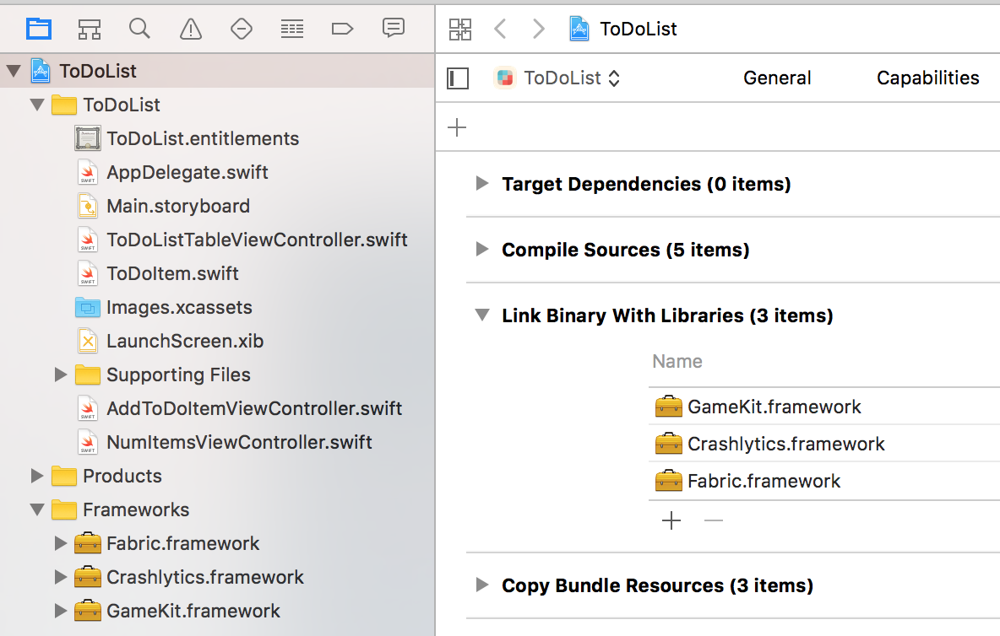 

Debemos copiar el código indicado en el fichero `AppDelegate.swift`.

 

Y volvemos a compilar la aplicación y la ejecutamos en el
simulador. La aplicación de Fabric detectará que la hemos lanzado y
aparecerá una pantalla indicando que todo ha ido correctamente.

 

También recibiremos un correo electrónico indicando que la app ya se
ha subido y está disponible para su distribución.

### Distribución a probadores ###

Debemos seleccionar en Xcode la opción de _Product > Archive_. 

!!! Alert "Cuidado"
    Recuerda que para habilitar la opción _Archive_ debe estar seleccionada la
    opción _Generic iOS Device_ en el menú de ejecución. Si está
    seleccionado un modelo concreto de iPhone la opción _Archive_ se
    deshabilita. 

    


Automáticamente la app aparecerá en la aplicación de Fabric.

 

Podremos activar la distribución, añadiendo los correos electrónicos
de las personas a las que se les enviará.

 

 

Si el UUID del dispositivo del probador está incluido en el perfil de
aprovisionamiento podrá ejecutar la app sin problemas. Si no, Fabric
obtendrá el UUID y nos lo proporcionará para que actualicemos el
perfil de aprovisionamiento.

### Ejecución de la app por el probador  ###

El probador recibe un e-mail que le dirige a una página web desde la
que debe instalar un perfil (que será el que permitirá leer el UUID
del dispositivo y comprobar si está incluido en el perfil de
aprovisionamiento instalado en la app que se distribuye).

 

 

 

 

Si el dispositivo puede ejecutar la app aparecerá un botón para
instalarla. La forma de instalarla será tan sencilla como pulsar ese
botón (no hay necesidad de usar iTunes ni Xcode).

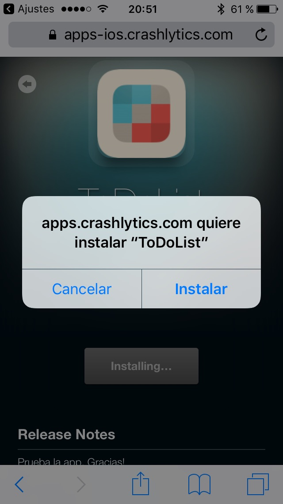 

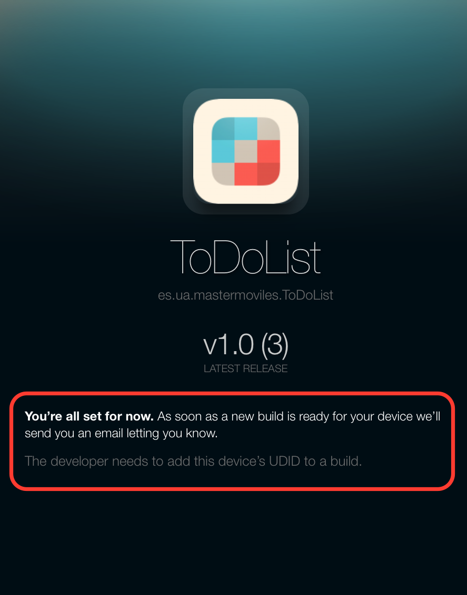 

Si el dispositivo no puede ejecutar la app, aparecerá un mensaje
indicándolo y nos informará del UUID.


### Dashboard de Fabric ###

En el dashboard ([https:/fabric.io](https://fabric.io)) podemos
acceder a estadísticas de descargas e instalaciones, información sobre
los crashes de nuestra apps, etc.

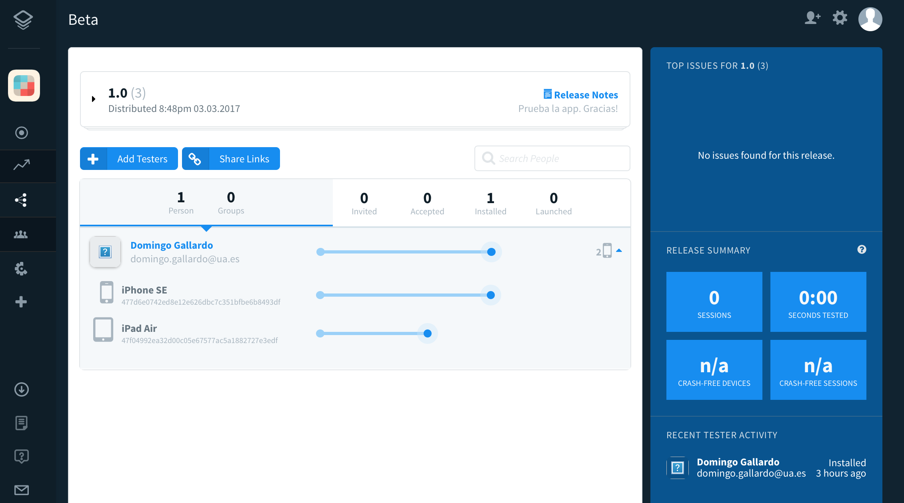

También podemos invitar nuevos probadores y crear un enlace desde el
que es posible instalar la app. Cuando se pulsa en el enlace se accede
a una página en la que se pide el e-mail de la persona que va a probar
la app.


----

## Test Flight ##

### Distribución de apps ###

El proceso de distribución de apps en el App Store es el siguiente:


### App Store Connect ###


App Store Connect es el servicio de Apple con el que los
desarrolladores pueden organizar:

- Todas sus apps para poder enviar a prueba versiones beta y subirlas
  al App Store.
- Toda la información legal y de impuestos.
- Información sobre el estado de los productos, retroalimentación
  e información de descargas, ventas y ganancias.

La plataforma está accesible desde el _member center_ en los programas de pago. No
está disponible en el programa de universidad.

También se puede acceder desde la URL
[https://appstoreconnect.apple.com](https://appstoreconnect.apple.com). 

!!! Note "Nota"
    Hasta el año pasado (2018) **iTunes Connect** era la plataforma única
    a la que se subían todos los productos para su distribución (apps,
    ebooks, podcasts, música). A mediados del 2018 Apple divide en dos
    esa plataforma, creando **App Store Connect** para gestionar
    únicamente apps. 
    
    Hemos conservado algunas imágnes del curso pasado en el caso en
    sean muy similares a las actuales. En estas imágenes aparece la
    cabecera _iTunes Connect_ en lugar de _App Store Connect_.

### Pasos para subir una app al App Store desde App Store Connect ###

1. Crear un registro en App Store Connect, un identificador único para el
   app.
2. Subir una compilación de la app.
3. Pruebas Beta: probar la app con usuarios de la organización o
   usuarios invitados, usando **Test Flight**.
4. Completar toda la información y enviar la app a revisión de la App Store.
5. Una vez que ha superado la revisión, la app se pone a la venta en
   la App Store.
6. Analizar analíticas de la app (de ventas, de uso, etc.) y
   desarrollar una nueva versión.


### Subir una compilación de la app ###


La forma más sencilla de subir una app a App Store Connect es
utilizando Xcode.

Debes crear un archivo ipa con la opción **_Product > Archive_** y
seleccionar la opción _Upload to App Store_.

Es posible subir distintos _builds_ y gestionarlos todos desde App
Store Connect. El identificador de la app es su _bundle id_.

### Añadir información de la App ###

Una vez que se ha subido la app, podemos añadir información sobre ella:


### Diseño de la página en el App Store ###

En el App Store se muestra distinta información sobre la app. Es
importante diseñar bien esta página para que sea atractiva para los
usuarios y estén interesados en descargar la app.

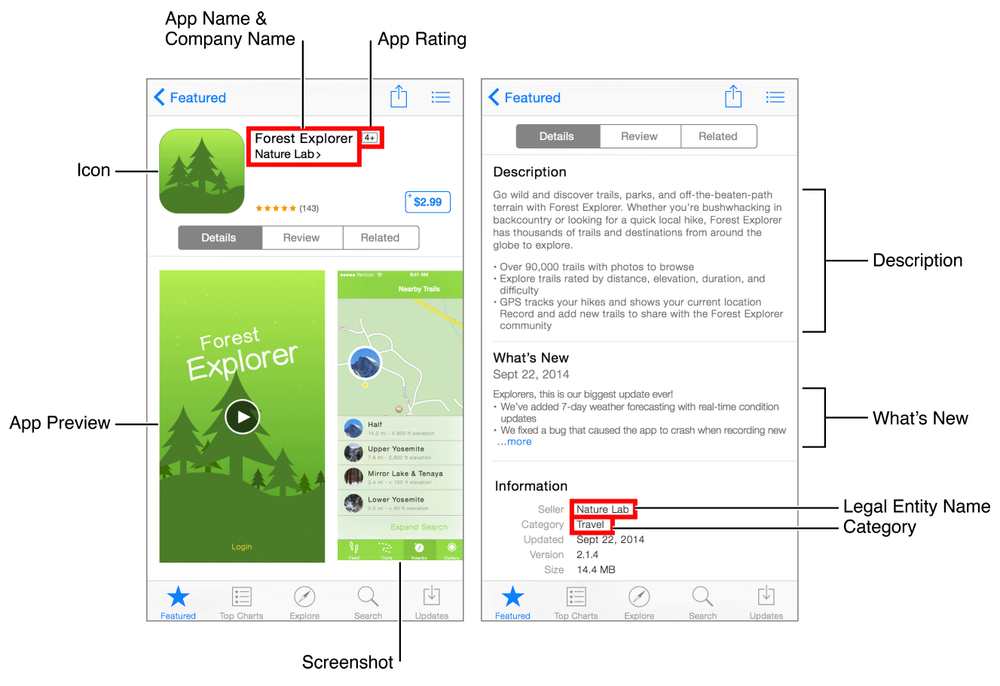

App Store Connect se usa para gestionar estos los elementos necesarios
para crear la página de la app en el App Store: nombre de la App,
iconos, previsualizaciones (pantallas y vídeos), descripción,
novedades, palabras claves y categorías.


### Nuevos usuarios App Store Connect ###

Es posible **añadir usuarios** a la cuenta de App Store Connect. Son
usuarios que van a poder trabajar con las apps subidas, realizando
funciones limitadas por su función.

No es necesario tener una cuenta de organización para poder añadir
usuarios colaboradores en App Store Connect. Es posible en cuentas de
desarrollador individual.

Los usuarios añadidos podrán ser **probadores internos** en TestFlight.

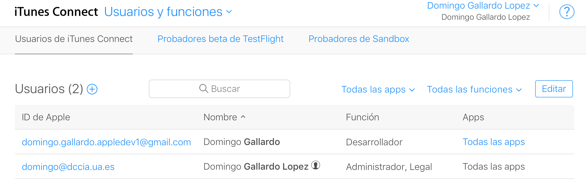


### TestFlight ###


TestFlight es una plataforma integrada en App Store Connect que permite
distribuir versiones beta de apps a probadores.

Es posible distribuir la app hasta 25 probadores internos
(seleccionados de entre los usuarios de la cuenta de App Store Connect) y
hasta 10.000 probadores externos.

Los usuarios de prueba deben descargarse la **app TestFlight** con la
que gestionarán la descarga de las pruebas en sus dispositivos.

### Aprobación de pruebas externas ###


Una vez subida a App Store Connect la app entra automáticamente en un
proceso de aprobación para que se pueda distribuir **externamente**
una versión beta en TestFlight.

La aprobación suele tardar menos de 1 día la primera compilación y ser
casi instantánea cada nueva compilación que se sube.

No es necesaria aprobación para la distribución de pruebas internas.


### TestFlight en App Store Connect ###


----

## Demo ##

Vamos a comprobar el funcionamiento de TestFlight, subiendo la app
ToDoList, añadiendo probadores y comprobando la instalación de la app
en los probadores.

### Registro de una app en App Store Connect ###

Antes de subir una app al App Store, hay que crear un registro de la
misma indicando un identificador único (SKU) que puede ser el propio
_bundle ID_ y seleccionando el App ID.


### Subida a App Store Connect con Xcode ###

Una vez creado el registro de la app ya es posible subirla desde
Xcode.


### Compilaciones listas para probar ###

Una vez que se ha subido a App Store Connect y ha pasado un tiempo
necesario para que la plataforma prueba que la app puede ser
distribuida para pruebas, aparecerá con un indicador verde lista para
probar. 

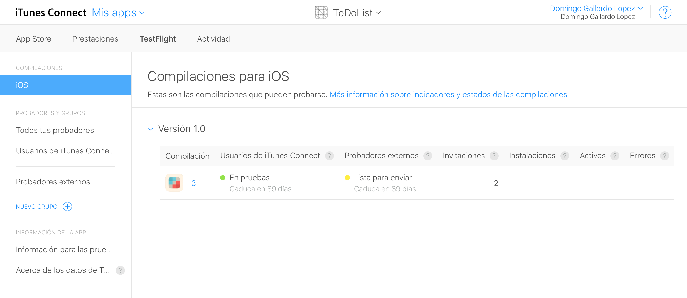

Los números de versión y de compilación (_build_) son los definidos
en Xcode.

Ahora la app está lista para que sea probada por los usuarios de
prueba internos. Podemos seleccionar la compilación a distribuir.


### Añadir probadores externos y enlace de prueba ###

Podemos también añadir usuarios de prueba externos y un enlace de
prueba que puede ser usado por cualquiera. Para ello es necesario
crear un grupo de prueba y volver a solicitar una autorización de
envío a pruebas de la app.

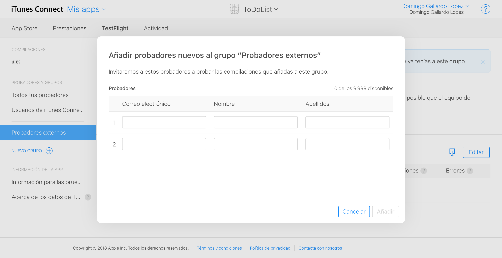

Debe pasar un tiempo para App Store Connect apruebe la distribución de
prueba. Mientras tanto la compilación seleccionada aparecerá en estado
_Pendiente de revisión_.


Una vez aprobada la distribución es posible crear un enlace para que
cualquiera la pueda instalar y probar.


### TestFlight en los usuarios ###

Los usuarios de prueba reciben un correo avisándoles de que la beta
está disponible.

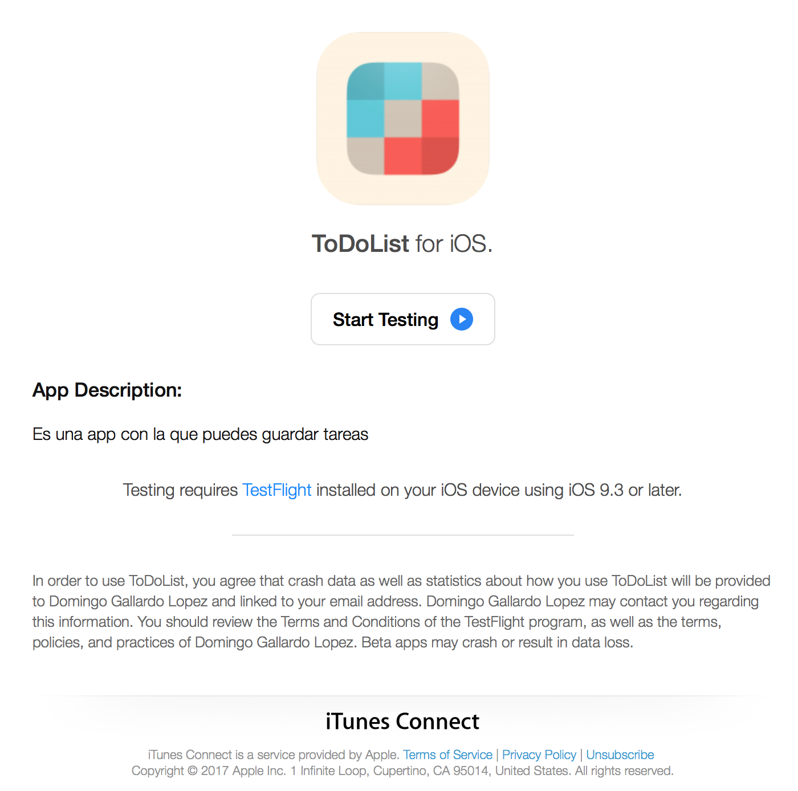

Deben instalar la app TestFlight y en la app aparecerá un botón que
permitirá instalar la app en el dispositivo. 

En este caso no es necesario que el dispositivo esté en la lista
incluida en el perfil de aprovisionamiento, porque la app está
autorizada por Apple para su ejecución en cualquier dispositivo.

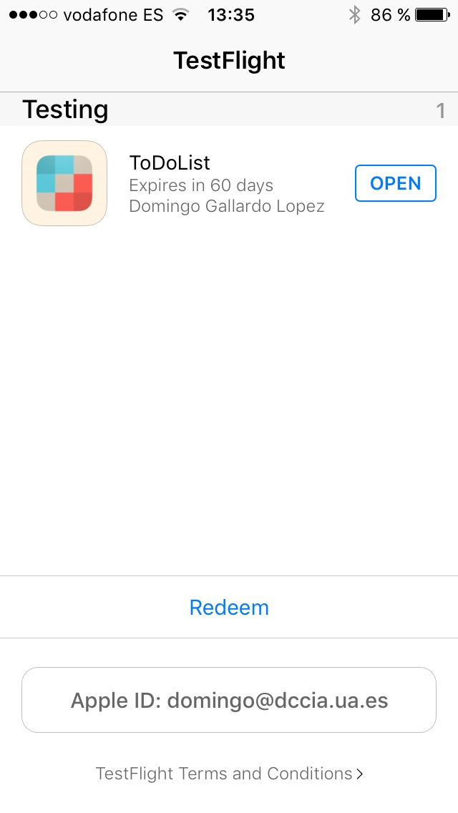

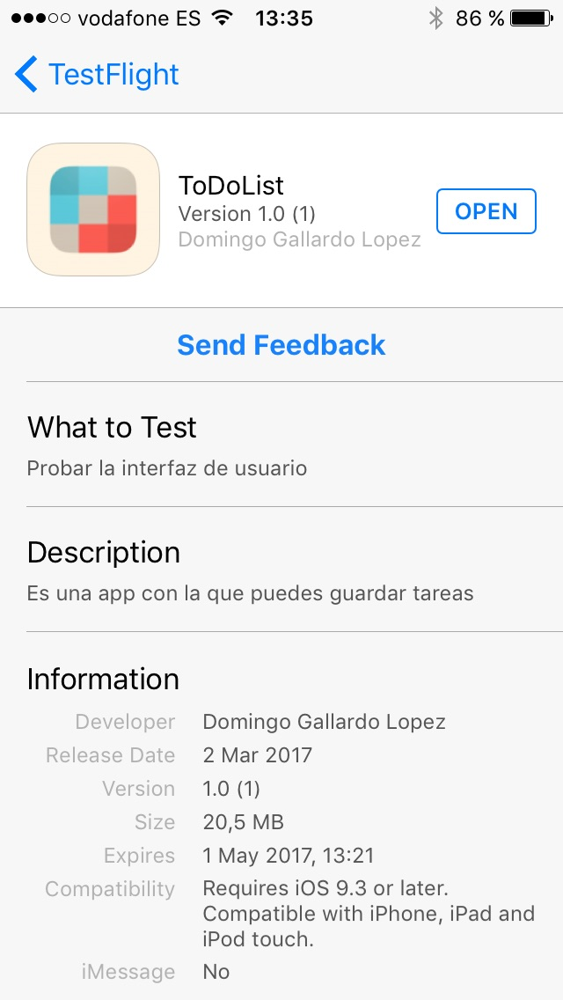

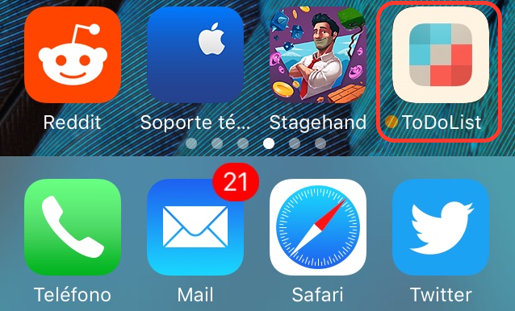

### Nuevas compilaciones ###

Cuando subimos desde Xcode una nueva compilación, debemos entrar en
el enlace de la compilación para activar la nueva prueba.

TestFlight enviará una notificación automáticamente a todos los
usuarios para que descarguen la nueva versión.


----

## Prácticas ##

En las prácticas de esta sesión deberás trabajar con distintos
aspectos relacionados con la firma, la distribución y el despliegue de
apps en dispositivos reales.

Resumimos a continuación lo que debes realizar:

1. Firmar una app con tu cuenta gratuita e instalarla en un
   dispositivo configurado como dispositivo de desarrollo.
2. Darte de alta en el equipo de desarrollo de la UA y firmar la app
   usando un perfil de aprovisionamiento que te permite instalarla en
   cualquier dispositivo autorizado en el perfil.
3. Distribuir esta app firmada con el perfil de aprovisionamiento del
   equipo de la UA usando Fabric.


### Creación de la cuenta de desarrollador Apple ###

Deberás crear un Apple ID introduciendo tus datos en [este
enlace](https://appleid.apple.com/account?localang=es_es). Este Apple
ID será el que se asociará a la cuenta de desarrollador.

Activa la autenticación de doble factor de alguna de las formas
definida en [este enlace](https://support.apple.com/es-es/HT204915).

Después deberás darte de alta como desarrollador Apple con el Apple ID
recién creado en [https://developer.apple.com/register/](https://developer.apple.com/register/).

De esta forma estás accediendo al programa gratuito. Este programa
permite acceder a las herramientas de desarrollo, la documentación y
acceso limitado a ciertas capacidades (incluido probar aplicaciones en
dispositivos conectados a Xcode).


Explora las distintas opciones que permite la cuenta:

- Documentation
- Downloads
- Forums
- Bug reporter
- Help


### Firma e instalación de una app en un dispositivo de desarrollo ###

1. Descarga la app [ToDoList](https://github.com/domingogallardo/apuntes-spm-ios/raw/master/apps/ToDoList.zip). 
2. Incluye tu nombre en alguna parte de la interfaz de usuario.
3. Fírmala con tu cuenta gratuita de desarrollador Apple (no la del
equipo de la UA). 
4. Instálala en un dispositivo de desarrollo conectado a Xcode y
   prueba que funciona correctamente.
5. Haz una foto y guárdala como documentación.


### Configuración de la cuenta de desarrollador  ###

Para la inscripción en el equipo de desarrollo de la universidad
escribe tu nombre, apellidos y dirección de e-mail en [este fichero
Google
Docs](https://docs.google.com/document/d/1-fgqgzKNPpo4--PGUvrsnXTe_ABA04gLcpv8rtJd9D0/edit?usp=sharing).

Una vez que te añadamos al equipo de la UA recibirás en el correo
electrónico un mensaje con un código de invitación. Pincha en él e
introduce allí tu Apple ID.


Una vez aceptada la invitación podemos entrar en el [_member
center_](https://developer.apple.com/account/), comprobar que ya estás
en el programa y probar las distintas opciones disponibles.


### Firma y despliegue de app con perfil de aprovisionamiento###

Debes seguir los pasos realizados en la demostración con la app
`ToDoList`.

1. Nos damos de alta al equipo de la universidad.
2. Compilamos la app, añadimos las capacidades necesarias y la firmamos con la cuenta del equipo.
3. Exportamos el fichero .ipa compilado de la app.
4. Instalamos y ejecutamos la app en un dispositivo de prueba.

### Distribución con Fabric ###


- Distribuye la app al profesor (`domingo.gallardo@ua.es`) usando
  Fabric.
- Captura la pantalla de la web de fabric en la que se muestra que el
  profesor ha instalado la app.
- Crea una nueva versión de la app en la que el usuario pueda provocar
  un crash (consulta cómo hacerlo en la documentación de
  Crashlytics). Distribúyela al profesor y captura la pantalla en la
  que se muestra el número de crashes producidos.


### Entregas ###

Resumen de las prácticas a realizar en esta sesión y entregas a
realizar en Moodle.

1. Descarga la app
   [ToDoList](https://github.com/domingogallardo/apuntes-spm-ios/raw/master/apps/ToDoList.zip)
   (o usa una app tuya que hayas desarrollado) y fírmala con tu cuenta
   gratuita de desarrollador Apple (no la del equipo de la
   UA). Modifica la app para que aparezca tu nombre en la interfaz de
   usuario. Instálala en un dispositivo de desarrollo de Xcode y
   prueba que funciona correctamente. Haz una foto y guárdala como
   documentación.
2. Firma la app con tu cuenta del equipo de la UA, activa
   el servicio de _Game Center_ e instálala en otro dispositivo del
   profesor que esté dado de alta en el perfil de aprovisionamiento,
   pero que no sea el dispositivo de desarrollo de Xcode. Instala la
   app usando _Apple Configurator 2_. Haz una foto y guárdala como
   documentación.
3. Distribuye la app al profesor (`domingo.gallardo@ua.es`) usando
   Fabric. Captura la pantalla de la web de fabric en la que se
   muestra que el profesor ha instalado la app.
4. Crea una nueva versión de la app en la que el usuario
   pueda provocar un crash (consulta cómo hacerlo en la documentación
   de Crashlytics). Distribúyela al profesor y captura la pantalla en
   la que se muestra el número de crashes producidos.
5. **Guarda las fotografías y pantallas en una carpeta, junto con el
   binario .ipa de la actividad 2, comprime la carpeta y entrégala en
   la actividad de Moodle _Entrega 1_**.


## Bibliografía

- [Developer Account Help](https://help.apple.com/developer-account/)
- [Code Signing Help](https://developer.apple.com/support/code-signing/)
- [Xcode Help](https://help.apple.com/xcode/)
- [Distribute your app to registered devices](https://help.apple.com/xcode/mac/current/#/dev7ccaf4d3c)
- [Distribute your  app](https://help.apple.com/xcode/mac/current/#/dev8b4250b57)
- [App Store Connect Help](https://help.apple.com/app-store-connect/)
- [Test Flight](https://developer.apple.com/testflight/)
- [Documentación de Fabric](https://docs.fabric.io/apple/fabric/overview.html)
  

