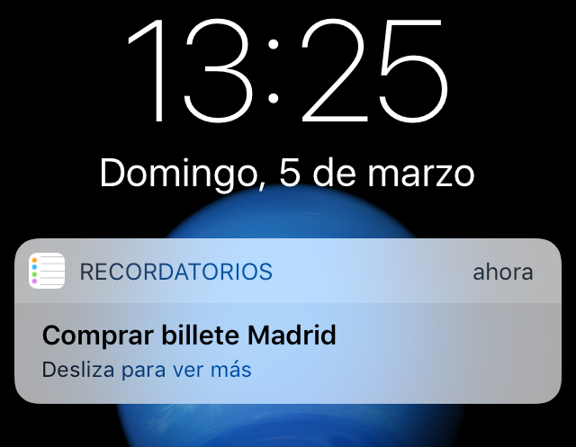
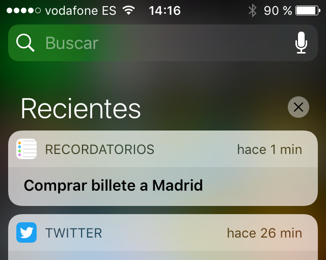
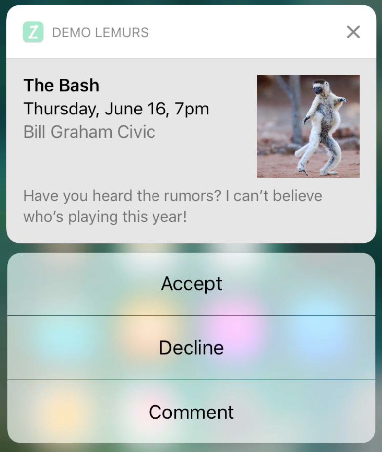
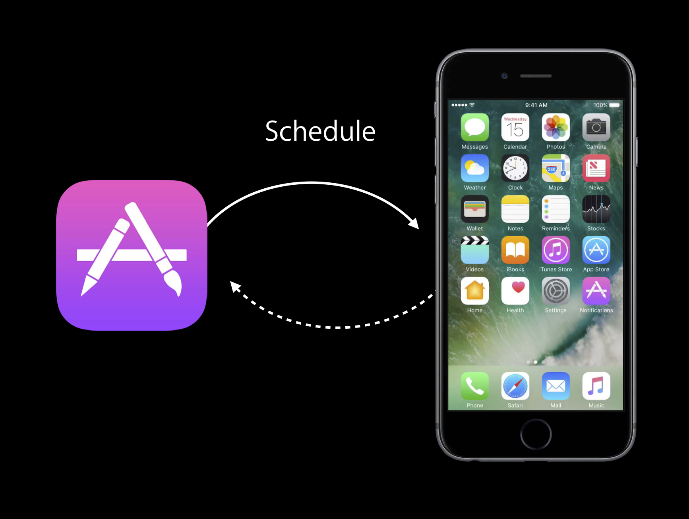
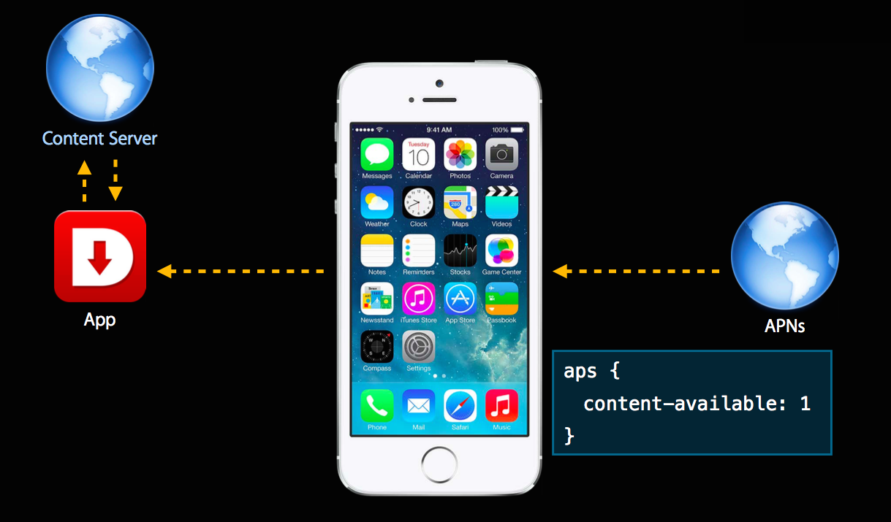
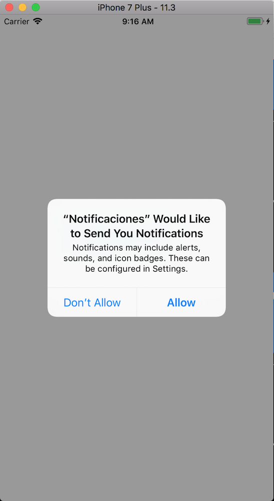
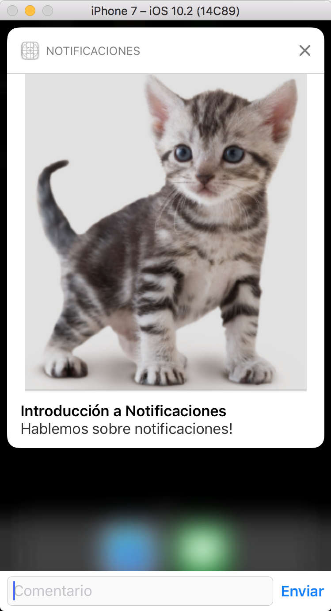
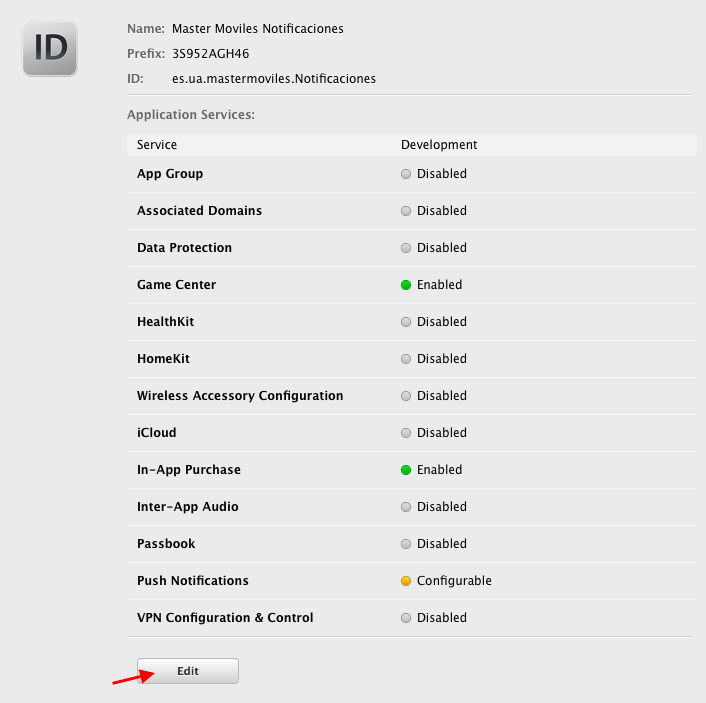
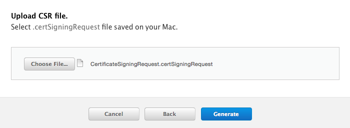

# Sesión 2: Notificaciones 

En esta sesión veremos la forma de crear, enviar y recibir
notificaciones locales y remotas (_push_) usando el _User
Notifications Framework_ de iOS.

## Introducción ##

En iOS sólo una única aplicación puede estar activa en un momento
dado. Sin embargo, en muchas ocasiones las apps operan en un entorno
basado en el tiempo o interconectado en el que es necesario avisar al
usuario cuando sucede algún evento. 

Las **notificaciones locales y remotas** permiten a estas apps
notificar a sus usuarios cuando ocurre algún suceso de su interés.

Todo el API para gestionar las notificaciones se unifica en iOS 10 en
el [_User Notifications
Framework_](https://developer.apple.com/reference/usernotifications) y
en el [_User Notifications UI Framework
Reference_](https://developer.apple.com/reference/usernotificationsui).

Además de los usos comentados, las notificaciones se utilizan también
para la comunicación entre nuestra app y el recién introducido _Apple
Watch_. Se puede consultar la [página de
recursos](https://developer.apple.com/watchos/resources/) de Apple
sobre el _WatchKit Framework_ para más información.


En la sesión de hoy vamos a ver la última versión del API de
notificaciones, introducida en iOS 11.

### Apariencia de las notificaciones ###

Tanto las notificaciones locales como las remotas pueden aparecer
como:

- Un aviso (_alert_) o tira (_banner_) en la parte superior de la
pantalla. Los avisos obligan al usuario a realizar una
interacción, las tiras aparecen y desaparecen.


- Un globo (_badge_) en el icono de la app.


- Un sonido que acompaña la alerta, _banner_ o _badge_.

El usuario puede configurar la aceptación de notificaciones y su
apariencia en los ajustes (**Ajustes > Notificaciones**).


### Dónde aparecen las notificaciones ###

Dependiendo de si el dispositivo está en uso o bloqueado, las
notificaciones se comportan de distinta forma.

Si el dispositivo está en uso, las notificaciones aparece en la parte superior.

 

Si el dispositivo está bloqueado aparecen en la pantalla de bloqueo.

 

En cualquier caso se guardan en el **centro de notificaciones** (se abre deslizando hacia abajo desde
la parte superior de la pantalla).

 


### Interacción en las notificaciones ###

Cuando se recibe una notificación, el usuario puede ignorarla, y se
guarda en el centro de notificaciones.

O puede interactuar con ella, desplegándola y seleccionando una de las
opciones estándar (_Abrir_, _Borrar_ o _Ver_):


- Con la opción _Abrir_ se pasa a primer plano la app a la que
  corresponde la notificación.
- Con la opción _Borrar_ se borra la notificación.
- Con la opción _Ver_ se muestra completamente la notificación y el
  usuario puede seleccionar una de las acciones incluidas en ella. Con
  el _User Notifications UI Framework_ es posible añadir imágenes,
  audio, vídeo e interfaces de usuario a las notificaciones y permitir
  al usuario interaccionar en la propia notificación sin abrir la app.




### Notificaciones locales ###

Las notificaciones remotas y locales satisfacen distintas
necesidades de diseño.

Una **notificación local** es planificada y enviada por la propia app,
cuando está en funcionamiento o cuando está en _background_ recogiendo
datos de un servidor y recibe alguna información interesante.



Dos ejemplos de uso:

- En una app que gestiona una lista de tareas por hacer, en la que
  cada ítem tiene una fecha y hora en el que debe ser completado.

- En una app que recibe en _background_ información de cotizaciones en
  bolsa y en la que hay un cambio considerable en la cotización de una
  empresa que el usuario ha marcado.

### Notificaciones remotas ###

Una **notificación remota**, también llamada _notificación push_,
llega del exterior del dispositivo. Se origina en un servidor remoto
gestionado por el desarrollador de la app (denominado proveedor de
la aplicación) y se envía al dispositivo del usuario a través del
_Apple Push Notification service_ (APNs).
  


Dos ejemplos de uso:

- En una aplicación de mensajería (estilo WhatsApp) se notifica cuando
  el usuario recibe un nuevo mensaje.

- En un reproductor de podcasts el servidor avisa de que hay un nuevo
  episodio disponible para ser reproducido.

### Para qué se usan las notificaciones ###

Las **notificaciones locales** se usan principalmente para gestionar
alarmas, recordatorios y eventos de una forma sencilla, sin tener que
usar un API más complicada como el _EventKit Framework_ que conlleva
el uso de apps como Calendario, Alarmas o Recordatorios.

Las **notificaciones remotas** se utilizan para:

- Avisar al usuario de que han sucedido determinados eventos.
- Notificar a la app para que descargue contenido nuevo para que
  esté disponible la próxima vez que el usuario la utilice.




### Notification service app extensions ###

Las **_app extensions_** de tipo _notification service_ son
extensiones que permiten modificar el contenido de las notificaciones
remotas antes de ser entregadas al usuario.

Por ejemplo, se pueden usar para:

- Implementar encriptación _end-to-end_ de las notificaciones.
- Modificar el contenido de la notificación, adaptándolo a algún
  contexto modificado en la app.
- Descargar del servidor imágenes o media adicionales.

Las veremos más adelante, en la sesión dedicada a las extensiones.


### Ciclo de vida de la app ###

Si pulsamos en una notificación y la app está en segundo plano no
ejecutándose, la app vuelve a primer plano.

Veremos que al volver a primer plano la app se ejecuta una función de
_callback_ asociada a la notificación, por lo que podremos modificar
la interfaz de usuario para adecuarla a la notificación que ha pulsado
el usuario (por ejemplo, si se trata de una app como Twitter, ir al
tweet correspondiente a la notificación).


<strong>Nota:</strong>

<table>
  <tr>
    <td><strong><em>Estado</em></strong></td> 
    <td><strong><em>Descripción</em></strong></td>
  </tr>
  <tr>
  <td><strong>No corriendo</strong></td> 
    <td>La app no ha sido lanzada o fue terminada por el usuario o por el sistema.</td>
  </tr>
  <tr>
    <td><strong>Inactiva</strong></td> 
    <td>La app está corriendo en primer plano pero no está recibiendo eventos (puede estar ejecutando código, sin embargo). Una app permanece en este estado brevemente, mientras realiza una transición a otro estado.</td>
  </tr>
  <tr>
    <td><strong>Activa</strong></td> 
    <td>La app está corriendo en primer plano y recibiendo eventos.</td>
  </tr>
  <tr>
    <td><strong>Background</strong></td> 

    <td>La app está ejecutando código pero no es visible en
        pantalla. Cuando el usuario sale de una app, el sistema mueve
        la app al estado de <em>background</em> antes de
        suspenderla. En otros momentos, el sistema puede lanzar una
        aplicación en <em>background</em> (o despertar una app suspendida) y
        darle tiempo para manejar ciertas tareas específicas. Por
        ejemplo, el sistema puede despertar una app para que procese
        descargas en <em>background</em>, o responda a notificaciones
        remotas. Una app en estado <em>background</em> debe hacer el mínimo
        trabajo posible y devolver rápidamente el control al sistema.</td>

  </tr>
  <tr>
    <td><strong>Suspendida</strong></td> 
    <td>La app está en memoria pero no ejecuta código. El sistema suspende apps que están en <em>background</em> y no tienen tareas pendientes que completar. El sistema puede eliminar apps suspendidas en cualquier momento sin despertarlas, para hacer sitio para otras apps.</td>
  </tr>
</table>


### API de notificaciones  ###

A partir de iOS 10 se unifican todas las funciones en el framework
  [UserNotifications](https://developer.apple.com/reference/usernotifications).  

Las clases y protocolos de ese framework permiten:

- Mismo código para notificaciones locales y remotas
- Métodos delegados simplificados
- Mejor gestión de las notificaciones
- Opción para presentar la notificación en el app
- Planificación y manejo de notificaciones en extensiones


### `UNUserNotificationCenter` ###

La clase
[`UNUserNotificationCenter`](https://developer.apple.com/reference/usernotifications/unusernotificationcenter)
es la clase principal de UserNotifications Framework. Define un
_singleton_  que es el objeto encargado
de planificar y gestionar todo lo relacionado con notificaciones.

Este objeto es el que se debe utilizar para todos los siguientes
tipos de tareas:

- Pedir autorización para mostrar las notificaciones.
- Declarar los tipos de notificación y las acciones que soporta la app.
- Planificar el envío de notificaciones a la app.
- Gestionar notificaciones específicas de la app mostradas en el Centro de Notificaciones.
- Obtener los ajustes relacionados con notificaciones de la app.
- Contener un delegado en el que se define la función de _callback_ a
  la que el sistema llama cuando el usuario activa la notificación.

### Notifications UI Framework ###

Es posible también incluir en la notificación animaciones y gráficos dinámicos usando el nuevo _framework_
[Notifications UI Framework](https://developer.apple.com/reference/usernotificationsui).
No tenemos tiempo de verlo en clase, puedes consultar la sesión de WWDC 2016 [Advanced Notifications](https://developer.apple.com/videos/play/wwdc2016/708/).


## Preparación de las notificaciones ##

### Registro de los tipos de notificación ###

Las apps que usan notificaciones locales o remotas deben registrar los
tipos de notificaciones que intentan enviar al usuario. Lo normal es
hacerlo antes de que la aplicación termine de lanzarse, en el método
`application:didFinishLaunchingWithOptions:` del delegado de la
aplicación.

El usuario debe aceptar el tipo de notificación: globos, alertas o
sonidos. Inicialmente le aparecerá una alerta en el que permite
aceptar o rechazar todos los tipos.

Después en cualquier momento puede modificar esta aceptación en los
ajustes de la aplicación (**Ajustes > Notificaciones**).

Por ejemplo, en el siguiente código se solicita autorización para mostrar avisos, sonidos y
globos:

```swift
func application(_ application: UIApplication, 
                 didFinishLaunchingWithOptions launchOptions: 
                     [UIApplicationLaunchOptionsKey: Any]?) -> Bool {
    UNUserNotificationCenter.current()
        .requestAuthorization(options: [.alert, .sound, .badge])
        { (granted, error) in print(granted)}
    return true
}
```


Se utiliza el método [`requestAuthorization(options:completionHandler:)`](https://developer.apple.com/reference/usernotifications/unusernotificationcenter/1649527-requestauthorization) del singleton `UserNotificationCenter` (accesible con el método de  tipo
  [`current()`](https://developer.apple.com/reference/usernotifications/unusernotificationcenter/1649510-current)).

Se pasa como parámetro los tipos de notificación que solicitamos usar
(tira, sonido o aviso) y un _completion handler_ que se ejecuta tras
la aceptación o negación de los servicios por parte del usuario.

La primera vez que la app solicita autorización, aparece un aviso y el
usuario puede aceptar o denegar la autorización.


Después de la petición inicial, el sistema recuerda la respuesta del
usuario y la devuelve en cualquier nueva petición.


### Obtener los ajustes definidos por el usuario ###

El método
[`getNotificationSettings(completionHandler:)`](https://developer.apple.com/reference/usernotifications/unusernotificationcenter/1649524-getnotificationsettings)
pide al sistema los ajustes y ejecuta asíncronamente un _completion
handler_ que recibe un objeto `UNNotificationSettings` como
parámetro.

```swift
func applicationWillEnterForeground(_ application: UIApplication) {
    print("Voy a pedir los settigs")
    UNUserNotificationCenter.current().
        getNotificationSettings(completionHandler:
            {(settings: UNNotificationSettings) in
                if (settings.alertSetting == UNNotificationSetting.enabled) {
                    print("Alert enabled")
                } else {
                    print("Alert not enabled")
                }
                if (settings.badgeSetting == UNNotificationSetting.enabled) {
                    print("Badge enabled")
                } else {
                    print("Badge not enabled")
                }})
}
```


## Notificaciones locales ##

Las notificaciones locales son creadas por la propia app y el sistema
es responsable de lanzarlas en la fecha y hora planificada. La app no
tiene que estar en marcha para que esto suceda.

Con una notificación local se puede hacer lo mismo que con una remota:
mostrar alertas, ejecutar sonidos o añadir globos al icono del app.

Se usan principalmente en apps con conductas basadas en temporizadores
y en apps sencillas de calendarios o de listas de to-do. Una app que
está ejecutándose en background también puede planificar una
notificación para informar al usuario de que ha llegado un mensaje, un
chat o se ha actualizado algún estado.


### Creación de notificaciones ###

La creación de una nueva notificación se realiza con la
clase
  [`UNNotificationRequest`](https://developer.apple.com/reference/usernotifications/unnotificationrequest),
  indicando los siguientes elementos:

- Identificador (`identifier: String`) que identifica de forma única la
petición de notificación.
- Contenido de la notificación (`content: UNNotificationContent`)
- Condiciones que disparan la notificación (` trigger: UNNotificationTrigger?`)


### Contenido de la notificación ###

El contenido de la notificación se define con la clase
[UNMutableNotificationContent](https://developer.apple.com/documentation/usernotifications/unmutablenotificationcontent). Podemos
actualizar sus propiedades para especificar:

- `title: String`: Breve descripción de la razón del aviso
- `subtitle: String`: Descripción secundaria 
- ` body: String`: El mensaje mostrado en el aviso 
- `badge: NSNumber?`: El número a mostrar en el globo de la app
- `sound: UNNotificationSound?`: El sonido cuando se entrega la notificación 
- `launchImageName: String`: El nombre de la imagen de lanzamiento
   a mostrar cuando la app se lanza en respuesta a la notificación
- `var userInfo: [AnyHashable : Any]`: Un diccionario de información asociada con la notificación
- `var attachments: [UNNotificationAttachment]`: Un array de adjuntos a mostrar con la notificación

Por ejemplo, la siguiente notificación:


se especifica con el siguiente código:

```swift
let content = UNMutableNotificationContent()
content.title = "Introduction to Notifications"
content.subtitle = "Session 707"
content.body = "Woah! These new notifications look amazing! Don’t you agree?"
content.badge = 1
```


### Media attachments  ###

Es posible adjuntar a una notificación imágenes, vídeo o
audio. Los _attachments_ deben ser ficheros en el disco y el formato del
fichero debe ser uno de los tipos soportados:

- Audio: MP3, MPEG4
- Imagen: JPEG, GIF, PNG
- Vídeo: MPEG, MPEG2, MPEG4, AVI

Se debe crear un objeto de tipo
  [`UNNotificationAttachment`](https://developer.apple.com/reference/usernotifications/unnotificationattachment).
  


El siguiente código presenta una extensión de `UNNotificationAttachment` que permite crear un _attachment_ de tipo imagen a partir de una `UIImage`:

```swift
extension UNNotificationAttachment {
    static func create(identifier: String, image: UIImage, options: [NSObject : AnyObject]?) -> UNNotificationAttachment? {
        let fileManager = FileManager.default
        let tmpSubFolderName = ProcessInfo.processInfo.globallyUniqueString
        let tmpSubFolderURL = URL(fileURLWithPath: NSTemporaryDirectory()).appendingPathComponent(tmpSubFolderName, isDirectory: true)
        do {
            try fileManager.createDirectory(at: tmpSubFolderURL, withIntermediateDirectories: true, attributes: nil)
            let imageFileIdentifier = identifier+".png"
            let fileURL = tmpSubFolderURL.appendingPathComponent(imageFileIdentifier)
            guard let imageData = UIImagePNGRepresentation(image) else {
                return nil
            }
            try imageData.write(to: fileURL)
            let imageAttachment = try UNNotificationAttachment.init(identifier: imageFileIdentifier, url: fileURL, options: options)
            return imageAttachment
        } catch {
            print("error " + error.localizedDescription)
        }
        return nil
    }
}
```


Una vez definida la extensión, podemos incluir el _attachment_ en la notificación:

```swift
if let attachment = UNNotificationAttachment.
                           create(identifier: "prueba",
                                  image: UIImage(named: "gatito.png")!,
                                  options: nil) {
   content.attachments = [attachment]
}
```

### Condiciones de disparo de la notificación ###

Otro de los elementos que hay que indicar en una notificación local
son las condiciones de disparo.


- **Intervalo de tiempo**: dentro determinado intervalo de
  tiempo ("dentro de 2 minutos a partir de ahora"). Repeticiones en un intervalo determinado ("repite la
  notificación cada hora a partir de ahora").
- **Calendario**: en una determinada fecha ("a las 8:00 del día 20 de
  abril") y también periódicos ("cada lunes a las 18:00").
- **Localización**: cuando entre o salga de una determinada región
  geográfica ("cuando salga de casa" o "cuando llegue al supermercado").

Para codificar las condiciones de disparo debemos usar una de las
subclases de la clase abstracta
[`UNNotificationTrigger`](https://developer.apple.com/documentation/usernotifications/unnotificationtrigger):

- [`UNTimeIntervalNotificationTrigger`](https://developer.apple.com/documentation/usernotifications/untimeintervalnotificationtrigger): Para entregar una
  notificación local en cierto momento relativo a al momento
  actual. Se debe especificar el número de segundos que debe pasar
  antes de que la notificación se lance. También se puede definir
  un intervalo de repetición.

    ```swift
    // Fire in 30 minutes (60 seconds times 30)
    let trigger = UNTimeIntervalNotificationTrigger(timeInterval: (30*60), repeats: false)
    ```

- [`UNCalendarNotificationTrigger`](https://developer.apple.com/documentation/usernotifications/uncalendarnotificationtrigger): Para especificar una fecha y
  hora concreta en la que lanzar una notificación. Por ejemplo,
  para crear un _trigger_ que lanza notificaciones todas las
  mañanas a las 8:30:
      
      ```swift
      let date = DateComponents()
      date.hour = 8
      date.minute = 30 
      let trigger = UNCalendarNotificationTrigger(dateMatching: date, repeats: true)
      ```
    
- [`UNLocationNotificationTrigger`](https://developer.apple.com/documentation/usernotifications/unlocationnotificationtrigger): Para entregar una notificación
  cuando el dispositivo entra o abandona una zona geográfica
  específica.

      ```swift
      let center = CLLocationCoordinate2D(latitude: 37.335400, longitude: -122.009201)
      let region = CLCircularRegion(center: center, radius: 2000.0, identifier: "Headquarters")
      region.notifyOnEntry = true
      region.notifyOnExit = false
      let trigger = UNLocationNotificationTrigger(region: region, repeats: false)
      ```


### Creación de la notificación local ###

Una vez definido el **contenido** y las **condiciones de disparo** se puede
crear la notificación local usando el método `add` del centro de
notificaciones compartido:

```swift
let content = UNMutableNotificationContent()
content.title = "Introducción a Notificaciones"
content.body = "Hablemos sobre notificaciones!"
content.sound = UNNotificationSound.default()
let trigger = UNTimeIntervalNotificationTrigger(timeInterval: 10, repeats: false)
let requestIdentifier = "peticionEjemplo"
let request = UNNotificationRequest(identifier: requestIdentifier,
                                    content: content,
                                    trigger: trigger)
UNUserNotificationCenter.current().add(request) {
            (error) in print ("Error \(error)")}
```


----

## Demo

Vamos a probar el código visto hasta ahora en una app ejemplo.

### Ejemplo de app: `Notificaciones` ###

Descargamos la app
[Notificaciones](https://github.com/domingogallardo/apuntes-spm-ios/raw/master/apps/Notificaciones.zip)
en la que podemos lanzar notificaciones locales.

Las notificaciones locales se pueden probar en el simulador.




- Mostramos el funcionamiento de la app y los mensajes que aparecen
  por la salida estándar.
- Mostramos el código del registro de notificaciones en el método
  `application(_:didFinishLaunchingWithOptions:)` de la clase `AppDelegate`.
- Mostramos el código de registro y creación de la notificación en el mismo
  método.
- Mostramos el código de los métodos manejadores del ciclo de vida de
  la app y el de obtención de los _settings_ de notificaciones.

----

## Manejo de notificaciones ##

- Podemos hacer que nuestra app ejecute código cuando llegue la
  notificación. Es lo que se denomina _manejo de la notificación_. Se
  implementa con el protocolo [`UNUserNotificationCenterDelegate`](https://developer.apple.com/reference/usernotifications/unusernotificationcenterdelegate).
- Se suele hacer que el `AppDelegate` cumpla este protocolo y
  asignarlo al centro de notificaciones en los métodos
  `application(_:willFinishLaunchingWithOptions:)` o
  `application(_:didFinishLaunchingWithOptions:)`


### Mostrar y recibir la notificación con la app en primer plano ###

- En el protocolo se define la función
  `userNotificationCenter(_:willPresent:withCompletionHandler:)` a la
  que el sistema llama cuando se recibe una notificación y la app está
  en primer plano.
- Si queremos que la notificación aparezca debemos llamar al
  _completionHandler_ pasando como parámetro un array con las opciones
  de visualización que deseamos.
- Podemos recuperar información contenida en la notificación
  accediendo al `content` del `request` de la notificación recibida.


### Ejemplo de código ###


```swift
func application(_ application: UIApplication, 
                 didFinishLaunchingWithOptions launchOptions: 
                       [UIApplicationLaunchOptionsKey: Any]?) -> Bool {
    ...
    UNUserNotificationCenter.current().delegate = self
    ...
}

func userNotificationCenter(_ center: UNUserNotificationCenter, 
                            willPresent notification: UNNotification,
                            withCompletionHandler completionHandler: @escaping (UNNotificationPresentationOptions) -> Void) {
    print("Recibida notificacion \(notification)")
    // Recuperamos el mensaje en la notificación
    let userInfo = notification.request.content.userInfo as? Dictionary<String,String>
    if let s = userInfo?["Mensaje"] {
        print("Mensaje: \(s)")
    }
    else {
        print("No he encontrado el mensaje\n")
    }
    // Mostramos la notificación
    completionHandler([.alert, .sound])
}
```


### App en segundo plano ###

- Cuando la app está en segundo plano (en background) las
  notificaciones se reciben y muestran en el sistema.
- Si es una **notificación local** la app sólo tiene forma de saber que se
  ha recibido la notificación cuando el usuario la pulsa.
   - Cuando el usuario pulsa en cualquier acción de la notificación,
     la app pasa a primer plano (se ejecuta el métodos
     `applicationWillEnterForeground`) y se llama al método
     `userNotificationCenter(_:didReceive:withCompletionHandler:)` del
     `UNUserNotificationCenterDelegate`.
- Si es una **notificación remota** se llama al método
  `application(_:didReceiveRemoteNotification:fetchCompletionHandler:)`
  del `UIApplicationDelegate` (lo veremos más adelante).

## Acciones ##


- Se unifican las acciones y la conducta por defecto en la que el
  usuario pulsa la notificación. Ambos casos se manejan con el mismo
  API.
- La acción en la que el usuario pulsa en la notificación se denomina
  **acción por defecto**.
- Es posible incorporar en la notificación distintos tipos de
  acciones:
    - Botones con títulos customizables
    - Entrada de texto
- Las acciones se crean con la clase
  [`UNNotificationAction`](https://developer.apple.com/reference/usernotifications/untextinputnotificationaction)
- El conjunto de acciones de una notificación deben agruparse en una
  categoría
  [`UNNotificationCategory`](https://developer.apple.com/reference/usernotifications/unnotificationcategory)
  que se registra en el `UNUserNotificationCenter`.
- Para conseguir una entrada de texto hay que crear un objeto de tipo [`UNTextInputNotificationAction`](https://developer.apple.com/reference/usernotifications/untextinputnotificationaction)


### Ejemplo de código ###


```swift
let action1 = UNNotificationAction(identifier:"acepto", title: "Acepto", options: [])
let action2 = UNNotificationAction(identifier:"otro", title: "Otro día", options: [])
// Acción con entrada de texto
let action3 = UNTextInputNotificationAction(identifier: "mensaje", title: "Mensaje", options: [],
                                            textInputButtonTitle: "Enviar",
                                            textInputPlaceholder: "Comentario")
let category = UNNotificationCategory(identifier: "invitacion", 
                                      actions: [action1, action2, action3], 
                                      intentIdentifiers: [], options: [])
UNUserNotificationCenter.current().setNotificationCategories([category])
```

- Las acciones añaden a una notificación actualizando el
  `categoryIdentifier` con el identificador apropiado:

```swift
content.categoryIdentifier = "invitacion"
```

### Aspecto ###





### Recepción de la acción ###

- La función
  `userNotificationCenter(_:didReceive:withCompletionHandler:)` del protocolo
  [`UNUserNotificationCenterDelegate`](https://developer.apple.com/reference/usernotifications/unusernotificationcenterdelegate)
  es a la que se llama cuando el usuario pulsa en la opción o en la propia
  notificación.
- Ejemplo (definido en la clase `AppDelegate`):

```swift
func userNotificationCenter(_ center: UNUserNotificationCenter, 
                            didReceive response: UNNotificationResponse, 
                            withCompletionHandler completionHandler: @escaping () -> Void) {
    // Obtener la acción y, en su caso, el texto introducido
    // a partir del objeto response
    completionHandler()
}
```

- Si el usuario pulsa en la propia notificación (no en una opción) el
  identificador de la acción seleccionada será `com.apple.UNNotificationDefaultActionIdentifier`.

----

## Demo

- Probamos el código anterior para incluir acciones en la notificación.


----

## Notificaciones remotas (_push_) ##


### Objetivo de las notificaciones remotas ###


- La app tiene un componente _server-side_ en el que se detecta que
  ha sucedido algo interesante para el usuario.
- La notificación remota permite enviar la información desde el
  servicio directamente al usuario.
- También es posible enviar una notificación invisible que llega a la
  app para que descargue nueva información en _background_ y la
  muestre instantáneamente la siguiente vez que el usuario acceda a la
  app. 
- El envío de notificaciones se hace a través del APNs (_Apple Push
  Notification service_).

<!-- Tres líneas en blanco para la siguiente transparencia -->


## Arquitectura de las notificaciones remotas


- Apple Push Notification service (APNs) es la pieza central de las
  notificaciones remotas. Es un servicio robusto y altamente eficiente
  para propagar información a dispositivos iOS y OS X.
- Cada dispositivo establece una conexión acreditada y encriptada con
  el servicio y recibe notificaciones sobre esta conexión persistente.
- Si llega una notificación para una app cuando el dispositivo está
  fuera de cobertura, el APNs guarda la notificación hasta que el
  dispositivo vuelve a estar disponible.
- Las notificaciones se originan en servidores (_proveedores_) propios
  del desarrollador. Los proveedores se conectan con el APNs y reciben
  datos de sus apps clientes. Cuando llegan nuevos datos para un app,
  los proveedores preparan y envían notificaciones a través de los
  canales al APNs, que se encarga de enviarlas a los dispositivos.

<!-- Tres líneas en blanco para la siguiente transparencia -->


## Arquitectura de seguridad

<!-- .slide: class="image-right"-->


- No queremos que nuestras notificaciones (con datos personales)
  puedan aparecer en otros dispositivos.
- El servicio de notificaciones remota de Apple (APNs) define unas
  condiciones de seguridad bastante estrictas tanto entre dispositivo
  y servicio como entre proveedor y el servicio.
- Seguridad en la **conexión Proveedor-APNs**
    - Basada en JWT (JSON web tokens) o basada en un certificado.
    - Utilizaremos la seguridad basada en un certificado, obteniéndolo
      en el _member center_ y usándolo para que el APNs confíe en los
      mensajes que recibe del proveedor.
- Seguridad en la **conexión APNs-Dispositivo**
    - Basada en un _token de dispositivo_ (único para cada dispositivo
      y encriptado con su clave privada) que envía el APNs al
      dispositivo y que debe estar presente en cada petición del
      proveedor al APNs.

<!-- Tres líneas en blanco para la siguiente transparencia -->


## Secuencia de registro del dispositivo

<!-- .slide: class="image-right"-->


- Sin considerar aspectos de seguridad y codificación, los pasos que
  se siguen al registrarse un dispositivo con el método de la clase
  `Application`
  [registerForRemoteNotifications()](https://developer.apple.com/reference/uikit/uiapplication/1623078-registerforremotenotifications)
  son los siguientes:


1. El dispositivo establece una conexión SSL con el APNs.
2. El APNs le envía un _token_ único asociado con el dispositivo.
3. El dispositivo le envía el _token_ al app.
4. El app envía el _token_ a su servidor (_Provider_) para que lo
   utilice a partir de ese momento en cada petición de notificación
   realizada al APNs.

<!-- Tres líneas en blanco para la siguiente transparencia -->


## Token del dispositivo

<!-- .slide: class="image-right"-->


- Cada dispositivo iOS tiene un certificado y una clave privada
  criptográfica, proporcionada por el sistema operativo en la
  activación inicial y almacenada en el llavero del dispositivo.
- Este certificado sirve para establecer una conexión segura basada en
  TLS con el APNs. Con la conexión TLS activa, las apps en el dispositivo pueden
  registrarse con APNs para recibir un token específico para recibir
  notificaciones remotas.
- El APNs genera el token, que contiene la información del dispositivo,
  lo encripta utilizando una clave asociada al token y lo envía al
  dispositivo. El sistema entrega el token encriptado a la app,
  llamando al método del delegado
  `application:didRegisterForRemoteNotificationsWithDeviceToken:`.
- Una vez recibido el token, el app debe enviarlo al proveedor (en
  formato binario o hexadecimal) para que lo utilice para enviar
  notificaciones al dispositivo.

<!-- Tres líneas en blanco para la siguiente transparencia -->


## Envío de notificación remota usando el token

<!-- .slide: class="image-right"-->


- Cuando el servidor envía una petición de notificación al APNs,
  incluye el token del dispositivo.
- El APNs desencripta el token para asegurarse de la validez de la
  petición y determina el dispositivo de destino.
- Si el APNs determina que el emisor y el receptor son legítimos,
  envía la notificación al dispositivo identificado.

<!-- Tres líneas en blanco para la siguiente transparencia -->


## Contenido de la notificación

- Una vez definido el mecanismo de seguridad en el envío de las
  notificaciones, veamos cómo se define el **contenido** de la
  notificación.
- El mensaje enviado al APNs se denomina _payload_ y debe cumplir unas
  condiciones estrictas definidas en la
  [documentación de Apple](https://developer.apple.com/library/content/documentation/NetworkingInternet/Conceptual/RemoteNotificationsPG/PayloadKeyReference.html#//apple_ref/doc/uid/TP40008194-CH17-SW1)
- Si se utiliza el API HTTP/2 el tamaño máximo está limitado a 4096
  bytes.
- Debe tener el formato de un objeto JSON diccionario (parejas clave,
  valor).

```json
{
    "aps" : {
        "alert" : {
            "title" : "Introducción a las notificaciones",
            "subtitle" : "Sesión 707",
            "body" : "La nueva API de notificaciones es genial!!!",
            "category" : "mensaje",
        },
        "badge" : 1
    },
}
```


<!-- Tres líneas en blanco para la siguiente transparencia -->


## Contenido de la notificación (2)

- El diccionario debe contener otro diccionario identificado por la
  clave `aps`. Este diccionario contiene una o más propiedades que
  especifican los siguientes tipos de notificación:
    - Mensaje de alerta a mostrar al usuario
    - Numero a añadir en el globo del icono de la app
    - Sonido a tocar
- El diccionario `aps` también puede tener la clave
  `content-available` con un valor de 1. Eso significa que la
  notificación será una notificación silenciosa que hará que el
  sistema despierte la app y la ponga en _background_ para que pueda
  conectarse al servidor o hacer alguna tarea de background. El
  usuario no recibirá ninguna notificación, pero verá el nuevo
  contenido la siguiente vez que abra la app.
- El resto del diccionario contendrá parejas clave-valor con
  información _custom_.
- La información JSON se convierte en un diccionario que se pasa como
  parámetro `userInfor` en el método
  [`didReceiveRemoteNotification`](https://developer.apple.com/documentation/uikit/uiapplicationdelegate/1623013-application)
  del delegado del app.

<!-- Tres líneas en blanco para la siguiente transparencia -->


## Otros ejemplos de _payload_

```json
{
    "aps" : {
        "alert" : "You got your emails.",
        "badge" : 9,
        "sound" : "bingbong.aiff"
    },
    "acme1" : "bar",
    "acme2" : 42
}
```

```json
{
    "aps" : {
        "alert" : {
            "loc-key" : "GAME_PLAY_REQUEST_FORMAT",
            "loc-args" : [ "Jenna", "Frank"]
        },
        "sound" : "chime.aiff"
    },
    "acme" : "foo"
}
```

<!-- Tres líneas en blanco para la siguiente transparencia -->


## Otros ejemplos de _payload_

```json
{
   "aps" : {
      "alert” : {
         “body” : "Acme message received from Johnny Appleseed”,
         “action-loc-key” : “VIEW”,
         "actions" : [
            {
               “id" : “delete",
               "title" : "Delete"
            },
            {
               “id" : “reply-to”,
               "loc-key" : “REPLYTO”,
               "loc-args" : [“Jane"]
            }
         ]
      }
      "badge" : 3,
      "sound" : “chime.aiff"
   },
   "acme-account" : "jane.appleseed@apple.com",
   "acme-message" : "message123456"
}
```

<!-- Tres líneas en blanco para la siguiente transparencia -->


## Servidores proveedores

- Las notificaciones remotas se deben originar en un servidor
  proveedor nuestro que debe conectarse con el APNs usando la API
  definida en la
  [documentación de Apple](https://developer.apple.com/library/prerelease/content/documentation/NetworkingInternet/Conceptual/RemoteNotificationsPG/CommunicatingwithAPNs.html#//apple_ref/doc/uid/TP40008194-CH11-SW1). Esta
  API usa el protocolo HTTP/2 desde diciembre de 2015.
- La mayoría de servicios PaaS proporcionan conexiones con el APNs y
  librerías que facilitan el envío de notificaciones:
    - [Firebase Cloud Messaging for iOS](https://developers.google.com/cloud-messaging/ios/start?ver=swift)
    - [Amazon Web Services](http://docs.aws.amazon.com/sns/latest/dg/mobile-push-apns.html)
    - [Microsoft Azure](https://azure.microsoft.com/en-us/documentation/articles/notification-hubs-ios-get-started/)
- Otras alternativas, como [Parse](http://parseplatform.org), que utilizamos
  en algún curso pasado, han ido desapareciendo o han ido cambiando de
  configuración.
- Una opción sencilla, que usaremos en la práctica, es usar un
  [script PHP](https://gist.github.com/domingogallardo/b7946d8fe500187b426afb7ac8d8e470)
  desde el terminal.

----

## Demo ##

## Pasos necesarios para la demo

- En la demo vamos a mostrar cómo se envían y reciben notificaciones
  remotas.
- Ejecutaremos una app que va a recibir las notificaciones
  (NotificacionesPush) en un dispositivo real.
- Podremos enviar notificaciones a este dispositivo real
  utilizando un script en PHP.
- Para configurar el script PHP necesitamos:
    - Certificado SSL autorizado por el APNs para enviar
      notificaciones
    - Token del dispositivo al que se envía la notificación.
- Para ello necesitaremos crear en el _member center_ un _App ID_ y
configurar: 
    - **Certificado SSL** para autentificar el proveedor de
      notificaciones frente al APNs.
    - **Perfil de aprovisionamiento** con la capacidad de notificación push.


## Nuevo App ID en el _member center_ (1)

- Un administrador del equipo UA debe crear una App ID con el nombre
  explícito de la app que se va a poner en producción.


<!-- Tres líneas en blanco para la siguiente transparencia -->


## Nuevo App ID en el _member center_ (2)

- Se debe añadir en el App ID la autorización de notificaciones push.


<!-- Tres líneas en blanco para la siguiente transparencia -->


## Creación del certificado SSL en el _member center_ (1)

- Debemos obtener un certificado de una autoridad de certificación que
  después subiremos al _member center_.
- Abrimos Acceso a Llaveros y seleccionamos _Acceso a Llaveros >
  Asistente de Certificados > Solicitar un certificado de una
  autoridad de certificación_.
- Salvamos el fichero `CertificateSigningRequest.certSigningRequest`.


<!-- Tres líneas en blanco para la siguiente transparencia -->


## Creación del certificado SSL en el _member center_ (2)



<!-- Tres líneas en blanco para la siguiente transparencia -->


## Creación del certificado SSL en el _member center_ (3)

- Para crear el certificado es necesario subir el fichero generado
  previamente `CertificateSigningRequest.certSigningRequest`

 




<!-- Tres líneas en blanco para la siguiente transparencia -->


## Creación del perfil de aprovisionamiento 

- Creamos un nuevo perfil de aprovisionamiento que podrán usar todos
  los miembros del equipo.


<!-- Tres líneas en blanco para la siguiente transparencia -->


## Generación del fichero `.pem` (1)

- Una vez creado el certificado en el _Member Center_ lo descargamos y
  lo instalamos en Acceso a llaveros, lo exportamos como fichero
  `.p12` y después lo convertiremos en un fichero `.pem` con el que
  nuestro servidor establecerá la conexión SSL con el APNs.


- Se guarda el certificado como `UADevelopmentPushCertificate.p12` con
  una contraseña (mastermoviles18)

<!-- Tres líneas en blanco para la siguiente transparencia -->


## Generación del fichero `.pem` (2)

- Creamos el fichero `.pem` con el siguiente comando:

```
$ openssl pkcs12 -in UADevelopmentPushCertificate.p12 \
   -out UADevelopmentPushCertificate.pem -nodes -clcerts
```

- Nos pedirá la contraseña que hemos introducido antes y se generará
  el certificado `UADevelopmentPushCertificate.pem`.
- Podremos usarlo para enviar la notificación push al APNs con un script PHP.

<!-- Tres líneas en blanco para la siguiente transparencia -->


## Obtención del token del dispositivo

- Ya hemos obtenido el certificado SSL que utilizaremos en el script
  PHP para enviar las notificaciones al APNs.
- Necesitamos obtener el token del dispositivo.
- Para ello hemos incluido en la app el código que imprime el token en
  la consola una vez recibido del APNs.
- Repasemos el código y la configuración de la app `NotificacionesPush`.

<!-- Tres líneas en blanco para la siguiente transparencia -->


## Registro de las notificaciones

- Igual que con las notificaciones locales, en `application(application:didFinishLaunchingWithOptions)`
  se realiza el registro de las notificaciones:

```swift
func application(application: UIApplication, 
                 didFinishLaunchingWithOptions launchOptions: [NSObject: AnyObject]?) -> Bool {
    // ...
    let notificationSettings = UIUserNotificationSettings(
          types: [.badge, .sound, .alert],
          categories: nil)
    application.registerUserNotificationSettings(notificationSettings)

    // ...
}
```

<!-- Tres líneas en blanco para la siguiente transparencia -->


## Obtención del token del dispositivo (1)

- El método `registerForRemoteNotifications` es el que se encarga de
  establecer al conexión con el APNs y solicitar el token de
  conexión. Se le invoca en el manejador
  `didRegisterUserNotificationSettings` al que se llama cuando el
  usuario ha aceptado recibir notificaciones.

```swift
func application(_ application: UIApplication, 
                 didRegister notificationSettings: UIUserNotificationSettings) {
    if notificationSettings.types != .none {
        application.registerForRemoteNotifications()
    }
}
```

<!-- Tres líneas en blanco para la siguiente transparencia -->


## Obtención del token del dispositivo (2)

- Cuando la app se registra en el APNs, éste envía un token (cadena
  hexadecimal) que identifica el dispositivo. Se recibe en el
  siguiente manejador, que lo imprime por la salida estándar.

```swift
func application(_ application: UIApplication, 
                 didRegisterForRemoteNotificationsWithDeviceToken deviceToken: Data) {
    var token = ""
    for i in 0..<deviceToken.count {
        token = token + String(format: "%02.2hhx", arguments: [deviceToken[i]])
    }
    print(token)
}
    
func application(_ application: UIApplication, 
                 didFailToRegisterForRemoteNotificationsWithError error: Error) {
    print("Failed to register:", error)
}
```


<!-- Tres líneas en blanco para la siguiente transparencia -->


## Probamos la app `NotificacionesPush`

- Descargamos el proyecto NotificacionesPush desde
  [este enlace](https://github.com/domingogallardo/apuntes-mastermoviles/blob/gh-pages/apps/NotificacionesPush.zip). Contiene la app y los scripts PHP para enviar las notificaciones al APNs.

<!-- Tres líneas en blanco para la siguiente transparencia -->


## Ejecución de `NotificacionesPush` en un dispositivo

- La app debe estar firmada con el perfil de aprovisionamiento creado
  y deben estar configuradas las _capabilities_ para activar las
  notificaciones push:


- Ejecutamos el app en un dispositivo físico en el que recibiremos las
  notificaciones remotas, ya que éstas no funcionan en el simulador.

<!-- Tres líneas en blanco para la siguiente transparencia -->


## Probamos a enviar notificaciones remotas al dispositivo
<!-- .slide: class="image-right"-->


1. Descargamos
  [desde este enlace](http://domingogallardo.github.io/apuntes-mastermoviles/UADevelopmentPushCertificate.pem)
  el certificado SSL `UADevelopmentPushCertificatepem` que hemos generado
  y lo guardamos en el mismo directorio `Scripts` en el que se encuentra
  el script `apnspush.php`.
2. Editamos el script `apnspush.php` (en el directorio `Scripts`) y
**modificamos en la línea 4 el `$deviceToken`**. Escribimos el token que ha
aparecido en la consola y que puedes copiar de
[este enlace](https://gist.github.com/domingogallardo/6afdc3a6d34aa3a45bed61685ce710f7). Este
token identifica el dispositivo al que el APNs enviará la
notificación.
3. Llama al script para crear una notificación remota en el dispositivo:

```bash
$ php apnspush.php 'Hola mundo desde la UA'
Connected to APNS
Message successfully delivered
```

<!-- Tres líneas en blanco para la siguiente transparencia -->


## Recepción de las notificaciones en la app
<!-- .slide: class="image-right"-->


- Vamos a ver ahora cómo se reciben las notificaciones en la app.
- La programación es similar a la ya vista en notificaciones locales,
  con algunas diferencias:
    - Registro de las notificaciones para solicitar permiso al usuario.
    - Definición de manejadores que se lanzan cuando el usuario pulsa
      en una notificación.
    - **Nuevo**: Registro de la app para notificaciones remotas.
    - **Nuevo**: Definición de manejador que se lanza cuando llega el
      token del APNs.
    - **Nuevo**: Definición de manejador que se lanza cuando llega la
      notificación remota.
      
<!-- Tres líneas en blanco para la siguiente transparencia -->


## Registro de la app para notificaciones remotas ##

- Se debe llamar al método `registerForRemoteNotifications()` en el
  objeto compartido `application`:
  
```swift
func application(_ application: UIApplication, 
                 didFinishLaunchingWithOptions launchOptions: [UIApplicationLaunchOptionsKey: Any]?) -> Bool {
    UNUserNotificationCenter.current().requestAuthorization(options: [.alert, .sound, .badge])
    { (granted, error) in print(granted)}
    application.registerForRemoteNotifications()
    UNUserNotificationCenter.current().delegate = self
    return true
}
```

- La primera vez que la app llama a este método, contacta con el APNs
  y solicita el token de dispositivo, que se utilizará como
  identificador al que enviar las notificaciones remotas.

<!-- Tres líneas en blanco para la siguiente transparencia -->


## Recepción del token de dispositivo ##

- El sistema llama de forma asíncrona a uno de los dos métodos
siguientes del delegado del app, dependiendo de si ha habido éxito o
no en la obtención del token:
    - Si ha habido éxito en la generación del token el sistema llama
      al método `
      application:didRegisterForRemoteNotificationsWithDeviceToken:`. En
      este método se debe implementar el envío del token a nuestro
      servicio de envío de notificaciones push.

```swift
func application(_ application: UIApplication, didRegisterForRemoteNotificationsWithDeviceToken deviceToken: Data) {
    var token = ""
    for i in 0..<deviceToken.count {
        token = token + String(format: "%02.2hhx", arguments: [deviceToken[i]])
    }
    print(token)
}
```

   - Si ha habido error, el sistema llama al método `application:didFailToRegisterForRemoteNotificationsWithError:`.

<!-- Tres líneas en blanco para la siguiente transparencia -->


## App en background ##

- Cuando llega una notificación remota que contiene la clave
  `content-available` con el valor `1` el sistema llama al método
  `application(_:didReceiveRemoteNotification:fetchCompletionHandler:)`
  del delegado del app.
- El método se ejecuta estando la app en segundo plano y se utiliza
  para recuperar información del servidor (puede ir en la notificación
  o puede la app conectarse al servicio):

```swift
func application(_ application: UIApplication, 
                 didReceiveRemoteNotification userInfo: [AnyHashable : Any], 
                 fetchCompletionHandler completionHandler: @escaping (UIBackgroundFetchResult) -> Void) {
    print("Recibida notificación remota en background")
    // Obtenemos la información de la notifiación y actualizamos la app
    let aps = userInfo["aps"] as! [String: AnyObject]
    createNewNewsItem(aps)
    completionHandler(UIBackgroundFetchResult.newData)
}
```

- Para que se llame al método se debe activar la capability `Background Modes >
  Remote Notifications`

<!-- Tres líneas en blanco para la siguiente transparencia -->


## Acciones del usuario sobre la notificación ##

- Una vez recibida, la notificación funciona igual que una
  notificación local:
   - Si la app está en primer plano se llama al metodo
     `userNotificationCenter(willPresent:withCompletionHandler:)` del
     `UNUserNotificationCenterDelegate`.
   - Si la app está en segundo plano y el usuario pulsa en la
     notificación o en una de sus acciones se llama a
     `userNotificationCenter(_:didReceive:withCompletionHandler:)` del
     `UNUserNotificationCenterDelegate`. 


<!-- Tres líneas en blanco para la siguiente transparencia -->


## App en primer plano ##

```swift
func userNotificationCenter(_ center: UNUserNotificationCenter, 
                            willPresent notification: UNNotification,
                            withCompletionHandler completionHandler: @escaping (UNNotificationPresentationOptions) -> Void) {
    print("Recibida notificación primer plano")
    let aps = notification.request.content.userInfo["aps"] as! [String: AnyObject]
    createNewNewsItem(aps)
    // No mostramos la notificación
    completionHandler([])
}

```

<!-- Tres líneas en blanco para la siguiente transparencia -->


## Notificación pulsada por el usuario ##

```swift
func userNotificationCenter(_ center: UNUserNotificationCenter, 
                            didReceive response: UNNotificationResponse, 
                            withCompletionHandler completionHandler: @escaping () -> Void) {
    print("Usuario ha pulsado una notificación")
    let aps = response.notification.request.content.userInfo["aps"] as! [String: AnyObject]
    if let contentAvailable = aps["content-available"] as? Int , contentAvailable == 1 {
        print ("Ya se ha actualizado la noticia al ser un background update")
    }
    else {
        createNewNewsItem(aps)
    }
    completionHandler()
}

```


<!-- Tres líneas en blanco para la siguiente transparencia -->


## Práctica
<!-- .slide: data-background="#cbe0fc" -->

- Descarga las apps
   [Notificaciones](https://github.com/domingogallardo/apuntes-mastermoviles/blob/gh-pages/apps/Notificaciones.zip)
   y
   [NotificacionesPush](https://github.com/domingogallardo/apuntes-mastermoviles/blob/gh-pages/apps/NotificacionesPush.zip). Examina
   su código y pruébalas.
- Ejercicio 1 (5 puntos): Modifica la app ToDoList (o alguna app tuya
  con la que estés trabajando) para que genere notificaciones
  locales. En la app ToDoList puedes hacerlo con un botón en la
  pantalla con el número de tareas terminadas. Deberás generar una
  notificación en el intervalo de 10 segundos que contenga alguna
  imagen y acciones. Y visualizar la acción que el usuario
  ha realizado sobre la notificación, lanzando una
  [alerta](https://developer.apple.com/reference/uikit/uialertcontroller)
  la siguiente vez que se abra la app que informe de la acción escogida.
- Ejercicio 2 (2,5 puntos): Implementa una notificación basada en el
  calendario, en la que dejes al usuario seleccionar la
  hora y minuto en la que aparezca una notificación informando del
  número de tareas terminadas.
- Ejercicio 3 (2,5 puntos): Añade la posiblidad de añadir una nueva
  tarea en la lista de tareas pendientes mediante una notificación
  remota. Utiliza el script PHP y el certificado para generar la
  notificación. Deberás utilizar un dispositivo real para realizar las
  pruebas.
- Firma la app resultante, exporta el fichero IPA y entrégalo en
  Moodle, junto con el proyecto comprimido y un documento PDF con una
  breve descripción de las funcionalidades añadidas.

<!-- Tres líneas en blanco para la siguiente transparencia -->


## Referencias

- [Local and Remote Programming Guide](https://developer.apple.com/library/ios/documentation/NetworkingInternet/Conceptual/RemoteNotificationsPG/Chapters/Introduction.html)
- [UserNotifications Framework](https://developer.apple.com/reference/usernotifications)

<!-- Tres líneas en blanco para la siguiente transparencia -->


# Master Programación <br/> de Dispositivos Móviles


