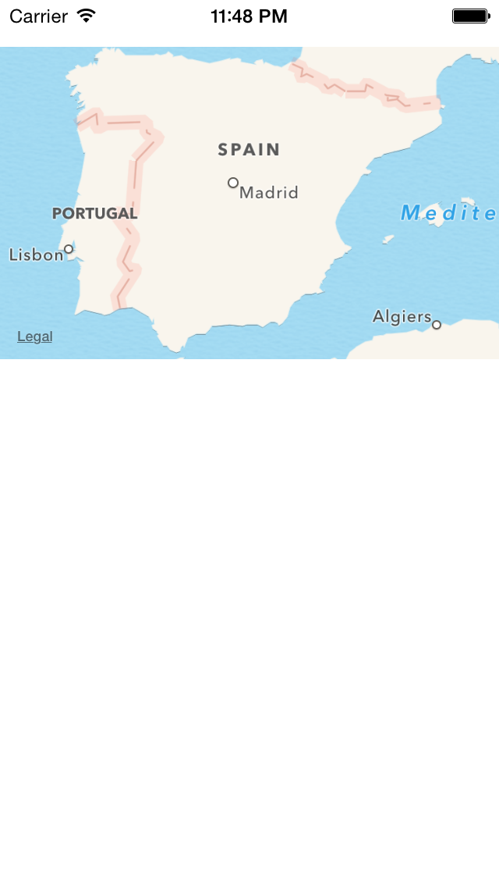
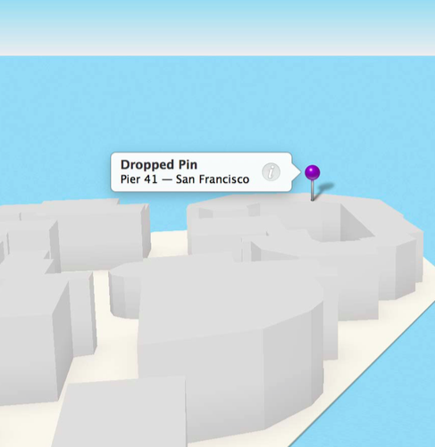
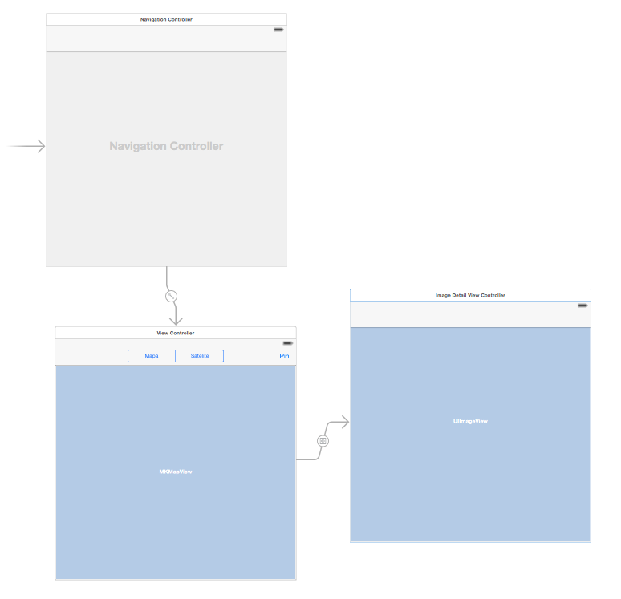

# Sesión 4: <br/> Mapas y <br/>localización

#### Servicios de las plataformas móviles - iOS

<small>Domingo Gallardo - domingo.gallardo@ua.es  
Departamento Ciencia de la Computación e Inteligencia Artificial  
Master Programación de Dispositivos Móviles    
2017-18</small>

<!-- Tres líneas en blanco para la siguiente transparencia -->


### Aspectos básicos de MapKit

- [Map Kit](https://developer.apple.com/library/ios/documentation/MapKit/Reference/MapKit_Framework_Reference/)
  es el framework de Apple para trabajar con mapas.
- Permite muchas funcionalidades: pan y zoom, anotaciones,
  localización, overlays, búsquedas, rutas, direcciones, ...
- Junto con los servicios de localización proporciona la forma de
  incluir datos geográficos en nuestras apps.

 


<!-- Tres líneas en blanco para la siguiente transparencia -->


### Aspectos básicos de MapKit

<!-- .slide: class="image-right"-->


- Los mapas permiten a los usuarios a visualizar datos geográficos de
  una forma fácil de entender.
- Por ejemplo, un mapa puede mostrar datos de satélite de un área, o
  una visualización tridimensional de una perspectiva de la zona.
- El framework Map Kit permite embeber en tu app un map completamente
  funcional, que soporta funcionalidades similares a la de la app
  `Mapas`.
- Con Map Kit puedes incorporar en tu app vistas de un punto
  geográfico concreto.
- Además, el framework te permite añadir capas de información sobre el
  mapa, moverlo, o tomar instantáneas de un mapa para imprimir.

<!-- Tres líneas en blanco para la siguiente transparencia -->


### Geometría de los mapas

<!-- .slide: class="image-right"-->


- Map Kit usa una proyección Mercator, que es un tipo específico de
  proyección cilíndrica.
- Una coordenada se define por una **latitud** y una **longitud**.
  - La **latitud** es la distancia angular (en grados: de -90.0 a
    90.0) desde el punto de la superficie hasta el ecuador. Las
    latitudes positivas definen puntos por encima del ecuador y las
    negativas por debajo.
  - La **longitud** es la distancia angular (en grados: de -180.0 a
    180.0) desde el punto de la superficie hasta el meridiano 0
    (meridianto de Greenwich). Las longitudes positivas definen puntos
    al este del meridiano y las negativas al oeste.
- La estructura
  [`CLLocationCoordinate2D`](https://developer.apple.com/reference/corelocation/cllocationcoordinate2d)
  representa esta estructura. Por ejemplo, para crear una localización
  situada en Alicante:

```swift
let alicanteLocation = CLLocationCoordinate2D(latitude: 38.3453, 
                                              longitude: -0.4831)
```

<!-- Tres líneas en blanco para la siguiente transparencia -->


### Otros puntos

<!-- .slide: class="image-right"-->


- Un _punto en el mapa_ se define por los valores `x` e `y` en la
  proyección de Mercator. Se define utilizando la estructura
  [`MKMapPoint`](https://developer.apple.com/library/ios/documentation/MapKit/Reference/MapKitDataTypesReference/index.html#//apple_ref/c/tdef/MKMapPoint). Se
  utiliza para especificar la posición y forma de los _overlays_ que
  podemos pintar sobre el mapa.
- Un _punto_ es una unidad gráfica asociada con el sistema de
  coordenadas de una vista. Los puntos en el mapa y las coordenadas
  deben convertirse en puntos antes de dibujar contenido en una
  vista. Los puntos individuales se definen usando la estructura
  `CGPoint` y las áreas usando `CGSize` y `CGRect`. Consultar las
  funciones del API de geometría y los tipos de datos en
  [este enlace](https://developer.apple.com/library/ios/documentation/GraphicsImaging/Reference/CGGeometry/index.html).
- Para almacenar los datos en ficheros es preferible usar coordenadas
  de mapas.

<!-- Tres líneas en blanco para la siguiente transparencia -->


### Permisos para activar los mapas en nuestra app

<!-- .slide: class="image-right"-->


- Para poder distribuir apps que trabajen con el servicio de mapas es
  necesario activar en la app el _entitlement_ correspondiente,
  activando los servicios que necesitamos.
- Debemos tener un perfil de aprovisionamiento aprobado con un App ID
  que soporte estos servicios.
- No es necesario para el desarrollo y las pruebas.

<!-- Tres líneas en blanco para la siguiente transparencia -->


### Añadir un mapa en nuestra app

- La clase
  [`MKMapView`](https://developer.apple.com/reference/mapkit/mkmapview)
  es una interfaz autocontenida para presentar los mapas en tu
  app. Proporciona todo el soporte para mostrar los datos del mapa,
  gestionar las interacciones del usuario y hospedar el contenido
  proporcionado por tu app. Debes importar `MapKit`.
- No debes hacer una subclase de `MKMapView` sino embeberla tal cual
  en la jerarquía de vistas de tu app:
    - Usando el _Interface Builder_ puedes arrastrar un objeto _Map
      view_ a la vista o ventana apropiada.
    - Para añadir un mapa por programa, crea una instancia de la clase
      `MKMapView`, inicialízala con el método
      [`initWithFrame:`](https://developer.apple.com/library/ios/documentation/UIKit/Reference/UIView_Class/index.html#//apple_ref/occ/instm/UIView/initWithFrame:)
      y añádela como una subvista a tu ventana o a tu vista.
- Por último debes actualizar el delegado con un objeto que implemente
  el protocolo
  [`MKMapViewDelegate`](https://developer.apple.com/reference/mapkit/mkmapviewdelegate).


<!-- Tres líneas en blanco para la siguiente transparencia -->


### Ejemplo: añadir un mapa mediante programa

```swift
import UIKit
import MapKit

class ViewController: UIViewController, MKMapViewDelegate {

    override func viewDidLoad() {
        super.viewDidLoad()
        let map = MKMapView(frame:
            CGRect(x: 0, y: 30, width: self.view.frame.width, height: 200))
        self.view.addSubview(map)
        map.delegate = self
    }

    override func didReceiveMemoryWarning() {
        super.didReceiveMemoryWarning()
    }
}
```

<!-- Tres líneas en blanco para la siguiente transparencia -->


### Resultado



<!-- Tres líneas en blanco para la siguiente transparencia -->


### Inicialización del mapa

- Podemos también inicializar el mapa cuando se crea usando el
  _Interface Builder_, usando un `didSet` en el _outlet_ `mapView` que
  definimos arrastrando desde el _storyboard_:

```swift
@IBOutlet weak var mapView: MKMapView! {
    didSet {
        mapView.mapType = .standard
        mapView.delegate = self
        let alicanteLocation = 
            CLLocationCoordinate2D(latitude: 38.3453, 
                                   longitude: -0.4831)
        let initialLocation = 
            CLLocation(latitude: alicanteLocation.latitude,
                       longitude: alicanteLocation.longitude)
        centerMapOnLocation(mapView: mapView, loc: initialLocation)
        // definida en la siguiente diapositiva
    }
}
```

- Para que los controles del mapa funcionen correctamente es necesario
  asignar el delegado.
- Lo más sencillo es definir el propio `View Controller` como el delegado.

<!-- Tres líneas en blanco para la siguiente transparencia -->


### Centrado del mapa

- La propiedad `region` del mapa controla el área del mapa mostrada.
- Contiene al mismo tiempo el punto de longitud y latitud en el que el
  mapa está centrado y la zona visible, determinando de forma
  implícita el zoom del mapa.
- Por ejemplo, la siguiente función centra el mapa en una localización
  y muestra una zona de 4 km. de alto y ancho:

```swift
func centerMapOnLocation(mapView: MKMapView, loc: CLLocation) {
    let regionRadius: CLLocationDistance = 1000
    let coordinateRegion = 
        MKCoordinateRegionMakeWithDistance(loc.coordinate,
                       regionRadius * 4.0, regionRadius * 4.0)
    mapView.setRegion(coordinateRegion, animated: true)
}
```
    

<!-- Tres líneas en blanco para la siguiente transparencia -->


### Tipos de mapas

- La definición del tipo de mapa se controla con la propiedad
  `mapType` del mapa.
- Puede tener los valores:

```swift
enum MKMapType : UInt {
    case standard
    case satellite
    case hybrid
}
```

<!-- Tres líneas en blanco para la siguiente transparencia -->


### Ejemplo de selección del tipo de mapa con un `SegmentedControl`

- Supongamos un `SegmentedControl` con los valores `Mapa` y
  `Satélite`.
- Podemos cambiar la visualización del mapa en la acción definida en
  el _View Controller_ que contiene el `mapView`:

```swift
enum TipoMapa: Int {
    case mapa = 0
    case satelite
}

...

// En el ViewController

@IBAction func seleccion(sender: UISegmentedControl) {
    let tipoMapa = TipoMapa(rawValue: sender.selectedSegmentIndex)!
    switch (tipoMapa) {
        case .mapa:
            mapView.mapType = MKMapType.standard
        case .satelite:
            mapView.mapType = MKMapType.satellite
    }
}
```

<!-- Tres líneas en blanco para la siguiente transparencia -->


### Uso del delegado

- El objeto delegado puede implementar las funciones del protocolo
  [`MKMapViewDelegate`](https://developer.apple.com/library/ios/documentation/MapKit/Reference/MKMapViewDelegate_Protocol/index.html#//apple_ref/occ/intf/MKMapViewDelegate)
  donde recibe los eventos relacionados con el mapa:
  - Cambios en la región visible del mapa.
  - La carga de zonas del mapa de la red.
  - Cambios en la localización del usuario.
  - Cambios asociados con anotaciones y overlys.
- Lo más sencillo es definir como delegado el _view controller_ en el
  que se incluye el mapa.
- Ejemplo:

```swift
func mapView(_ mapView: MKMapView, regionDidChangeAnimated animated: Bool) {
    print("Cambiada la posición del mapa: \(mapView.centerCoordinate)")
}
```

<!-- Tres líneas en blanco para la siguiente transparencia -->


### Anotaciones

<!-- .slide: class="image-right"-->


- Las anotaciones permite resaltar coordenadas específicas del mapa y
  proporcionar información adicional sobre ellas.
- Puedes usar anotaciones para resaltar direcciones, puntos de interés
  y otros tipos de destinos.
- Cuando se muestran en el mapa, las anotaciones tienen algún tipo de
  imagen para identificar su localización y también pueden tener un
  bocadillo (_callout_) que proporciona información y enlaces hacia
  más contenido.
- En la imagen se muestra una vista estándar en forma de chincheta
  para marcar un lugar y un _callout_ que muestra más información.

<!-- Tres líneas en blanco para la siguiente transparencia -->


### Clases relacionadas

- Para mostrar una anotación en un mapa necesitamos dos objetos:
  - Un **objeto `annotation`**, que es un objeto que cumple el
    protocolo
    [`MKAnnotation`](https://developer.apple.com/reference/mapkit/mkannotation)
    y que gestiona los datos de la anotación.
  - Una **vista** de la anotación, que es una vista (derivada de la
    clase
    [`MKAnnotationView`](https://developer.apple.com/reference/mapkit/mkannotationview))
    usada para dibujar la representación visual de la anotación sobre
    la superficie del mapa.


<!-- Tres líneas en blanco para la siguiente transparencia -->


### El protocolo `MKAnnotation`

```swift
var coordinate: CLLocationCoordinate2D { get }
var title: String? { get }
var subtitle: String? { get }
```
- `coordinate`: coordenadas de la anotación
- `title`: cadena mostrada en el _callout_
- `subtitle`: cadena subtítulo mostrada en el _callout_

<!-- Tres líneas en blanco para la siguiente transparencia -->


### El objeto `annotation`

- Los objetos `annotation` son objetos que conforman el protocolo `MKAnnotation`
- Un ejemplo sencillo:

```swift
class Pin:  NSObject, MKAnnotation {
    var coordinate: CLLocationCoordinate2D
    var title: String?
    var subtitle: String?

    init(num: Int, coordinate: CLLocationCoordinate2D) {
        self.title = "Pin \(num)"
        self.subtitle = "Un bonito lugar"
        self.coordinate = coordinate
        super.init()
    }
}
```

<!-- Tres líneas en blanco para la siguiente transparencia -->


### `MKAnnotationView`

- La clase
  [`MKAnnotationView`](https://developer.apple.com/library/ios/documentation/MapKit/Reference/MKAnnotationView_Class/index.html#//apple_ref/swift/cl/MKAnnotationView)
  permite bastante flexibilidad para definir las distintas
  características de las vistas de las anotaciones.
- Permite definir la imagen de la anotación, con su propiedad `image`.
- Permite definir las características del _callout_ que aparecerá
  cuando el usuario pinche sobre la imagen, así como mantener el
  estado del mismo. Cuando la anotación está seleccionada, el
  _callaout_ está activo.
- La subclase
  [`MKPinAnnotationView`](https://developer.apple.com/reference/mapkit/mkpinannotationview)
  proporciona unos valores por defecto que podemos usar (por ejemplo,
  la imagen de la chincheta).


<!-- Tres líneas en blanco para la siguiente transparencia -->


### Creación de la anotación

- Para crear una anotación (o, más precisamente, una vista de una
  anotación), debemos usar la función
  [`mapView(_:viewFor:)`](https://developer.apple.com/reference/mapkit/mkmapviewdelegate/1452045-mapview)
  en el objeto delegado del mapa. 
- Esta función proporciona una vista cuando las coordenadas de la
  anotación están la región visible y el mapa la solicita. 
  

```swift
func mapView(_ mapView: MKMapView, viewFor annotation: MKAnnotation) 
                          -> MKAnnotationView?
```

- En la implementación de esta función debemos construir una vista
  asociada a la anotación que nos pasan y devolverla para que el
  _mapView_ la gestione o devolver `nil` si queremos que se muestre la
  vista estándar.

<!-- Tres líneas en blanco para la siguiente transparencia -->


### Un ejemplo de vista de anotación

```swift
func mapView(_ mapView: MKMapView, viewFor annotation: MKAnnotation) -> MKAnnotationView? {
    print("Devolviendo vista para anotación: \(annotation)")
    let view = MKPinAnnotationView(annotation: annotation, reuseIdentifier: nil)
    view.pinTintColor = UIColor.red
    view.animatesDrop = true
    view.canShowCallout = true
    return view;
}
```

<!-- Tres líneas en blanco para la siguiente transparencia -->


### Añadir anotaciones en el mapa

- Para añadir una anotación al mapa hay que usar el método `addAnnotation` del `viewMap`.
- Por ejemplo, podemos crear una anotación en el centro del mapa creando una instancia de `Pin` (la clase definida anteriormente, que cumple el protocolo `MKAnnotation`) que inicializamos con un número (variable definida en el `viewController` que vamos incrementado):

```swift
let pin = Pin(num: numPin, coordinate: mapView.centerCoordinate)
mapView.addAnnotation(pin)
```

<!-- Tres líneas en blanco para la siguiente transparencia -->


### Elementos en el _callout_

<!-- .slide: class="image-right"-->


- Es posible definir en el _callout_ una imagen en su parte izquierda
  y un botón en la parte derecha.
- Hay que actualizar las propiedades de la vista
  `leftCalloutAccessoryView` y `rightCalloutAccessoryView` con objetos
  `UIView`.
- En la parte derecha es común usar un objeto `UIButton` con tipo
  `UIButtonTypeDetailDisclosure`.

<!-- Tres líneas en blanco para la siguiente transparencia -->


### Imágenes en las anotaciones

- Vamos a mostrar imágenes en la parte izquierda del _callout_, por
  ejemplo, _thumbnails_ con la foto del sitio en el que está situada
  la anotación.
- Lo más apropiado es guardar las imágenes en el objeto _annotation_.
- Por simplificar, guardamos dos imágenes predefinidas según el número
  del pin sea par o impar:

```swift
class Pin:  NSObject, MKAnnotation {
    var coordinate: CLLocationCoordinate2D
    var title: String
    var subtitle: String
    var thumbImage: UIImage

    init(num: Int, coordinate: CLLocationCoordinate2D) {
        self.title = "Pin \(num)"
        self.subtitle = "Un bonito lugar"
        self.coordinate = coordinate
        if (num % 2 == 0) {
            self.thumbImage = UIImage(named: "alicante1_thumb.png")!
        } else {
            self.thumbImage = UIImage(named: "alicante2_thumb.png")!
        }
        super.init()
    }
}
```

<!-- Tres líneas en blanco para la siguiente transparencia -->


### Actualización del _callout_

- La actualización del _callout_ se hace en el mismo método
  `mapView(_:viewFor`) que devuelve la vista de una anotación:

```swift
func mapView(mapView: MKMapView, viewFor annotation: MKAnnotation) -> MKAnnotationView? {
    //
    // el mismo código que antes
    //
    let pin = annotation as! Pin
    let thumbnailImageView = UIImageView(frame: CGRect(x:0, y:0, width: 59, height: 59))
    thumbnailImageView.image = pin.thumbImage
    view.leftCalloutAccessoryView = thumbnailImageView
    view.rightCalloutAccessoryView = UIButton(type:UIButtonType.detailDisclosure)
    return view
}
```

<!-- Tres líneas en blanco para la siguiente transparencia -->


### Overlays

<!-- .slide: class="image-right"-->


- Los overlays permiten definir capas de contenido sobre una región
  arbitraria del mapa.
- Están definidos por coordenadas en las que es posible definir
  conjuntos de líneas, rectángulos y otras formas.
- Por ejemplo, se podría usar usar overlays para añadir información de
  tráfico sobre carreteras, o marcar los límites de un parque o de una
  región. 
- Puedes ver una demostración del uso de overlays en la app
  [ParkView](http://domingogallardo.github.io/apuntes-mastermoviles/apps/ParkView.zip)
  del tutorial de [raywenderlich.com](https://www.raywenderlich.com/166182/mapkit-tutorial-overlay-views).

<!-- Tres líneas en blanco para la siguiente transparencia -->


### Mostrar un overlay ###

- Para mostrar un overlay sobre un mapa se deben proporcionar dos
objetos:
  - Un **objeto overlay**, que es un objeto que cumple el protocolo
    [MKOverlay](https://developer.apple.com/documentation/mapkit/mkoverlay)
    y gestiona los puntos de datos del overlay.
  - Un **renderizador del overlay**, que es una clase derivada de
    [MKOverlayRenderer](https://developer.apple.com/documentation/mapkit/mkoverlayrenderer)
    y que debe usarse para dibujar la representación visual del
    overlay sobre la superficie del mapa.
  
<!-- Tres líneas en blanco para la siguiente transparencia -->


### Ejemplo de código (1)###

- Ejemplo de código de la aplicación demo `Park View`

```swift
class ParkMapOverlay: NSObject, MKOverlay {
  
  var coordinate: CLLocationCoordinate2D
  var boundingMapRect: MKMapRect
  
  init(park: Park) {
    boundingMapRect = park.overlayBoundingMapRect
    coordinate = park.midCoordinate
  }
}
```

<!-- Tres líneas en blanco para la siguiente transparencia -->


### Ejemplo de código (2)###

```swift
class ParkMapOverlayView: MKOverlayRenderer {
  var overlayImage: UIImage
  
  init(overlay:MKOverlay, overlayImage:UIImage) {
    self.overlayImage = overlayImage
    super.init(overlay: overlay)
  }
  
  override func draw(_ mapRect: MKMapRect, zoomScale: MKZoomScale, in context: CGContext) {
    guard let imageReference = overlayImage.cgImage else { return }
    
    let rect = self.rect(for: overlay.boundingMapRect)
    context.scaleBy(x: 1.0, y: -1.0)
    context.translateBy(x: 0.0, y: -rect.size.height)
    context.draw(imageReference, in: rect)
  }
}
```

<!-- Tres líneas en blanco para la siguiente transparencia -->


### Añadido y dibujado del overlay ###

- El overlay debe añadirse al `mapView`

```swift
let overlay = ParkMapOverlay(park: park)
mapView.add(overlay)
```

- Para su visualización debemos implementar el método
  `mapView:rendererForOverlay:` en el `mapView` delegado. En el
  siguiente código se dibujan distintos tipos de overlays:

```swift
  func mapView(_ mapView: MKMapView, rendererFor overlay: MKOverlay) -> MKOverlayRenderer {
    if overlay is ParkMapOverlay {
      return ParkMapOverlayView(overlay: overlay, overlayImage: #imageLiteral(resourceName: "overlay_park"))
    } else if overlay is MKPolyline {
      let lineView = MKPolylineRenderer(overlay: overlay)
      lineView.strokeColor = UIColor.green
      return lineView
      else if ...
    }
    
    return MKOverlayRenderer()
  }
```

<!-- Tres líneas en blanco para la siguiente transparencia -->


### Otras características: búsquedas


<!-- Tres líneas en blanco para la siguiente transparencia -->


### Otras características: rutas


<!-- Tres líneas en blanco para la siguiente transparencia -->


### Otras características: 3D

 

<!-- Tres líneas en blanco para la siguiente transparencia -->


## Localización ##
<!-- Tres líneas en blanco para la siguiente transparencia -->


### Localización
<!-- .slide: class="image-right"-->


- Las apps usan datos de localización del dispositivo para múltiples
  propósitos, desde redes sociales hasta servicios de navegación.
- Los datos de localización se obtienen mediante el framework
  [`Core Location`](https://developer.apple.com/library/ios/documentation/CoreLocation/Reference/CoreLocation_Framework/). La
  clase principal es
  [`CLLocationManager`](https://developer.apple.com/library/ios/documentation/CoreLocation/Reference/CLLocationManager_Class/index.html).
- Este framework proporciona bastantes servicios que puedes usar para
  obtener y monitorizar la localización actual del dispositivo:
  - El servicio de localización de cambios-significativos proporciona
    una forma de bajo consumo de obtener la localización actual y ser
    notificado cuando ha ocurrido un cambio significativo.
  - El servicio de localización estándar ofrece una forma altamente
    configurable de obtener la localización actual y de hacer un
    seguimiento de los cambios.
  - La monitorización de regiones te permite monitorizar regiones
    geográficas y regiones definidas por _beacons_ de Bluetooth de
    baja energía.

<!-- Tres líneas en blanco para la siguiente transparencia -->


### Activación de los servicios de localización

- Si la app requiere servicios de localización para funcionar
  correctamente, debes incluir la clave `UIRequiredDeviceCapabilities`
  en el fichero `Info.plist` de la app. La App Store usa la
  información en esta clava para prevenir la descarga de la app a
  dispositivos que no contienen estos servicios. Puedes no añadir esta
  clave si quieres permitir descargar la app aunque no esté disponible
  el servicio.
- El valor de la clave es un array de cadenas indicando las
  características que requiere la app. En el caso de los servicios de
  localización son relevantes las cadenas `location-services` y
  `gps`. La primera si se requieren servicios de localización en
  general y la segundo si se requiere la precisión ofrecida por el
  GPS.


<!-- Tres líneas en blanco para la siguiente transparencia -->


### Solicitar información al usuario


- Es necesario añadir también en `Info.plist` una cadena asociada a la
  clave `NSLocationWhenInUseUsageDescription`. Esta clave tiene la
  descripción en Xcode `Privacy - Location When in Use Usage
  Description`.
- Se solicita autorización al usuario llamando al método
  `request​When​In​Use​Authorization()` o `requestAlwaysAuthorization()` del objeto `CLLocationManager`.
- La cadena se mostrará como subtítulo en el diálogo en el que se
  solicita al usuario la autorización.


<!-- Tres líneas en blanco para la siguiente transparencia -->


### Clase `CLLocationManager`

- Se debe crear una instancia de la clase [`CLLocation​Manager`](https://developer.apple.com/reference/corelocation/cllocationmanager) y
  guardar una referencia fuerte a ella en la app.
- Se necesita mantener una referencia fuerte al objeto _location
  manager_ hasta que han terminado todas las tareas en las que
  participa.
- Debido a que las tareas de gestión de localización se ejecutan
  asíncronamente, es insuficiente almacenar una referencia al
  _location manager_ en una variable local.

<!-- Tres líneas en blanco para la siguiente transparencia -->


### Para activar la localización

- La clase `AppDelegate` también puede funcionar como
  [`CLLocationManagerDelegate`](https://developer.apple.com/reference/corelocation/cllocationmanagerdelegate). Inicializamos
  ahí el `CLLocationManager`.
- En el método `didFinishLaunchingWithOptions` podemos actualizar el
  gestor de localización:
  - Inicializamos el delegado del gestor de localización.
  - Solicitamos permiso al usuario de que la app va a usar los
    servicios de localización invocando al método
    `requestWhenInUseAuthorization()`
  - Se debe configurar la precisión de la localización, actualizando
    la propiedad `desiredAccuracy` del gestor de localización,
    asignándole el valor en metros de la precisión deseada. Cuanto
    mayor sea la precisión deseada, mayor será el consumo de batería
    del dispositivo.
  - Después se debe llamar al método `startUpdatingLocation()`.

<!-- Tres líneas en blanco para la siguiente transparencia -->


### Código

```swift
import UIKit
import CoreLocation

@UIApplicationMain
class AppDelegate: UIResponder, UIApplicationDelegate, CLLocationManagerDelegate {

    var window: UIWindow?
    let locationManager = CLLocationManager()

    func application(application: UIApplication, didFinishLaunchingWithOptions launchOptions: [NSObject: AnyObject]?) -> Bool {
        // Override point for customization after application launch.
        locationManager.delegate = self
        locationManager.requestWhenInUseAuthorization()
        locationManager.desiredAccuracy = kCLLocationAccuracyNearestTenMeters
        locationManager.startUpdatingLocation()
        return true
    }
    
    ...
```


<!-- Tres líneas en blanco para la siguiente transparencia -->


### Monitorización de la localización

- Cuando suceda un cambio en localización se notificará al delegado llamando a su método `didUpdateLocations` pasándole un array de localizaciones (objetos `CLLocation`):


```swift
func locationManager(_ manager: CLLocationManager, didUpdateLocations locations: [CLLocation]) {
   // Código para gestionar las localizaciones
}
```

<!-- Tres líneas en blanco para la siguiente transparencia -->


### Clase `CLLocation`

- La clase [`CLLocation`](https://developer.apple.com/documentation/corelocation/cllocation) permite representar una posición _outdoor_ o _indoor_ y el instante de tiempo asociado a ella.
- Atributos:
  - `coordinate`
  - `altitude`
  - `floor`
  - `horizontalAccuracy`
  - `verticalAccuracy`
  - `speed`
  - `course`
  - `timestamp`
  - `description`

<!-- Tres líneas en blanco para la siguiente transparencia -->


### Activación de la localización en el mapa

- Una vez activado el servicio de localización se puede activar la localización en el mapa obteniendo el `MKUserTrackingBarButtonItem` y añadiéndolo a la barra de navegación.
- No hace falta llamar a `startUpdatingLocation()`.
- Se puede hacer en el `ViewController` que contiene el mapa:

```swift
override func viewDidLoad() {
    super.viewDidLoad()
    let userTrackingButton = MKUserTrackingBarButtonItem(mapView: mapView)
    self.navigationItem.leftBarButtonItem = userTrackingButton
}
```

<!-- Tres líneas en blanco para la siguiente transparencia -->


### Prueba de la localización en el simulador

- Es posible probar los servicios de localización desde el simulador
- Seleccionar la simulación del movimiento y localización del dispositivo en _Debug > Location_
- Opciones:
  - Ninguna
  - Custom
  - Apple
  - City Bicycle Ride
  - City Run
  - Freeway Ride

<!-- Tres líneas en blanco para la siguiente transparencia -->


### Práctica: Mapas (1)
<!-- .slide: class="image-right"-->
<!-- .slide: data-background="#cbe0fc"-->


- Debes crear la app `es.ua.mastermoviles.Mapas`.
- Empieza por definir un _View Controller_ en el que debes incluir un
  mapa centrado inicialmente en Alicante.
- Incluye el _View Controller_ en un _Navigation Controller_ con la
  opción _Editor > Embed In > Navigation Controller_.
- Añade en el centro de la barra del _Navigation Controller_ un
  _Segmented Control_ con los valores `Mapa` y `Satélite`, conéctalos
  con el _ViewController_ y haz que el mapa cambie de tipo cuando se
  pulse en el control.

<!-- Tres líneas en blanco para la siguiente transparencia -->


### Práctica: Mapas (2)

<!-- .slide: class="image-right"-->
<!-- .slide: data-background="#cbe0fc"-->


- En el _Storyboard_ añade un `Bar Button Item` en la parte derecha de
  la barra de navegación.
- Llámalo `Pin` y enlázalo con una acción en el `ViewController` que
  añada una anotación en el mapa.


<!-- Tres líneas en blanco para la siguiente transparencia -->


### Práctica: Mapas (3)

<!-- .slide: class="image-right"-->
<!-- .slide: data-background="#cbe0fc"-->


- Añade en los _callouts_ imágenes _thumbnails_ predefinidas,
  dependiendo de si el número de pin es par o impar.
- Añade en los _callouts_ el botón de información.

<!-- Tres líneas en blanco para la siguiente transparencia -->


### Práctica: Mapas (opcional - 2,5 puntos)

<!-- .slide: data-background="#cbe0fc"-->

- Implementa un _segue_ que haga aparecer otra vista con un detalle de
  la foto.

 


<!-- Tres líneas en blanco para la siguiente transparencia -->


### Práctica: Mapas 

<!-- .slide: data-background="#cbe0fc"-->

- Pista 1 (Segue):

```swift
func mapView(_ mapView: MKMapView, annotationView view: MKAnnotationView, calloutAccessoryControlTapped control: UIControl) {
    performSegue(withIdentifier: "DetalleImagen", sender: view)
}

override func prepare(for segue: UIStoryboardSegue, sender: Any?) {
    if segue.identifier == "DetalleImagen" {
        if let pin = (sender as? MKAnnotationView)?.annotation as? Pin {
            if let vc = segue.destination as? MiImageViewController {
                vc.imageDetail = pin.thumbImage
            }
        }
    }
}
```

<!-- Tres líneas en blanco para la siguiente transparencia -->


### Práctica: Mapas

<!-- .slide: data-background="#cbe0fc"-->

- Pista 2 (`ViewController` de la vista detalle):

```swift
class ImageDetailViewController: UIViewController {
    
    @IBOutlet weak var imageView: UIImageView!
    var imageDetail: UIImage? = nil
    
    override func viewDidLoad() {
        super.viewDidLoad()
        if imageDetail != nil {
            imageView.image = imageDetail!
        }
    }
}
```

<!-- Tres líneas en blanco para la siguiente transparencia -->


### Práctica: Mapas (Localización - opcional 2,5 puntos)

<!-- .slide: class="image-right"-->
<!-- .slide: data-background="#cbe0fc"-->


- Añade el tracking de localización a la aplicación, imprimiendo la
  localización en la salida estándar cada 10 metros. Comprueba el
  funcionamiento activando la localización en el simulador.
- Añade la localización al mapa, haciendo que aparezca en la parte
  izquierda de la barra de navegación el botón de navegación.
- Cuando pulses el botón de navegación se debe mostrar la posición
  actual del dispositivo.
- Deberás modificar la función que muestra la vista de una anotación
  ([`mapView(_:viewFor:)`](https://developer.apple.com/reference/mapkit/mkmapviewdelegate/1452045-mapview)
  porque se utiliza también para mostrar la vista de la posición
  actual del dispositivo (que también es una anotación).

<!-- Tres líneas en blanco para la siguiente transparencia -->


### Referencias

- [Recursos sobre mapas y localización](https://developer.apple.com/maps/)
- [Location and maps programming guide](https://developer.apple.com/library/content/documentation/UserExperience/Conceptual/LocationAwarenessPG/Introduction/Introduction.html#//apple_ref/doc/uid/TP40009497)
- APIs:
  - [Map Kit Framework Reference](https://developer.apple.com/library/ios/documentation/MapKit/Reference/MapKit_Framework_Reference/)
  - [Core Location Framework Reference](https://developer.apple.com/library/ios/documentation/CoreLocation/Reference/CoreLocation_Framework/)
- [Artículo - pedir autorización en uso](https://developer.apple.com/documentation/corelocation/choosing_the_authorization_level_for_location_services/requesting_when_in_use_authorization)
- [Artículo - pedir autorización siempre](https://developer.apple.com/documentation/corelocation/choosing_the_authorization_level_for_location_services/requesting_always_authorization)

<!-- Tres líneas en blanco para la siguiente transparencia -->


# Master Programación <br/> de Dispositivos Móviles


