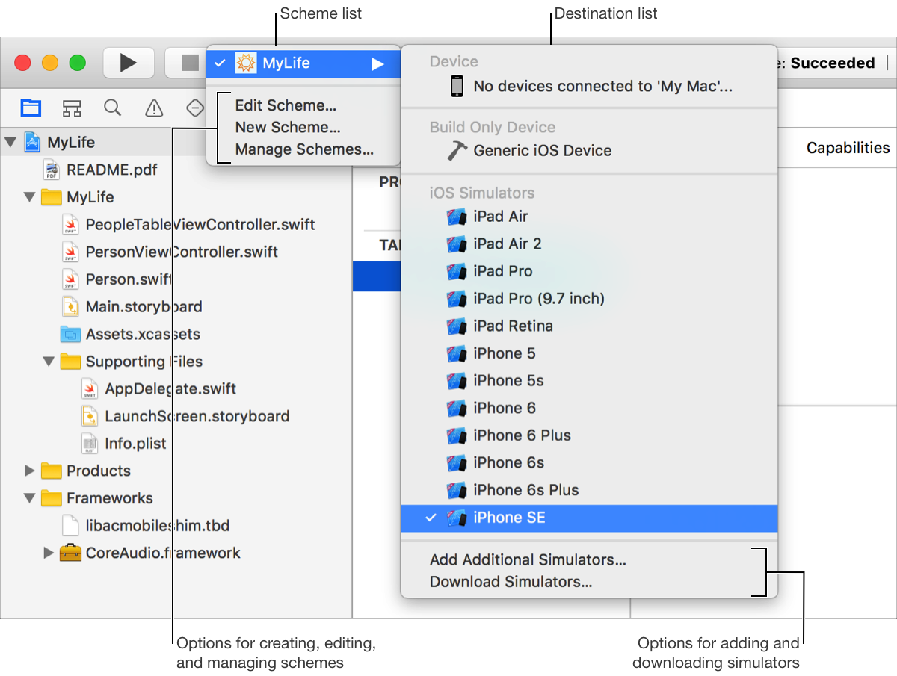
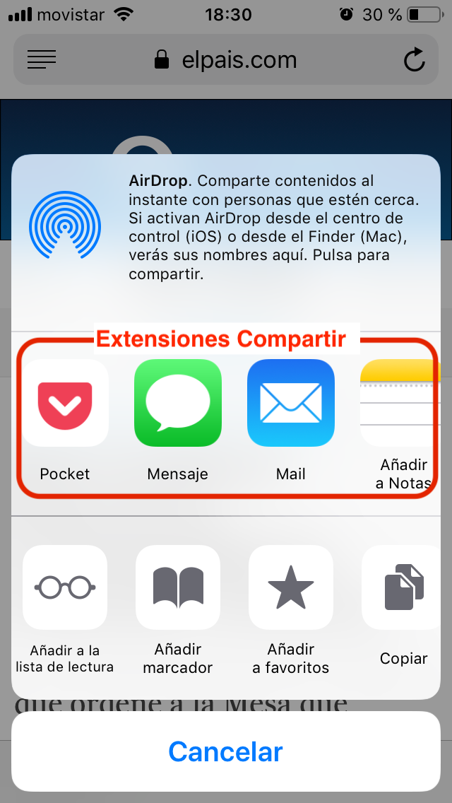
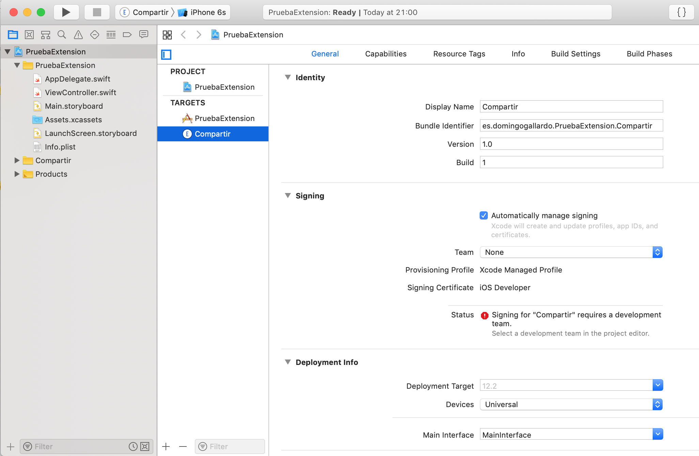
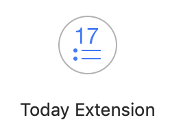
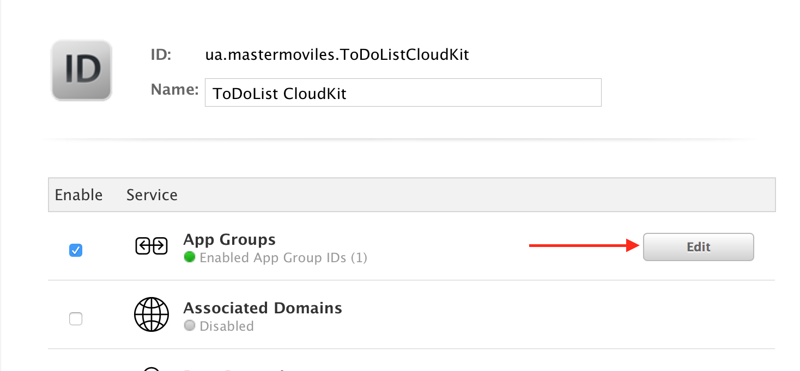
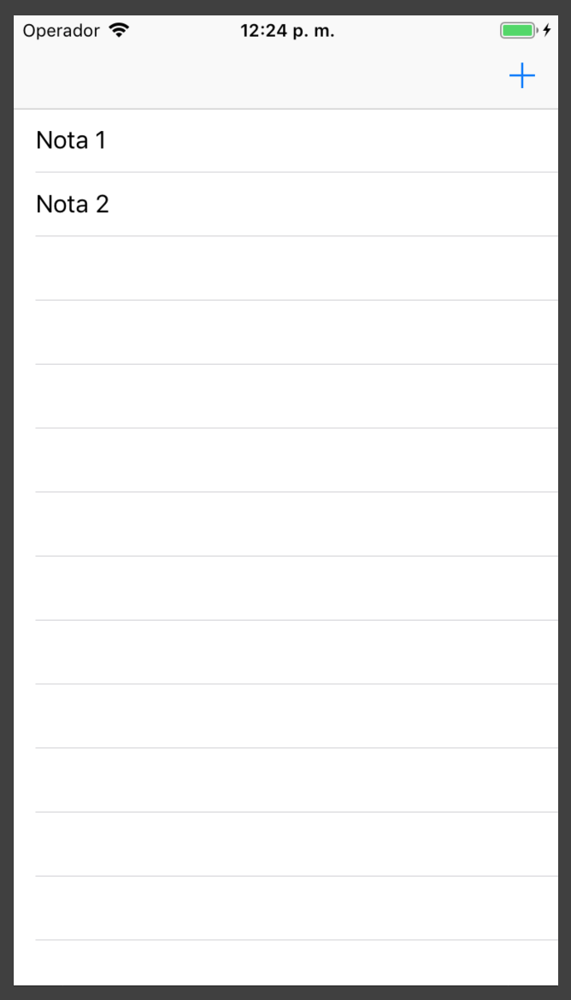

# Sesión 5: Extensiones

## Extensiones ##

### Introducción

Las _app extensions_ representan **pequeñas apps** o pequeños hilos de
ejecución que se instalan en **puntos de extensión** del sistema y de
otras apps.

Se distribuyen e instalan junto con apps normales (la **app
contenedora** de la extensión), no de forma independiente (con la
excepción de los teclados configurables). Por ejemplo, **Pocket**
distribuye una extensión para guardar contenido en la app cuando el
usuario pulsa el botón de compartir estando en una página web.

Pueden llegar a ser importantes para el usuario final, proporcionando
integración entre apps y aumentando la experiencia de usuario.

En nuestras apps podemos también declarar **puntos de extensión** a
los que se conectarán extensiones de terceros (compartir, por
ejemplo).
  
### Targets ###

Las extensiones se incluyen en el proyecto como _targets_ adicionales
que acompañan a la app principal.

Un _target_ especifica un producto a construir por Xcode. Por ejemplo,
si cuando creamos un proyecto escogemos añadir tests unitarios y de
UI, Xcode introduce automáticamente estos targets, además de la app
principal.

Para añadir manualmente un nuevo target al proyecto podemos
seleccionar el botón `+` en la parte de abajo o la opción _Editor >
Add Target..._.


<p style="text-align:center;">

</p>

Podemos seleccionar el _target_ y especificar sus características en
el panel principal. Hay que especificar los mismos elementos que para
una app principal (de hecho los _targets_ son como _mini_ apps):

- Bundle Id, versión, build
- Certificado y perfil de aprovisionamiento
- Permisos (_capabilities_)
- Configuración y reglas del build


### Esquema ###

Cada target tiene una configuración automática de construcción
definida por su esquema (_schema_).

Un esquema es una colección de configuraciones que especifican las
acciones a realizar para la compilación del _target_ y el entorno
ejecutable a usar para lanzar el producto.

Cuando abrimos o creamos un proyecto, Xcode crea automáticamente un
esquema para cada _target_.

El menú de esquemas se puede usar para cambiar el esquema activo y el
destino. Podemos usar también el menú de esquemas para crear, editar y
gestionar esquemas y para añadir y descartar simuladores.

<p style="text-align:center;">

</p>

Los esquemas y los destinos son distintos. Los destinos especifican
dónde instalar la app (dispositivos físicos y simuladores).

<p style="text-align:center;">

</p>

Los esquemas especifican los ajustes para compilar, ejecutar, testear,
monitorizar, analizar y archivar el proyecto. Estos ajustes se pueden
configurar en la opción de editar esquema.

<p style="text-align:center;">

</p>


### Ejemplo de extensión: Compartir

Veamos un ejemplo concreto, la extensión _Compartir_ (_Share
Extension_).


Muchas aplicaciones proporcionan el *punto de extensión* Compartir, en
el que se pueden instalar extensiones de tipo _Share
Extension_. Por ejemplo, en la siguiente imagen vemos como se puede
acceder a la opción de _compartir_ en una página del navegador Safari
y cómo el usuario puede acceder a las extensiones que se han añadido.


<p style="text-align:center;">
 

</p>

La extensión Compartir hereda un `ViewController` por defecto de tipo
[`SLComposeServiceViewController`](https://developer.apple.com/documentation/social/slcomposeserviceviewcontroller)
que contiene entre otros:

- Un campo de texto que puede editar el usuario, 
- Una previsualización del objeto a compartir
- Los botones `Cancel` y `Post`

<p style="text-align:center;">
 
</p>

La extensión puede configurar algunos aspectos de este
`ViewController`. Por ejemplo, puede añadir una opción en la parte
inferior en la que el usuario pueda seleccionar dónde compartir.

Por ejemplo, esto se hace en la extensión adaptada por la app
`Recordatorios`, en la que se da la opción de seleccionar el
recordatorio en el que se quiere añadir la página.

<p style="text-align:center;">
 
</p>

### SLComposeServiceViewController ###

Cuando creamos una extensión (más adelante haremos una demostración)
Xcode crea una plantilla inicial de código.

En el caso de una extensión `Compartir` la plantilla define un _view
controller_ hijo de `SLComposeServiceViewController` en el que podemos
configurar el funcionamiento de la extensión.

```swift
import UIKit
import Social

class ShareViewController: SLComposeServiceViewController {

    override func isContentValid() -> Bool {
        // Do validation of contentText and/or NSExtensionContext 
        // attachments here
        return true
    }

    override func didSelectPost() {
        // This is called after the user selects Post. Do the 
        // upload of contentText and/or NSExtensionContext 
        // attachments.
    
        // Inform the host that we're done, so it un-blocks its UI. 
        // Note: Alternatively you could call super's -didSelectPost,
        // which will similarly complete the extension context.
        self.extensionContext!.completeRequest(returningItems: [], 
                                               completionHandler: nil)
    }

    override func configurationItems() -> [Any]! {
        // To add configuration options via table cells at the
        // bottom of the sheet, return an array of 
        // SLComposeSheetConfigurationItem here.
        return []
    }
}
```

### Extension Context ###

La aplicación que invoca a la extensión crea un objeto de tipo
[NSExtensionContext](https://developer.apple.com/documentation/foundation/nsextensioncontext)
que se guarda en la variable `extensionContext` del
`SLComposeServiceViewController`.

Este objeto contiene la información del ítem o ítems que el usuario a
seleccionado para compartir en su propiedad `inputItems`:

- `var inputItems : [Any]`


### Creación de extensiones dentro de apps

Las extensiones se crean en Xcode seleccionando el proyecto y la
opción **Editor > Add Target...**

Hay plantillas para todos los tipos de extensiones que proporcionan
un punto de partida a partir del que desarrollar nuestra extensión.

<p style="text-align:center;">

</p>


### Se construyen de forma independiente

<p style="text-align:center;">

</p>

Las extensiones se compilan de forma independiente de la app.

Tienen su propio _bundle id_, _capabilities_, perfil de
aprovisionamiento, etc.

En el caso de la práctica, el _bundle id_ de la extensión será:
`es.ua.mastermoviles.ToDoListCloudKit.Hecho`.

Para poder depurarlas o que aparezca su salida en el panel de salida
estándar de Xcode hay que seleccionarla como producto a lanzar en el
simulador.


## Demo: Extensión Compartir ##

Vamos a crear una extensión _Compartir_ desde cero.

1. Creamos un proyecto nuevo llamado `PruebaExtension` y añadimos un
nuevo _target_. Elegimos el tipo de extensión _Share Extension_:

<p style="text-align:center;">

</p>

2. Escribimos como nombre del producto `Compartir` y aceptamos activar
   el esquema `Compartir`.
   
<p style="text-align:center;">

</p>
   

3. Comprobamos los dos productos existentes, el código de cada uno de
   ellos, y los esquemas. 
   
       Añadimos en el _storyboard_ de la app principal una etiqueta
       que deberá aparecer cuando la app esté lanzada en el simulador.
   
       Añadimos código en el _view controller_ creado por defecto para
       la extensión en el que imprimimos algunos mensajes en la salida
       estándar. 

<p style="text-align:center;">

</p>

4. Podemos instalar y depurar la extensión seleccionando el esquema y
   ejecutándolo. Aparece un panel en el que tenemos que seleccionar la
   app _compañera_ de la extensión (cualquier extensión debe
   instalarse junto con una app principal). 
   
   Podemos escoger cualquier app de las ya instaladas. Lo más normal
   es que instalemos primero la app principal y después ejecutemos la
   extensión usando esta app.
   
   
<p style="text-align:center;">

</p>

5. Cuando se lance la app principal, ya se habrá cargado la
   extensión. Abrimos Safari, por ejemplo, y escogemos la opción
   _compartir_. Comprobamos si la extensión está habilitada.
   
   
<p style="text-align:center;">


</p>


6. Pulsamos la extensión `Compartir` y vemos cómo se activa su _view
   controller_ y como aparecen en la consola los mensajes que hemos
   añadido en el código.
   
<p style="text-align:center;">


</p>
   

## Tipos de extensiones ##

### Puntos de extensión

Cada uno de los tipos de extensiones anteriores se conectan con
puntos de extensión del sistema.

Cada punto de extensión define una política de uso y proporciona
APIs que se usan en las extensiones de ese tipo.

Cada punto de extensión permite una funcionalidad distinta. Cuando
diseñemos una extensión hay que identificar qué funcionalidad
queremos ofrecer y qué punto de extensión debemos usar.

Se puede consultar la lista completa de puntos de extensión en la
[documentación de
Apple](https://developer.apple.com/library/content/documentation/General/Conceptual/ExtensibilityPG/#//apple_ref/doc/uid/TP40014214-CH20-SW1).

Algunos de los tipos de extensiones que proporciona el sistema:

- **Actions**: Permite manipular contenido de la app original
- **Audio Unit**: Permite generar o modificar un _stream_ de audio
- **Custom Keyboard**: Permite reemplazar el teclado del sistema con
  un teclado customizado
- **Document Provider**: Permite acceder y gestionar un repositorio de ficheros
- **Intents**: Manejar tareas relacionadas con la integración con Siri.
- **Photo Editing**: Permite editar una foto o un vídeo en la app `Fotos`
- **Share**: Permite enviar a un sitio web o compartir contenido con otros
- **Today**: Permite añadir _widgets_ en el panel de _Hoy_
- **WatchKit App**: Proporcionar una app o una notificación UI para el Apple Watch.


Xcode permite añadir un _target_ que implementa cualquiera de las
extensiones anteriores, creando el código y la configuración inicial
de la misma.

Un ejemplo del aspecto de las extensiones `Custom Keyboard` y `Photo Editing`:

<p style="text-align:center;">


</p>

### Propiedades de la extensión ###

Todos los aspectos relacionados con la configuración de la extensión,
incluido su tipo, se definen en propiedades en el fichero
`Info.plist`.

Por ejemplo, la extensión _Share_ añadida en la demostración se crea
con las siguientes propiedades:

```xml
	<key>NSExtension</key>
	<dict>
		<key>NSExtensionAttributes</key>
		<dict>
			<key>NSExtensionActivationRule</key>
			<string>TRUEPREDICATE</string>
		</dict>
		<key>NSExtensionMainStoryboard</key>
		<string>MainInterface</string>
		<key>NSExtensionPointIdentifier</key>
		<string>com.apple.share-services</string>
	</dict>
```

La propiedad `NSExtensionPointIdentifier` es la que define el tipo de
extensión y el punto de extensión. Como vemos, en el caso de una
extensión de tipo _Share_ es `com.apple.share-services`. 

### Panel `Today`

Veamos algunas características de otro tipo de extensión, la _Today Extension_.



En iOS los usuarios pueden visualizar un panel especial, denominado
`Today`, en el que es posible instalar extensiones. Se accede a este
panel con un gesto de deslizar hacia la derecha, incluso con el
dispositivo bloqueado. 

<p style="text-align:center;">

</p>

Las extensiones tienen una pequeña vista que se muestran apiladas una
sobre otra. También se puede acceder a una segunda vista ampliada al
pulsar _Mostrar más_.

El usuario puede configurar el orden en que aparecen las extensiones
y activarlas o esconderlas.


### Notification Service Extension ###

Veamos un último ejemplo de extensión, la _Notification Service Extension_.


La _Notification Service Extension_ es una extensión que permite
modificar el contenido de una notificación remota que llega al
dispositivo, antes de ser mostrada.

Hay que seleccionar el tipo en Xcode y se añade un nuevo _target_ a
la aplicación. En este caso Xcode no genera ninguna vista ni
controller, sólo una clase `NotificationService` que extiende
`UNNotificationServiceExtension` y que debemos modificar.

```swift

import UserNotifications

class NotificationService: UNNotificationServiceExtension {

    var contentHandler: ((UNNotificationContent) -> Void)?
    var bestAttemptContent: UNMutableNotificationContent?

    override func didReceive(_ request: UNNotificationRequest, 
                             withContentHandler contentHandler: 
                             @escaping (UNNotificationContent) -> Void) {
        self.contentHandler = contentHandler
        bestAttemptContent = (request.content.mutableCopy() as? 
                                       UNMutableNotificationContent)
        
        if let bestAttemptContent = bestAttemptContent {
            // Modify the notification content here...
            bestAttemptContent.title = 
                    "\(bestAttemptContent.title) [modified]"
            
            contentHandler(bestAttemptContent)
        }
    }
    
    override func serviceExtensionTimeWillExpire() {
        // Called just before the extension will be terminated by 
        // the system.
        // Use this as an opportunity to deliver your "best attempt" 
        // at modified content, otherwise the original push payload 
        // will be used.
        if let contentHandler = contentHandler, 
           let bestAttemptContent =  bestAttemptContent {
            contentHandler(bestAttemptContent)
        }
    }
}
```

Se debe usar el método
`didReceiveNotificationRequest:withContentHandler:` para crear un
nuevo objeto `UNMutableNotificationContent` en el que se pueden
realizar los cambios que se deseen, reemplazando algunos o todos de
los valores originales.

Cuando se haya terminado, se debe llamar al manejador proporcionado
pasándole el nuevo objeto. El sistema integra el nuevo contenido en la
notificación y la entrega al usuario.


## Funcionamiento de una extensión ##

### Ciclo de vida de una extension

<p style="text-align:center;">

</p>

Las app extensión tienen un ciclo de vida muy corto. 

Se inicia cuando el usuario la elige de la IU de la app anfitriona. La
app anfitriona define el contexto proporcionado a la extensión y
comienza el ciclo de vida de la extensión, lanzándole una petición en
respuesta a una acción del usuario. 

Si la extensión tiene un _ViewController_, el sistema llama al método
`viewDidLoad()` para inicializar la vista y permitir que el usuario
interaccione con ella.

La extensión termina tan pronto como completa la petición que ha
recibido de la app anfitriona.

Ejemplo: el usuario escribe un texto, lo selecciona y pulsa el botón
compartir para enviarlo a una red social.

### Comunicación de la app extension

<p style="text-align:center;">

</p>

Una app extension se comunica principalmente con su app anfitriona (la
app desde la que se lanza la extensión).

No hay comunicación directa entre la extensión y la app
contenedora. La app contenedora ni siquiera estará ejecutándose cuando
la extensión esté corriendo.

El sistema abre la app extension en respuesta a la app anfitriona y la
extensión toma sus datos de un contexto proporcionado por esta
app. Como ya hemos visto, un objeto del tipo ` NSExtensionContext`.

Una extensión de tipo `Today` (y ninguna otra) puede pedir al sistema
que abra la app contenedora.


### Comunicación entre la app y la extensión

La extensión y su app contenedora pueden comunicarse a través de datos
compartidos en un contenedor compartido. Veamos posibles formas de hacerlo.

<p style="text-align:center;">

</p>

La app y la extensión se ejecutan en diferentes procesos y también
en diferentes contenedores.

Es posible compartir código usando:

- frameworks embebidos compartidos
- grupos de apps
- a través de una persistencia común, usando CoreData o sqlite


### Framework embebido para compartir código

<p style="text-align:center;">

</p>

Un framework embebido permite compartir código entre la extensión y
la app contenedora.

Por ejemplo, si se desarrolla código para realizar un filtro de una
foto es conveniente poner el código en un framework y embeber ese
framework tanto en la extensión como en su app contenedora.

Para crear un framework embebido se debe seleccionar "Frameworks" como
  destino en la fase de construcción **Copy Files**.


### Grupos de apps

Los **grupos de apps** permiten que distintas apps y extensiones de
un mismo desarrollador puedan acceder a recursos compartidas entre
todas ellas, como:

- UserDefaults compartido
- Ficheros compartidos

Un grupo de app se define con un identificador y se crea en el
centro de desarrolladores. También lo puede crear automáticamente
Xcode en la opción _App Groups_ en las _capabilities_.

Todas las apps y extensiones deben usar ese mismo identificador de
grupo en su App Id (configurado en el centro de desarrolladoras) y en
sus _capabilities_ (en Xcode).


### Configuración del grupo de apps

<p style="text-align:center;">

</p>

Hay que crear un grupo de app en el centro de desarrolladores (dando
el identificador) e incluir ese grupo en el App Id que usaremos en la
app y en la extensión.

Creamos para la práctica el grupo `group.ua.mastermoviles.ToDoList`


### App IDs y perfiles de aprovisionamiento

<p style="text-align:center;">


</p>

Para la práctica actualizamos los App IDs y los perfiles de
aprovisionamiento, creando el App ID y el perfil `Master Moviles
ToDoList Extension` y añadiendo el identificador de grupo compartido
entre este App Id y el `Master Moviles ToDoList`.

App IDs:

- `Master Moviles ToDoList` con el _bundle ID_ `es.ua.mastermoviles.ToDoList`
- `ToDoList Today Extension` con el _bundle ID_ `ua.mastermoviles.ToDoList.Hecho`

Perfiles de aprovisionamiento: 

- `Master Moviles ToDoList`
- `ToDoList Today Extension`

### Capabilities

<p style="text-align:center;">

</p>

Tanto en la extensión como en la app hay que activar la _capability_
**App Groups** y escribir el identificador del grupo que hemos
definido.


### Compartir datos con UserDefaults

La clase
[UserDefaults](https://developer.apple.com/reference/foundation/userdefaults)
define un diccionario compartido en el que se puede guardar valores
asociados a claves.

```swift
let compartido = UserDefaults(suiteName: "group.app.group.id")

// set valores

compartido?.set(1, forKey: "contador")
compartido?.synchronize()

// get valores

compartido?.synchronize ();
let contador = compartido?.integer(forKey: "contador")
```


### Compartir datos con `FileManager`

La clase
[`FileManager`](https://developer.apple.com/reference/foundation/filemanager)
contiene el método
[`containerURL`](https://developer.apple.com/reference/foundation/filemanager/1412643-containerurl)
al que se le debe pasar el identificador del grupo de apps y que
devuelve una URL con la localización del directorio compartido del
grupo en el sistema de ficheros.

Es posible crear ficheros compartidos con todas las apps del grupo
en este directorio.
  
```swift
let fileManager = FileManager.default
if let containerURL = fileManager.
    containerURL(forSecurityApplicationGroupIdentifier: 
                    "group.com.company.project") {
    ...
}
```

## Demo: CustomNotes ##

Veamos un ejemplo completo de extensión de tipo _Share Extension_, la
app _CustomNotes_, adaptada de una versión original hecha con Swift 3
y disponible en [github](https://github.com/almusto/CustomNotes). La
aplicación original se describe en este [artículo de
Medium](https://medium.com/@ales.musto/making-a-share-extension-that-accepts-text-and-urls-in-combination-with-coredata-swift-3-a0139c0f9800). 

Se ha modificado la app original, simplificándola y adaptándola a
Swift 5. La puedes descargar desde [este
enlace](https://github.com/domingogallardo/apuntes-spm-ios/raw/master/apps/CustomNotes.zip).

<p style="text-align:center;">


</p>

<p style="text-align:center;">


</p>

Algunas características interesantes:

- Utiliza _Core Data_ para guardar las notas.
- Define un grupo de app compartido entre la extensión y la app en el
  que se guardan los datos.
- Permite seleccionar la nota en la que se guarda el texto a compartir.

Examinamos cómo funcionan la app y la extensión.

## Práctica: ToDoList ##

- Implementar una extensión Today en la app ToDoList. 
- En la pantalla principal de la extensión debe aparecer el número de
  ítems completados y nombre del último de ellos.
- Para comunicar los datos entre la app y la extensión debes usar el
  `UserDefaults` compartido en el grupo de apps.
- Puedes consultar los nombres del grupo de apps y de los _bundle
  identifiers_ asociados a los App Ids en el member center de la UA.

<p style="text-align:center;">

</p>

## Referencias ##

- [Página de principal de Apple: App Extensions](https://developer.apple.com/app-extensions/)
- [App Extensions Programming Guide](https://developer.apple.com/library/content/documentation/General/Conceptual/ExtensibilityPG/)


