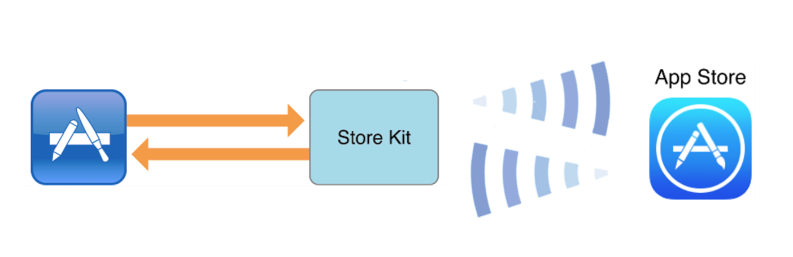
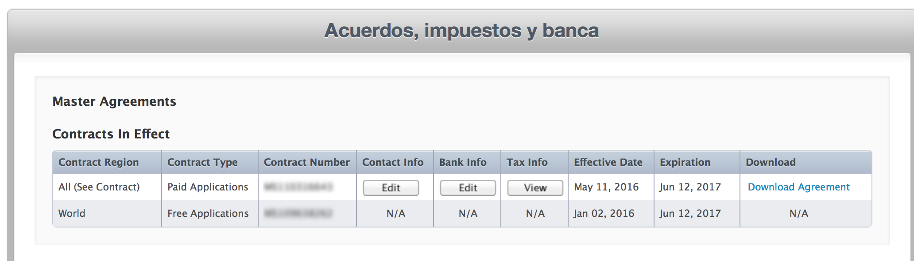
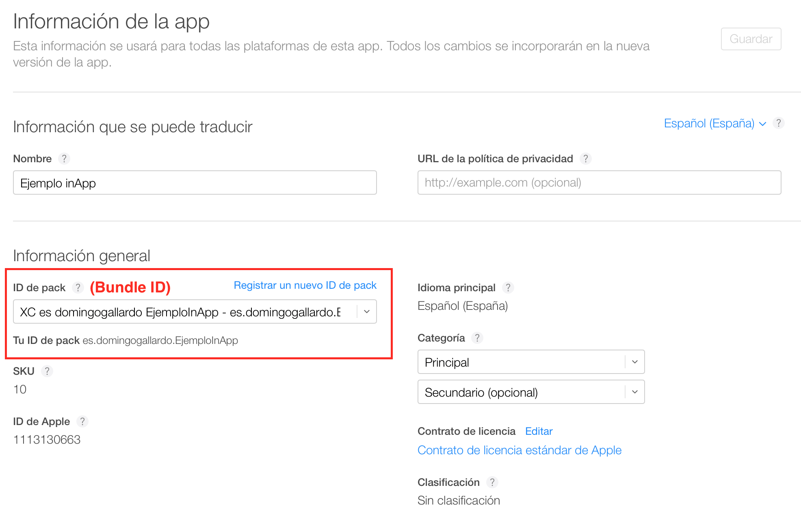
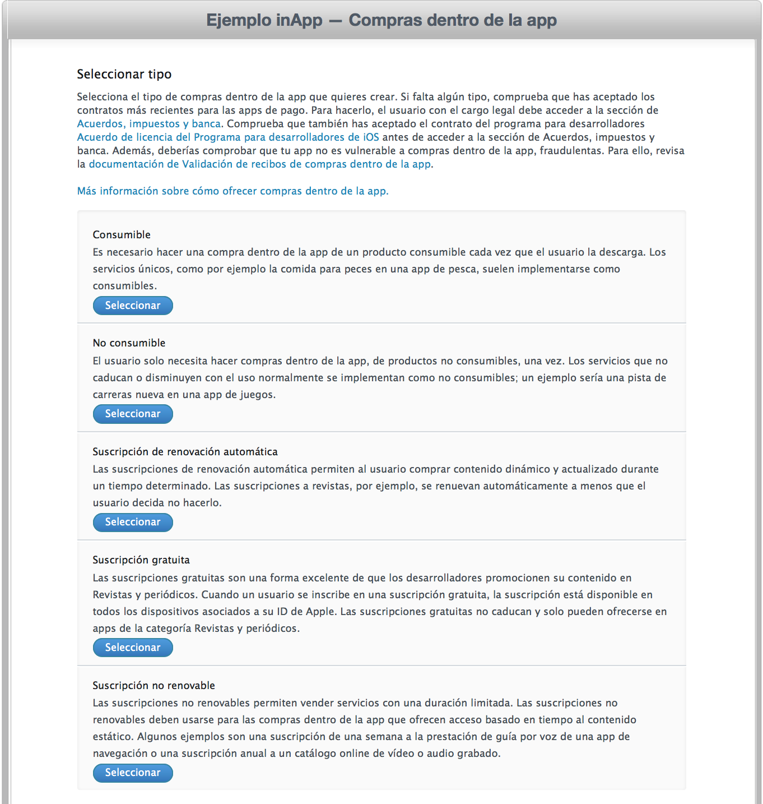
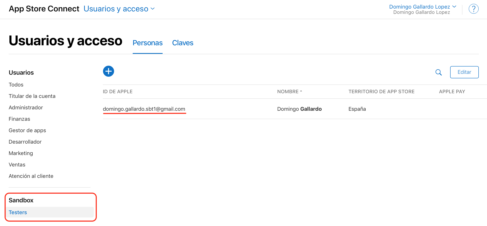

# Sesión 6: <br/> Compras In-App

### Servicios de las plataformas móviles - iOS

<small>Domingo Gallardo - domingo.gallardo@ua.es  
Departamento Ciencia de la Computación e Inteligencia Artificial  
Master Programación de Dispositivos Móviles   
2017-18</small> 

<!-- Tres líneas en blanco para la siguiente transparencia -->


### ¿Qué es una compra In-App?

- Permite vender directamente una funcionalidad dentro de una app.
- Los datos de la compra (precio, identificador) se definen en iTunes Connect.
- Se implementa con el API StoreKit
    - StoreKit pregunta al usuario si confirma la transacción a través del acceso seguro del App Store.
    - La app recibe la confirmación de la compra y debe desbloquear dinámicamente la funcionalidad.
    - La app debe guardar la información de que el usuario ha comprado esa nueva funcionalidad, aunque el usuario siempre puede recuperar la compra.




<!-- Tres líneas en blanco para la siguiente transparencia -->


### Ejemplos de uso

- Las compras In-App son una de las formas de monetización más usadas en la actualidad
- Por ejemplo:
    - Podemos dar una versión básica gratuita y vender funcionalidades adicionales premium
    - Podemos permitir la subscripción a contenidos periódicos que se pueden descargar
    - Ofertas de niveles adicionales en juegos
    - Compras de mercancías virtuales en juegos on-line

<!-- Tres líneas en blanco para la siguiente transparencia -->


### Tipos de compras In-App - Compras

- No-consumibles
    - Ítems que permanecen disponibles de forma indefinida en todos los dispositivos del usuario.
    - Ejemplos: libros, niveles de un juego, funcionalidades premium de un app.
- Consumibles
    - Ítems que se consumen durante el tipo de ejecución del app.
    - Ejemplos: minutos de llamadas de voz sobre IP, o servicios de un sólo uso como transcripción de voz.

<!-- Tres líneas en blanco para la siguiente transparencia -->


### Tipos de compras In-App - Subscripciones

- Subscripciones auto-renovables
    - Como los no-consumibles, las subscripciones permanecen disponibles en todos los dispositivos. Tienen una fecha de expiración, en la que el sistema renueva automáticamente la compra.
- Subscripciones no-renovables
    - Subscripciones en las que no se entrega contenido periódico.
    - Ejemplos: acceso a una base de datos de fotos históricas.
    - Suele acompañarse de una cuenta de usuario en un servidor.
    - La duración y la expiración de la subscripción se realizan desde la app (y el servidor).

<!-- Tres líneas en blanco para la siguiente transparencia -->


### Requisitos para activar las In-App

- Las compras In-App sólo pueden probarse y activarse con una cuenta de desarrollador de pago.
- Es necesario acceso a iTunes Connect para configurar las compras.
- No es posible hacerlo con el equipo de la universidad.
- Haremos una demo con una cuenta de desarrollador.

<!-- Tres líneas en blanco para la siguiente transparencia -->


### Contratos

- **¡Cuidado!**: Para poder probar las compras In-App hay que tener todos los contratos en regla.




<!-- Tres líneas en blanco para la siguiente transparencia -->


### Servicios a activar en la app


<!-- Tres líneas en blanco para la siguiente transparencia -->


### _Bundle identifier_ y App Id


<!-- Tres líneas en blanco para la siguiente transparencia -->


### Configuración In-App desde iTunes Connect


<!-- Tres líneas en blanco para la siguiente transparencia -->


### Datos del app



<!-- Tres líneas en blanco para la siguiente transparencia -->


### Pantalla para añadir nuevos In-Apps


<!-- Tres líneas en blanco para la siguiente transparencia -->


### Seleccionar el tipo de In-App



<!-- Tres líneas en blanco para la siguiente transparencia -->


### Características del In-App

- Nombre de referencia: aparece en la ventana de compra
- ID del producto: identificador del In-App para reconocerlo en el app
- Precio
- Datos para la revisión de Apple


<!-- Tres líneas en blanco para la siguiente transparencia -->


### Características del In-App


<!-- Tres líneas en blanco para la siguiente transparencia -->


### Características del In-App (2)


<!-- Tres líneas en blanco para la siguiente transparencia -->


### Usuarios de prueba 

- Para probar las compras In-App debemos crear usuarios de prueba de sandbox en iTunes Connect.
- En el dispositivo de prueba hay que iniciar la sesión en el App Store con ese usuario de prueba.

 

<!-- Tres líneas en blanco para la siguiente transparencia -->


### Aplicación ejemplo

- Vamos a ver un ejemplo de aplicación que contiene una pantalla sorpresa cuyo acceso se activa con una compra In-App.
- Está disponible en las plantillas en [este enlace](http://domingogallardo.github.io/apuntes-mastermoviles/apps/EjemploInApp.zip)


<!-- Tres líneas en blanco para la siguiente transparencia -->


### Aplicación ejemplo (2)


<!-- Tres líneas en blanco para la siguiente transparencia -->


### El proceso de compra en un vistazo

- Debemos implementar los protocolos [`SKProductsRequestDelegate`](https://developer.apple.com/library/ios/documentation/StoreKit/Reference/SKProductsRequestDelegate/) y [`SKPaymentTransactionObserver`](https://developer.apple.com/library/ios/documentation/StoreKit/Reference/SKPaymentTransactionObserver_Protocol/).


<!-- Tres líneas en blanco para la siguiente transparencia -->


### Clase auxiliar InApp (1)

- Creamos un protocolo `InAppDelegate` y una clase `InApp` donde gestionaremos la interacción con `StoreKit`:

```swift
protocol InAppDelegate {
    func compraRecibida()
}
```
```swift
class InApp: NSObject, SKProductsRequestDelegate, SKPaymentTransactionObserver {
    var productDetailsList: [SKProduct] = []
    var productIdentiferList: [String] = []
    var delegate: InAppDelegate?
    
    override init() {
        super.init()
        SKPaymentQueue.defaultQueue().addTransactionObserver(self)
        // Cargamos la lista de productos
        productIdentiferList.append("ejemplo3")
        let request = SKProductsRequest.init(productIdentifiers: 
                            Set(productIdentiferList))
        request.delegate = self
        request.start()
    }
```

<!-- Tres líneas en blanco para la siguiente transparencia -->


### Clase auxiliar InApp (2)

```swift
// Método del delegado al que se llama cuando se han recibido los productos

func productsRequest(request: SKProductsRequest, didReceiveResponse response: SKProductsResponse) {
    print("Hemos recibido \(response.products.count) productos")
    productDetailsList = response.products
    for invalidProductId in response.invalidProductIdentifiers {
        print("Producto invalido id: \(invalidProductId)")
    }
}
```
<!-- Tres líneas en blanco para la siguiente transparencia -->


### Clase auxiliar InApp (3)

```swift
// Método para lanzar la petición de compra al usuario

func lanzarPago() {
    if (self.productDetailsList.count > 0 &&
              SKPaymentQueue.canMakePayments()) {
        let producto = productDetailsList[0]
        let pago = SKPayment(product: producto)
        SKPaymentQueue.defaultQueue().addPayment(pago)
        print("Comprando...")
    } else {
        print("No existen productos")
    }
}
```

<!-- Tres líneas en blanco para la siguiente transparencia -->


### Clase auxiliar InApp (4)

```swift
// Método del delegado al que se llama cuando el usuario compra el InApp
func paymentQueue(queue: SKPaymentQueue, 
                  updatedTransactions transactions: 
                                    [SKPaymentTransaction]) {
    for transaction in transactions {
        switch transaction.transactionState {
        case .Purchased:
            print("Purchased")
            delegate?.compraRecibida()
            SKPaymentQueue.defaultQueue()
                            .finishTransaction(transaction)
        case .Failed:
            print("Failed")
            print("Error de transacción: \(transaction.error?.localizedDescription)")
            SKPaymentQueue.defaultQueue()
                            .finishTransaction(transaction)
        case .Restored:
            print("Restored")
            delegate?.compraRecibida()
            SKPaymentQueue.defaultQueue()
                           .finishTransaction(transaction)
        default:
            print("Otro")
        }
    }
}
```
<!-- Tres líneas en blanco para la siguiente transparencia -->


### Clase ViewController (1)

- En la clase `ViewController` adoptamos nuestro protocolo `InAppDelegate` y definimos su método `compraRecibida()` al que se va a llamar cuando se haya recibido y validado la compra.

```swift
class ViewController: UIViewController, InAppDelegate {
    @IBOutlet weak var botonSorpresa: UIButton!
    let inApp = InApp() // Instancia de la clase auxiliar InApp

    override func viewDidLoad() {
        // Nos hacemos delegados de InApp
        inApp.delegate = self

        // Escondemos el botón que da acceso a la pantalla sorpresa
        botonSorpresa.hidden = true
    
        // Comprobamos si el usuario ha comprado antes el inApp
        // Funciona si el usuario está identificado 
        if NSUserDefaults.standardUserDefaults().boolForKey("inAppComprado") {
            botonSorpresa.hidden = false
        } else {
            botonSorpresa.hidden = true
        }
        super.viewDidLoad()
    }
```

<!-- Tres líneas en blanco para la siguiente transparencia -->


### Clase ViewController (2)

- La acción asociada al botón de compra llama al método `lanzarPago` de la instancia de nuestra clase `InApp`:

```swift
    // Acción asociada al botón de compra
    @IBAction func hazCompra(sender: UIButton) {
        print("Click botón de compra")
        inApp.lanzarPago()
    }
```
    
<!-- Tres líneas en blanco para la siguiente transparencia -->


### Clase ViewController (3)

- En el método `compraRecibida()` (del protocolo) activamos un botón que da acceso a la pantalla sorpresa.

```swift
    // Implementación del método del protocolo InAppDelegate
    func compraRecibida() {
        botonSorpresa.hidden = false
    }
```

- Acción para mostrar la pantalla sorpresa:
    
```swift
    @IBAction func sorpresa(sender: UIButton){
        performSegueWithIdentifier("Sorpresa", sender: view)
    }
}
```

<!-- Tres líneas en blanco para la siguiente transparencia -->


## _Demo_

<!-- Tres líneas en blanco para la siguiente transparencia -->


### Referencias

- [Recursos sobre compras In-App](https://developer.apple.com/in-app-purchase/)
- [In-App Purchase Configuration Guide for iTunes Connect](https://developer.apple.com/library/ios/documentation/LanguagesUtilities/Conceptual/iTunesConnectInAppPurchase_Guide/Chapters/Introduction.html)
- [In-App Purchase Programming Guide](https://developer.apple.com/library/ios/documentation/NetworkingInternet/Conceptual/StoreKitGuide/Introduction.html)
- [Receipt Validation Programming Guide](https://developer.apple.com/library/ios/releasenotes/General/ValidateAppStoreReceipt/Introduction.html#//apple_ref/doc/uid/TP40010573-CH105-SW1)
- [StoreKit Framework Reference](https://developer.apple.com/library/mac/documentation/StoreKit/Reference/StoreKit_Collection/)
- [Getting Started with In-App purchase](https://developer.apple.com/in-app-purchase/In-App-Purchase-Guidelines.pdf)
- [Technical Note: Adding In-App Purchase to your iOS and OS X Applications](https://developer.apple.com/library/ios/technotes/tn2259/_index.html#//apple_ref/doc/uid/DTS40009578)
- [Technical Note: In-App Purchase Best Practices](https://developer.apple.com/library/ios/technotes/tn2387/_index.html)

<!-- Tres líneas en blanco para la siguiente transparencia -->


# Master Programación <br/> de Dispositivos Móviles


