<!-- Una forma de subir un fichero .ipa a una web para que otros -->
<!-- puedan descargarlo es usar la web https://www.diawi.com/ y todas -->
<!-- sus alternativas: https://alternativeto.net/software/diawi/ -->

# Firma, aprovisionamiento y distribución de apps

## Introducción ##

En la sesión de hoy estudiaremos los elementos que proporciona la
plataforma iOS para:

- Ejecutar apps en dispositivos reales.
- Configurar perfiles de aprovisionamiento en el Programa de
  Desarrollo de la Universidad que nos permitan:
    - Distribuir nuestras apps en dispositivos de prueba.
    - Utilizar APIs de los servicios de iOS no disponibles en la cuenta
      de desarrollador gratuita. 
- Probar y distribuir apps usando Test Flight y App Store Connect.


### Seguridad en las apps ###

La seguridad es uno de los elementos fundamentales de la plataforma
iOS. En concreto, el sistema de instalación y ejecución de apps en
dispositivos reales contempla la necesidad de que las apps se ejecuten
de forma segura y sin comprometer la integridad de la plataforma,
eliminando virus, malware o ataques no autorizados.

El documento [iOS Security
Guide](https://support.apple.com/es-es/guide/security/welcome/web)
detalla todos los elementos que conforman la seguridad de la
plataforma. Uno de los elementos más críticos de la arquitectura son
las apps.

Para garantizar la autoría del desarrollador y la no modificación del
código, todo el código ejecutable que se ejecute en un dispositivo iOS
debe haber sido firmado con un **certificado generado por
Apple**. Al arrancar la aplicación el sistema se asegura de que el
código de la app no ha sido modificado desde la última vez que fue
instalada o actualizada.

Para obtener un certificado, los desarrolladores deben registrase en
el **Apple Developer Program**. Para publicar una app en el App Store,
es necesario haberla firmado. De esta forma, toda app que nos
instalemos en nuestros dispositivos ha sido desarrollada por una
persona física u organización identificable.

A diferencia de otras plataformas móviles, iOS no permite que los
usuarios instalen de páginas web apps no firmadas, potencialmente
maliciosas. Tampoco permite ejecutar código no fiable. 


## Cuenta de desarrollador de Apple ##

### Distintos programas de desarrollo ###

Apple define varios tipos de programas de desarrollo:

- Programa gratuito 
- [Programa de desarrollador de Apple](https://developer.apple.com/programs/whats-included/) (_Apple Developer Program_) - $99 al año
- [Programa de desarrollador de empresa](https://developer.apple.com/programs/enterprise/) (_Apple Developer Enterprise Program_) - $299 al año

Si sólo queremos empezar a desarrollar y probar apps en nuestro
dispositivo iOS basta con darse de alta de forma gratuita en el
**portal del desarrollador** (_member center_) de Apple con un Apple ID. 

El programa de pago de desarrollador de Apple permite utilizar
funcionalidades avanzadas, distribuir apps a dispositivos de prueba o
subir nuestra app al App Store.

El programa de desarrollador de empresa permite distribuir apps
_in-house_, en los dispositivos del personal de la empresa, sin
necesidad de usar el App Store.

Además de los anteriores programas, Apple ofrece el denominado [_iOS Developer
University Program_](https://developer.apple.com/support/university/) orientado a la formación en iOS en la universidad,
que permite acceder a funcionalidades intermedias entre el programa
gratuito y el programa de pago. 

Este programa permite utilizar servicios de Apple no disponibles en el
programa gratuito y ejecutar apps en dispositivos registrados, no solo
en el dispositivo de desarrollo.

Dependiendo del rol es posible acceder a distintas opciones. Hay dos
tipos de roles principales: `Admin` (administrador de la organización)
y `Member` (miembro de la organización).

La Universidad de Alicante participa en este programa y probaremos sus
características.

En concreto, las características de cada uno de los programas se
muestra en la siguiente tabla
[https://developer.apple.com/support/compare-memberships/](https://developer.apple.com/support/compare-memberships/):

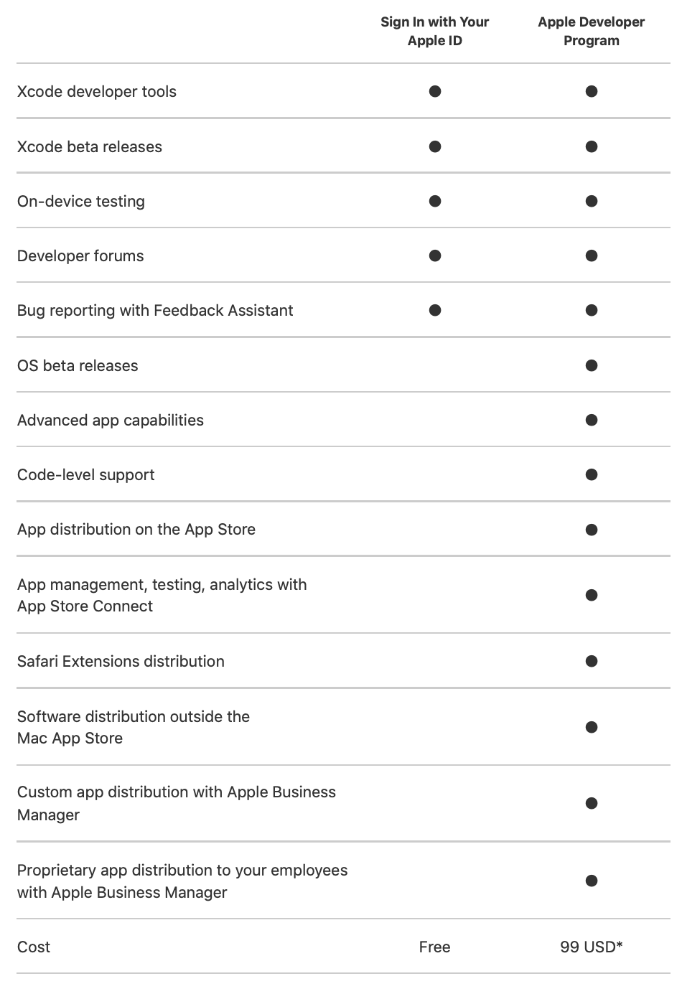


### Equipo de desarrollo ###

En los programas de pago de desarrollador de Apple es posible trabajar
con un equipo de desarrolladores. No es necesario darse de alta como
organización para componer un equipo.

Cuando se da de alta un programa de desarrollo se crea un
identificador de equipo único (_Team ID_)  que compartirán todos los
desarrolladores del equipo. Se puede consultar el identificador de
equipo en la opción _Membership_ del portal del desarrollador.


Se pueden añadir desarrolladores al equipo desde el App Store Connect,
en la opción de _Usuarios y Acceso_.


También es posible configurar los permisos de los desarrolladores del
equipo para que puedan subir apps o probarlas como _testers_ en Test
Flight.

También se pueden configurar estas opciones en el programa
universitario.

----

## Demo ##

Veremos una demostración en la que accederemos al [portal del
desarrollador](https://developer.apple.com/account/) y al [App Store
Connect](https://appstoreconnect.apple.com/login) usando distintos
perfiles:

- Perfil gratuito (domingo.gallardo.appledev2@gmail.com)
- Miembro de la cuenta de la universidad (domingo.gallardo.appledev1@gmail.com)
- Administrador de la cuenta de la universidad (domingo@dccia.ua.es)
- Perfil de pago (domingo@dccia.ua.es)


### Perfil gratuito ###

Para darse de alta como desarrollador de Apple es necesario dar de
alta un Apple ID y definir una [autenticación de doble
factor](https://support.apple.com/es-es/HT204915). 

Con esta forma de autenticación activada, cada vez que intentes
acceder a tu cuenta desde un nuevo dispositivo tendrás que introducir
un código de autorización que se envía a tus dispositivos autorizados
en los que estás logeado.

También es posible recibir un código de autorización en un teléfono
móvil que deberás proporcionar en tu registro.


Una vez dados de alta como desarrolladores de Apple podremos acceder al
[portal del desarrollador](https://developer.apple.com/account/).

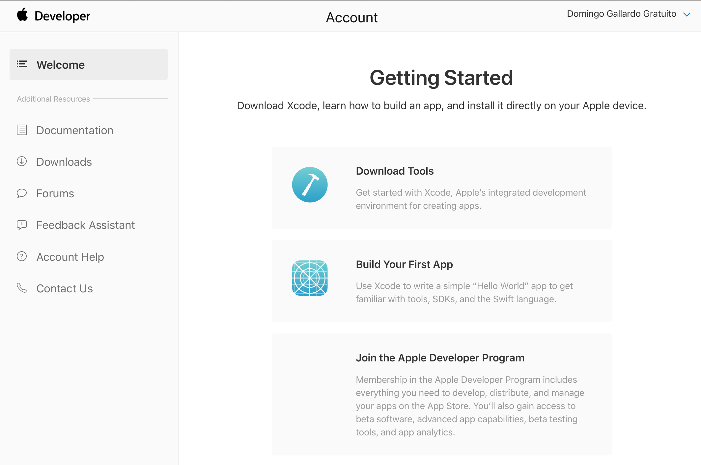

Con esta cuenta gratuita podremos comenzar a desarrollar apps y
probarlas en nuestro dispositivo de desarrollo. Pero este desarrollo
estará limitado. No podremos distribuirlas a más dispositivos ni
utilizar servicios avanzados de Apple.

### Miembro del equipo de la UA ###

Si añadimos nuestra cuenta al equipo de la Universidad de Alicante,
podremos gestionar servicios y capacidades adicionales. Esta es la
cuenta que usaremos durante la asignatura.

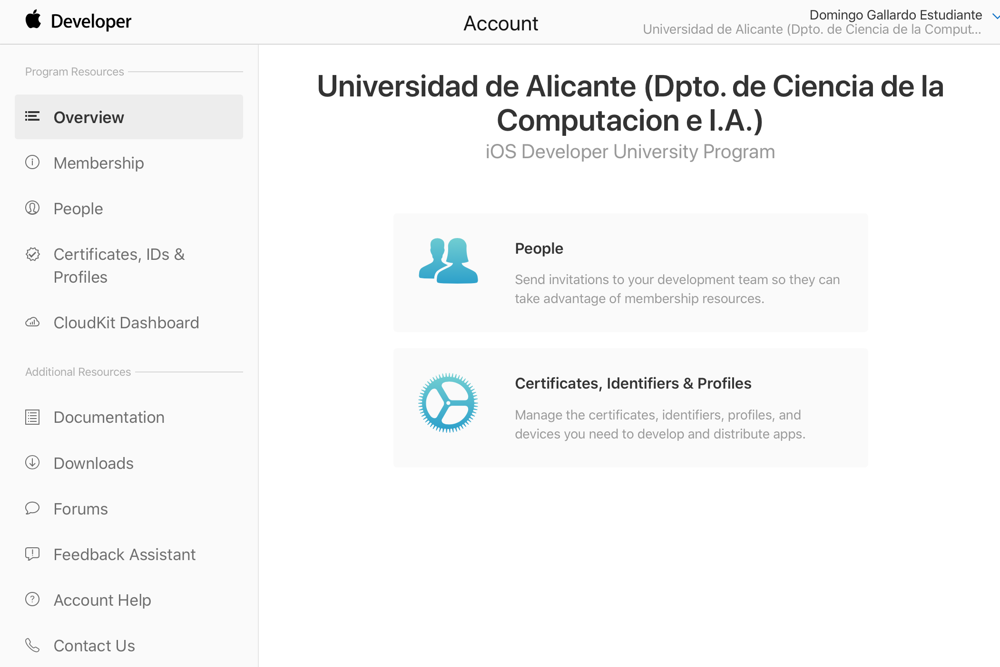

En el menú de la izquierda podemos comprobar que hay opciones
adicionales a la cuenta gratuita.

### Miembro de pago ###

Por último, si usamos una cuenta de pago, tenemos opciones adicionales:

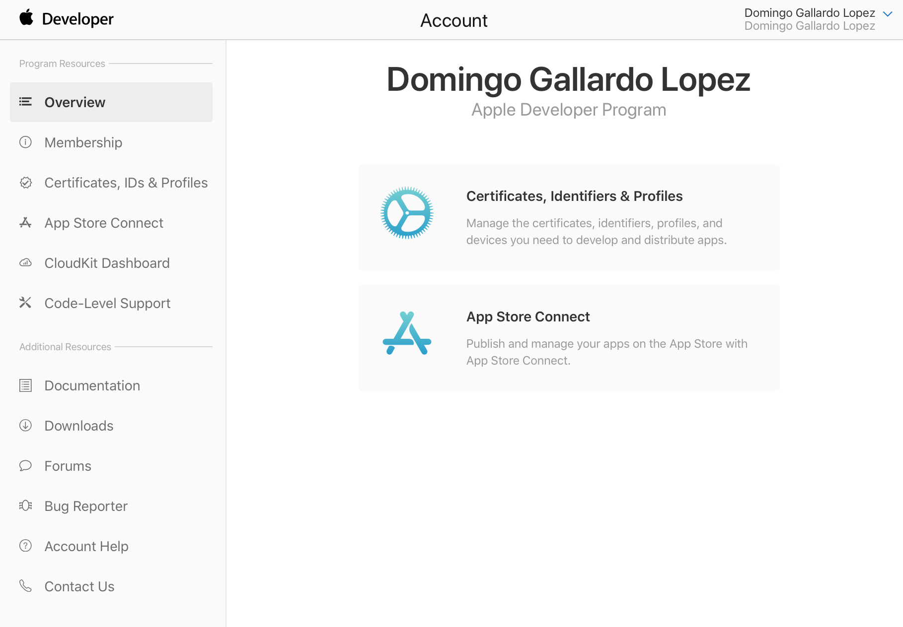

También tenemos acceso al portal de gestión de nuestras apps, el [App
Store Connect](https://appstoreconnect.apple.com/login) desde donde
gestionar recursos relacionados con nuestro equipo de desarrollo y
prueba, así como preparar las apps para su distribución en la App
Store.


### Fin de la demo ###

----


## Certificados  ##

### Código firmado ###

Para poder tanto ejecutar una app en un dispositivo físico como
distribuirla en el _App Store_ es necesario firmar su código
digitalmente.

La **firma digital del código** (_code signing_) permite al sistema
operativo identificar quién ha firmado la app y verificar que no se ha
modificado desde el momento de su firma. El código ejecutable está
protegido por la firma y ésta se invalida si el código cambia. Los
recursos de la app como ficheros nib o imágenes no están firmados.

En tiempo de ejecución, el sistema iOS comprueba el código firmado de
todas las páginas ejecutables de memoria cuando se cargan, para
asegurar que la app no ha sido modificada desde que fue instalada o
actualizada por última vez.

Para poder firmar una app es necesario instalar un certificado
proporcionado por Apple que proporciona la clave privada con la que se
realiza la firma.


### Identidad de firma ###


Una **identidad de firma** (_signing identity_) consiste en una pareja
de clave pública y clave privada que proporciona Apple en el
certificado de desarrollador.

El certificado es creado por Xcode al añadir la cuenta de usuario y se
almacena en el llavero de inicio de sesión del Mac en el que se
realiza el desarrollo (se puede consultar con la aplicación _Acceso a
llaveros_) y en el portal del desarrollador de Apple.

La clave privada se usa para firmar la aplicación. La clave pública
del certificado determina la identidad del desarrollador. La mantiene
Apple en el centro de desarrollador y se guarda en los perfiles de
aprovisionamiento del equipo de desarrollo.

Se necesita también un certificado intermedio proporcionado por
Apple. Cuando instalas Xcode este certificado intermedio se guarda en
el llavero.

Es muy importante conservar segura la clave privada, como si fuera una
contraseña de una cuenta. Debes mantener una contraseña segura de tu
pareja clave pública-privada. Si se pierde la clave privada, tendrás
que crear una identidad completamente nueva para firmar el código. O
peor aún, si alguien se hace con tu clave privada puede hacerse pasar
por ti e intentar distribuir una app con código malicioso. Esto podría
hacer que Apple revocara tus credenciales de desarrollador.


### Tipos de certificados ###

Existen varios [tipos de certificados](https://help.apple.com/developer-account/#/dev52fdd1ce5):
de desarrollo, de distribución, para el servidor de notificaciones
push, etc. El **certificado de desarrollador** permite ejecutar
aplicaciones en un dispositivo. El de distribución permite enviarla al
_App Store_.

Los certificados de desarrollo identifican a una persona del
equipo. Los certificados de distribución identifican al equipo y
pueden ser compartidos por los miembros del equipo que tienen permiso
para enviar apps al _store_.

Todos los certificados son proporcionados por Apple.

Para comprobar el tipo de certificado podemos consultar el portal del
desarrollador, _Xcode_ o _Acceso a llaveros_.


### Gestión de los certificados en Xcode ###

Xcode mantiene nuestra identidad (Apple ID) y nuestros certificados. 

En el caso de pertenecer a más de un programa de desarrollo (por
ejemplo al programa educativo de la UA y a nuestro programa personal)
Xcode muestra los dos equipos y nos permite utilizar el que nos
interese en cada momento.
  
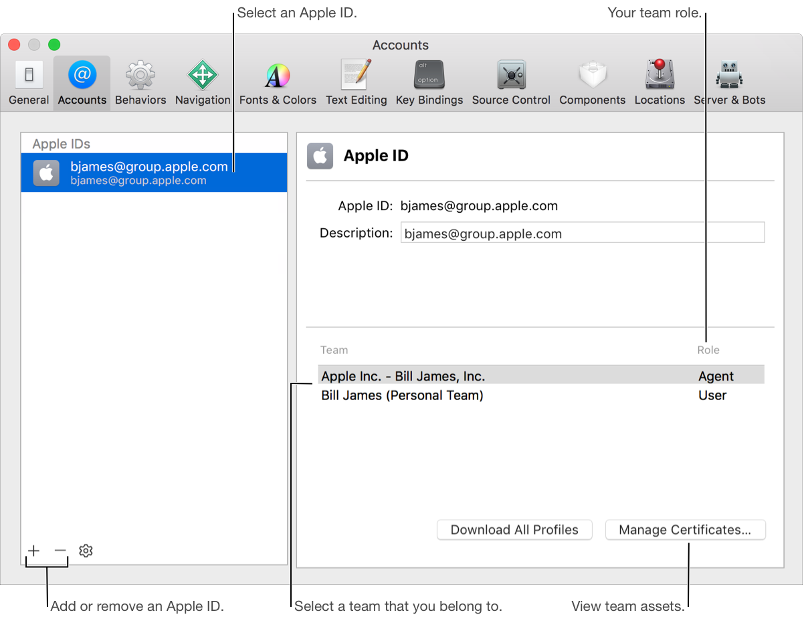


### Creación e instalación de certificados ###

Es posible generar e instalar manualmente los certificados, pero es
más sencillo dejar que sea Xcode quien los gestione.

Al firmar una aplicación por primera vez, Xcode se conecta a los
servidores de Apple e instala automáticamente el certificado de firma.


### Ejecución de apps en dispositivos reales ###

Para la instalación y ejecución de una app iOS en un dispositivo
físico es necesario realizar una configuración del _target_ (binario
que se instala en el dispositivo) que incluye múltiples procesos:

- **Firma digital** del binario con un certificado del desarrollador
  proporcionado por Apple (_Signing Certificate_).

- Instalación de un **perfil de aprovisionamiento** (_Provisioning
  Profile_) compatible con el _bundle identifier_ de la app que determina,
  entre otros: servicios de la plataforma Apple a los que la app puede
  acceder (**_capabilities_** y **_entitlements_**) y dispositivos
  concretos (IDs) autorizados en los que puede ejecutarse la app (lo
  veremos más adelante).

Xcode facilita la realización de todos estos procesos. 
  
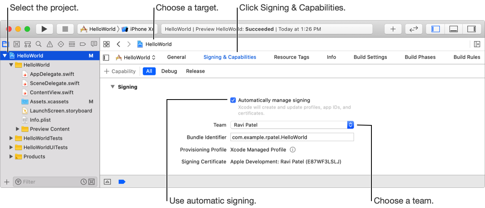

El resultado de estos procesos es un fichero binario .ipa firmado
digitalmente.

La forma habitual de instalar una app en un dispositivo iOS es
descargándola del App Store. Pero también existen formas alternativas,
para el caso de dispositivos de prueba o apps distribuidas
internamente en una empresa (_in-house_). En estos casos es posible
instalar las apps desde _Test Flight_, desde una web o con el programa
de MacOS _Apple Configurator 2_.

Resumiendo las distintas condiciones posibles, un dispositivo iOS
puede ejecutar una app si:

1. El dispositivo es un dispositivo de desarrollo inicializado por
  Xcode.
2. El dispositivo tiene instalado un perfil de aprovisionamiento
  aprobado por el usuario, que contiene el UUID del propio dispositivo
  y el certificado contiene la clave pública del desarrollador que ha
  firmado la app.
3. Se trata de una versión beta de la app que se ha instalado con Test
   Flight.
4. El dispositivo tiene instalado un perfil de aprovisionamiento
  aprobado por el usuario y la app está firmada con un certificado de
  empresa proporcionado por Apple.
5. Proviene del App Store y está firmada con un certificado de
  distribución en el App Store.

----


## Demo ##

Vamos a demostrar cómo firmar una app y cómo ejecutarla en un
dispositivo autorizado por Xcode, usando el perfil de desarrollador
de la cuenta gratuita de Apple y después usando el perfil de
desarrollador del equipo de la Universidad de Alicante.

### Instalación de la identidad de firma ###

Una vez creado el Apple ID, Xcode facilita el proceso de generación
de nuestra identidad de firma y de nuestro certificado de
desarrollador.

Escogemos _Xcode > Preferences_ y pinchamos en el signo + para añadir Apple
ID.

 


Si todo ha ido bien, Xcode mostrará la información de nuestro perfil gratuito. 

### Firma de una app ###

Para firmar una app con Xcode debemos seleccionar el proyecto completo,
el _target_ y, en el apartado General, rellenar el _bundle ID_ de la
app y seleccionar tu identidad de firma en la opción _Signing & Capabilities_.


El _bundle ID_ debe ser un identificador único. Si utilizamos uno que
ya se ha usado Xcode indicará un error. Podemos utilizar nuestro
nombre de login, seguido de un punto y del nombre de la app.


### App ejemplo `ToDo` ###

Vamos a utilizar una app ya codificada para probar todos los conceptos
de esta sesión. Se trata de una app muy sencilla, con la que podemos
gestionar una lista de tareas por hacer.


Estando en el programa de desarrollo gratuito podemos probar la app en
nuestro móvil de desarrollo. Para ello es necesario firmar el código
compilado de la app con el certificado de desarrollador que acabamos
de obtener.
    
Al firmar la app, Xcode creará automáticamente el certificado de
desarrollador.


### Comprobación del certificado ###

En la pantalla de _Xcode > Preferences... > Accounts_ pulsamos _Manage
Certificates..._ para comprobar el certificado recién creado.

Podemos gestionar los certificados (crear nuevos, exportar, importar,
examinar) desde esta pantalla. Podemos encontrar más información en el
[manual de
Xcode](https://help.apple.com/xcode/mac/current/#/dev154b28f09).

 

 

### Comprobación de la identidad de firma en Acceso a Llaveros ###

En la aplicación Acceso a Llaveros podemos comprobar que el
certificado se ha instalado junto con la clave privada
en _Mis certificados_ e _Inicio de sesión_.


### Conexión de un dispositivo de desarrollo a Xcode ###

Una vez que se ha firmado la aplicación es posible ejecutarla en un
dispositivo de desarrollo conectado a Xcode. 

Comenzamos conectando el dispositivo iOS al ordenador. Se debe aceptar
en el dispositivo un mensaje en el que se pide confirmación para
confiar en el ordenador.

Después, en Xcode seleccionamos _Window > Devices_ para comprobar que
se ha conectado correctamente. En esa ventana se puede acceder al
identificador UUID del dispositivo.

Es posible activar la conexión inalámbrica al dispositivo.


### Prueba en un dispositivo real ###

Seleccionamos el dispositivo en el menú de ejecución y ejecutamos para que
la app se instale en el dispositivo.

Es posible desplegar y ejecutar la aplicación en el dispositivo de
forma inalámbrica.


### Autorización al desarrollador en el dispositivo ###

Al ser un dispositivo de prueba gestionado automáticamente por
Xcode, debemos autorizar al desarrollador antes de poder lanzarse la
app.


 

 


### Archivo y distribución de la app ###

Seleccionando la opción de Xcode _Product > Archive_ se accede al
panel de archivo y distribución de la app 

Sin embargo, al estar registrado en el programa gratuito no es posible
seleccionar ninguna forma de distribución de la app.


!!! Alert "Cuidado"
    Para poder pulsar la opción _Archive_ debe estar seleccionada la
    opción _Generic iOS Device_ en el menú de ejecución. Si está
    seleccionado un modelo concreto de iPhone la opción _Archive_ se
    deshabilita. 

    


### Firma con el equipo de la UA ###

Podemos firmar con el equipo de la UA cambiando el bundle ID,
seleccionando el `Team` `Universidad de Alicante`.

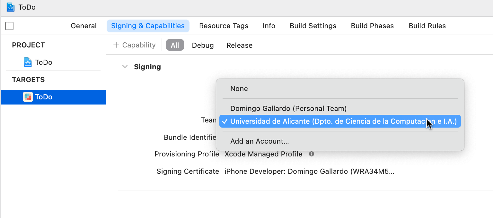

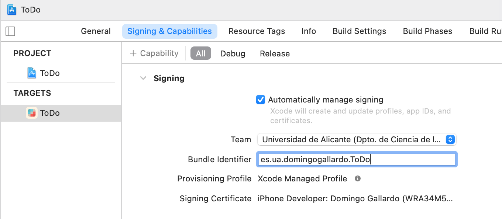

Al seleccionar el equipo `Universidad de Alicante` Xcode selecciona nuestro
certificado específico asociado al equipo de la UA y firma con él la
aplicación.

Podemos instalar cualquier perfil de aprovisionamiento creado en el
equipo de la UA que sea compatible con el bundle ID. Para ello
desmarcamos la opción `Automatically manage signing` y descargamos el
perfil que nos interese. Un perfil de aprovisionamiento contiene un
listado de capacidades que podemos activar en la app y un listado de
dispositivos en los que podemos ejecutarla. Más adelante explicaremos
esto con más detalle.


Podemos seleccionar el perfil denominado `Genérico`:

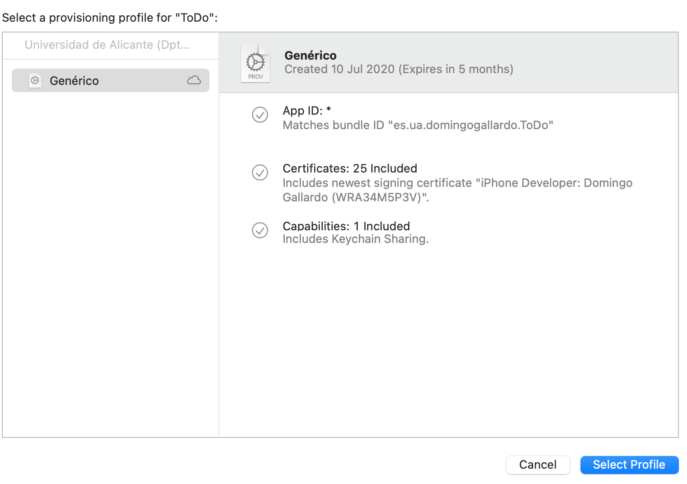

Una vez instalado el perfil de aprovisionamiento, la configuración de
firma de la app queda como se muestra en la siguiente imagen:

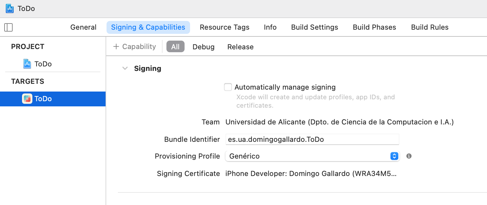

### Archivo y distribución de la app ###

Ahora ya podemos exportar la app y ejecutarla en cualquier dispositivo
registrado en el perfil que acabamos de instalar. Para ello debemos
seleccionar `Product > Archive` y la opción `Development`.

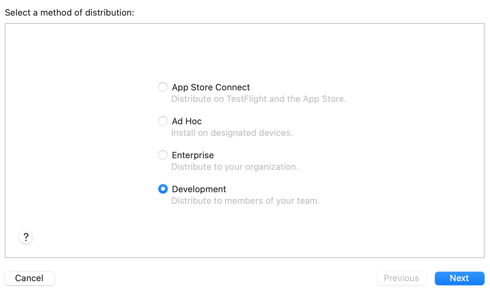


Se crea una carpeta que contiene el fichero `.ipa` que puede
instalarse en cualquier dispositivo incluido en el perfil de
aprovisionamiento (aunque no sea un dispositivo de desarrollo).

Podemos instalar la app en un dispositivo conectando el dispositivo al
Mac y usando el programa de Apple `Apple Configurator 2`.

### Fin de la demo ###

----

## Capacidades de las apps ##

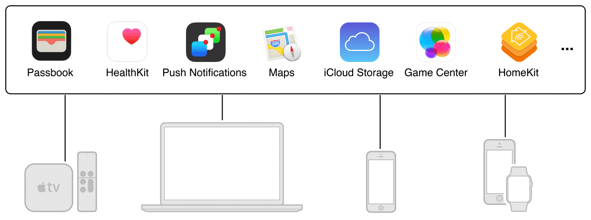

Apple proporciona un conjunto de servicios para ser utilizados por las
apps. Apple denomina a estos servicios como _Capabilities_. Para que
una app pueda utilizar cualquiera de estas _capabilities_ debe
autorizarse su uso desde la cuenta de desarrollo o desde Xcode.

Dependiendo del tipo de cuenta de desarrollo es posible utilizar unas
_capabilities_ y otras. Por ejemplo, podemos utilizar el servicio de
mapas o el API de _Health Kit_ con el programa gratuito, pero
necesitamos el programa de la universidad para poder utilizar
servicios iCloud o notificaciones push. Y existen _capabilities_ avanzadas
que sólo pueden ser usadas con el programa de pago.

Para una lista completa de las capacidades disponibles según el tipo
de desarrollador se puede consultar la documentación en [_Apple
Developer > Support > Advanced App
Capabilities_](https://developer.apple.com/support/app-capabilities/).

 

Podemos explorar en Xcode el listado de _capabilities_ que podemos
añadir a nuestra app, accediendo desde la pantalla de _Signing &
Capabilities_ a la opción _+ Capability_.

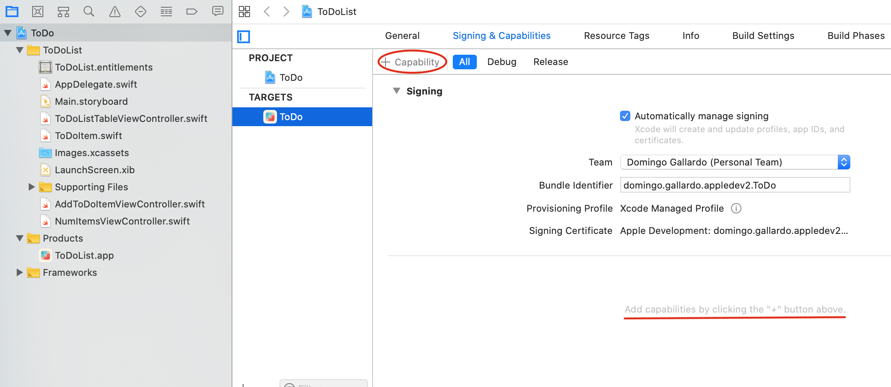

Con el programa gratuito podemos usar el siguiente listado de
_capabilities_:


Con el programa de pago podemos acceder a todos los
servicios proporcionados por Apple:

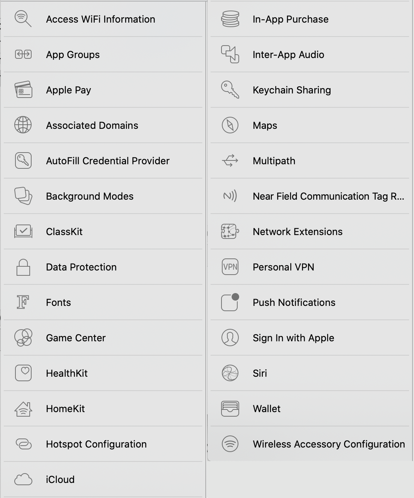


### _Bundle Identifier_ ###

Un _bundle ID_ es una cadena que identifica de forma única una
app. Cuando definimos el bundle ID de un proyecto, Apple lo registra
y no permite que ningún otro desarrollador utilice ese mismo ID. Si
intentamos registrar un bundle ID que otro desarrollador ya ha usado
Xcode nos informa de un error.


La cadena de _bundle ID_ debe contener únicamente caracteres
alfanuméricos (A-Z,a-z,0-9), guiones (-), y puntos (.). Una forma de
que no existan demasiadas colisiones en los bundle ID es usar un
formato DNS-inverso con el nombre de la app y el dominio de nuestra
organización. Por ejemplo, si el dominio de la organización es
`Acme.com` y creamos una app llamada `Hola` podríamos usar como
_bundle ID_ de la app la cadena `com.Acme.Hola`. También podríamos
usar nuestro nombre y el nombre de la app (si nadie ha registrado una
app con un nombre idéntico al nuestro): `domingogallardo.Hola`.

La forma de comprobar la disponibilidad del bundle ID es intentar
firmar la app en la pantalla `Signing & Capabilities` de Xcode. Al
escribir el bundle ID y pulsar `Enter` Xcode intenta firmar la app y
da un error si el bundle ID ya está cogido.


### Uso del Bundle ID ###


Ya que el bundle ID identifica una app de forma única, éste se utiliza
en varias fases de su configuración. En concreto, se usa en el proceso
de aprovisionamiento de la app y en la configuración de los permisos y
capacidades a los que la app puede acceder. Cuando configuramos los
permisos para que la app pueda utilizar determinados servicios debemos
indicar a qué bundle IDs otorgamos esos permisos. Esto lo hacemos como
el _App ID_.

### App ID ###

El _App ID_ es un patrón de texto que da permiso a un único _bundle
ID_ (identificador de la app) o a un conjunto de ellos. Un App ID
define una lista de capacidades (_whitelist_) que permitimos usar a
una app (_explicit App ID_) o varias apps (_wildcard App ID_).

El _App ID_ se puede crear de forma automática desde Xcode o
manualmente desde la propia cuenta de desarrollo. 

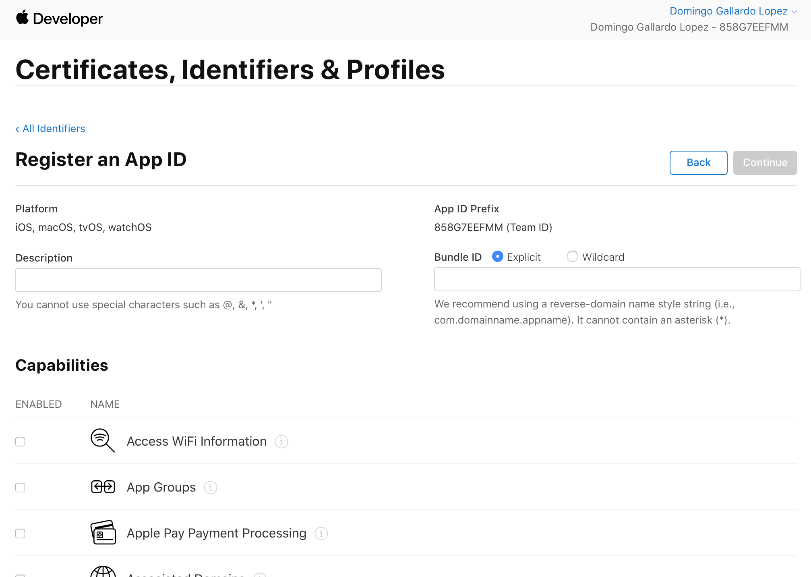

Todos los App IDs creados se guardan en el portal del desarrollador. Los que
crea Xcode de forma automática tienen en su nombre el prefijo XC.


Por ejemplo, podríamos crear el _App ID_
`es.ua.mastermoviles.icloud.*` con la _capability_ de acceso a
iCloud. De esta forma, todos los _bundles ID_ que tengan este prefijo
podrán acceder al servicio.

Una vez creado, el _App ID_ se instala en un **perfil de
aprovisionamiento** que es el que finalmente hay que instalar en la
app y permite que ésta acceda a los permisos otorgados. Además, el
perfil de aprovisionamiento también contendrá los identificadores de
los dispositivos de prueba en los que la app podrá ejecutarse.

En el caso de un desarrollador individual los permisos se gestionan
automáticamente desde Xcode, que es quien se encarga de crear el _App
ID_ y otorgarle los permisos necesarios.

La cadena del _App ID_ contiene realmente dos partes separadas por un
punto: el prefijo, que es el _Team ID_, y el sufijo que es la cadena
de búsqueda del _bundle ID_ propiamente dicha.


### Gestión de las capacidades en Xcode ###

Como se ha comentado anteriormente, podemos acceder en Xcode a las
_capabilities_ que queremos autorizar en la app que estamos
desarrollando.

Para ello debemos seleccionar el _target_ y la opción
_Signing & Capabilities_ y pulsar en _+ Capability_.


Una vez seleccionadas las capacidades que necesitamos, Xcode busca en
el portal del desarrollador algún perfil de aprovisionamiento con un App ID que
empareje el _bundle ID_ y que satisfaga estas necesidades. Si no
existe ninguno, crea el _App ID_ y el perfil de aprovisionamiento de
forma automática. El App ID lo registra en la cuenta de
desarrollo. Sólo lo puede hacer si somos administradores.

## Demo ##

Vamos a comprobar el uso de las capacidades (_capabilities_) en la app
ToDo. Si pulsamos en `+ Capability` veremos que podemos añadir un
amplio conjunto de capacidades a la app. Son muchas más que en
el perfil gratuito, por estar firmando la app con la cuenta de
desarrollador del equipo de la UA.

Pero para poder utilizar la capacidad, ésta debe estar autorizada por
el perfil de aprovisionamiento. Y el perfil de aprovisionamiento
`Genérico` no autoriza ninguna.

Lo podemos comprobar seleccionando por ejemplo `Game Center`. Veremos
el siguiente mensaje de error, que el perfil `Genérico` no autoriza la
capacidad `Game Center`.


Podemos ver los perfiles en la web del desarrollador del equipo de la
UA, y buscar un perfil que autorice esa capacidad.

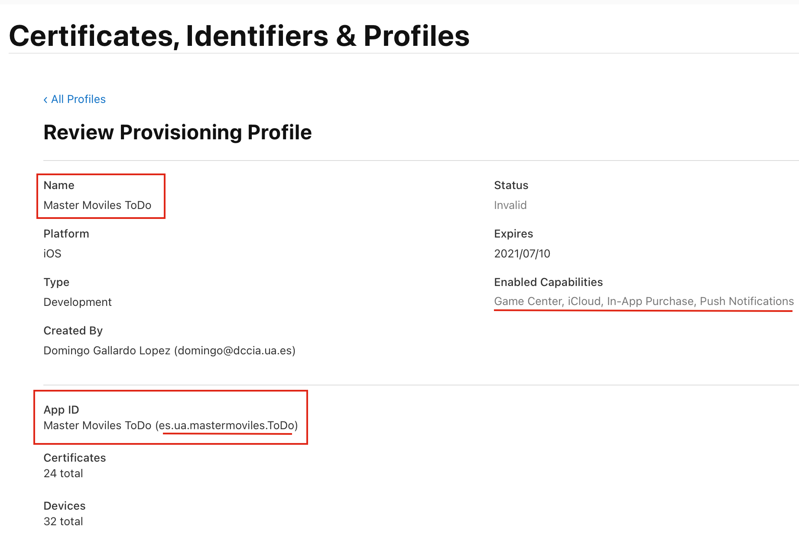

Vemos que el perfil `Master Moviles ToDo` contiene las capacidades
`Game Center`, `iCloud`, `In-App Purchase` y `Push Notifications`. Y
que el App ID autoriza su uso al bundle ID `es.ua.mastermoviles.ToDo`.

Cambiamos el bundle ID de la app a `es.ua.mastermoviles.ToDo`. Ese
mismo identificador puede ser usado por distintos programadores, siempre
que estén en el mismo equipo. En este caso, en el equipo de la UA. 

Descargamos el perfil `Master Moviles ToDo`.

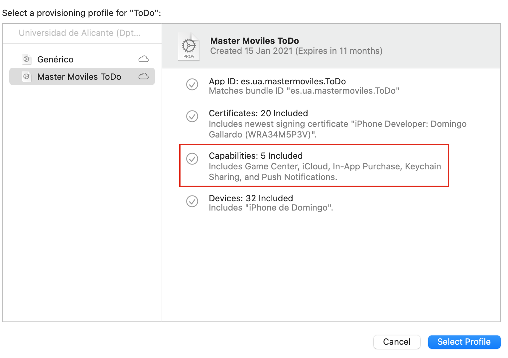

Y podemos comprobar que ahora ya no da ningún error el uso de la
capacidad `Game Center`.

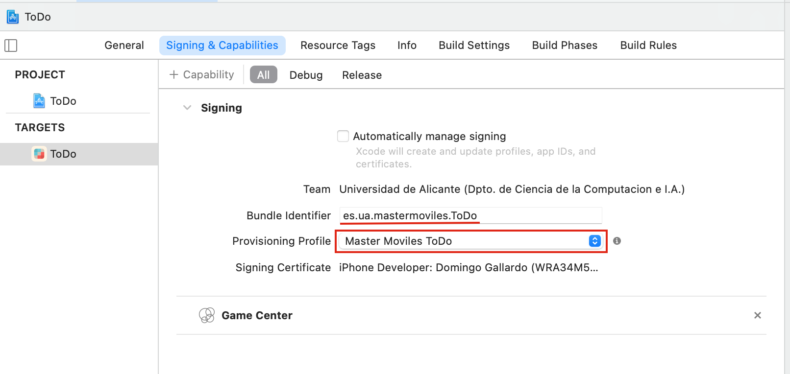

Al exportar la app tenemos que seleccionar manualmente el perfil
correcto:


### Fin de la demo ###

----

## Despliegue de apps en dispositivos de prueba ##

Hemos visto que cuando estamos desarrollando una app podemos
desplegarla en el dispositivo de desarrollo usando Xcode. 

Una vez terminada, y antes de publicarla en la App Store, debemos
distribuirla en dispositivos de usuarios prueba para que realicen
pruebas más extensas.

Es posible hacerlo declarando los dispositivos de prueba en el portal
del desarrollador y añadiéndolos al _perfil de aprovisionamiento_ de
la app. Vamos a ver estos conceptos.

### Características del dispositivo ###

Cuando compilamos una app podemos especificar ciertas características
necesarias que debe tener el dispositivo en el que va a correr la app.


En el apartado _Deployment Info_ de XCode, disponible en la pantalla
_Target > General_ podemos definir:

- Tipo de dispositivo: iPhone, iPad o Mac (utilizando [Mac Catalyst](https://developer.apple.com/documentation/uikit/mac_catalyst))
- Sistema operativo mínimo: versión de OS mínima necesaria de los
  dispositivos en los que se va a instalar nuestra app.
- Características de la interfaz de usuario y de la orientación del dispositivo


### Distribución de apps ###

La forma de distribuir apps en la plataforma iOS es la App Store. Para
enviar una app al App Store es necesario haberse registrado en el
programa de pago de desarrollador de Apple. 

Apple proporciona un **certificado de distribución** necesario para subir
la app al App Store. De esta forma, todas las apps en el App Store han
sido enviadas por una persona o una empresa conocida.

Las apps enviadas son revisadas por Apple para asegurarse de que
funcionan tal y como se describe y que no contiene bugs obvios ni
otros problemas evidentes. Este proceso de curación da a los clientes
confianza en las apps que compran.

### Aprovisionamiento de apps ###

Antes de distribuir la app en el App Store debemos haberla probada en
dispositivos de prueba. 

Apple permite también distribuir apps de forma restringida, declarando
los dispositivos en el portal del desarrollador e incorporándolos en
el **perfil de aprovisionamiento** de la app. Esto solo es posible si
tenemos una cuenta de pago de desarrollador o si estamos en un equipo
con una cuenta. En nuestro caso usaremos la cuenta del programa de
desarrollo de la universidad.

Una vez añadido el perfil de aprovisionamiento a la app, podremos
generar el archivo binario _.ipa_ utilizando los métodos de
distribución denominados _Ad hoc_ y _Development_. Con ambos métodos
de distribución podemos distribuir el app a aquellos dispositivos
incluidos en la lista de dispositivos autorizados del perfil de
aprovisionamiento. Con el segundo método podemos además distribuir la
app a _testers_ de nuestro equipo de desarrollo.

El perfil de aprovisionamiento de la app también incluye las
capacidades declaradas para que la app pueda acceder a servicios de la
plataforma Apple (como almacenamiento iCloud, mapas, compras In-App o
notificaciones push).


### Perfil de aprovisionamiento ###

Un **perfil de aprovisionamiento** (_provisioning profile_) es un fichero
que contiene una colección de datos (claves públicas de certificados,
permisos, UUIDs de dispositivos autorizados, etc.) que conecta
desarrolladores y dispositivos a un equipo de desarrollo autorizado y
que permite que un dispositivo sea utilizado para pruebas.

Un perfil de aprovisionamiento determina básicamente:

- Qué desarrolladores pueden compilar y distribuir un app.
- Qué servicios puede utilizar una app.
- En qué dispositivos se pueden ejecutar la app.

Un perfil de aprovisionamiento contiene los siguientes elementos:


- **App ID**: nombre del perfil, cadena de búsqueda y servicios
  autorizados por el pérfil.
- **Certificados** de desarrolladores del equipo.
- **Dispositivos**: Nombre e identificadores de dispositivos.

Físicamente, los perfiles de aprovisionamiento son ficheros XML
encriptados. Los que usa Xcode se guardan en el directorio
`Library/MobileDevice/Provisioning Profiles`. Podemos acceder a este
directorio desde el terminal o desde el Finder mostrando la carpeta
`Biblioteca` con el menú `Ir + Alt > Biblioteca` (el modificador `Alt`
muestra las opciones ocultas).

Si los borramos de esa
carpeta, **automáticamente se borran de Xcode** (esto es muy útil cuando
tenemos algún problema con los perfiles y queremos empezar de cero).

Es posible consultar su contenido desde el terminal con el comando:

```
security cms -D -i <perfil>.mobileprovision
```


También podemos visualizar su contenido con la vista previa del
Finder:


### Dispositivos de prueba en el perfil de aprovisionamiento ###

El perfil de aprovisionamiento de una app se incluye en el binario de
la app (fichero .ipa) y se instala automáticamente en el dispositivo
cuando se copia la app.

Para que la app se pueda ejecutar en el dispositivo, su UUID debe
estar incluido en la lista de dispositivos autorizados del
perfil. Además se deben cumplir las siguientes condiciones:

- El bundle ID de la app empareja el App ID del perfil.
- Los permisos solicitados por la app están otorgados en el App ID del
perfil.
- La app está firmada por un desarrollador cuya clave pública está en
la perfil de aprovisionamiento.


En combinación con el _bundle ID_, el perfil de aprovisionamiento y
los permisos (_entitlements_) se usan para asegurar que:

- La app ha sido compilada y firmada por nosotros o por un miembro de
  confianza del equipo.
- Las apps firmadas por nosotros o por nuestro equipo se ejecutan sólo en
  dispositivos de desarrollo escogidos.
- Las apps se ejecutan únicamente en los dispositivos de prueba
  que especifiquemos.
- Nuestra app no está usando servicios que no hemos añadido al app.
- Sólo nosotros podemos enviar revisiones del app al _store_.


### Instalación de la app en un dispositivo de prueba  ###

Es posible instalar la app en el iPhone de prueba usando Xcode o
_Apple Configurator 2_.

La aplicación _Apple Configurator 2_ permite configurar dispositivos,
hacer copias de seguridad, añadir apps, etc.


La app se copia en el dispositivo junto con el perfil de
aprovisionamiento (está incluido en el ipa). De esta forma, para
ejecutar la app no es necesario autorizar el perfil del desarrollador.


Podemos instalar también el fichero _ipa_ desde el panel de gestión de
dispositivos de Xcode accesible desde la opción _Window > Devices_.

Allí también podemos comprobar el perfil de aprovisionamiento recién
instalado.

### Ejecución de apps en dispositivos no registrados ###

Existen dos tipos especiales de perfiles de aprovisionamiento que
permiten que cualquier dispositivo (no solo aquellos que están
registrados en el propio perfil) puedan ejecutar una app:

- El _App Store Distribution Provisioning Profile_ que se utiliza para
  poder subir la app al App Store de Apple.
- El _In-house Distribution Provisioning Profile_ que se utiliza para
  poder distribuir una app en la empresa y que debe tener un
  **certificado de empresa** de Apple.


### Certificados de empresa ###

Los certificados de empresa de Apple han sido noticia recientemente
debido a que Apple ha detectado [malas prácticas en su uso por parte de
Facebook y Google](https://www.theverge.com/2019/1/31/18205795/apple-google-blocked-internal-ios-apps-developer-certificate). Como
castigo, Apple ha revocado los certificados durante un par de
días. Durante ese tiempo, las apps _in-house_ de esas compañías han
dejado de funcionar. 

El mal uso de Facebook y Google de estos certificados [ha puesto al
descubierto](https://www.theverge.com/2019/2/20/18232583/apple-ios-developer-enterprise-program-store-mobile-apps)
la existencia de una gran cantidad de sitios que hacen un uso
fraudulento de los certificados de empresa de Apple para distribuir
apps no permitidas en el App Store (de juego o pornografía) como si
fueran apps _in-house_.


----

## Demo y ejercicio ##

### Resumen del flujo de trabajo ###

Vamos a comprobar que es necesario firmar digitalmente la app para
poder ejecutarla en un dispositivo y usar ciertos servicios como
CloudKit, Game Center o compras In-App. Además, veremos que la app
puede ejecutarse en todos aquellos dispositivos que hayamos registrado
y añadido en el perfil de aprovisionamiento usado para firmar la app
(además de en el dispositivo de desarrollo autorizado por Xcode).

Veremos que si seleccionamos la opción de firma automática en Xcode,
Xcode creará estos elementos de forma automática. También
comprobaremos cómo el administrador puede configurar App IDs y
perfiles de aprovisionamiento en la web del equipo de desarrollo de
Apple.

Un resumen de los pasos que vamos a seguir en el ejercicio:

1. Nos damos de alta al equipo de la universidad.
2. El administrador del equipo de la universidad crea un App ID con
   ciertas capacidades y un perfil de aprovisionamiento con ese App
   ID, los dispositivos de prueba y los desarrolladores del equipo.
3. Compilamos la app, añadimos las capacidades necesarias y la firmamos con la cuenta del equipo.
4. Exportamos el fichero .ipa compilado de la app.
5. Instalamos y ejecutamos la app en un dispositivo de prueba.


### Equipo de desarrollo del programa de Universidad ###

La mayoría de opciones en el portal del desarrollador serán sólo accesibles para
consulta. Será el administrador del equipo de la Universidad el que
podrá cambiarlas.

 

Es necesario crear un nuevo certificado para el desarrollador,
distinto del certificado individual. Servirá para firmar aplicaciones
desarrolladas en el equipo en el que se ha añadido al desarrollador.

Se puede hacer desde Xcode, seleccionando el equipo _Universidad de
Alicante_ y la opción _Manage Certificates..._. Será un certificado de
tipo **iOS App Development**.

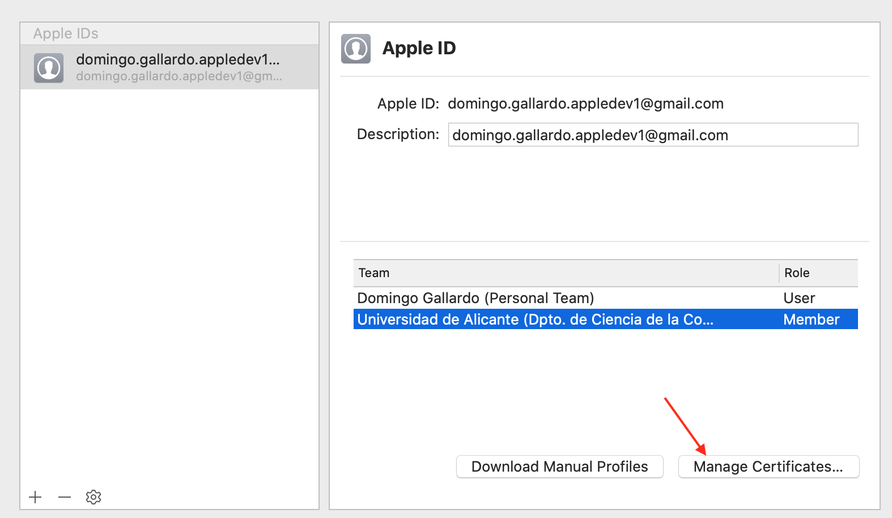 

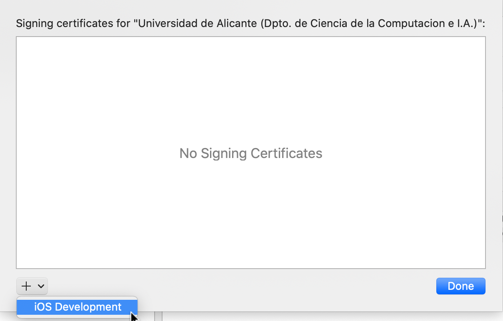

Para confirmar que se ha creado el nuevo certificado, podemos entrar
en el portal del desarrollador o en la aplicación de Acceso a llaveros:
  


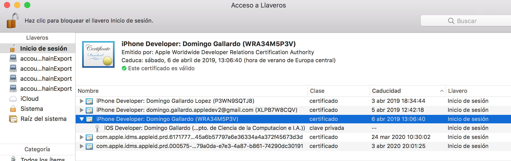


### Incorporación de certificado a un perfil de aprovisionamiento (administrador)  ###

Para poder firmar y distribuir apps el certificado recién creado debe
estar incluido en un perfil de aprovisionamiento compatible con la app
que estamos desarrollando.

Vamos a incorporar los nuevos certificados al perfil de
aprovisionamiento genérico, con App ID comodín (`*`) con el que se
puede compilar cualquier app.

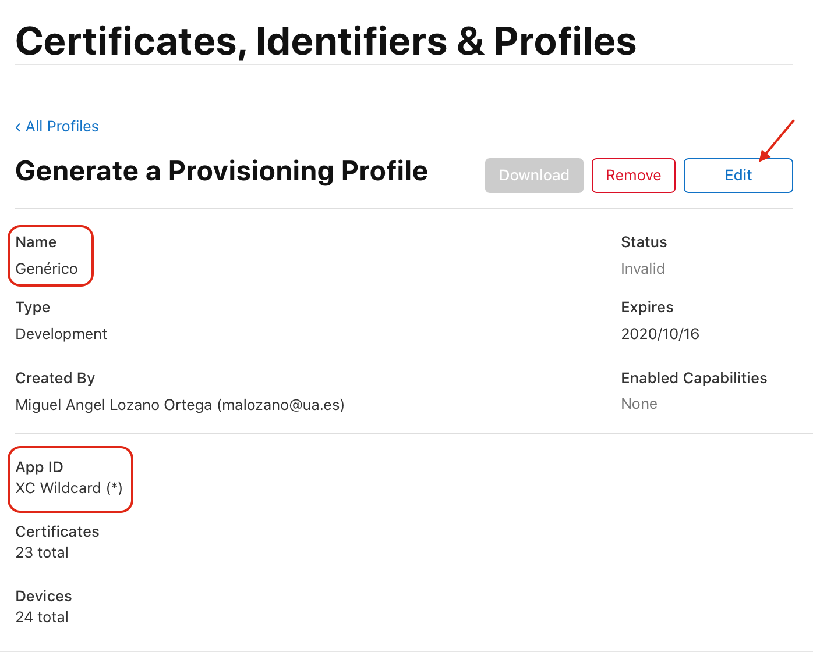

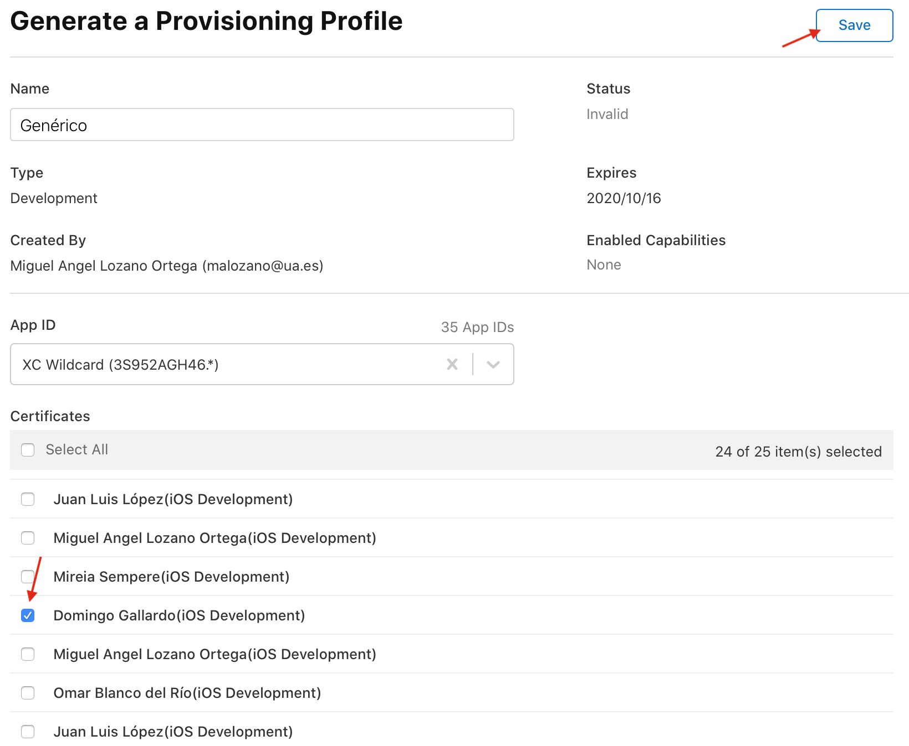

### Firma de la app con el nuevo certificado ###

Para firmar la app con el nuevo certificado **desmarcamos la opción
para que Xcode gestione automáticamente la firma**. De esta forma
podremos gestionar manualmente qué perfil de aprovisionamiento es el
que utilizamos.

Seleccionamos el _team_ Universidad de Alicante. Y escribimos como
_bundle id_ `es.ua.mastermoviles.ToDo`.

En el desplegable _Provisioning Profile_ seleccionamos la opción
_Download Profile..._.

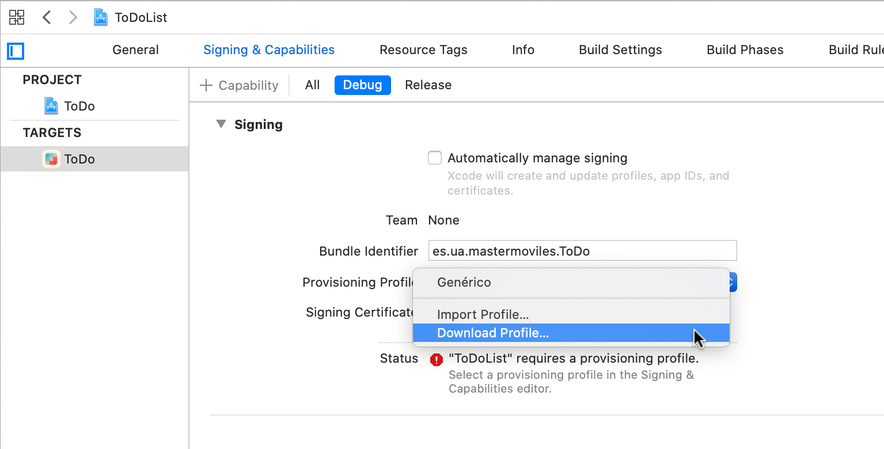

Aparece un listado con todos los perfiles de aprovisionamiento
creados en nuestro equipo en el portal del desarrollador. Podemos
examinarlos y seleccionar el más apropiado. Seleccionamos el
denominado _Genérico_.

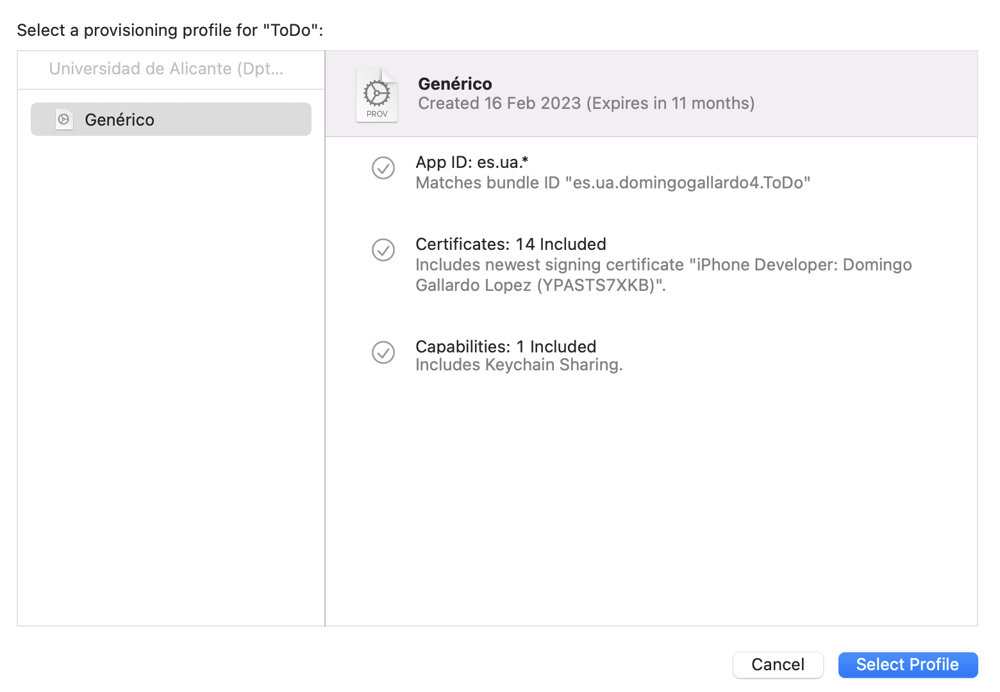

Vemos que se firma la aplicación correctamente y que se añade el
perfil de aprovisionamiento que hemos seleccionado.


La ventaja principal de firmar las apps de esta forma es que podremos
distribuirlas a cualquier dispositivo incluido en el perfil.

Prueba que es posible generar un fichero `.ipa` seleccionando
la opción `Product > Archive`. Para ello debe estar seleccionada la
opción `Generic iOS Device` en el menú de ejecución. Si está
seleccionado un modelo concreto de iPhone la opción Archive se
deshabilita.

### El perfil genérico no tiene configurado ningún servicio ###

Vamos ahora a intentar añadir una _capability_. Por ejemplo,
la de _Game Center_. Lo podemos hacer pulsando en el botón `+ Capability`, 
seleccionando la opción _Game Center_. 

Intentamos compilar la app (_Product > Build_) y aparecerá el
siguiente error:

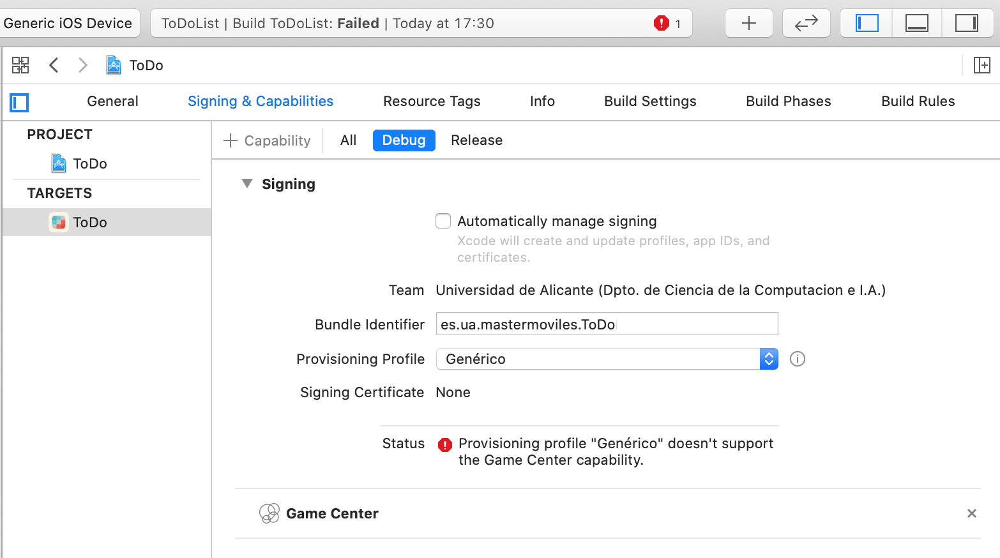

El error se debe a que el perfil de aprovisionamiento seleccionado no
soporta la capacidad _Game Center_.

Es el **administrador de la cuenta** de la UA el que debe crear un
perfil de aprovisionamiento para la app en el portal del desarrollador
e incorporar en ese perfil el certificado del desarrollador.

### Examinamos los perfiles de aprovisionamiento ###


Podemos examinar los perfiles de aprovisionamiento desde el portal del
desarrollador, desde Xcode y desde el terminal o el Finder (en el
directorio `Library/MobileDevice/Provisioning Profiles`). Podemos
acceder a la carpeta `Library` desde el Finder con el menú `Ir + Alt >
Biblioteca` (el modificador `Alt` muestra las opciones ocultas). Si
borramos los perfiles de esa carpeta, **automáticamente se borran de
Xcode** (esto es muy útil cuando tenemos algún problema con los
perfiles y queremos empezar de cero).

En el portal del desarrollador tenemos que entrar en la opción
_Certificates, Identifiers and Profiles_ para entrar en la página de
gestión de los perfiles de aprovisionamiento.


### Menú de opciones ###

El portal del desarrollador contiene todos los perfiles de
aprovisionamiento creados, junto con la información asociada.

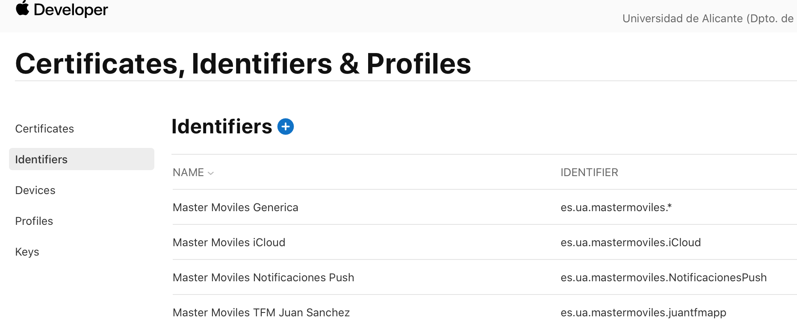

- **Certificados**: todos los certificados de los desarrolladores del
  equipo.
- **Identificadores**: todos los App IDs aprobados, con las
  características aprobadas en cada uno de ellos.
- **Dispositivos**: todos los dispositivos aprobados para probar las
  apps


### Creación de un App ID desde el portal del desarrollador (administrador) ###

Sólo se puede hacer con el rol administrador. Se pulsa `+` en la
cabecera _Identifiers_. Se selecciona la opción _Register a New
Identifier_ y se escoge la opción _App IDs_. Vemos que hay otros
posibles identificadores que podemos crear.

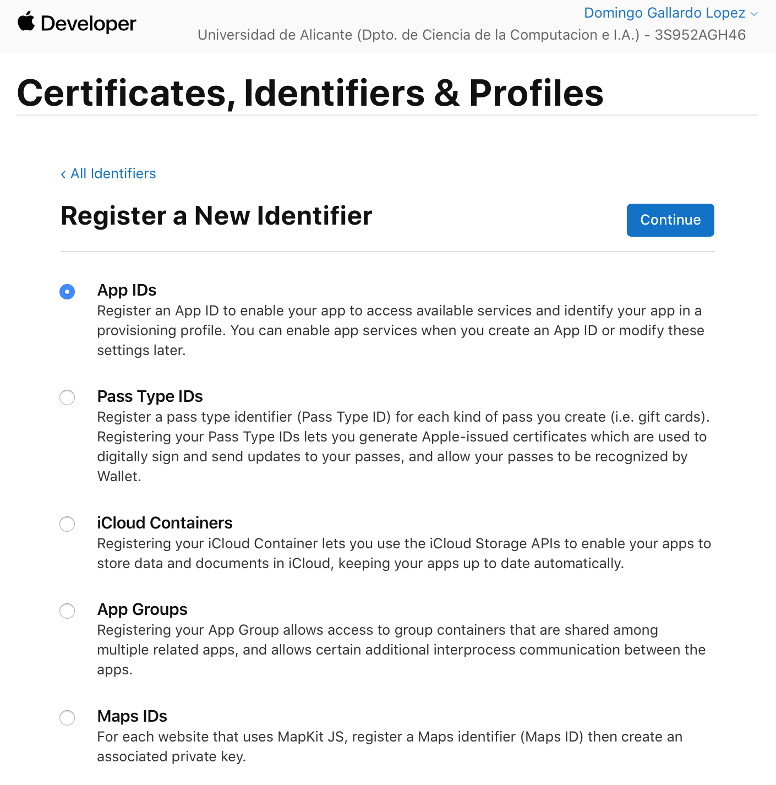

Se define la descripción del App ID y el prefijo de App ID (que debe
emparejar con el _bundle id_ de la aplicación). Se escoge la opción
_Explicit_ para indicar que no se va a usar un prefijo con comodín. La
app deberá tener exactamente el _bundle id_
`es.ua.mastermoviles.ToDo` para poder aplicarse el App ID.


Se puede comprueba que la _capability_ _Game Center_ ya está
seleccionada por defecto.


Confirmamos y el _App Id_ queda registrado en el portal del
desarrollador:


Una vez creado el _App Id_ en el que definimos las capacidades del
app, podemos pasar a añadir los dispositivos en los que vamos a
permitir probar el app. Y, por último, crearemos un perfil de
aprovisionamiento que contenga el _App Id_ y los dispositivos y que se
descargará la app.


### Dispositivos (administrador) ###

Para añadir un dispositivo al portal del desarrollador hay que
seleccionar la opción correspondientes (_Devices_) y añadir su UDID,
_Unique Device Identifier_.


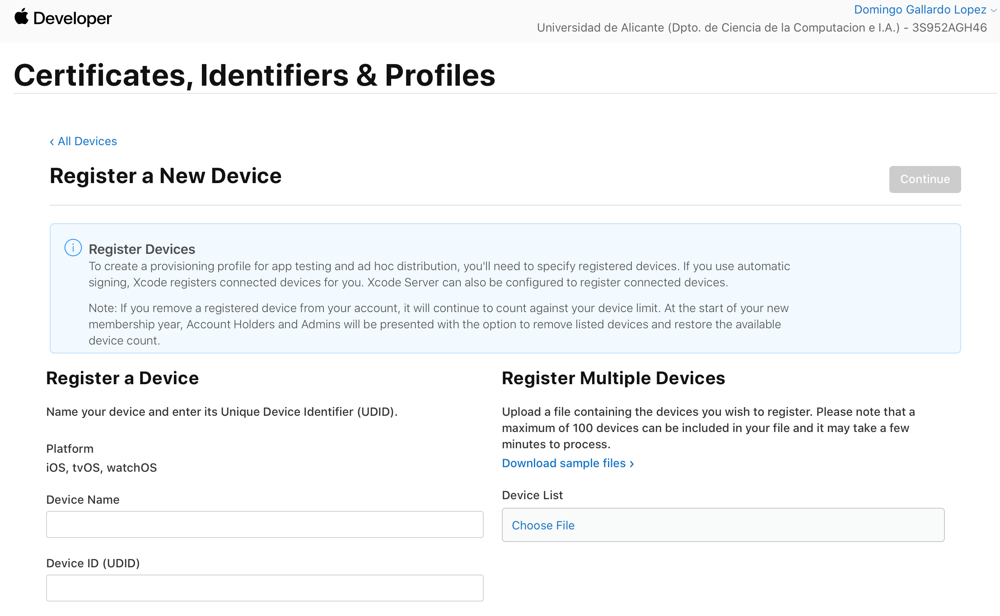

El UDID es una cadena de 40 caracteres de símbolos alfanuméricos (a-z
y 0-9) única de cada dispositivo. Se puede obtener desde Xcode en la
pantalla de Dispositivos (_Window > Devices_).

Se pueden registrar en el portal del desarrollador hasta 200 UDIDs para
probar aplicaciones en desarrollo.

### Creación de perfiles de aprovisionamento (administrador) ###

Una vez creado el App ID con los permisos necesarios, añadidos los
certificados de los desarrolladores del equipo y añadidos los
dispositivos es posible crear un nuevo perfil de aprovisionamiento.

Se puede hacer desde el portal del desarrollador y también desde Xcode. Es más
claro ver el proceso desde portal del desarrollador, ya que Xcode mezcla el
proceso de creación del perfil con el de dar autorizaciones
(_entitlements_) a la propia aplicación.

Para crear un nuevo perfil de aprovisionamiento desde el portal del
desarrollador, se selecciona la opción _iOS App Development_.


Se selecciona el _App ID_ que queremos incluir en el perfil:


Se seleccionan los certificados de los desarrolladores a los que van
a utilizar este perfil para compilar apps en Xcode:

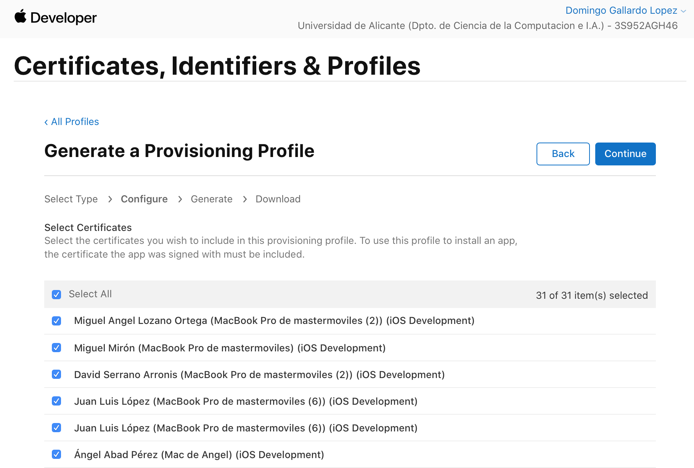

Se seleccionan los dispositivos en los que vamos a poder probar la app:


Por último se da un nombre al perfil de aprovisionamiento:

 

Y aparece una pantalla con el resumen del perfil generado. Se puede
descargar en el ordenador para después añadirlo manualmente a
la app usando Xcode. También se puede descargar directamente desde
Xcode.

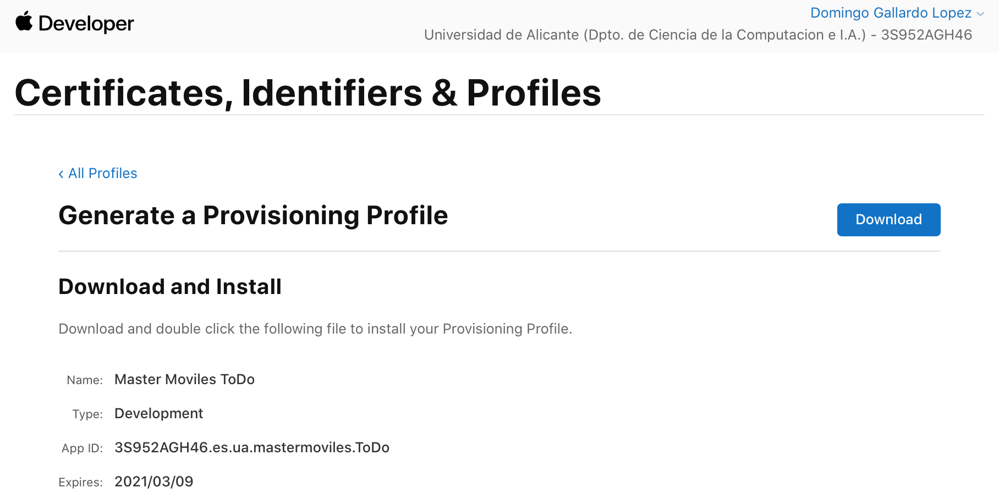 

Listado de los perfiles de aprovisionamiento creados en el portal de
desarrolladores:

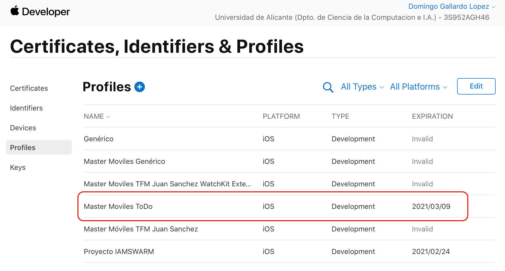


### Firma de la app ToDo con el perfil de aprovisionamiento creado ###

Una vez creado el perfil de aprovisionamiento ya es posible instalarlo
en la app. 

Igual que antes nos aseguramos de que tenemos activa la opción manual
y volvemos a seleccionar _Download Profile..._. Veremos ahora que ha
aparecido el perfil que el administrador ha añadido. Lo
seleccionamos:

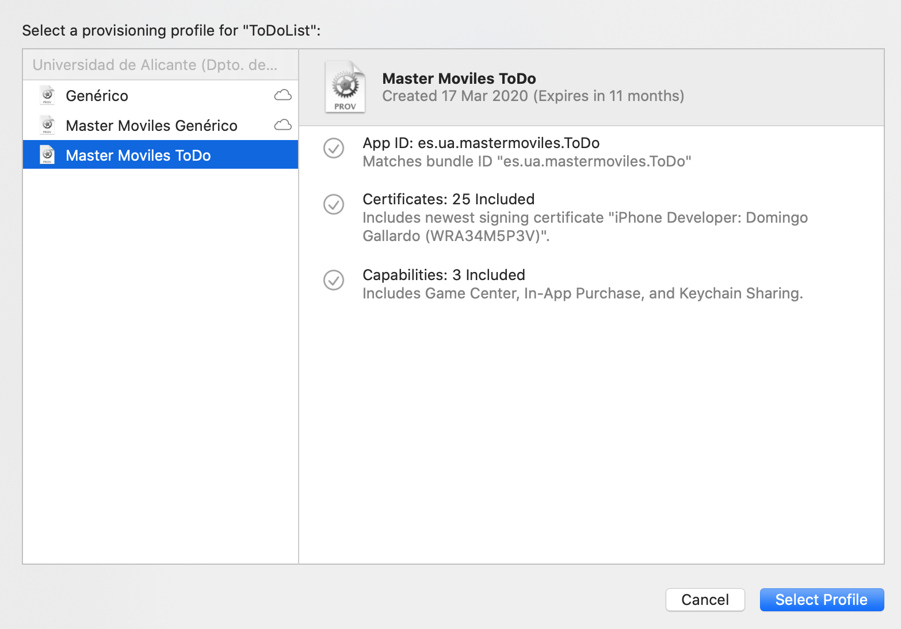 

Y ahora ya podemos ver que desparece el error anterior porque el nuevo
perfil ya tiene la capacidad _Game Center_.

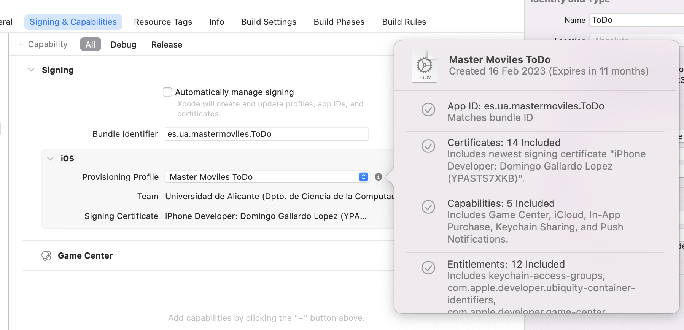 


### Exportar la app  ###

Seleccionando en Xcode la opción _Product > Archive_ (hay que
asegurarse de que el tipo de dispositivo seleccionado es _Generic iOS
Device_) ahora ya funcionará la opción _Distribute App_.


Las opciones _App Store_ y _Ad Hoc_ no funcionan por no tener una
cuenta de universidad permisos para subir apps al App Store. Se puede
hacer con una cuenta de pago. En la opción _Ad Hoc_ es posible definir
una URL privada para descargar la app y probarla.

La única opción de exportación que funciona es _Development_, que
permite distribuir la app a cualquier dispositivo incluido en el
perfil de aprovisionamiento.


La opción de `App Thining` permite generar distintos ficheros _ipa_
adaptados a cada tipo de dispositivo, lo que minimiza el tamaño del
fichero. Si no se selecciona, se genera un único fichero _ipa_ que
puede ejecutarse en cualquier dispositivo.

Seleccionamos el perfil de aprovisionamiento que acabamos de crear
`Master Moviles ToDo`.

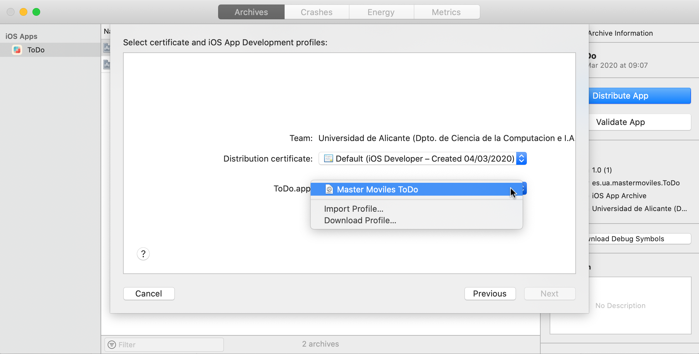

Y, por último, confirmamos la opción de exportar:

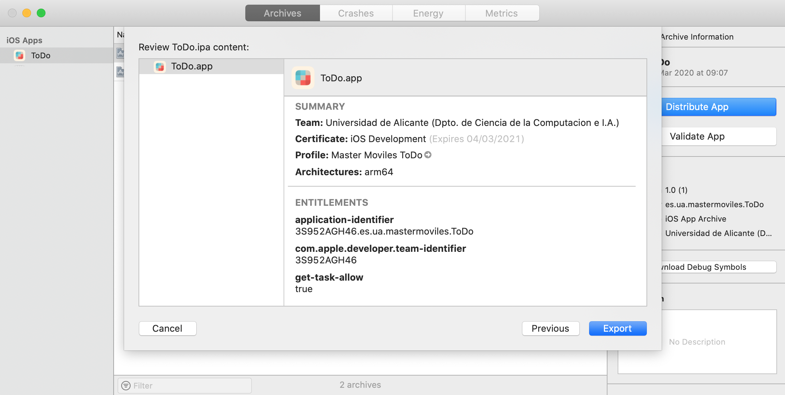

Tarda un rato en generar el fichero _ipa_ (_iOS App file_).

Se genera una carpeta con un fichero `ToDo.ipa`, que es un binario que
se puede instalar sólo en dispositivos autorizados en el perfil de
aprovisionamiento.
  
### Instalación y ejecución de la app ###

Probamos a instalar la app en un dispositivo autorizado usando Apple
Configurator 2.


### Fin demo y ejercicio ###

----


## Distribución e instalación de betas online ##

Hemos visto que es posible ejecutar apps de prueba en dispositivos que
estén dados de alta en el perfil de aprovisionamiento. 

Pero la instalación de la app es un proceso algo tedioso: hay que
conectar físicamente el dispositivo a un ordenador Mac y realizar la
instalación mediante una aplicación auxiliar como Xcode o Apple
Configurator 2.

Sería mucho más fácil si permitiéramos instalar la app desde el propio
dispositivo (iPhone o iPad), descargándola de una web o de alguna app
de configuración.

Esto es lo que se consigue con la aplicación TestFlight de Apple.

Puedes encontrar más información sobre TestFlight en [este
enlace](https://developer.apple.com/testflight/). Lo utilizarás cuando
desarrolles y publiques apps de iOS usando el perfil de pago.

Existe una solución intermedia: seguir usando la distribución al
equipo de desarrollo mediante el alta de los dispositivos en el pefil
de aprovisionamiento, pero usar un servicio que facilite la
instalación de la app en esos dispositivos. Esta es una funcionalidad
que proporciona Firebase de Google.

### TestFlight ###


TestFlight es una plataforma integrada en App Store Connect que permite
distribuir versiones beta de apps a probadores.

Es posible distribuir la app hasta 25 probadores internos
(seleccionados de entre los usuarios de la cuenta de App Store Connect) y
hasta 10.000 probadores externos.

Los usuarios de prueba deben descargarse la **app TestFlight** con la
que gestionarán la descarga de las pruebas en sus dispositivos.

### Firebase para distribuir apps ###

[Firebase](https://firebase.google.com) permite distribuir apps compiladas (ficheros .ipa) y
ejecutarlas en aquellos dispositivos que están registrados en el
perfil de aprovisionamiento. La funcionalidad se denomina `App
Distribution` y permite distribuir distintas versiones de una misma
app a usuarios de prueba.


Podemos añadir usuarios de prueba o crear un enlace al que puede
acceder cualquiera para introducir su correo electrónico. El usuario
de prueba recibe un correo electrónico con instrucciones de cómo
descargar la app.

Al aceptar las instrucciones, el sistema comparte el UUID del
dispositivo con nosotros y podemos añadir el dispositivo al perfil de
aprovisionamiento. El usuario de prueba debe añadir el perfil de
Firebase a su dispositivo.

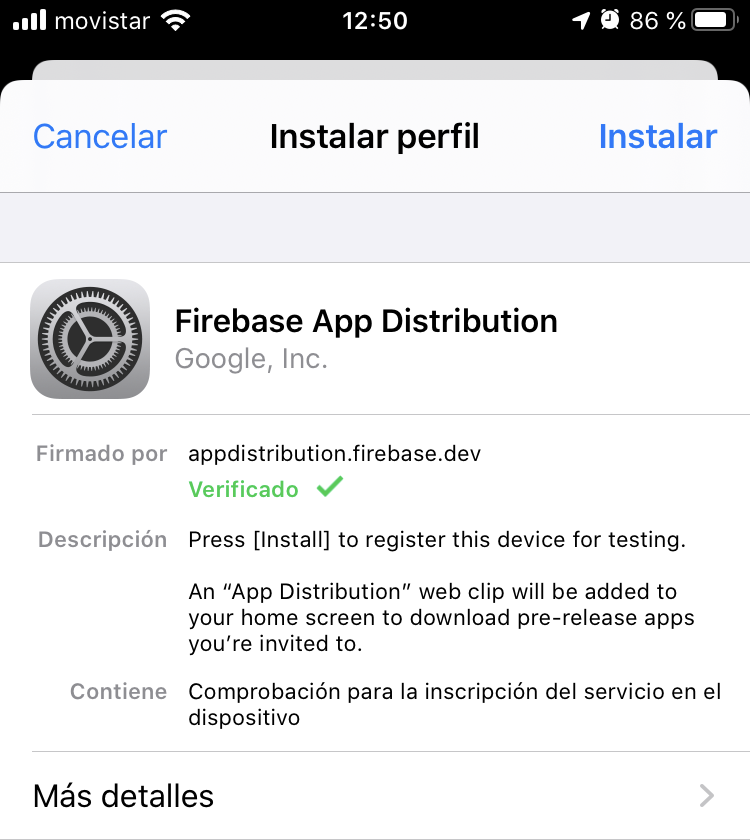

Una vez hemos añadido el UUID al perfil de aprovisionamiento, lo
añadimos a la app y volvemos a distribuirla. El sistema enviará un
correo al usuario, y éste podrá descargar y probar la app.


Por último, Firebase permite también incluir en la app el servicio de
de Google Analytics con el que podemos comprobar una gran cantidad de
opciones relacionadas con el uso del app.


<!--

## Test Flight ##

### Distribución de apps ###

El proceso de distribución de apps en el App Store es el siguiente:


### App Store Connect ###


App Store Connect es el servicio de Apple con el que los
desarrolladores pueden organizar:

- Todas sus apps para poder enviar a prueba versiones beta y subirlas
  al App Store.
- Toda la información legal y de impuestos.
- Información sobre el estado de los productos, retroalimentación
  e información de descargas, ventas y ganancias.

La plataforma está accesible desde el portal del desarrollador en los
programas de pago. No está disponible en el programa de universidad.

También se puede acceder desde la URL
[https://appstoreconnect.apple.com](https://appstoreconnect.apple.com). 

!!! Note "Nota"
    Hasta el año 2018 **iTunes Connect** era la plataforma única
    a la que se subían todos los productos para su distribución (apps,
    ebooks, podcasts, música). A mediados del 2018 Apple divide en dos
    esa plataforma, creando **App Store Connect** para gestionar
    únicamente apps. 
    
    Hemos conservado algunas imágenes del curso pasado en el caso en
    sean muy similares a las actuales. En estas imágenes aparece la
    cabecera _iTunes Connect_ en lugar de _App Store Connect_.

### Pasos para subir una app al App Store desde App Store Connect ###

1. Crear un registro en App Store Connect, un identificador único para el
   app.
2. Subir una compilación de la app.
3. Pruebas Beta: probar la app con usuarios de la organización o
   usuarios invitados, usando **Test Flight**.
4. Completar toda la información y enviar la app a revisión de la App Store.
5. Una vez que ha superado la revisión, la app se pone a la venta en
   la App Store.
6. Analizar analíticas de la app (de ventas, de uso, etc.) y
   desarrollar una nueva versión.

### Añadir información de la App ###

Antes de subir una app a App Store Connect, hay que crear un registro de la
misma indicando un identificador único (SKU) que puede ser el propio
_bundle ID_ y seleccionando el App ID.


### Subir una compilación de la app ###

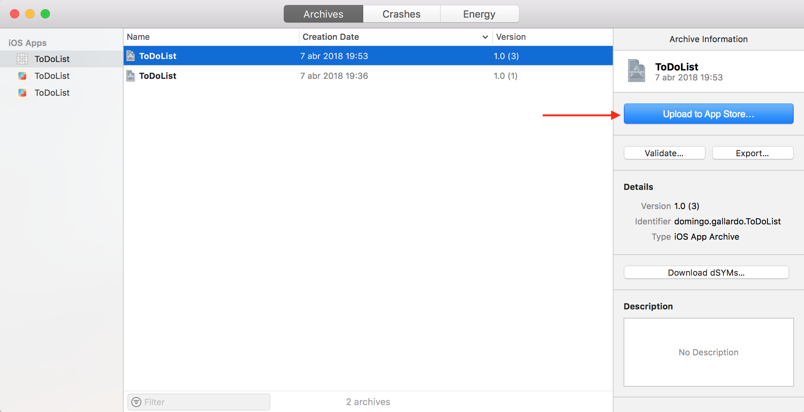

La forma más sencilla de subir una app a App Store Connect es
utilizando Xcode.

Debes crear un archivo ipa con la opción **_Product > Archive_** y
seleccionar la opción _Upload to App Store_.

Es posible subir distintos _builds_ y gestionarlos todos desde App
Store Connect. El identificador de la app es su _bundle id_.


### Diseño de la página en el App Store ###

En el App Store se muestra distinta información sobre la app. Es
importante diseñar bien esta página para que sea atractiva para los
usuarios y estén interesados en descargar la app.


App Store Connect se usa para gestionar estos los elementos necesarios
para crear la página de la app en el App Store: nombre de la App,
iconos, previsualizaciones (pantallas y vídeos), descripción,
novedades, palabras claves y categorías.


### Nuevos usuarios App Store Connect ###

Es posible **añadir usuarios** a la cuenta de App Store Connect. Son
usuarios que van a poder trabajar con las apps subidas, realizando
funciones limitadas por su función.

No es necesario tener una cuenta de organización para poder añadir
usuarios colaboradores en App Store Connect. Es posible en cuentas de
desarrollador individual.

Los usuarios añadidos podrán ser **probadores internos** en TestFlight.


### TestFlight ###


TestFlight es una plataforma integrada en App Store Connect que permite
distribuir versiones beta de apps a probadores.

Es posible distribuir la app hasta 25 probadores internos
(seleccionados de entre los usuarios de la cuenta de App Store Connect) y
hasta 10.000 probadores externos.

Los usuarios de prueba deben descargarse la **app TestFlight** con la
que gestionarán la descarga de las pruebas en sus dispositivos.

### Aprobación de pruebas externas ###

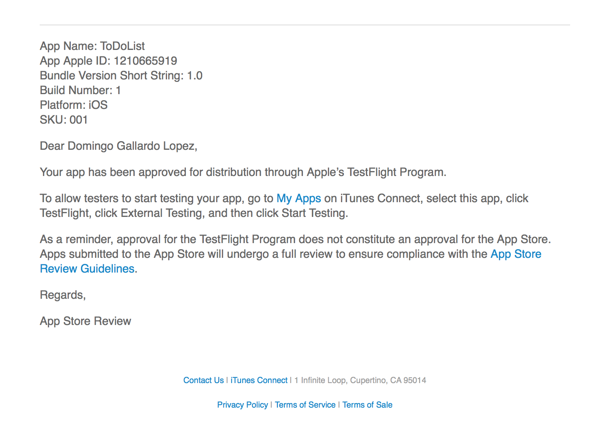

Una vez subida a App Store Connect la app entra automáticamente en un
proceso de aprobación para que se pueda distribuir **externamente**
una versión beta en TestFlight.

La aprobación suele tardar menos de 1 día la primera compilación y ser
casi instantánea cada nueva compilación que se sube.

No es necesaria aprobación para la distribución de pruebas internas.


### TestFlight en App Store Connect ###

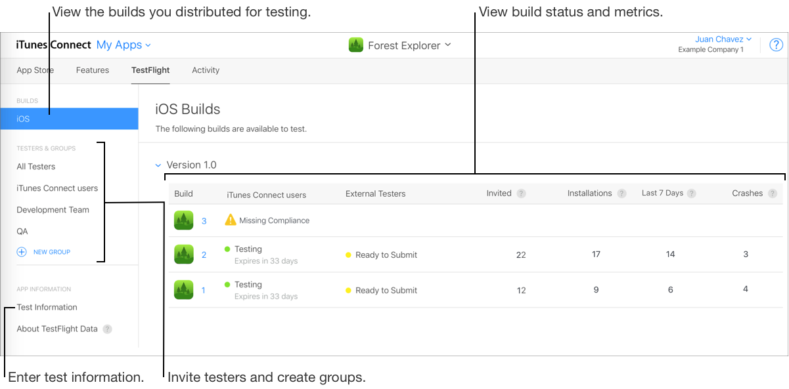

----

## Demo ##

Vamos a comprobar el funcionamiento de TestFlight, subiendo la app
ToDo, añadiendo probadores y comprobando la instalación de la app
en los probadores.

### Registro de una app en App Store Connect ###

Registramos la app en App Store Connect.


### Subida a App Store Connect con Xcode ###

Una vez creado el registro de la app ya es posible subirla desde
Xcode.


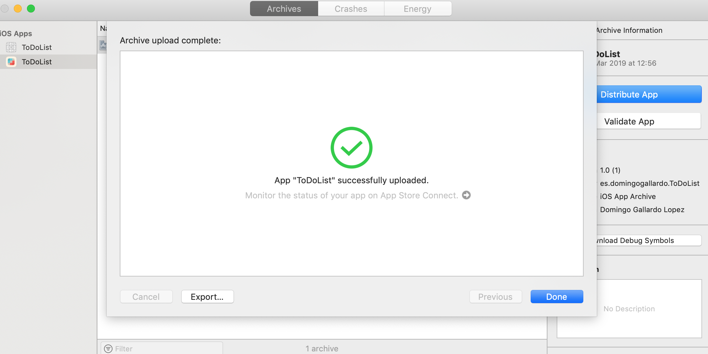

### Compilaciones listas para probar ###

Una vez que se ha subido a App Store Connect y ha pasado un tiempo
necesario para que la plataforma prueba que la app puede ser
distribuida para pruebas, aparecerá con un indicador verde lista para
probar. 


Los números de versión y de compilación (_build_) son los definidos
en Xcode.

Ahora la app está lista para que sea probada por los usuarios de
prueba internos. Podemos seleccionar la compilación a distribuir.


### Añadir probadores externos y enlace de prueba ###

Podemos también añadir usuarios de prueba externos y un enlace de
prueba que puede ser usado por cualquiera. Para ello es necesario
crear un grupo de prueba y volver a solicitar una autorización de
envío a pruebas de la app.


Debe pasar un tiempo para App Store Connect apruebe la distribución de
prueba. Mientras tanto la compilación seleccionada aparecerá en estado
_Pendiente de revisión_.


Una vez aprobada la distribución es posible crear un enlace para que
cualquiera la pueda instalar y probar.


### TestFlight en los usuarios ###

Los usuarios de prueba reciben un correo avisándoles de que la beta
está disponible.


Deben instalar la app TestFlight y en la app aparecerá un botón que
permitirá instalar la app en el dispositivo. 

En este caso no es necesario que el dispositivo esté en la lista
incluida en el perfil de aprovisionamiento, porque la app está
autorizada por Apple para su ejecución en cualquier dispositivo.


### Nuevas compilaciones ###

Cuando subimos desde Xcode una nueva compilación, debemos entrar en
el enlace de la compilación para activar la nueva prueba.

TestFlight enviará una notificación automáticamente a todos los
usuarios para que descarguen la nueva versión.


----
-->

## Bibliografía

- [Developer Account Help](https://help.apple.com/developer-account/)
- [Code Signing Help](https://developer.apple.com/support/code-signing/)
- [Xcode Help](https://help.apple.com/xcode/)
- [Distribute your app to registered devices](https://help.apple.com/xcode/mac/current/#/dev7ccaf4d3c)
- [Distribute your  app](https://help.apple.com/xcode/mac/current/#/dev8b4250b57)
- [App Store Connect Help](https://help.apple.com/app-store-connect/)
- [Distribución de apps con Firebase](https://firebase.google.com/docs/app-distribution/ios/distribute-console?authuser=0)
- [Google Analytics](https://firebase.google.com/docs/analytics?authuser=0)
- [Test Flight](https://developer.apple.com/testflight/)

