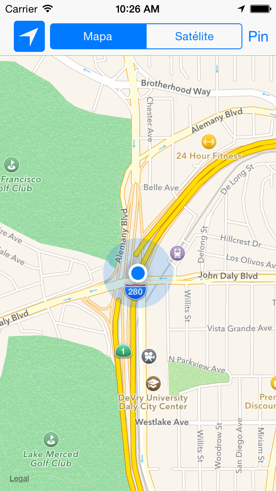
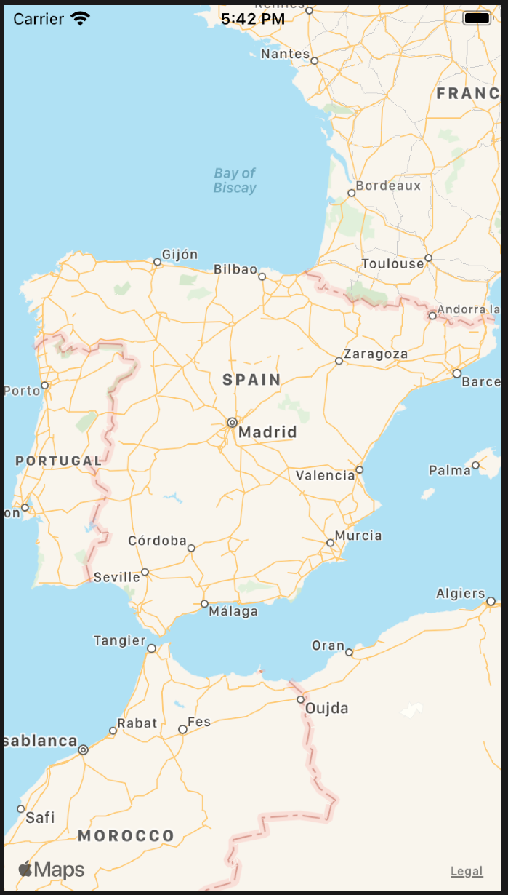
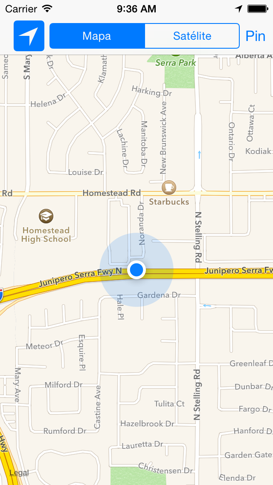

<!--
Terminan la práctica en unas 1,5 horas + 1 hora de explicación = 2,5 horas
-->


# Mapas y localización

## MapKit ##

### Aspectos básicos de MapKit

[Map Kit](https://developer.apple.com/library/ios/documentation/MapKit/Reference/MapKit_Framework_Reference/)
es el framework de Apple para trabajar con mapas.

Permite muchas funcionalidades: pan y zoom, anotaciones, localización,
overlays, búsquedas, rutas, direcciones, etc.

Junto con los servicios de localización proporciona la forma de
incluir datos geográficos en nuestras apps.

<p style="text-align:center;">
 

</p>


Los mapas permiten a los usuarios a visualizar datos geográficos de
una forma fácil de entender. Por ejemplo, un mapa puede mostrar datos
de satélite de un área, o una visualización tridimensional de una
perspectiva de la zona.

El framework Map Kit permite embeber en tu app un map completamente
funcional, que soporta funcionalidades similares a la de la app
`Mapas`.

Con Map Kit puedes incorporar en tu app vistas de un punto geográfico
concreto. Además, el framework te permite añadir capas de información
sobre el mapa, moverlo, o tomar instantáneas de un mapa para imprimir.

Un ejemplo de la app `Mapas` mostrando una vista 3D de Alicante:

<p style="margin-top:20px; text-align:center;">

</p>


### Geometría de los mapas

<p style="text-align:center;">

</p>

Map Kit usa una proyección Mercator, que es un tipo específico de
proyección cilíndrica.

Una coordenada se define por una **latitud** y una **longitud**.

- La **latitud** es la distancia angular (en grados: de -90.0 a 90.0)
desde el punto de la superficie hasta el ecuador. Las latitudes
positivas definen puntos por encima del ecuador y las negativas por
debajo.

- La **longitud** es la distancia angular (en grados: de -180.0 a
180.0) desde el punto de la superficie hasta el meridiano 0
(meridianto de Greenwich). Las longitudes positivas definen puntos al
este del meridiano y las negativas al oeste.

La estructura
[`CLLocationCoordinate2D`](https://developer.apple.com/reference/corelocation/cllocationcoordinate2d)
representa esta estructura. Por ejemplo, para crear una localización
situada en Alicante:

```swift
let alicanteLocation =  CLLocationCoordinate2D(latitude: 38.3453, 
                                               longitude: -0.4831)
```


Un _punto en el mapa_ se define por los valores `x` e `y` en la
proyección de Mercator. Se define utilizando la estructura
[`MKMapPoint`](https://developer.apple.com/library/ios/documentation/MapKit/Reference/MapKitDataTypesReference/index.html#//apple_ref/c/tdef/MKMapPoint). Se
utiliza para especificar la posición y forma de los _overlays_ que
podemos pintar sobre el mapa.

<p style="text-align:center;">

</p>

Un _punto_ es una unidad gráfica asociada con el sistema de
coordenadas de una vista. Los puntos en el mapa y las coordenadas
deben convertirse en puntos antes de dibujar contenido en una
vista. Los puntos individuales se definen usando la estructura
`CGPoint` y las áreas usando `CGSize` y `CGRect`. Consultar las
funciones del API de geometría y los tipos de datos en [este
enlace](https://developer.apple.com/library/ios/documentation/GraphicsImaging/Reference/CGGeometry/index.html).

Para almacenar los datos en ficheros es preferible usar coordenadas
de mapas.

### Añadir un mapa en nuestra app

Para poder distribuir apps que trabajen con el servicio de mapas es
necesario activar en la app el _entitlement_ correspondiente,
activando los servicios que necesitamos. Debemos tener un perfil de
aprovisionamiento aprobado con un App ID que soporte estos servicios.

<p style="text-align:center;">

</p>

No es necesario para el desarrollo y para las pruebas en el
simulador. No utilizaremos por tanto ningún perfil de
aprovisionamiento especial para la práctica.

La clase
[`MKMapView`](https://developer.apple.com/reference/mapkit/mkmapview)
es una interfaz autocontenida para presentar los mapas en tu
app. Proporciona todo el soporte para mostrar los datos del mapa,
gestionar las interacciones del usuario y hospedar el contenido
proporcionado por tu app. Debes importar `MapKit`.

No debes hacer una subclase de `MKMapView` sino embeberla tal cual en
la jerarquía de vistas de tu app:

- Usando el _Interface Builder_ puedes arrastrar un objeto _Map
  view_ a la vista o ventana apropiada.
- Para añadir un mapa por programa, crea una instancia de la clase
  `MKMapView`, inicialízala con el método
  [`initWithFrame:`](https://developer.apple.com/library/ios/documentation/UIKit/Reference/UIView_Class/index.html#//apple_ref/occ/instm/UIView/initWithFrame:)
  y añádela como una subvista a tu ventana o a tu vista.

Por último debes actualizar el delegado con un objeto que cumpla
el protocolo
[`MKMapViewDelegate`](https://developer.apple.com/reference/mapkit/mkmapviewdelegate).

Ejemplo de código para añadir un mapa mediante programa:

```swift
import UIKit
import MapKit

class ViewController: UIViewController, MKMapViewDelegate {

    override func viewDidLoad() {
        super.viewDidLoad()
        let map = MKMapView(frame:
            CGRect(x: 0, y: 30, width: self.view.frame.width, height: 200))
        self.view.addSubview(map)
        map.delegate = self
    }

    override func didReceiveMemoryWarning() {
        super.didReceiveMemoryWarning()
    }
}
```

El resultado tiene el siguiente aspecto:

<p style="text-align:center;">

</p>


### Inicialización del mapa

Podemos también inicializar el mapa cuando se crea usando el
_Interface Builder_, usando un `didSet` en el _outlet_ `mapView` que
definimos arrastrando desde el _storyboard_:

```swift
class ViewController: UIViewController, MKMapViewDelegate  {

    override func viewDidLoad() {
        super.viewDidLoad()
        // Do any additional setup after loading the view.
    }

    @IBOutlet weak var mapView: MKMapView! {
        didSet {
            mapView.mapType = .standard
            mapView.delegate = self
            let alicanteLocation = 
                CLLocationCoordinate2D(latitude: 38.3453, 
                                       longitude: -0.4831)
            let initialLocation = 
                CLLocation(latitude: alicanteLocation.latitude,
                           longitude: alicanteLocation.longitude)
            centerMapOnLocation(mapView: mapView, loc: initialLocation)
        }
    }

    func centerMapOnLocation(mapView: MKMapView, loc: CLLocation) {
        let regionRadius: CLLocationDistance = 1000
        let coordinateRegion = 
            MKCoordinateRegionMakeWithDistance(loc.coordinate,
                           regionRadius * 4.0, regionRadius * 4.0)
        mapView.setRegion(coordinateRegion, animated: true)
    }
    
    ...
}
```

Para que los controles del mapa funcionen correctamente es necesario
asignar el delegado `MKMapViewDelegate`a un objeto que defina las
funciones de este delegado. Lo más sencillo es definir el propio `View
Controller` como el delegado.

La propiedad `region` del mapa controla el área del mapa
mostrada. Contiene al mismo tiempo el punto de longitud y latitud en
el que el mapa está centrado y la zona visible, determinando de forma
implícita el zoom del mapa.

Por ejemplo, el código anterior centra el mapa en Alicante y muestra
una zona de 4 km. de alto y ancho.

    
### Tipos de mapas

La definición del tipo de mapa se controla con la propiedad
`mapType` del mapa.

Puede tener los valores:

```swift
enum MKMapType : UInt {
    case standard
    case satellite
    case hybrid
}
```


### Ejemplo de selección del tipo de mapa con un `SegmentedControl`

Supongamos un `SegmentedControl` con los valores `Mapa` y
`Satélite`. Podemos cambiar la visualización del mapa en la acción
definida en el _View Controller_ que contiene el `mapView`:

```swift
enum TipoMapa: Int {
    case mapa = 0
    case satelite
}

...

// En el ViewController

@IBAction func seleccion(sender: UISegmentedControl) {
    let tipoMapa = TipoMapa(rawValue: sender.selectedSegmentIndex)!
    switch (tipoMapa) {
        case .mapa:
            mapView.mapType = MKMapType.standard
        case .satelite:
            mapView.mapType = MKMapType.satellite
    }
}
```


### Uso del delegado

Hemos visto que Lo más sencillo es definir como delegado el _view
controller_ en el que se incluye el mapa.

El objeto delegado puede implementar las funciones del protocolo
[`MKMapViewDelegate`](https://developer.apple.com/library/ios/documentation/MapKit/Reference/MKMapViewDelegate_Protocol/index.html#//apple_ref/occ/intf/MKMapViewDelegate)
donde recibe los eventos relacionados con el mapa:

- Cambios en la región visible del mapa.
- La carga de zonas del mapa de la red.
- Cambios en la localización del usuario.
- Cambios asociados con anotaciones y overlys.

Por ejemplo:

```swift
func mapView(_ mapView: MKMapView, regionDidChangeAnimated animated: Bool) {
    print("Cambiada la posición del mapa: \(mapView.centerCoordinate)")
}
```


### Anotaciones

Las anotaciones permiten resaltar coordenadas específicas del mapa y
proporcionar información adicional sobre ellas.

Puedes usar anotaciones para resaltar direcciones, puntos de interés
y otros tipos de destinos.

Cuando se muestran en el mapa, las anotaciones tienen algún tipo de
imagen para identificar su localización y también pueden tener un
bocadillo (_callout_) que proporciona información y enlaces hacia más
contenido.

En la imagen se muestra una vista estándar en forma de chincheta para
marcar un lugar y un _callout_ que muestra más información.

<p style="text-align:center;">

</p>


### Clases relacionadas

Para mostrar una anotación en un mapa necesitamos dos objetos:

- Un **objeto `annotation`**, que es un objeto que cumple el
    protocolo
    [`MKAnnotation`](https://developer.apple.com/reference/mapkit/mkannotation)
    y que gestiona los datos de la anotación.

- Una **vista** de la anotación, que es una vista (derivada de la
    clase [`MKAnnotationView`](https://developer.apple.com/reference/mapkit/mkannotationview))
    usada para dibujar la representación visual de la anotación sobre
    la superficie del mapa (una "chincheta" por defecto).


### El protocolo `MKAnnotation`

El protocolo `MKAnnotation` define los métodos que deben cumplir los
objetos que vayan a implementar una anotación:

```swift
var coordinate: CLLocationCoordinate2D { get }
var title: String? { get }
var subtitle: String? { get }
```

- `coordinate`: coordenadas de la anotación
- `title`: cadena mostrada en el _callout_
- `subtitle`: cadena subtítulo mostrada en el _callout_

Podemos conformar el protocolo en cualquier clase. Por ejemplo,
podemos definir una clase `Pin`:


```swift
class Pin:  NSObject, MKAnnotation {
    var coordinate: CLLocationCoordinate2D
    var title: String?
    var subtitle: String?

    init(num: Int, coordinate: CLLocationCoordinate2D) {
        self.title = "Pin \(num)"
        self.subtitle = "Un bonito lugar"
        self.coordinate = coordinate
        super.init()
    }
}
```

### `MKAnnotationView`

La clase
[`MKAnnotationView`](https://developer.apple.com/library/ios/documentation/MapKit/Reference/MKAnnotationView_Class/index.html#//apple_ref/swift/cl/MKAnnotationView)
permite bastante flexibilidad para definir las distintas
características de las vistas de las anotaciones.

Permite definir la imagen de la anotación, con su propiedad `image` y
definir las características del _callout_ que aparecerá cuando el
usuario pinche sobre la imagen, así como mantener el estado del
mismo. Cuando la anotación está seleccionada, el _callaout_ está
activo.
  
La subclase
[`MKPinAnnotationView`](https://developer.apple.com/reference/mapkit/mkpinannotationview)
proporciona unos valores por defecto que podemos usar (por ejemplo,
la imagen de la chincheta).

Para crear una anotación (o, más precisamente, una vista de una
anotación), debemos usar la función
[`mapView(_:viewFor:)`](https://developer.apple.com/reference/mapkit/mkmapviewdelegate/1452045-mapview)
**en el objeto delegado del mapa**. Esta función proporciona una vista cuando las coordenadas de la
anotación están la región visible y el mapa la solicita. 
  

```swift
func mapView(_ mapView: MKMapView, viewFor annotation: MKAnnotation) 
                          -> MKAnnotationView?
```

En la implementación de esta función debemos construir una vista
asociada a la anotación que nos pasan y devolverla para que el
_mapView_ la gestione o devolver `nil` si queremos que se muestre la
vista estándar.


Por ejemplo:

```swift
func mapView(_ mapView: MKMapView, viewFor annotation: MKAnnotation) -> MKAnnotationView? {
    print("Devolviendo vista para anotación: \(annotation)")
    let view = MKPinAnnotationView(annotation: annotation, reuseIdentifier: nil)
    view.pinTintColor = UIColor.red
    view.animatesDrop = true
    view.canShowCallout = true
    return view;
}
```


### Añadir anotaciones en el mapa

Para añadir una anotación al mapa hay que usar el método `addAnnotation` del `viewMap`.

Por ejemplo, podemos crear una anotación en el centro del mapa creando
una instancia de `Pin` (la clase definida anteriormente, que cumple el
protocolo `MKAnnotation`) que inicializamos con un número (variable
definida en el `viewController` que vamos incrementado):

```swift
let pin = Pin(num: numPin, coordinate: mapView.centerCoordinate)
mapView.addAnnotation(pin)
```


### Elementos en el _callout_

Es posible definir en el _callout_ una imagen en su parte izquierda
y un botón en la parte derecha.

<p style="text-align:center;">

</p>


Hay que actualizar las propiedades de la vista
`leftCalloutAccessoryView` y `rightCalloutAccessoryView` con objetos
`UIView`. En la parte derecha es común usar un objeto `UIButton` con
tipo `UIButtonTypeDetailDisclosure`.

Por ejemplo, podemos mostrar imágenes en la parte izquierda del
_callout_, un _thumbnail_ con la foto del sitio en el que está situada
la anotación. Podemos guardar la imagen en el objeto
modelo _annotation_ y después inicializar la imagen del _callout_ con
esa imagen.

Por simplificar, guardamos dos imágenes predefinidas según el número
del pin sea par o impar. Podríamos también tener una colección de
imágenes y guardar en el pin la más cercana a sus coordenadas.

```swift
class Pin:  NSObject, MKAnnotation {
    var coordinate: CLLocationCoordinate2D
    var title: String
    var subtitle: String
    var thumbImage: UIImage

    init(num: Int, coordinate: CLLocationCoordinate2D) {
        self.title = "Pin \(num)"
        self.subtitle = "Un bonito lugar"
        self.coordinate = coordinate
        if (num % 2 == 0) {
            self.thumbImage = UIImage(named: "alicante1_thumb.png")!
        } else {
            self.thumbImage = UIImage(named: "alicante2_thumb.png")!
        }
        super.init()
    }
}
```


La actualización del _callout_ se hace en el mismo método
`mapView(_:viewFor`) que devuelve la vista de una anotación: 

```swift
func mapView(mapView: MKMapView, viewFor annotation: MKAnnotation) -> MKAnnotationView? {
    //
    // el mismo código que antes
    //
    let pin = annotation as! Pin
    let thumbnailImageView = UIImageView(frame: CGRect(x:0, y:0, width: 59, height: 59))
    thumbnailImageView.image = pin.thumbImage
    view.leftCalloutAccessoryView = thumbnailImageView
    view.rightCalloutAccessoryView = UIButton(type:UIButtonType.detailDisclosure)
    return view
}
```


### Overlays

Los overlays permiten definir capas de contenido sobre una región
arbitraria del mapa.

<p style="text-align:center;">

</p>

Están definidos por coordenadas en las que es posible definir conjuntos de líneas, rectángulos y otras formas.

Por ejemplo, se podría usar usar overlays para añadir información de tráfico sobre carreteras, o marcar los límites de un parque o de una
región. 

Puedes ver una demostración del uso de overlays en la app
[ParkView](https://github.com/domingogallardo/apuntes-spm-ios/raw/master/apps/ParkView.zip)
del tutorial de [raywenderlich.com](https://www.raywenderlich.com/166182/mapkit-tutorial-overlay-views).

Para mostrar un overlay sobre un mapa se deben proporcionar dos
objetos:

- Un **objeto overlay**, que es un objeto que cumple el protocolo
[MKOverlay](https://developer.apple.com/documentation/mapkit/mkoverlay)
y gestiona los puntos de datos del overlay.

- Un **renderizador del overlay**, que es una clase derivada de
[MKOverlayRenderer](https://developer.apple.com/documentation/mapkit/mkoverlayrenderer)
y que debe usarse para dibujar la representación visual del
overlay sobre la superficie del mapa.
  

Un ejemplo de código de la aplicación demo `Park View`:

```swift
class ParkMapOverlay: NSObject, MKOverlay {
  
  var coordinate: CLLocationCoordinate2D
  var boundingMapRect: MKMapRect
  
  init(park: Park) {
    boundingMapRect = park.overlayBoundingMapRect
    coordinate = park.midCoordinate
  }
}
```


```swift
class ParkMapOverlayView: MKOverlayRenderer {
  var overlayImage: UIImage
  
  init(overlay:MKOverlay, overlayImage:UIImage) {
    self.overlayImage = overlayImage
    super.init(overlay: overlay)
  }
  
  override func draw(_ mapRect: MKMapRect, zoomScale: MKZoomScale, in context: CGContext) {
    guard let imageReference = overlayImage.cgImage else { return }
    
    let rect = self.rect(for: overlay.boundingMapRect)
    context.scaleBy(x: 1.0, y: -1.0)
    context.translateBy(x: 0.0, y: -rect.size.height)
    context.draw(imageReference, in: rect)
  }
}
```


El overlay debe añadirse al `mapView`:


```swift
let overlay = ParkMapOverlay(park: park)
mapView.add(overlay)
```

Para su visualización debemos implementar el método
`mapView:rendererForOverlay:` en el `mapView` delegado. En el
siguiente código se dibujan distintos tipos de overlays:

```swift
  func mapView(_ mapView: MKMapView, rendererFor overlay: MKOverlay) -> MKOverlayRenderer {
    if overlay is ParkMapOverlay {
      return ParkMapOverlayView(overlay: overlay, overlayImage: #imageLiteral(resourceName: "overlay_park"))
    } else if overlay is MKPolyline {
      let lineView = MKPolylineRenderer(overlay: overlay)
      lineView.strokeColor = UIColor.green
      return lineView
      else if ...
    }
    
    return MKOverlayRenderer()
  }
```


### Geocoding ###

El API de MapKit proporciona funcionalidades para realizar
_geocoding_, transformar coordenadas del mapa en nombres de lugares y
vicersa.

La clase
[CLGeocoder](https://developer.apple.com/documentation/corelocation/clgeocoder)
proporciona un API que realiza estas operaciones realizando peticiones
a un servicio de Apple.

Debemos crear un objeto geocoder y realizar una petición llamando a
uno de sus métodos de _forward geocoding_ o _reverse geocoding_.

Las peticiones de _reverse geocoding_ toman una longitud y latitud y
obtienen una dirección con nombres.

<p style="text-align:center;">

</p>

Las peticiones de _forward geocoding_ hacen al revés: toman una
dirección con nombres y buscan la correspondiente latitud y
longitud. Estas peticiones pueden también devolver información
adicional acerca de la localización especificada, como un punto de
interés o un edificio en esa localización.

El objeto devuelto en ambos tipos de peticiones es un
[CLPlacemark](https://developer.apple.com/documentation/corelocation/clplacemark). En
el caso de peticiones _forward geocoding_ se puede devolver una lista
de lugares a los que corresponde la dirección suministrada. 

Un _placemark_ (marca de lugar) contiene propiedades para especificar
el nombre de una calle, de una ciudad o de un país. También contienen
propiedades que describen características geográficas relevantes o
puntos de interés en la localización, como los nombres de montañas,
ríos, negocios o localizaciones.

Existe un límite en el ratio de peticiones de geocoding que puede
hacer una app. Si se hacen demasiadas peticiones en un tiempo pequeño
puede producirse un error.

### Conversión de localización en placemarks ###

Con el método `reverseGeocodeLocation` se puede obtener una lista de
_placemarks_ asociadas a unas coordenadas. Las llamadas al objeto
_geocoder_ son asíncronas y hay que pasarle al método una clausura
_completion handler_. 

Un ejemplo de uso:

```swift
func lookUpCurrentLocation(completionHandler: @escaping (CLPlacemark?) -> Void ) {
    // Use the last reported location.
    if let lastLocation = self.locationManager.location {
        let geocoder = CLGeocoder()
            
        // Look up the location and pass it to the completion handler
        geocoder.reverseGeocodeLocation(lastLocation, 
                    completionHandler: { (placemarks, error) in
            if error == nil {
                let firstLocation = placemarks?[0]
                completionHandler(firstLocation)
            }
            else {
	         // An error occurred during geocoding.
                completionHandler(nil)
            }
        })
    }
    else {
        // No location was available.
        completionHandler(nil)
    }
}
```

### Conversión de placemarks en localizaciones ###

Con el método `geocodeAddressString` se puede pasar una dirección al
_geocoder_ y obtener una lista de lugares asociados (_placemarks_). Se
obtendrán menos lugares cuanto más precisa sea la dirección.

Ejemplo:

```swift
func getCoordinate( addressString : String, 
        completionHandler: @escaping(CLLocationCoordinate2D, NSError?) -> Void ) {
    let geocoder = CLGeocoder()
    geocoder.geocodeAddressString(addressString) { (placemarks, error) in
        if error == nil {
            if let placemark = placemarks?[0] {
                let location = placemark.location!
                    
                completionHandler(location.coordinate, nil)
                return
            }
        }
            
        completionHandler(kCLLocationCoordinate2DInvalid, error as NSError?)
    }
}
```

### Otras características: búsquedas, rutas y 3D

No tenemos tiempo de verlo, pero el API también proporciona la
posibilidad de realizar búsquedas y rutas en los mapas:

<p style="text-align:center;">


</p>

Así como la posibilidad de mostrar el mapa en 3D:

<p style="text-align:center;">
 

</p>


## Localización ##

Mediante el framework [`Core
Location`](https://developer.apple.com/library/ios/documentation/CoreLocation/Reference/CoreLocation_Framework/)
es posible obtener la localización del dispositivo móvil. 

Los datos de localización pueden ser muy útiles para proporcionar
servicios al usuario en distintos tipos de apps, como redes sociales,
compras o navegación.

Este framework proporciona bastantes funcionalidades que podemos usar para
obtener y monitorizar la localización actual del dispositivo:

- El servicio de localización de cambios-significativos proporciona
una forma de bajo consumo de obtener la localización actual y ser
notificado cuando ha ocurrido un cambio significativo.

- El servicio de localización estándar ofrece una forma altamente
configurable de obtener la localización actual y de hacer un
seguimiento de los cambios.

- La monitorización de regiones nos permite monitorizar regiones
geográficas y regiones definidas por _beacons_ de Bluetooth de baja
energía.

La  clase principal del framework es
  [`CLLocationManager`](https://developer.apple.com/library/ios/documentation/CoreLocation/Reference/CLLocationManager_Class/index.html).

<p style="text-align:center;">

</p>


### Activación de los servicios de localización

Si la app requiere servicios de localización para funcionar
correctamente, debes incluir la clave `UIRequiredDeviceCapabilities`
en el fichero `Info.plist` de la app. La App Store usa la información
en esta clava para prevenir la descarga de la app a dispositivos que
no contienen estos servicios. Puedes no añadir esta clave si quieres
permitir descargar la app aunque no esté disponible el servicio.

El valor de la clave es un array de cadenas indicando las
características que requiere la app. En el caso de los servicios de
localización son relevantes las cadenas `location-services` y
`gps`. La primera si se requieren servicios de localización en general
y la segundo si se requiere la precisión ofrecida por el GPS.


### Solicitar información al usuario

Es necesario añadir también en `Info.plist` una cadena asociada a la
clave `NSLocationWhenInUseUsageDescription`. Esta clave tiene la
descripción en Xcode `Privacy - Location When in Use Usage
Description`.

<p style="text-align:center;">

</p>

Se solicita autorización al usuario llamando al método
`request​When​In​Use​Authorization()` o `requestAlwaysAuthorization()` del
objeto `CLLocationManager`.

La cadena se mostrará como subtítulo en el diálogo en el que se
solicita al usuario la autorización.

<p style="text-align:center;">

</p>


### Clase `CLLocationManager`

Se debe crear una instancia de la clase
[`CLLocation​Manager`](https://developer.apple.com/reference/corelocation/cllocationmanager). Se
necesita mantener una referencia a esta instancia que han terminado
todas las tareas en las que participa.

Debido a que las tareas de gestión de localización se ejecutan
asíncronamente, no debemos almacenar una referencia al _location
manager_ en una variable local.

La clase `AppDelegate` también puede funcionar como
[`CLLocationManagerDelegate`](https://developer.apple.com/reference/corelocation/cllocationmanagerdelegate). Inicializamos
ahí el `CLLocationManager`.

En el método `didFinishLaunchingWithOptions` podemos actualizar el
gestor de localización:

- Inicializamos el delegado del gestor de localización.
- Solicitamos permiso al usuario de que la app va a usar los
servicios de localización invocando al método
`requestWhenInUseAuthorization()`

Se debe configurar la precisión de la localización, actualizando la
propiedad `desiredAccuracy` del gestor de localización, asignándole el
valor en metros de la precisión deseada. Cuanto mayor sea la precisión
deseada, mayor será el consumo de batería del dispositivo.

Después se debe llamar al método `startUpdatingLocation()`.

Ejemplo de código:


```swift
import UIKit
import CoreLocation

@UIApplicationMain
class AppDelegate: UIResponder, UIApplicationDelegate, CLLocationManagerDelegate {

    var window: UIWindow?
    let locationManager = CLLocationManager()

    func application(application: UIApplication, didFinishLaunchingWithOptions launchOptions: [NSObject: AnyObject]?) -> Bool {
        // Override point for customization after application launch.
        locationManager.delegate = self
        locationManager.requestWhenInUseAuthorization()
        locationManager.desiredAccuracy = kCLLocationAccuracyNearestTenMeters
        locationManager.startUpdatingLocation()
        return true
    }
    
    ...
```


### Monitorización de la localización

Cuando suceda un cambio en localización se notificará al delegado
llamando a su método `didUpdateLocations` pasándole un array de
localizaciones (objetos `CLLocation`):


```swift
func locationManager(_ manager: CLLocationManager, didUpdateLocations locations: [CLLocation]) {
   // Código para gestionar las localizaciones
}
```


### Clase `CLLocation`

La clase
[`CLLocation`](https://developer.apple.com/documentation/corelocation/cllocation)
permite representar una posición _outdoor_ o _indoor_ y el instante de
tiempo asociado a ella.

Atributos:

- `coordinate`
- `altitude`
- `floor`
- `horizontalAccuracy`
- `verticalAccuracy`
- `speed`
- `course`
- `timestamp`
- `description`


### Activación de la localización en el mapa

Una vez activado el servicio de localización se puede visualizar la
localización en el mapa obteniendo el `MKUserTrackingBarButtonItem` y
añadiéndolo a la barra de navegación.

No hace falta llamar a `startUpdatingLocation()`.

Se puede hacer en el `ViewController` que contiene el mapa:

```swift
override func viewDidLoad() {
    super.viewDidLoad()
    let userTrackingButton = MKUserTrackingBarButtonItem(mapView: mapView)
    self.navigationItem.leftBarButtonItem = userTrackingButton
}
```

### Prueba de la localización en el simulador

Es posible probar los servicios de localización desde el
simulador. Pare ello se debe seleccionar la simulación del movimiento
y localización del dispositivo en _Debug > Location_ y escoger una de
las siguientes opciones:

- Ninguna (se desactiva la localizadión)
- Custom (se puede definir una localización)
- Apple (localización de Apple en San Francisco)
- City Bicycle Ride (Simulación de un paseo en bicicleta)
- City Run (Simulación de una carrera por la ciudad)
- Freeway Ride (Simulación de un recorrido en coche)


## Referencias ##

- [Recursos sobre mapas y localización](https://developer.apple.com/maps/)
- [Location and maps programming guide](https://developer.apple.com/library/content/documentation/UserExperience/Conceptual/LocationAwarenessPG/Introduction/Introduction.html#//apple_ref/doc/uid/TP40009497)
- [Map Kit Framework Reference](https://developer.apple.com/documentation/mapkit)
- [Core Location Framework Reference](https://developer.apple.com/documentation/corelocation)
- [Converting a User's Location to a Descriptive Placemark](https://developer.apple.com/documentation/mapkit/mkmapview/converting_a_user_s_location_to_a_descriptive_placemark)
- [Converting Between Coordinates and User-Friendly Place Names](https://developer.apple.com/documentation/corelocation/converting_between_coordinates_and_user-friendly_place_names)
