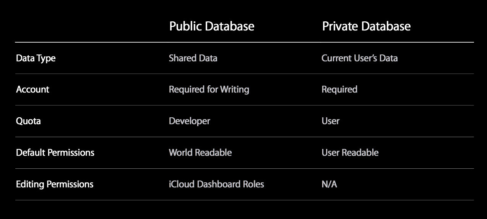
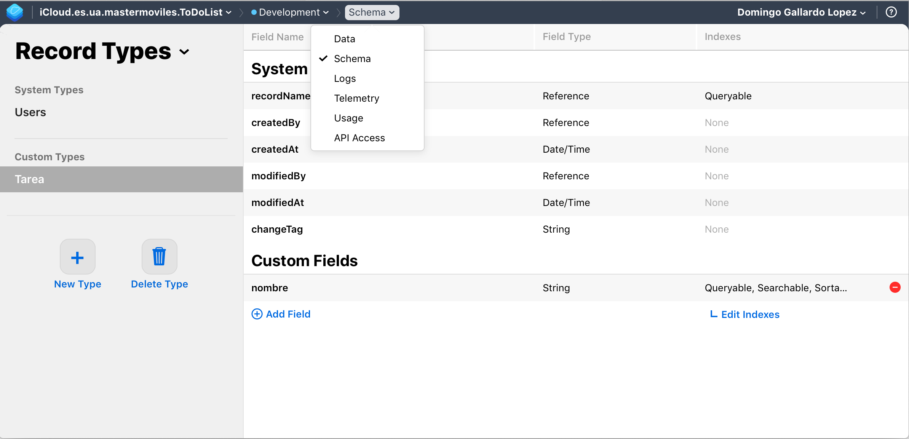
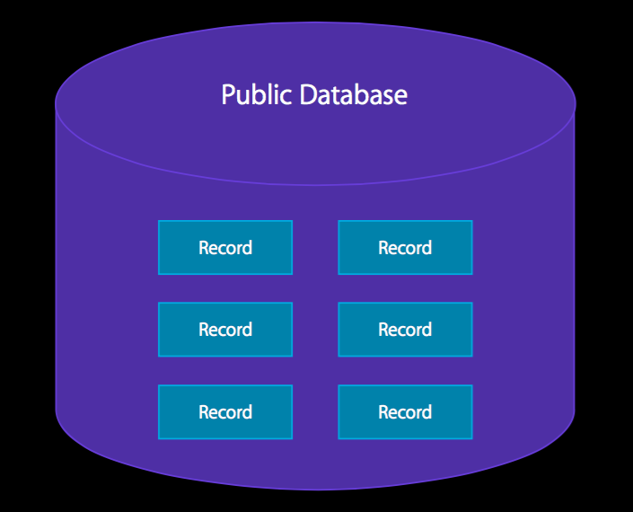
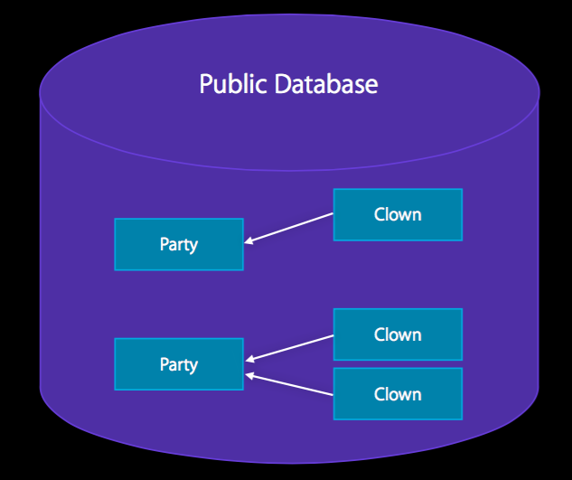
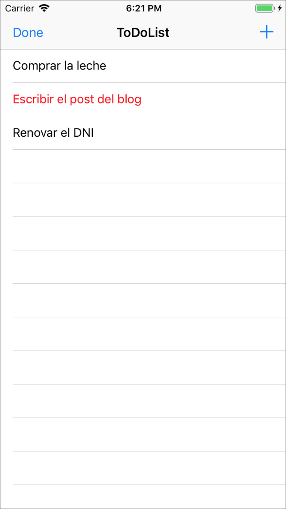
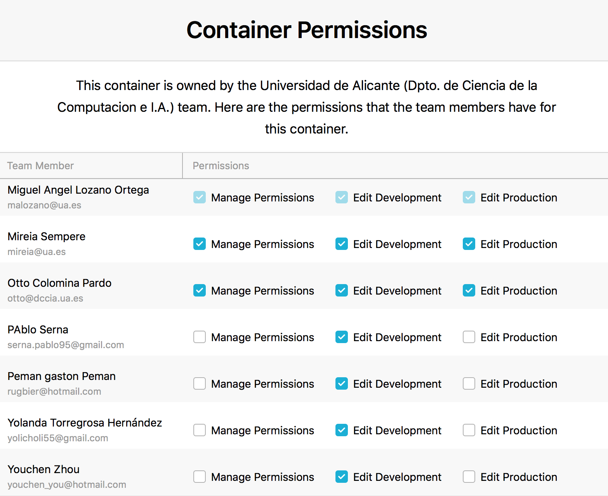

<!--
Referencias:
WWDC vídeo What's next in CoreData: https://developer.apple.com/videos/wwdc/2014/?id=225
WWDC vídeo Advanced CloudKit: https://developer.apple.com/videos/wwdc/2014/?id=231
WWDC vídeo Introducing CloudKit: https://developer.apple.com/videos/wwdc/2014/?id=208
iCloud Design Guide: https://developer.apple.com/library/ios/documentation/General/Conceptual/iCloudDesignGuide/Chapters/Introduction.html
CloudKit Quick Start: https://developer.apple.com/library/ios/documentation/DataManagement/Conceptual/CloudKitQuickStart/Introduction/Introduction.html#//apple_ref/doc/uid/TP40014987

Xamarin Tutorial CloudKit: http://developer.xamarin.com/guides/ios/platform_features/intro_to_cloudkit/
Ray Wenderlich Core Data Tutorial con Swift: http://www.raywenderlich.com/85578/first-core-data-app-using-swift
Tutorial Hacking with Swift: https://www.hackingwithswift.com/read/33/6/reading-from-icloud-with-cloudkit-ckqueryoperation-and-nspredicate
-->

# iCloud y CloudKit

## iCloud


iCloud es un servicio de Apple que permite a un usuario acceder a su
contenido personal (datos, documentos) en todos sus dispositivos
utilizando su Apple ID.

iCloud consigue esto combinando almacenamiento en la nube y APIs
dedicadas integradas en el sistema operativo.

Apple proporciona la infraestructura de servidores, de transmisión de
datos y de cuentas de usuario, facilitando el trabajo a los
desarrolladores que no necesitan crear sus propios servicios ni
recurrir a soluciones de terceros.

### Filosofía de iCloud para el usuario de iOS ###

Un escenario frecuente es que un usuario tenga una app instalada en
más de un dispositivo (un iPhone y un iPad, por ejemplo).  Por
ejemplo es muy común usar la app de fotos, la del calendario, o las
notas en cualquier dispositivo.

En este escenario, la idea principal de iCloud es que el usuario pueda
pasar de un dispositivo a otro y seguir trabajando con el mismo estado
de la app tal y como la dejó en el dispositivo anterior.

Para el usuario, los cambios aparecen automáticamente en todos los
dispositivos conectados a la cuenta iCloud.


### Cuenta iCloud ###


Todo usuario de Apple puede activar una cuenta de iCloud usando su
Apple ID. Casi todos los usuarios de dispositivos Apple tienen
activada esta cuenta.

Permite mantener el estado en aplicaciones ejecutándose en distintos
dispositivos asociados al mismo Apple ID: Recordatorios, Notas, etc.

El sistema operativo encripta todos los datos antes de
transmitirlos a los servidores de iCloud, los cuales almacenan los
datos también en formato encriptado. Se utilizan tokens para la
autenticación. 

De forma gratuita Apple proporciona 5Gb de espacio en la cuenta de
iCloud.

!!! Note "Nota"
    La cuenta de iCloud puede activarse desde el simulador. Si es la
    primera vez que usas iCloud desde el simulador **debes logearte con tu Apple Id en
    [icloud.com](https://www.icloud.com) y aceptar los términos**.


### Distintas APIs ###

Bajo el nombre genérico de iCloud, existen distintas APIs que Apple ha
ido proporcionando a los desarrolladores para gestionar datos
asociados a la cuenta de usuario:


- Almacenamiento **clave-valor en iCloud**: para mantener el estado de
  la aplicación (puntuación de un juego, última página leída, etc.).
- **Documentos en iCloud**: para gestionar documentos en la nube y
  mantenerlos sincronizados entre iPhone/iPad/Mac.
- **iCloud con Core Data**: para mantener de forma automática en
  iCloud una copia de todos los datos de la app gestionados con Core
  Data. Versión inicial con muchos problemas, muy mejorado en las
  últimas versiones.
- **CloudKit**: nueva tecnología a partir de iOS 8
  que permite mayor flexibilidad y control. Basado en la gestión en la
  nube de registros con diccionarios clave-valor, con un enfoque muy
  similar a las tecnologías NoSQL.
    - Se trata de un API de peticiones a los servidores en la nube,
      que no mantiene un estado local. Es conveniente usarla en combinación
      con Core Data, si queremos hacer persistentes en local los datos
      existentes en la nube.
    - Basada en peticiones y respuestas asíncronas.

Vamos a ver en esta sesión el **almacenamiento clave-valor** y
**CloudKit**, que son las APIs más usadas.

### Preparación de aprovisionamiento y permisos para iCloud ###

Para desarrollar con iCloud es necesario estar registrado como
desarrollador en el programa de desarrollo de Apple. También puedes
hacerlo con tu Apple ID registrado en el equipo de la UA.

Para usar los servicios de iCloud es necesario crear un perfil de
aprovisionamiento con un App Id concreto, añadir el servicio de
iCloud y activar el permiso (_capabilities_) en la app con XCode.

Si estás registrado en el equipo de desarrollo con un rol de
administrador (o tienes una cuenta de pago en la que tienes todos
los permisos de tu equipo), se puede hacer todo automáticamente
desde Xcode.

### Creación del App ID ###

Para trabajar con iCloud clave-valor puedes utilizar el perfil de
aprovisionamiento `Master Moviles iCloud` creado en el _member
center_ del equipo de la universidad. El _bundle ID_ de la app debe
ser `es.ua.mastermoviles.iCloud`.

También hemos actualizado el perfil `Master Moviles ToDoList` para
incluir los permisos de uso de iCloud y CloudKit.

Se debe crear el App ID que otorgue la capacidad de acceso a iCloud.

Hemos creado el permiso (App ID) `Master Moviles iCloud` con el
_bundle name_ `es.ua.mastermoviles.iCloud` que incluye la capacidad de
iCloud.  

 

La activación del permiso de iCloud aparecerá en amarillo porque
requiere una configuración posterior relacionada con CloudKit (lo
veremos más adelante). Pero es suficiente para trabajar con iCloud
clave-valor.

## iCloud clave-valor ##

### API de almacenamiento clave-valor ###


Permite guardar y recuperar en iCloud claves y valores desde los
dispositivos en los que el usuario está registrado con su Apple Id.

Para gestionar estos valores debemos usar la clase
[NSUbiquitousKeyValueStore](https://developer.apple.com/library/ios/documentation/Foundation/Reference/NSUbiquitousKeyValueStore_class/index.html).

Puedes almacenar `String`s, valores escalares como `BOOL` o
`Double`, diccionarios y también objetos de cualquiera de los
siguientes tipos: `NSNumber`, `NSString`, `NSDate`, `NSData`,
`NSArray`, or `NSDictionary`.

El espacio de almacenamiento total, para un usuario dado y una app,
es de 1 MB y un máximo de 1024 claves.

Para obtener el objeto compartido iCloudKeyValueStore:

```swift
let iCloudStore = NSUbiquitousKeyValueStore.default
```


### Método `synchronize` ###

```swift
func synchronize() -> Bool
```

Devuelve `true` si las claves y valores en memoria y en disco están
sincronizados o `false` si ha sucedido algún error. Por ejemplo,
devuelve `false` si la app no se ha compilado con las peticiones
adecuadas de _entitlement_ o si el usuario no está logeado e iCloud.

Los cambios al almacén de claves-valor se salvan en memoria. El
sistema sincroniza automáticamente estos datos con la caché del
disco en los momentos apropiados. Por ejemplo, cuando el app pasa a
segundo plano o cuando se reciben cambios de iCloud.

Este método no fuerza la subida a iCloud de los nuevos valores y
claves, sino que hace saber a iCloud que los valores están listos
para ser subidos. El sistema controla cuándo subir los datos.

No es obligatorio su uso, pero es recomendable cuando estamos
trabajando con el simulador para asegurarnos de que el almacén de
claves-valor se guarda.

Se recomiendo también hacerlo después de lanzar la app o cuando
vuelve al primer plano.


### Ejemplo de uso de `synchronize` al lanzar la app ###

```swift

@UIApplicationMain
class AppDelegate: UIResponder, UIApplicationDelegate {

    var window: UIWindow?
    let store = NSUbiquitousKeyValueStore.default

    func application(_ application: UIApplication, didFinishLaunchingWithOptions launchOptions: [UIApplication.LaunchOptionsKey: Any]?) -> Bool {
        // Override point for customization after application launch.
        if (store.synchronize()) {
            print("Sincronización OK")
        } else {
            print("Problemas en la sincronización")
        }
    }
    
    ...

}

```


### Guardar valores en el almacén de claves-valor ###

Para actualizar los valores hay que usar los métodos _set_. El
primer parámetro es el valor a guardar y el segundo la clave:

- `set(Bool, forKey: String)`
- `set(Double, forKey: String)`
- `set(Int64, forKey: String)`
- `set([Any]?, forKey: String)`
- ...

Por ejemplo,
[`set(Int64, forKey: String)`](https://developer.apple.com/reference/foundation/nsubiquitouskeyvaluestore/1407812-set) actualiza en el almacén el valor long long (`Int64`) asociándolo a una clave especificada:

```swift
store.set(100, forKey: "puntuacion")
```


### Obtención de valores del almacén de claves-valor ###

Funciones que obtienen los distintos tipos de datos a partir de una
clave (una cadena):

- `array(forKey: String) -> [Any]?`
- `bool(forKey: String) -> Bool`
- `dictionary(forKey: String) -> [String : Any]?`
- `string(forKey: String) -> String?`
- `longLong(forKey: String) -> Int64`
- ...

`forKey` es el String que es la clave en el almacén de  claves-valor.

Devuelve el valor asociado a la clave o `nil` si la clave no existe
(0 en el caso de los métodos que devuelven un valor numérico).

Por ejemplo, [`longlong(forKey: String)`](https://developer.apple.com/reference/foundation/nsubiquitouskeyvaluestore/1413240-longlong)
 devuelve el valor `Int64` asociado a una clave especificada:

```swift
let puntuacion = Int(store.longLong(forKey:"puntuacion"))
```


### Definición de un observador de cambios ###

Además de almacenar los valores podemos recibir notificaciones
([`NSNotification`](https://developer.apple.com/reference/foundation/nsnotification)
gestionadas por el
[`NotificationCenter`](https://developer.apple.com/reference/foundation/notificationcenter))
de cambio de los valores en otros dispositivos conectados a iCloud.

En el lanzamiento del app hay que registrarse para la notificación
`NSUbiquitousKeyValueStoreDidChangeExternallyNotification`.

La notificación se envía cuando el valor de una o más claves han
cambiado debido a datos que han llegado desde iCloud. La
notificación no se envía cuando la propia app ha cambiado los
valores.

El diccionario atributo `userInfo` de la notificación contiene la
razón de la notificación, así como una lista de los valores
cambiados.

El objeto en la notificación es el `NSUbiquitousKeyValueStore` cuyo
contenido ha cambiado.

Por ejemplo, en el siguiente código se registra como observador un
método de la propia clase `AppDelegate`:

```swift
func application(_ application: UIApplication, didFinishLaunchingWithOptions launchOptions: [UIApplication.LaunchOptionsKey: Any]?) -> Bool {
    // Override point for customization after application launch.
    if (store.synchronize()) {
        print("Sincronización OK")
    } else {
        print("Problemas en la sincronización")
    }
    NotificationCenter.default.addObserver(
        self,
        selector: #selector(muestraValoriCloud(notification:)),
        name: NSUbiquitousKeyValueStore.didChangeExternallyNotification,
        object: nil)
    return true
}

@objc func muestraValoriCloud(notification: Notification){
    let valoriCloud = Int(store.longLong(forKey: "puntuación"))
    // Actualizamos el valor en el controller
}
```


## Demo ##

- Mostramos la app `iCloudKeyValue`, primero la versión sin
comunicación con iCloud clave-valor y después la que utiliza iCloud
clave-valor para guardar el valor del contador.
- Mostramos la app ejecutándose en dos dispositivos simultáneamente y
mostrando cómo los cambios en un dispositivo se actualizan en el otro.


## CloudKit ##


### Introducción a CloudKit ###


El origen de CloudKit es un proyecto interno de Apple en el que se
basan muchas de sus APIs de persistencia. Su uso se ofrece a les
desarrolladores en la WWDC de 2014, para apps a partir de iOS 8.
  
Permite gestionar datos remotos ubicados en los servidores de iCloud propios de Apple.

En los datos propios de la aplicación (datos privados del usuario) el
almacenamiento se imputa a las cuentas iCloud de los usuarios.

Existe la posibilidad de datos públicos, en un almacenamiento
gestionado por el desarrollador (gratuito hasta una capacidad y de
pago a partir de ella).

Permite datos estructurados y datos _bulk_.

Los datos están en la nube e iCloud proporciona una tecnología de
transporte, basada en peticiones de registro, de lectura y de
búsqueda. Los datos obtenidos se almacenan en la aplicación. Si
queremos hacerlos persistentes de forma local (para que estén
disponibles sin conexión) podemos utilizar otra tecnología como Core
Data.


### Tecnología de transporte ###

CloudKit no proporciona ninguna forma de almacenar datos localmente.

Es un servicio para **mover datos a y desde iCloud** y no está pensado
para reemplazar los modelos de datos ya existentes en tu app
(CoreData).

El objetivo del framework es complementar estos modelos con una
forma de empaquetar los datos para iCloud y recibir actualizaciones
posteriores sobre esos datos.

Con CloudKit, tu eres el responsable de mover los datos desde tu app
a iCloud y desde iCloud a la app. Aunque CloudKit proporciona
facilidades para mantenerte informado cuando sucede un cambio, tu
debes obtener esos cambios explícitamente.

Debido a que eres el responsable de obtener y salvar los datos,
debes de asegurarte de que los datos se obtienen en el momento
oportuno y en el orden correcto, y de manejar los errores que se
producen.


### Elementos de CloudKit ###

- Contenedores
- Bases de datos
- Registros
- Zonas de registros
- Identificadores
- Referencias 

### Contenedores ###


Múltiples apps y usuarios tienen acceso a iCloud, pero los datos se
encuentran segregados y encapsulados en particiones llamadas
`contenedores`.

Los contenedores de tus apps no pueden ser usados por apps de otro
desarrollador.

Es posible **compartir un contenedor entre varias apps**, siempre que
hayan sido desarrolladas por el mismo desarrollador.

Cada contenedor tiene un nombre único. El nombre del contenedor con el
que trabaja la app se define en la configuración de _capabilities_ de
Xcode y en el App ID del perfil de aprovisionamiento.

**Los contenedores no pueden borrarse.**


### Clase CKContainer ###

La clase con la que trabajar para gestionar el contenedor es
  [CKContainer](https://developer.apple.com/library/ios/documentation/CloudKit/Reference/CKContainer_class/index.html#//apple_ref/occ/cl/CKContainer)

La debemos usar para:

- Obtener las bases de datos públicas y privadas
- Obtener el identificador del contenedor
- Determinar el estado del acceso de la cuenta iCloud del usuario
- Solicitar y determinar permisos de la app
- Ejecutar operaciones sobre el contenedor
- Descubrir registros de usuarios 

En CloudKit todas las operaciones son asíncronas: se pasa el código
de _callback_ al que se llamará cuando la petición devuelva la
respuesta.


### Datos públicos y privados ###

Se pueden guardar datos de forma pública y privada, dependiendo
de si se guardan en la **base de datos pública o en la privada**.

Los datos públicos son accesibles a todos los usuarios de la
app, aunque el usuario no se haya identificado con su cuenta de
iCloud.

Los datos privados son sólo visibles por el usuario actual
logeado en iCloud.

Para salvar datos en la base de datos pública es necesario que
el usuario esté identificado, porque siempre se guarda el usuario
propietario del registro.


### Bases de datos ###


Las bases de datos son instancias de la clase
[`CKDatabase`](https://developer.apple.com/library/ios/documentation/CloudKit/Reference/CKDatabase_class/index.html#//apple_ref/occ/cl/CKDatabase)

Cada app tiene acceso a dos bases de datos:

- Base de datos pública
- Base de datos privada

Se obtienen a través del `CKContainer`:

```swift
let container = CKContainer.default()
let privateDB = container.privateCloudDatabase
let publicDB = container.publicCloudDatabase
```




### Dashboard ###

_Dashboard_ es una interfaz web con la que podemos gestionar
nuestros contenedores y bases de datos.

[https://icloud.developer.apple.com/dashboard/](https://icloud.developer.apple.com/dashboard/)


La interfaz web permite:

- Crear, visualizar, editar y borrar tipos de registros, registros, etc.
- Estadísticas de uso
- Administración de acceso
 Configuración de despliegue

Ejemplo de visualización de tipos de registros:




### CloudKit trabaja sobre registros en iCloud ###

CloudKit proporciona una forma de mover datos estructurados entre tu
aplicación y iCloud.

A diferencia de las bases de datos relacionales tradicionales, en las
que el modelo de datos se basa en tablas, en CloudKit se trabaja con
**tipos de registros**. 

Un tipo de registro se define dinámicamente, en tiempo de ejecución de
la app, por un nombre y un conjunto de claves. Una instancia concreta de
un registro tiene un identificador único y es un **diccionario de parejas
clave-valor con cada clave representando un campo del registro**.

El valor de cada campo suele ser un tipo de datos simple como una
cadena, una fecha o un número, pero es posible almacenar también
bloques de datos arbitrarios (ficheros),

Es posible guardar en los valores **referencias a otros registros**,
permitiendo definir relaciones entre registros.

Por ejemplo, en la siguiente figura se muestran dos tipos de registros
con sus campos asociados. El nombre del primer tipo de registro es
`Artwork` y el del segundo `Artist`.


!!! Note "Nota"
    En iCloud se dispone de dos tipos de entornos: el **entorno de
    desarrollo** y el de **producción**. Cuando se desarrolla la app se
    construyen de forma dinámica los tipos de registros, con sus
    identificadores y sus campos. Después se debe desplegar estos
    tipos de registros al entorno de producción, en donde ya no es
    posible modificar los tipos de registro.

### Registros ###

Una base de datos está compuesta de registros:



Las instancias de registro son objetos de la clase
[CKRecord](https://developer.apple.com/library/ios/documentation/CloudKit/Reference/CKRecord_class/).

Cada instancia es un conjunto de parejas clave y valor (determinados
por el tipo de registro) y tiene un identificador único, un objeto de
la clase
[`CKRecord.ID`](https://developer.apple.com/documentation/cloudkit/ckrecord/id). Este
identificador único podemos proporcionarlo en el momento de creación
del registro o podemos dejar que se inicializa automáticamente, si no
lo definimos.

Para crear una instancia de registro es necesario identificar el tipo
de registro, definido por un `String`:

```swift
let artistaRecord = CKRecord(recordType: "Artista")
```

Si es la primera vez que se crea un registro de ese tipo, se crea el
tipo de registro dinámicamente en la base de datos.

- Una vez creado el registro se añaden valores a sus campos (que
  también se crean dinámicamente):

```swift
artistaRecord["artista"] = "Jonhn Lennon"
let formatter = DateFormatter()
formatter.dateFormat = "yyyy/MM/dd"
artistaRecord["fechanacimiento"] = formatter.date(from: "1940/10/09")!
```


### Datos en los registros ###

Es posible definir los siguientes tipos de valores que pueden haber en los campos de los registros:

- `NSString` (`String`): Cadenas
- `NSNumber` (`Int`, `Double`, ...): Números, incluidos enteros y punto flotante.
- `NSData`: Bytes arbitrarios de datos (por ejemplo, la
  serialización binaria de un `struct`. No usar para almacenar
  ficheros binarios grandes, usar `CKAsset` en su lugar.
- `NSDate`: Fechas
- `CLLocation`: Coordenadas geográficas
- `CKReference`: Referencias a otros registros para crear relaciones entre ellos.
- `CKAsset`: Fichero binario.
- Arrays de todo lo anterior


### Grabación de registros ###

Se añaden registros a una base de datos usando la función
[`save`](https://developer.apple.com/reference/cloudkit/ckdatabase/1449114-save),
a la que hay que pasar un bloque que recibe el registro salvado y un
error (en caso en que no se haya podido salvar).

```swift
privateDB.save(toDoItemRecord, completionHandler: {
    (record: CKRecord?, error: Error?) in
    print("Error: \(String(describing: error))")
})
```


### Relaciones entre registros: referencias ###

Es posible definir relaciones entre los registros. Por ejemplo un
`Artwork` está relacionado con un `Artist`. Son similares a las claves
ajenas en el tradicional modelo relacional con las que se implementan
relaciones muchos-a-uno.




La clase
[CKReference](https://developer.apple.com/documentation/cloudkit/ckrecord/reference)
es la utilizada para definir estas relaciones:

```swift
itemRecord["owningList"] = CKReference(record: listRecord, action: .deleteSelf)
```

La constante `.deleteSelf` indica que si el registro referenciado se
borra, el propio registro también debe borrarse (borrado en
cascada). La otra posible acción es `.none`.


### Queries ###

Para realizar una consulta se debe utilizar la clase
[`CKQuery`](https://developer.apple.com/library/ios/documentation/CloudKit/Reference/CKQuery_class/index.html#//apple_ref/occ/cl/CKQuery)
para buscar objetos que cumplen una determinada condición en una base
de datos.

La consulta almacena los parámetros de búsqueda, incluyendo el tipo
de registros a buscar, el criterio (predicado) a aplicar, y el
parámetro de ordenación que aplicar a los resultados.

El objeto de la búsqueda se usa para ejecutar una consulta en la
base de datos usando el método
[`perform`](https://developer.apple.com/reference/cloudkit/ckdatabase/1449127-perform)

Se le pasa un manejador al que se llamará cuando se obtengan los
resultados. La operación de búsqueda se restringe a los objetos de
una zona (se pasa `nil` para la zona por defecto).

Para realizar consultas con más control sobre el número de registros
devueltos, o utilizar un cursor definido por el límite de registros
devueltos, hay que realizar una
[`CKQueryOperation`](https://developer.apple.com/library/ios/documentation/CloudKit/Reference/CKQueryOperation_class/index.html#//apple_ref/occ/cl/CKQueryOperation).

Por ejemplo, la query que devuelve todos los registros de tipo "Tarea" de la base de
datos privada del usuario actual es la siguiente (se ha añadido código
de ejemplo en el que se actualiza el array de tareas por hacer y se
actualiza la vista de la tabla)

```swift
let privateDB = CKContainer.default().privateCloudDatabase
let query = CKQuery(recordType: "Tarea", predicate: NSPredicate(value:true))
privateDB.perform(query, inZoneWith: nil, completionHandler: {
    (results, error) in
    if error == nil {
        for result in results! {
            if let nombre = result["nombre"] {
                let toDoItem = ToDoItem(nombre: nombre as! String, publica: false)
                self.toDoItems.append(toDoItem)
            }
        }
        DispatchQueue.main.async( execute: {
            self.tableView.reloadData()
        })
    } else {
        print("Query error: \(String(describing: error))")
    }
})
```

!!! Important "Importante"
    Para que funcione la consulta que recupera todos los registros de
    un tipo hay que crear en el _dashboard_ un índice _queryable_ sobre
    el campo nativo `recordName`.


Otros ejemplos de predicados (consultar [CKQuery](https://developer.apple.com/reference/cloudkit/ckquery) y [NSPredicate](https://developer.apple.com/reference/foundation/nspredicate))

```swift
let predicate = NSPredicate(format: "nombre BEGINSWITH 'Limpiar'")
let predicate = NSPredicate(format: "favoriteColors CONTAINS 'red'")
```

### Operaciones con registros obtenidos ###

Un ejemplo de código en el que borramos los registros de tipo "Tarea" cuyo nombre coincide con un nombre:

```swift
func deleteTarea(_ toDoItem: ToDoItem) {
    let query = CKQuery(recordType: "Tarea",
                        predicate: NSPredicate(format: "nombre == %@", argumentArray: [toDoItem.nombreItem]))
    let publicDB = CKContainer.default().publicCloudDatabase
    publicDB.perform(query, inZoneWith: nil, completionHandler: {
        (results, error) in
        if error == nil {
            for result in results! {
                let record: CKRecord! = result as CKRecord
                publicDB.delete(withRecordID: record.recordID, completionHandler: {
                    (recordID, error) in print("Error: \(String(describing: error))")
                })
            }
        }
    })
} 
```

### Características sociales de CloudKit ###


CloudKit permite descubrirse entre ellos a usuarios que están usando
nuestra app. Los usuarios podrán compartir datos de identidad
(nombre de usuario y correo elctrónico) si:

- Están en los contactos del usuario actual
- Han dado el permiso a la app

Para que otros usuarios puedan acceder a la información del usuario
actual, hay que solicitarle su aprobación llamando a la función
[`requestApplicationPermission`](https://developer.apple.com/reference/cloudkit/ckcontainer/1399174-requestapplicationpermission)

Se le pasa como parámetro `completionHandler` el manejador de la
respuesta del usuario. Recibiremos dos parámetros, el
`applicationPermissionStatus` (constante que indica lo que ha
respondido el usuario) y un objeto `error` que será `nil` si todo ha
ido correctamente.

Se pueden buscar los usuarios que han dado permiso y que están en la
agenda del usuario actual por su dirección de correo electrónico
registrada en el Apple Id.

La función
[`discover​All​Identities(completion​Handler:​)`](https://developer.apple.com/reference/cloudkit/ckcontainer/1640421-discoverallidentities)
de `CKContainer` permite obtener estos usuarios

Se le pasa como parámetro `completionHandler`, una función que
la consulta ejecutará cuando se obtengan los resultados. Tiene
dos parámetros:

- Un array de objetos `CKUser​Identity` que corresponde con los
contactos del usuario que han autorizado conocerlos. Si no hay
usuarios, el array estará vacío.

- Un objeto error si sucede algún problema, o `nil` si los IDs
se han obtenido correctamente.

Ejemplo de código:

```swift
let container = CKContainer.default()
print("Container: ")
print(container)
// Solicitamos permiso para que el usuario se haga descubrible
container.requestApplicationPermission(
    CKApplicationPermissions.userDiscoverability,
    completionHandler: { (permissionStatus, error) in
        print("Permiso concedido: " +
            "\(permissionStatus == CKApplicationPermissionStatus.granted)")})
        
// Obtenemos los usuarios de la app que han dado permiso
container.discoverAllIdentities(completionHandler: { (optUsers, error) in
    if let users = optUsers {
        for user in users {
            print(user)
            // usamos user.userRecordID para buscar
            // registros públicos de un usuario
        }
    }})
```


### Suscripciones ###


Es posible hacer consultas "permanentes" que son ejecutadas en
background por el servidor tras cada registro salvado. 

Generan notificaciones push con los resultados.


### CloudKit JS ###


[CloudKit JS](https://developer.apple.com/library/ios/documentation/CloudKitJS/Reference/CloudKitJavaScriptReference/index.html)
es una librería que proporciona un API JavaScript para acceder a los
datos en los contenedores CloudKit.

Lanzado en WWDC 2015.

Necesita un token generado en el dashboard para acceso seguro al API
en la conexión servidor-servidor.

Permite autentificarse y realizar peticiones seguras JavaScript
desde una aplicación web para acceder a los datos de CloudKit.

Sistema usado por la interfaz web de las apps de Apple en la página
web de iCloud (Notas, Photos, etc.)

Un ejemplo de aplicación web presentado por Apple en el que se
demuestra el uso de esta librería  [CloudKit Catalog](https://cdn.apple-cloudkit.com/cloudkit-catalog/#readme/CloudKit-on-the-web)


## Demo ##


### Gestión en el _member center_ ###


Una de las opciones del _member center_ permite gestionar contenedores de iCloud.

Utilizaremos un contenedor con el identificador `iCloud.es.ua.mastermoviles.ToDoList` que utilizaremos en la app _ToDoList_.


### Asignación del container al App ID ###

Incluimos en el App ID `Master Moviles ToDoList` (con el bundle Id
`es.ua.mastermoviles.ToDoList`) el contenedor de iCloud anterior.

 


### Creación del perfil de aprovisionamiento ###

Actualizamos el perfil de aprovisionamiento `Master Moviles ToDoList`
con el App ID anterior.


### Actualización de capacidades de la app ToDoList ###


### Ejecutamos la app ToDoList###

Ejecutamos la app ToDoList modificada para trabajar con CloudKit y
comprobamos cómo se guardan las tareas, a pesar de eliminarlas de la
memoria. Las tareas se cargan de la base de datos cuando la app se
inicializa, en el método `viewDidLoad`.

Mostramos cómo se añaden registros en las bases de datos públicas y
privadas.



### Dashboard ###

Comprobamos también el _Dashboard_ y vemos cómo se actualiza conforme
guardamos nuevos registros.

El administrador del equipo de desarrollo puede gestionar permisos
para el resto de miembros. Los permisos se definen a nivel de
contenedor.

[https://icloud.developer.apple.com/dashboard/](https://icloud.developer.apple.com/dashboard/)


Comprobamos los permisos de los miembros del equipo de la universidad en el _dashboard_ de iCloud.



Los tipos de registros:


Y los logs:


## Referencias

- [CloudKit Documentation](https://developer.apple.com/documentation/cloudkit)
- [CloudKit Quick Start](https://developer.apple.com/library/archive/documentation/DataManagement/Conceptual/CloudKitQuickStart/Introduction/Introduction.html#//apple_ref/doc/uid/TP40014987)
- [iCloud Design Guide](https://developer.apple.com/library/archive/documentation/General/Conceptual/iCloudDesignGuide/Chapters/Introduction.html#//apple_ref/doc/uid/TP40012094-CH1-SW1)
- [Providing User Access to CloudKit Data](https://developer.apple.com/documentation/cloudkit/providing_user_access_to_cloudkit_data)
- [Changing Access Controls on User Data](https://developer.apple.com/documentation/cloudkit/changing_access_controls_on_user_data)  
- [Responding to Requests to Delete Data](https://developer.apple.com/documentation/cloudkit/responding_to_requests_to_delete_data)  
- [Identifying an App's Containers](https://developer.apple.com/documentation/cloudkit/identifying_an_app_s_containers)
- [CloudKit JS](https://developer.apple.com/documentation/cloudkitjs)
